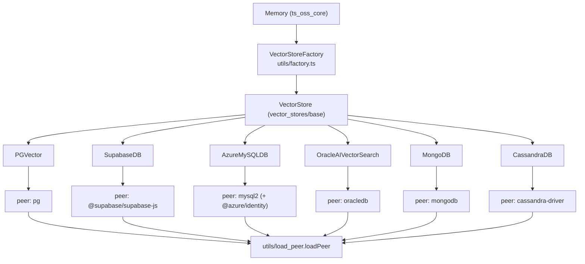
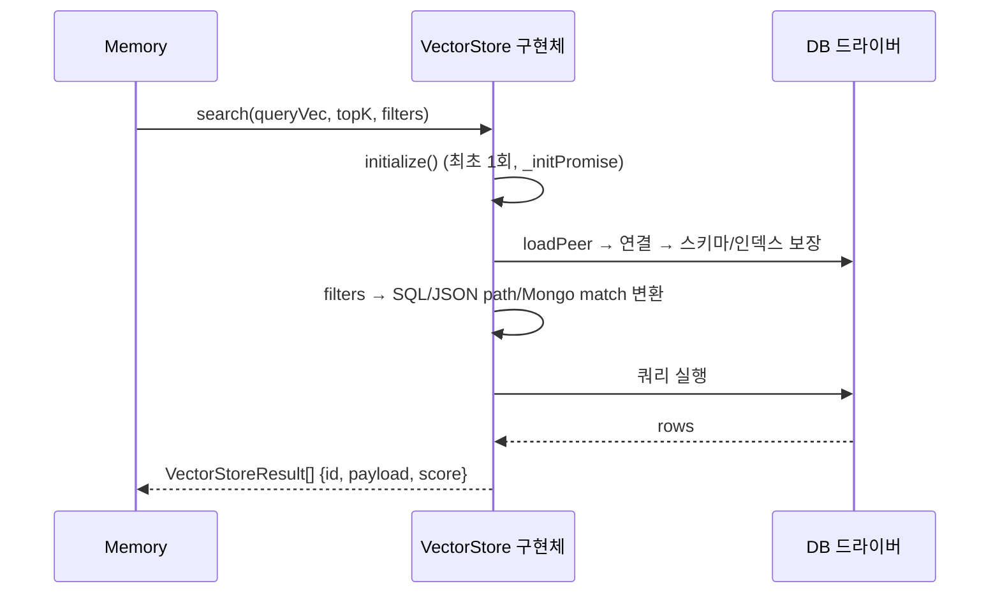
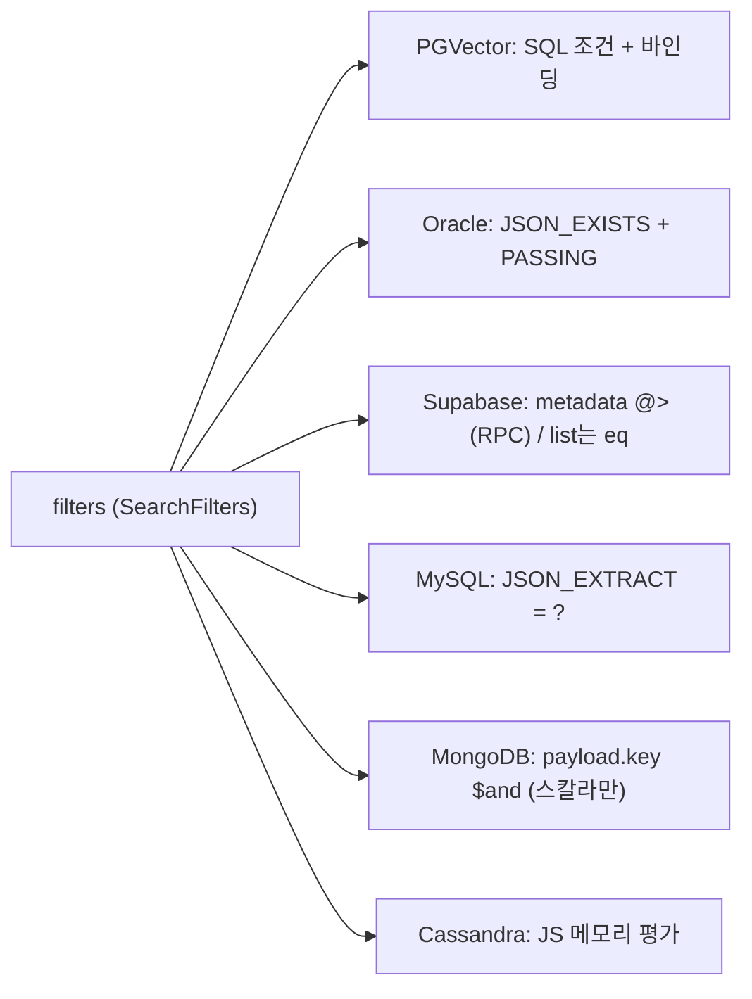

# ts_oss_vector_stores_database_backed_vector_stores

## 개요

`ts_oss_vector_stores_database_backed_vector_stores`는 TypeScript OSS SDK(`mem0-ts/src/oss`)에서 **범용 데이터베이스를 벡터 저장소로 사용하는 `VectorStore` 구현체**를 모은 모듈입니다. 전용 벡터 DB가 아니라 PostgreSQL, Supabase, Azure MySQL, Oracle, MongoDB, Cassandra 같은 기존 DB에 벡터 컬럼/인덱스를 얹어 Mem0의 메모리(벡터 + payload)를 저장합니다.

| 클래스 | 파일 | 백엔드 | 벡터 유사도 계산 위치 |
|---|---|---|---|
| `PGVector` | `vector_stores/pgvector.ts` | PostgreSQL + `pgvector` | DB (`<=>` 코사인 거리) |
| `SupabaseDB` | `vector_stores/supabase.ts` | Supabase (PostgREST + RPC `match_vectors`) | DB (RPC 함수) |
| `AzureMySQLDB` | `vector_stores/azure_mysql.ts` | Azure Database for MySQL | **클라이언트** (JS `cosineSimilarity`) |
| `OracleAIVectorSearch` | `vector_stores/oracledb.ts` | Oracle 23ai | DB (`VECTOR_DISTANCE`) |
| `MongoDB` | `vector_stores/mongodb.ts` | MongoDB Atlas | DB (`$vectorSearch`) |
| `CassandraDB` | `vector_stores/cassandra.ts` | Apache Cassandra / Astra | **클라이언트** (전체 스캔 후 top-K) |

관련 모듈:
- 동일 계층의 다른 저장소: [ts_oss_vector_stores_local_and_adapter_vector_stores](ts_oss_vector_stores_local_and_adapter_vector_stores.md), [ts_oss_vector_stores_dedicated_vector_database_stores](ts_oss_vector_stores_dedicated_vector_database_stores.md), [ts_oss_vector_stores_search_engine_and_keyvalue_stores](ts_oss_vector_stores_search_engine_and_keyvalue_stores.md), [ts_oss_vector_stores_cloud_platform_vector_stores](ts_oss_vector_stores_cloud_platform_vector_stores.md)
- 상위 모듈: [ts_oss_vector_stores](ts_oss_vector_stores.md), 팩토리/`Memory` 엔진은 [ts_oss_core](ts_oss_core.md)
- Python 대응 구현: [database_backed_vector_stores](database_backed_vector_stores.md)

## 아키텍처



### 공통 규약

모든 구현체는 `VectorStore` 인터페이스를 따릅니다.

- `insert(vectors, ids, payloads)`, `search(query, topK, filters)`, `get(id)`, `update(id, vector, payload)`, `delete(id)`, `deleteCol()`, `list(filters, topK) → [results, total]`
- `keywordSearch(query, topK, filters)`: 어휘 검색. 미지원 시 `null` 반환 (Supabase, Cassandra는 항상 `null`).
- `getUserId()` / `setUserId()`: 테이블/컬렉션 `memory_migrations`에 사용자 ID를 저장 (텔레메트리/마이그레이션용). Oracle·MySQL은 `id = 1` 단일 행, Cassandra는 행 키 `mem0-user`.
- **지연 초기화**: `_initPromise`로 `initialize()`를 한 번만 실행하며, 각 연산이 `await this.initialize()`로 보장합니다. 테이블/인덱스/확장은 첫 사용 시 `CREATE ... IF NOT EXISTS`로 생성됩니다.
- **선택적 peer 의존성**: 드라이버는 `loadPeer(...)`로 동적 로딩하므로 `import { Memory } from "mem0ai/oss"`는 드라이버 없이도 동작합니다.
- 반환 `score`는 "클수록 유사"이며, 저장소별로 정규화 방식이 다릅니다(아래 참조).



## 구성 요소별 상세

### PGVector (`pgvector.ts`)

- 설정: `connectionString` 또는 `user/password/host/port`(+`dbname`), `ssl`, `embeddingModelDims`, `diskann`, `hnsw`. `validateConnectionConfig`가 둘 중 하나를 요구합니다.
- 초기화: 연결 문자열이 없으면 `postgres` DB에 접속해 대상 DB를 생성한 뒤 재접속. 이후 `CREATE EXTENSION IF NOT EXISTS vector`, `memory_migrations`, 컬렉션 테이블(`id UUID`, `vector vector(N)`, `payload JSONB`) 생성. `diskann`(차원 < 2000 + `vectorscale` 확장 필요) 또는 `hnsw`(`vector_cosine_ops`) 인덱스는 실패해도 경고만 출력합니다.
- 검색: `vector <=> $1::vector`; `score = clamp(1 - distance, 0, 1)`.
- `keywordSearch`: `to_tsvector('simple', payload->>'textLemmatized')` + `ts_rank_cd`. 오류 시 `null`.
- **필터 빌더** `buildFilterConditions`(export): 파라미터 바인딩(`$n`)된 조건을 생성. `eq/ne/gt/gte/lt/lte/in/nin/contains/icontains`, `$or`, `$not`, `"*"`(키 존재, `payload ? $n`), 배열(IN) 지원. 숫자 비교는 `::numeric` 캐스팅, `contains`는 `%`, `_`, `\` 이스케이프.
- 보안: 식별자는 `validateIdentifier`(`/^[a-zA-Z_][a-zA-Z0-9_]{0,127}$/`)와 `escapeIdentifier`, 필터 키는 `escapeFilterKey`로 검증하여 SQL 인젝션을 차단합니다.
- 주의: `insert`는 행마다 쿼리를 `Promise.all`로 병렬 실행(트랜잭션 없음). `list`는 목록/카운트 쿼리를 병렬 실행.

### SupabaseDB (`supabase.ts`)

- 설정: `supabaseUrl`, `supabaseKey`, `tableName`, `embeddingColumnName`(기본 `embedding`), `metadataColumnName`(기본 `metadata`).
- 사전 조건: 파일 주석/에러 메시지에 있는 SQL을 Supabase SQL Editor에서 실행해야 합니다(`vector` 확장, `memories`, `memory_migrations`, `match_vectors` 함수). 초기화 시 테이블 프로브 실패하면 이 SQL을 포함한 에러를 던집니다. 현재 SQL 예시는 `vector(1536)` 고정이므로 다른 차원은 직접 수정해야 합니다.
- 검색: RPC `match_vectors`(`similarity = 1 - cosine distance`, 필터는 `metadata @> filter` 포함 매칭). `topK`가 PostgREST 상한 `POSTGREST_MAX_ROWS = 1000`을 넘고 정확히 1000건이 오면 잘림 경고.
- `list`: `range()`로 1000행씩 페이지네이션, 필터는 `metadata->>key` 동등 비교만 지원.
- `getUserId`는 오류 시 `"anonymous-supabase"` 폴백, `setUserId`는 오류를 삼킵니다(로그만 출력).
- `VectorSearchResult`: RPC 응답 행 타입(`id`, `similarity`, `metadata`).
- `keywordSearch`는 항상 `null`.

### AzureMySQLDB (`azure_mysql.ts`)

- 설정: `host`, `port`(3306), `user`, `password`, `database`, `collectionName`, `embeddingModelDims`, `useAzureCredential`, `sslCa`, `sslDisabled`, `maxConn`(5).
- 인증: `useAzureCredential`이면 `@azure/identity`의 `DefaultAzureCredential`로 토큰(`https://ossrdbms-aad.database.windows.net/.default`)을 받아 `mysql_clear_password` 플러그인으로 사용. SSL 기본값은 `rejectUnauthorized: true`.
- 스키마: `id VARCHAR(255)`, `vector JSON`, `payload JSON`, 생성 컬럼 `text_lemmatized` + `FULLTEXT` 인덱스(실패 시 무시).
- **`search`는 DB 인덱스를 쓰지 않고** 필터링된 전체 행을 읽어 JS에서 코사인 유사도를 계산·정렬합니다 → 데이터가 커지면 O(N). 소규모/중규모용.
- `keywordSearch`: `MATCH ... AGAINST(... IN NATURAL LANGUAGE MODE)`, 오류 시 `null`.
- `insert`는 트랜잭션 + `ON DUPLICATE KEY UPDATE`(upsert); `update`도 트랜잭션.
- 필터: `JSON_EXTRACT(payload, '$.key') = ?` 동등 비교만. 단, 키가 `$.${k}`로 경로에 직접 결합되므로 신뢰할 수 없는 키 입력에 주의하세요(값은 바인딩됨).

### OracleAIVectorSearch (`oracledb.ts`)

- 설정: `connectionParams` 또는 기존 `client`(Connection/Pool) 필수, `collectionName`(`mem0`), `embeddingModelDims`(1536), `distanceMetric`(`COSINE`, `EUCLIDEAN`, `EUCLIDEAN_SQUARED`, `DOT`, `HAMMING`, `MANHATTAN`), `indexType`(`HNSW`|`IVF`), `indexParameters`, `indexAccuracy`(1–100), `doCreateIndex`.
- 검증: 생성자에서 거리/인덱스 타입/파라미터 범위(`INDEX_PARAMETER_RANGES`)를 엄격히 검증. 초기화 시 Oracle 클라이언트/서버 버전이 **23.4 이상**인지 확인(`assertVectorSupport`).
- 연결: 풀(기본, `poolMin 1`/`poolMax 4`) 또는 단일 연결. `withConnection`이 커밋/롤백/반환을 처리. 외부에서 받은 `client`는 `close()`에서 닫지 않습니다(`ownsClient`).
- 스키마: `id VARCHAR2(36)`, `vector VECTOR(N)`, `payload JSON`, `CREATE VECTOR INDEX ... ORGANIZATION INMEMORY NEIGHBOR GRAPH | NEIGHBOR PARTITIONS`.
- 점수 변환 `SCORE_FROM_DISTANCE`: 코사인은 `1-d`(0~1 클램프), 유클리드 계열은 `1/(1+d)`, `DOT`은 `-d`.
- **필터**: `buildWhereClause`/`buildFilterGroup`(export)이 `JSON_EXISTS(payload, '$.path?(...)' PASSING :f_n AS "f_n")` 형태로 변환. 값은 모두 bind 변수. `$and/$or/$not`(및 `AND/OR/NOT`), `eq…lte`, `in/nin`, `contains/icontains`, `"*"` 지원. 키는 `METADATA_KEY_RE`로 검증하고 `[*]` 배열 와일드카드를 허용. `quoteIdentifier`(export)가 테이블/인덱스 이름을 검증합니다.
- 필터가 없을 때만 `VECTOR_INDEX_TRANSFORM` 힌트와 `FETCH APPROX FIRST`로 근사 검색.
- `keywordSearch`는 구현되어 있지 않음(인터페이스 선택 사항). `getUserId`는 UUID 생성.

### MongoDB (`mongodb.ts`)

- 설정: `url`(`mongodb://localhost:27017`), `dbName`(`mem0_db`), `collectionName`(`mem0`), `embeddingModelDims`/`dimension`(1536), 사전 구성된 `client`.
- 문서 구조: `{ _id, embedding, payload }`. 초기화 시 Atlas **Vector Search 인덱스**(`<collection>_vector_index`, cosine)와 **Text Search 인덱스**(`<collection>_text_search_index`, `payload.data|textLemmatized|text_lemmatized`)를 생성합니다. 기존 텍스트 인덱스의 매핑이 오래되면(`textLemmatized` 미포함) 삭제 후 재생성. 비-Atlas 환경에서는 경고만 출력되고 검색은 동작하지 않습니다.
- `search`: `$vectorSearch`(`numCandidates = min(topK*20, 10000)`) 후 `$match`로 후처리 필터. 인덱스가 아직 빌드 중이면 `[]` 반환(에러 로그만).
- `keywordSearch`: `$search` + `searchScore`. 실패 시 `null`.
- 보안: `validateFilterValue`가 필터 값에 객체(=Mongo 연산자 주입 가능성)를 금지합니다. 따라서 **비교 연산자 필터는 지원하지 않고** 동등/배열만 허용.
- `update`는 `payload.<key>` 개별 `$set`(부분 병합), `list`의 total은 반환된 건수(전체 카운트 아님)입니다. `get`/`list` 오류는 `null`/`[[],0]`로 삼켜집니다.

### CassandraDB (`cassandra.ts`)

- 설정: `contactPoints`+`localDataCenter`(필수, `secureConnectBundle` 없을 때), `port`(9042), `username/password`, `keyspace`(`mem0`), `collectionName`(`memories`), 차원, `protocolVersion`, `loadBalancingPolicy`, 주입형 `client`/`driver`(테스트용).
- 스키마: keyspace(`SimpleStrategy`, RF=1)와 테이블 `id text PRIMARY KEY, vector list<float>, payload text(JSON)` 생성. RF=1은 개발용이므로 운영에서는 keyspace를 미리 만들어 두세요.
- **`search`는 전체 테이블을 페이지(500) 단위로 스캔**하며 클라이언트에서 코사인 유사도·top-K를 유지합니다. 차원 불일치는 `assertVectorDimension`에서 에러.
- 필터는 `filterVector`/`matchFieldCondition`로 **메모리 내 평가**. `AND/OR/NOT`(`$and/$or/$not` 매핑), `eq/ne/gt/gte/lt/lte/in/nin/contains/icontains`, `"*"` 지원. 복합 연산자는 모두 AND로 평가됩니다.
- `update`는 `INSERT`(Cassandra upsert), `deleteCol`은 DROP 후 재생성. `keywordSearch`는 `null`.

## 검색·필터 방식 비교



| 항목 | PGVector | Supabase | AzureMySQL | Oracle | MongoDB | Cassandra |
|---|---|---|---|---|---|---|
| 서버측 ANN 인덱스 | HNSW/DiskANN(옵션) | 사용자 SQL | 없음 | HNSW/IVF | Atlas vectorSearch | 없음 |
| 비교 연산자 필터 | O | X (포함 매칭) | X | O | X | O |
| `keywordSearch` | O (tsvector) | null | O (FULLTEXT) | 미구현 | O (Atlas Search) | null |
| 점수 범위 | 0~1 | 0~1 (코사인) | -1~1 | 거리별 | Atlas 점수 | -1~1 |

## 사용 방법

`VectorStoreFactory`(`utils/factory.ts`, 상세는 [ts_oss_core](ts_oss_core.md))가 provider 이름으로 구현체를 생성합니다. 예시:

```typescript
import { Memory } from "mem0ai/oss";

const memory = new Memory({
  vectorStore: {
    provider: "pgvector",
    config: {
      connectionString: process.env.DATABASE_URL,
      collectionName: "memories",
      embeddingModelDims: 1536,
      hnsw: true,
    },
  },
});
```

해당 DB 드라이버(`pg`, `@supabase/supabase-js`, `mysql2`, `oracledb`, `mongodb`, `cassandra-driver`)는 사용자가 직접 설치해야 하며, 미설치 시 `loadPeer`가 안내 오류를 던집니다. 빌드/패키징 설정(peer dependency 선언)은 `mem0-ts/package.json`, `mem0-ts/tsup.config.ts`를 참고하세요.

## 유지보수 시 주의 사항

- 생성자에서 `initialize().catch(console.error)`를 호출하는 저장소(PGVector, Supabase, Cassandra)는 초기화 실패가 로그로만 남고, 이후 연산에서 같은 rejected promise가 다시 던져집니다. Oracle은 실패 시 `_initPromise`를 초기화하여 재시도가 가능합니다.
- 새 DB 기반 저장소를 추가할 때는: 식별자 검증, 필터 값 바인딩, `loadPeer` 사용, `memory_migrations` 처리, `keywordSearch` 미지원 시 `null` 반환 규약을 따르세요.
- `getUserId`용 난수 ID 생성은 `Math.random` 기반이므로 보안 토큰 용도가 아닙니다.
