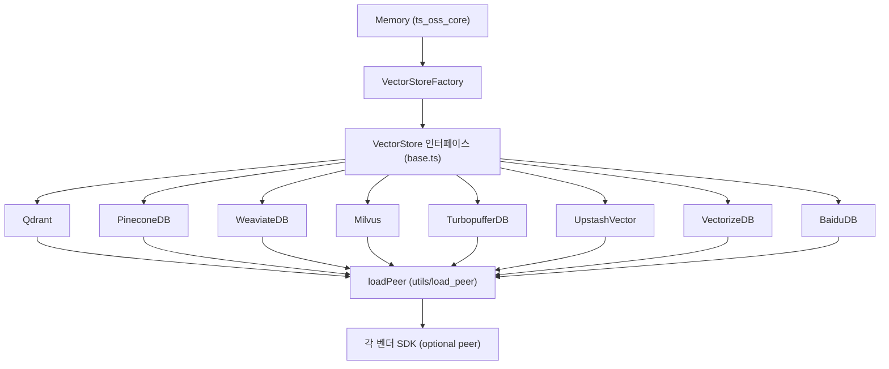
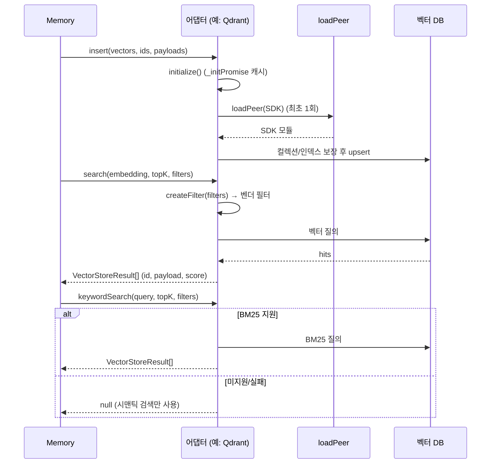

# ts_oss_vector_stores_dedicated_vector_database_stores

## 개요

`mem0-ts/src/oss/src/vector_stores/` 아래에 위치한 **전용 벡터 데이터베이스(dedicated vector database) 어댑터 모음**입니다. TypeScript OSS SDK의 `Memory`가 사용하는 `VectorStore` 인터페이스(`./base`)를 구현하며, 벡터 검색을 전문으로 하는 외부 서비스를 백엔드로 연결합니다.

| 어댑터 | 클래스 | 파일 | 피어 의존성(optional) |
|---|---|---|---|
| Qdrant | `Qdrant` | `qdrant.ts` | `@qdrant/js-client-rest` |
| Pinecone | `PineconeDB` | `pinecone.ts` | `@pinecone-database/pinecone` |
| Weaviate | `WeaviateDB` | `weaviate.ts` | `weaviate-client` |
| Milvus / Zilliz | `Milvus` | `milvus.ts` | `@zilliz/milvus2-sdk-node` |
| Turbopuffer | `TurbopufferDB` | `turbopuffer.ts` | `@turbopuffer/turbopuffer` |
| Upstash Vector | `UpstashVector` | `upstash_vector.ts` | `@upstash/vector` |
| Cloudflare Vectorize | `VectorizeDB` | `vectorize.ts` | `cloudflare` |
| Baidu Mochow | `BaiduDB` | `baidu.ts` | `@mochow/mochow-sdk-node` |

관련 모듈:
- 상위: [ts_oss_vector_stores](ts_oss_vector_stores.md) — 공통 `VectorStore` 계약과 `VectorStoreFactory`
- 형제: [ts_oss_vector_stores_local_and_adapter_vector_stores](ts_oss_vector_stores_local_and_adapter_vector_stores.md), [ts_oss_vector_stores_search_engine_and_keyvalue_stores](ts_oss_vector_stores_search_engine_and_keyvalue_stores.md), [ts_oss_vector_stores_database_backed_vector_stores](ts_oss_vector_stores_database_backed_vector_stores.md), [ts_oss_vector_stores_cloud_platform_vector_stores](ts_oss_vector_stores_cloud_platform_vector_stores.md)
- 호출 측: [ts_oss_core](ts_oss_core.md) (`Memory`, `VectorStoreFactory` in `utils/factory.ts`)
- Python 대응 구현: [py_vector_stores](py_vector_stores.md) (`dedicated_vector_database_stores`)

## 아키텍처

### 공통 설계 패턴

1. **지연 로딩(lazy peer loading)**: 벤더 SDK는 optional peer dependency입니다. `loadPeer(패키지명, 설명, () => import(...))`로 최초 사용 시점에만 import하므로, `import { Memory } from "mem0ai/oss"`는 SDK가 없어도 동작합니다. 예외: `Milvus`는 생성자에서 `require("@zilliz/milvus2-sdk-node")`를 직접 호출하며 SDK가 없으면 즉시 예외를 던집니다.
2. **`_initPromise` 기반 멱등 초기화**: 컬렉션/인덱스 생성은 `initialize()`가 Promise를 캐시해 한 번만 실행합니다. 생성자에서 `initialize().catch(console.error)`로 fire-and-forget 시작하는 어댑터가 많습니다(Qdrant, Pinecone, Weaviate, Milvus, Vectorize, Baidu). `TurbopufferDB.initialize`는 no-op(네임스페이스는 첫 쓰기 시 생성), `UpstashVector.initialize`는 클라이언트 확보만 수행합니다.
3. **클라이언트 주입**: 대부분 `config.client`로 사전 구성된 클라이언트를 받을 수 있습니다(테스트/DI용). Turbopuffer와 Vectorize는 해당 옵션이 없습니다.
4. **사용자 ID 저장**: `getUserId`/`setUserId`는 텔레메트리용 익명 ID를 보관합니다. 저장 위치는 어댑터마다 다릅니다(아래 표).
5. **`keywordSearch`는 best-effort**: 지원하지 않거나 실패하면 `null`을 반환하여 호출자가 시맨틱 검색만으로 폴백하도록 합니다.

### 공통 메서드 계약

| 메서드 | 시그니처 | 설명 |
|---|---|---|
| `insert` | `(vectors, ids, payloads) => Promise<void>` | 벡터 + 페이로드 upsert |
| `search` | `(query: number[], topK, filters) => VectorStoreResult[]` | 밀집 벡터 검색 (score는 높을수록 유사) |
| `keywordSearch` | `(query: string, topK, filters) => VectorStoreResult[] \| null` | BM25 등 키워드 검색, 미지원 시 `null` |
| `get` | `(id) => VectorStoreResult \| null` | ID 조회 |
| `update` | `(id, vector, payload)` | 대부분 upsert로 구현 |
| `delete` / `deleteCol` | | 단건 삭제 / 컬렉션(또는 인덱스·네임스페이스) 삭제 |
| `list` | `(filters, topK) => [results, count]` | 필터 기반 목록 |
| `getUserId` / `setUserId` | | 익명 사용자 ID |

## 어댑터별 상세

### Qdrant (`qdrant.ts`)

- **연결**: `client` 주입 → `url`(+`apiKey`) → `host`+`port` → 로컬(`path`). 연결 정보가 없으면 로컬 모드(`_isRemote=false`)이며, `onDisk`가 아니고 `path`가 디렉터리면 **삭제 후 재생성**합니다(`fs.rmSync`). 데이터 소실 가능성에 유의하세요. `url`이 있으면 qdrant-js#59 버그 회피를 위해 `port`를 명시적으로 지정합니다.
- **컬렉션**: `Cosine` 거리. 메인 컬렉션은 `sparse_vectors: { bm25: { modifier: "idf" } }`를 포함해 생성되어 **서버사이드 BM25 추론**(Qdrant ≥ 1.15.2)을 사용합니다. 기존 컬렉션에 `bm25` 슬롯이 없으면 `_hasBm25Slot=false`로 키워드 점수를 끄고 경고합니다. 벡터 차원이 다르면 예외를 던집니다.
- **쓰기 폴백**: `upsertPoints`가 BM25 벡터 때문에 실패하면 `_hasBm25Slot`을 끄고 dense-only로 재시도합니다. BM25 텍스트는 `payload.textLemmatized || payload.data`입니다.
- **필터**: `createFilter`가 `AND/OR/NOT`(`$and/$or/$not` 정규화)을 `must/should/must_not`로 변환합니다. 연산자: `eq, ne, gt, gte, lt, lte, in, nin, contains, icontains`, 배열 단축형(`in`), `"*"` 와일드카드(무시). range 연산자와 비-range 연산자를 한 필드에 섞으면 예외입니다.
- **페이로드 인덱스**: 원격일 때 `user_id, agent_id, run_id, actor_id`에 `keyword` 인덱스를 생성합니다(실패는 non-fatal).
- **사용자 ID**: `memory_migrations` 컬렉션(차원 1)에 저장.

### Pinecone (`pinecone.ts`)

- API 키는 `apiKey` 또는 `PINECONE_API_KEY` 환경변수(없으면 생성자에서 예외, `client` 주입 시 제외).
- 인덱스가 없으면 생성: `podConfig`가 있으면 pod, 아니면 serverless(기본 `aws`/`us-east-1`), `waitUntilReady: true`. 기본 metric `cosine`, `batchSize` 100.
- `namespace` 옵션 지원. `deleteCol`은 namespace가 있으면 `deleteAll()`, 없으면 인덱스 자체를 삭제하고 내부 상태를 리셋합니다.
- 필터: `AND/OR` → `$and/$or`, 배열 → `$in`, 연산자 매핑. **`NOT`, `contains`, `icontains`는 지원하지 않아 경고 후 건너뜁니다.**
- `keywordSearch`는 항상 `null`. `list`는 영벡터 쿼리로 구현(점수 순서가 의미 없음).
- 사용자 ID: `__mem0_migrations__` 네임스페이스의 `mem0-user-id` 레코드.

### Weaviate (`weaviate.ts`)

- 연결: `client` 주입 → `clusterUrl`에 `localhost` 포함 시 `connectToLocal` → `apiKey` 있으면 `connectToWeaviateCloud` → 그 외 `connectToCustom`(gRPC 포트 50051 고정, `grpcSecure: false`).
- 컬렉션은 `RETURN_PROPERTIES` 전체를 `text` 속성으로 만들고 vectorizer `none` + HNSW 인덱스를 사용합니다.
- 필터는 `user_id`, `agent_id`, `run_id`의 **동등 비교만** 지원하며 AND로 결합합니다(다른 키는 무시됨).
- `search` 점수는 `1 - distance`, `keywordSearch`는 `data` 속성에 대한 네이티브 `bm25`.
- 사용자 ID는 서버에 저장하지 않고 **메모리에만 유지**(`uuidv4`)하므로 프로세스 재시작 시 바뀝니다.

### Milvus (`milvus.ts`)

- 기본값: `url=http://localhost:19530`, 컬렉션 `mem0`, 차원 1536, metric `L2`(`L2|IP|COSINE|HAMMING|JACCARD`).
- 신규 컬렉션 스키마: `id`(VarChar PK), `vectors`(FloatVector), `metadata`(JSON), `text`(analyzer 활성), `sparse`(SparseFloatVector) + `bm25` Function. 인덱스는 `AUTOINDEX`와 `SPARSE_INVERTED_INDEX`. 기존 컬렉션은 `describeCollection`으로 `text`/`sparse` 존재 여부를 확인(`hasBm25Schema`)하고 없으면 키워드 검색을 끕니다.
- `createFilter`는 **동등 비교만** 지원(AND 결합). 키는 `^[a-zA-Z_][a-zA-Z0-9_]*$`로 검증하고 문자열은 백슬래시 → 따옴표 순으로 이스케이프해 표현식 인젝션을 방지합니다. `"*"`는 건너뛰며, 문자열/숫자/불리언 이외의 값은 예외.
- `parseHits`: metric이 `L2`이면 `1/(1+distance)`로 정규화.
- `keywordSearch` 실패 시 `null`. `initialize` 완료를 기다리지 않는 메서드들이 있으므로(생성자에서 fire-and-forget) 직후 호출 시 타이밍에 유의하세요.
- 사용자 ID: `memory_migrations` 컬렉션(`vectors` 차원 2, metric `L2`).

### Turbopuffer (`turbopuffer.ts`)

- API 키: `apiKey` 또는 `TURBOPUFFER_API_KEY`(없으면 예외). 기본 리전 `gcp-us-central1`, 기본 거리 `cosine_distance`, `batchSize` 100. 네임스페이스 = `collectionName`.
- `update`: 벡터가 비어 있으면 `patch_rows`, 아니면 `upsert_rows`.
- 필터 변환(`convertFilters`): `eq→Eq, ne→NotEq, gt/gte/lt/lte, in→In, nin→NotIn`, 배열 → `In`, `"*"` 무시, 복수 조건은 `["And", [...]]`. 미지원 연산자는 예외.
- 점수: `euclidean_squared`는 `1/(1+$dist)`, 그 외 `1-$dist`.
- `search/get/list`는 오류를 `console.error` 후 빈 결과로 삼킵니다. `keywordSearch`는 `null`.
- 사용자 ID: `<collectionName>_migrations` 네임스페이스(404는 "아직 없음"으로 처리).

### Upstash Vector (`upstash_vector.ts`)

- `collectionName` 필수, `client` 또는 `url`+`token` 필수. `collectionName`을 Upstash **namespace**로 사용합니다.
- `keywordSearch`: `data: query`로 Upstash의 텍스트 쿼리 기능을 사용. 실패 시 `null`.
- `update`는 `upsert`로 벡터와 메타데이터를 함께 교체. `deleteCol`/`reset`은 `reset({ namespace })`.
- 필터는 `key = value` 문자열을 `AND`로 연결(동등 비교만). `list`는 `range` 커서 순회, 종료 조건은 **빈 문자열 커서**이며(`"0"`이 아님) 필터는 클라이언트 측(`matchesFilters`)에서 적용됩니다.
- 사용자 ID는 고정값 `"anonymous-upstash-vector"`이고 `setUserId`는 no-op.

### Cloudflare Vectorize (`vectorize.ts`)

- `indexName`, `accountId` 필수. 차원은 `config.dimension`(기본 1536) — 다른 어댑터와 달리 `embeddingModelDims`를 읽지 않으므로 주의.
- 초기화: 인덱스(metric `cosine`)와 `userId`, `agentId`, `runId` 문자열 metadata 인덱스를 생성하고 `memory_migrations` 인덱스(차원 1)를 보장합니다.
- 쓰기(`insert`/`update`/`setUserId`)는 SDK가 아닌 **REST `fetch` + NDJSON**으로 호출합니다.
- `filters`를 그대로 전달(변환 없음), `list`는 영벡터 쿼리. `keywordSearch`는 `null`. 오류는 `Failed to ...` 메시지로 감싸 재던집니다.
- 사용자 ID metadata 키는 `userId`(다른 어댑터의 `user_id`와 다름).

### Baidu Mochow (`baidu.ts`)

- 필수: `databaseName`, `tableName`, `embeddingModelDims`, (`client`가 없으면) `endpoint`, `account`, `apiKey`. metric 기본 `L2`.
- Mochow는 에러를 `{code, msg}` 응답으로 돌려주므로 `check()`가 코드를 검사하며, 멱등 결과(이미 존재/없음)는 `tolerated`로 허용합니다.
- `ensureTable`: DB/테이블 생성(복제 3, 파티션 HASH 1) 후 `TableState.Normal`까지 폴링(2초 간격 × 60회). 기존 테이블이면 `applySchema`가 `id/data/vector/metadata` 스키마와 벡터 차원을 검증하고, BM25 인덱스(`text_lemmatized_bm25_idx`) 존재 여부로 `supportsKeywordSearch`를 결정합니다(기본 닫힘).
- 스키마: HNSW 벡터 인덱스(M=16, efConstruction=200), `metadata` 필터링 인덱스, `textLemmatized`에 대한 영어 분석기 inverted index. BM25 인덱스 이름이 Python 어댑터(`data_bm25_idx`)와 의도적으로 다릅니다.
- 필터: `metadata["key"] = value` 형태, 키 검증 + 문자열 이스케이프, 동등 비교만 지원하며 배열 값은 예외. L2 점수는 `1/(1+score)`.
- `deleteCol`은 진행 중인 초기화를 기다린 뒤 `dropTable`하고 삭제 완료까지 폴링. `reset()`은 `deleteCol` + `initialize`.
- 사용자 ID는 메모리 보관(`anonymous-baidu-user`).

## 기능 비교

| 기능 | Qdrant | Pinecone | Weaviate | Milvus | Turbopuffer | Upstash | Vectorize | Baidu |
|---|---|---|---|---|---|---|---|---|
| 키워드(BM25) 검색 | 서버사이드(슬롯 필요) | 없음(`null`) | 네이티브 | Function 기반 | 없음(`null`) | 텍스트 쿼리 | 없음(`null`) | inverted index |
| 필터 연산자 | 풍부(논리·범위·`in`·`contains`) | 비교·`in`·`AND/OR` | user/agent/run 동등 | 동등 | 비교·`in` | 동등 | 그대로 전달 | 동등 |
| 사용자 ID 영속화 | 컬렉션 | 네임스페이스 | 메모리 | 컬렉션 | 네임스페이스 | 고정값 | 인덱스 | 메모리 |
| 컬렉션 자동 생성 | 예 | 예 | 예 | 예 | 첫 쓰기 시 | 아니오(namespace) | 예 | 예 |
| 클라이언트 주입 | 예 | 예 | 예 | 예 | 아니오 | 예 | 아니오 | 예 |

## 데이터 흐름

## 유지보수 시 주의사항

- **필터 의미 차이**: 같은 `SearchFilters`라도 어댑터별 지원 범위가 다릅니다(Pinecone은 `NOT` 무시, Weaviate/Milvus/Baidu/Upstash는 동등 비교 위주). 새 필터 기능은 어댑터마다 확인이 필요합니다.
- **점수 정규화**: 거리 기반 metric은 "높을수록 좋음"으로 변환합니다(`1/(1+d)` 또는 `1-d`). 새 어댑터도 이 계약을 따라야 합니다.
- **기존 컬렉션 호환**: BM25 지원 이전에 만든 컬렉션은 키워드 검색이 꺼진 채 동작합니다(Qdrant/Milvus/Baidu). 활성화하려면 새 컬렉션이 필요합니다.
- **fire-and-forget 초기화**: 일부 어댑터는 생성자에서 초기화 오류를 `console.error`로만 기록합니다. 이후 메서드 호출 시 `initialize()`가 같은 Promise를 await하므로 오류가 재발생할 수 있습니다(Baidu는 실패 시 Promise를 비워 재시도 허용).
- **Python과의 동등성**: 대부분의 로직은 `mem0/vector_stores/*.py`를 미러링합니다(필터 키 검증, 와일드카드 처리, BM25 슬롯). 한쪽을 수정하면 다른 쪽도 확인하세요. 규칙은 [py_vector_stores](py_vector_stores.md) 참조.
- 새 어댑터 추가 시 `AGENTS.md`(`mem0-ts/AGENTS.md`)의 규칙과 `utils/factory.ts`의 `VectorStoreFactory` 등록을 함께 갱신하세요.
