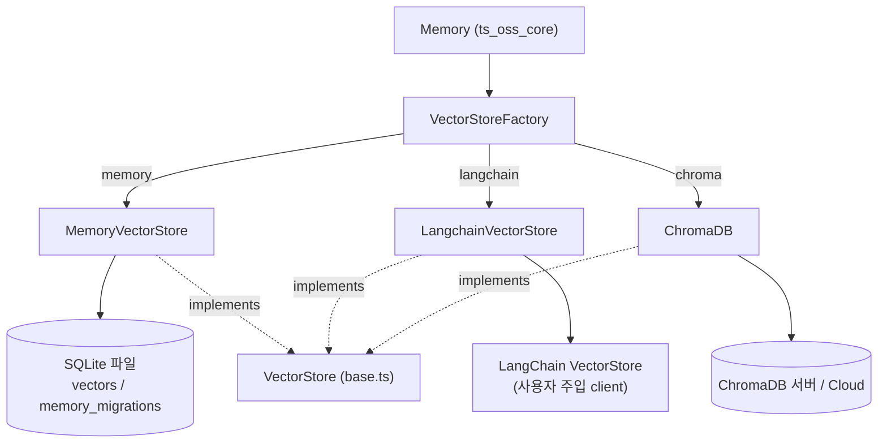
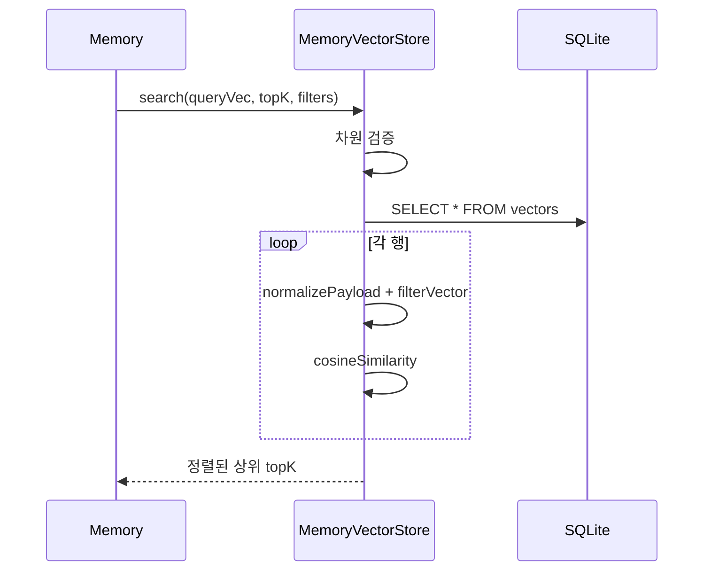

# ts_oss_vector_stores_local_and_adapter_vector_stores

## 개요

mem0 TypeScript OSS SDK(`mem0-ts/src/oss/src/vector_stores/`)의 벡터 스토어 중 **로컬 실행형**과 **어댑터형** 세 가지를 다룬다.

| 컴포넌트 | 파일 | 성격 |
|---|---|---|
| `MemoryVectorStore` | `memory.ts` | `better-sqlite3` 기반 로컬 파일 스토어. 기본 스토어 (`provider: "memory"`) |
| `LangchainVectorStore` | `langchain.ts` | 외부 LangChain `VectorStore` 인스턴스를 감싸는 어댑터 (`provider: "langchain"`) |
| `ChromaDB` | `chroma.ts` | `chromadb` v3 JS 클라이언트 어댑터. 로컬 서버 또는 Cloud (`provider: "chroma"`) |

세 클래스 모두 `base.ts`의 `VectorStore` 인터페이스를 구현하며, `utils/factory.ts`의 `VectorStoreFactory`가 `provider` 문자열(`"memory"`, `"langchain"`, `"chroma"`)로 생성한다. 상위 모듈은 [ts_oss_vector_stores](ts_oss_vector_stores.md)이고, OSS 엔진(`Memory`)은 [ts_oss_core](ts_oss_core.md)에서 이 인터페이스를 소비한다. Python 쪽 대응 구현은 [local_and_adapter_vector_stores](local_and_adapter_vector_stores.md)를 참고.

## 아키텍처



### `VectorStore` 인터페이스 (`base.ts`)

`insert`, `search`, `keywordSearch?`(선택), `get`, `update`, `delete`, `deleteCol`, `list`, `getUserId`, `setUserId`, `initialize`. `keywordSearch`는 결과가 없을 때/미지원 시 `null`을 반환하는 계약이다.

## 컴포넌트 상세

### MemoryVectorStore

- **저장소**: SQLite 테이블 `vectors(id, vector BLOB, payload TEXT)`와 `memory_migrations(id, user_id UNIQUE)`. 벡터는 `Float32Array` 버퍼로 직렬화, payload는 JSON.
- **경로**: `config.dbPath` 또는 `getDefaultVectorStoreDbPath()`. 기본 경로를 쓰는데 과거 위치 `cwd/vector_store.db`가 존재하면 이전 안내 경고를 출력한다. 디렉터리는 `ensureSQLiteDirectory`로 생성.
- **차원**: `config.dimension`(기본 1536). `insert`/`update`/`search`에서 불일치 시 예외.
- **검색**: 전체 행을 읽어 메모리에서 필터 → 코사인 유사도 계산 → 내림차순 정렬 후 `topK`. (선형 스캔 O(N); 대규모 데이터에는 부적합)
- **키워드 검색**: 필터 통과 후보에 대해 인라인 BM25(`k1=1.5`, `b=0.75`)를 계산. 텍스트는 `payload.textLemmatized || payload.data`, 공백 토큰화. 점수 0은 제외. 오류 시 `null`.
- **payload 정규화**: `userId/agentId/runId` → `user_id/agent_id/run_id` (`normalizePayload`).
- **필터** (`filterVector`/`matchFieldCondition`): `AND`/`OR`/`NOT`(및 `$and`/`$or`/`$not`), 비교 연산자 `eq, ne, gt, gte, lt, lte, in, nin, contains, icontains`, 배열 단축형(`in`), 와일드카드 `"*"`.
- **사용자 ID**: `memory_migrations`에 저장, 없으면 랜덤 생성(`getUserId`), `setUserId`는 교체.
- `deleteCol`은 `vectors` 테이블을 DROP 후 재생성.



### LangchainVectorStore

- 생성자는 `config.client`(초기화된 LangChain `VectorStore`)를 필수로 요구하며 `addVectors`, `similaritySearchVectorWithScore` 존재를 검사한다. 차원은 `config.dimension` 또는 `embeddings.embeddingDimension`에서 추론하며, 못 구하면 경고 후 검증을 생략.
- `insert`: payload를 `Document`(`pageContent: ""`, `metadata: {...payload, _mem0_id}`)로 변환해 `addVectors`. ids 전달이 실패하면 ids 없이 재시도.
- `search`: `similaritySearchVectorWithScore`를 호출하고 `metadata._mem0_id`를 id로 매핑. **`filters`는 무시된다** (범용 LangChain 스토어로 신뢰성 있게 변환 불가).
- `delete`: 하위 스토어에 `delete`가 있으면 `{filter: {_mem0_id}}`로 시도(스토어 구현에 따라 성공 여부 상이).
- **미지원(예외 발생)**: `get`, `update`, `list`, `deleteCol`. `keywordSearch`는 `null`.
- 사용자 ID는 프로세스 메모리에만 존재(`"anonymous-langchain-user"` 기본). `initialize`는 no-op.

> 주의: 필터 무시와 `get/update/list` 미지원으로 인해 `Memory`의 사용자 단위 격리 및 갱신 흐름이 제한된다.

### ChromaDB

- **클라이언트 생성**: `config.client` 우선 → 없으면 `loadPeer("chromadb", ...)`로 선택적 peer를 **지연 로딩**. `apiKey`+`tenant`가 있으면 `CloudClient`(database 기본 `"mem0"`), 아니면 `ChromaClient`(`host/port/ssl/path`).
- **컬렉션**: `getOrCreateCollection({name, embeddingFunction: null})` — 임베딩은 항상 mem0가 제공. 별도 컬렉션 `memory_migrations`에 user_id를 저장(`getUserId`/`setUserId`, 더미 임베딩 `[0]`).
- 생성자는 `initialize()`를 비동기로 호출하며 실패는 `console.error`로만 기록.
- **점수 변환**: 거리 → `1 / (1 + distance)`.
- **필터 변환** (`generateWhereClause`): 연산자를 `$eq/$ne/$gt/$gte/$lt/$lte/$in/$nin`으로 매핑. Chroma가 필드당 연산자 하나만 허용하므로 연산자별 절을 `$and`로 결합. `OR`/`$or`는 `$or`, `NOT`/`$not`은 드모르간 법칙(필드 내 `$or`, 조건 간 `$and`)으로 부정 연산자를 적용. `"*"`는 건너뛰고, `contains/icontains`와 알 수 없는 연산자는 동등 비교로 폴백.
- `keywordSearch`는 `null`. `deleteCol`은 컬렉션 삭제 후 캐시된 promise를 초기화.

## 비교

| 항목 | MemoryVectorStore | LangchainVectorStore | ChromaDB |
|---|---|---|---|
| 영속성 | 로컬 SQLite 파일 | 하위 스토어에 의존 | Chroma 서버/Cloud |
| 필터 | 완전 지원 (인프로세스) | 무시 | where 절로 변환 |
| `keywordSearch` | BM25 구현 | `null` | `null` |
| `get/update/list` | 지원 | 미지원(throw) | 지원 |
| 확장성 | 선형 스캔 | 하위 스토어 의존 | DB 수준 |
| 추가 의존성 | `better-sqlite3` | `@langchain/core` + 사용자 스토어 | `chromadb` (선택 peer) |

## 사용 예

```typescript
import { Memory } from "mem0ai/oss";

new Memory({ vectorStore: { provider: "memory", config: { dimension: 1536, dbPath: "./v.db" } } });
new Memory({ vectorStore: { provider: "chroma", config: { collectionName: "mem0", host: "localhost", port: 8000 } } });
new Memory({ vectorStore: { provider: "langchain", config: { client: myLcStore } } });
```

## 관련 모듈

- [ts_oss_vector_stores](ts_oss_vector_stores.md) — 전체 TS 벡터 스토어 집합과 공통 인터페이스
- [ts_oss_core](ts_oss_core.md) — `Memory`, `VectorStoreFactory`
- [local_and_adapter_vector_stores](local_and_adapter_vector_stores.md) — Python 대응 구현(Chroma, FAISS, Langchain)
