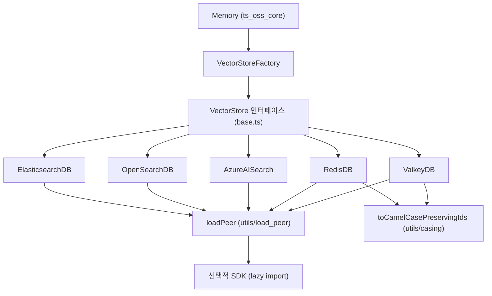
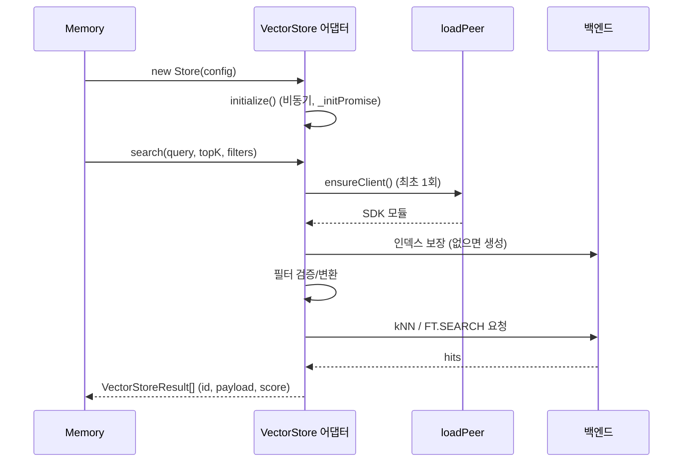
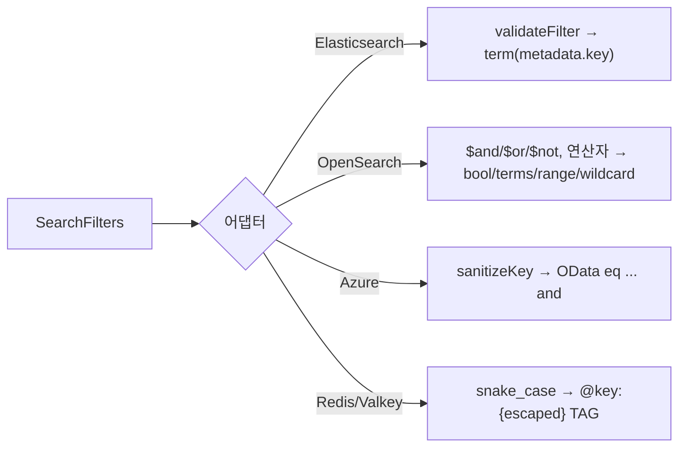

# ts_oss_vector_stores_search_engine_and_keyvalue_stores

## 1. 개요

`mem0-ts/src/oss/src/vector_stores/` 아래에서 **검색 엔진(Elasticsearch, OpenSearch, Azure AI Search)** 과 **키-값 저장소(Redis, Valkey)** 를 벡터 저장소로 사용하는 5개 어댑터를 모은 모듈입니다. 모두 공통 `VectorStore` 인터페이스(`./base`)를 구현하며, TypeScript OSS `Memory` 엔진이 `VectorStoreFactory`를 통해 선택해 사용합니다.

| 클래스 | 파일 | 백엔드 | 선택적 peer 의존성 |
|---|---|---|---|
| `ElasticsearchDB` | `elasticsearch.ts` | Elasticsearch `dense_vector` + kNN | `@elastic/elasticsearch` |
| `OpenSearchDB` | `opensearch.ts` | OpenSearch `knn_vector` (nmslib HNSW) | `@opensearch-project/opensearch` |
| `AzureAISearch` | `azure_ai_search.ts` | Azure AI Search 벡터/하이브리드 검색 | `@azure/search-documents`, `@azure/identity` |
| `RedisDB` | `redis.ts` | Redis Stack (RediSearch) HASH + KNN | `redis` |
| `ValkeyDB` | `valkey.ts` | Valkey Search (`FT.*` 명령) | `iovalkey` |

상위/형제 모듈: [ts_oss_vector_stores](ts_oss_vector_stores.md), [ts_oss_core](ts_oss_core.md), [ts_oss_vector_stores_local_and_adapter_vector_stores](ts_oss_vector_stores_local_and_adapter_vector_stores.md), [ts_oss_vector_stores_dedicated_vector_database_stores](ts_oss_vector_stores_dedicated_vector_database_stores.md), [ts_oss_vector_stores_database_backed_vector_stores](ts_oss_vector_stores_database_backed_vector_stores.md), [ts_oss_vector_stores_cloud_platform_vector_stores](ts_oss_vector_stores_cloud_platform_vector_stores.md). Python 대응 구현은 [search_engine_and_keyvalue_stores](search_engine_and_keyvalue_stores.md)를 참고하세요.

## 2. 아키텍처

### 공통 설계 패턴

1. **지연 로딩(lazy peer)**: 생성자는 `initialize().catch(console.error)`만 호출하고, 실제 SDK는 `ensureClient()`에서 `loadPeer(...)`로 처음 사용할 때 import합니다. 드라이버가 설치되지 않은 사용자는 비용을 치르지 않습니다.
2. **단일 초기화 Promise**: `_initPromise`로 `initialize()`를 멱등하게 만들어, 동시 호출이 인덱스를 중복 생성하지 않도록 합니다.
3. **`memory_migrations` 저장소**: `getUserId()`/`setUserId()`로 익명 사용자 ID를 영속화합니다. 위치는 백엔드마다 다릅니다(별도 인덱스 또는 `memory_migrations:1` 키).
4. **공통 CRUD 시그니처**: `insert(vectors, ids, payloads)`, `search(query, topK, filters)`, `get`, `update`, `delete`, `deleteCol`, `list(filters, topK) → [results, total]`.

## 3. 컴포넌트별 상세

### 3.1 ElasticsearchDB
- **인덱스**: `dense_vector`(cosine, `index: true`), `metadata.{user_id,agent_id,run_id}`는 `keyword`. 샤드 5 / 레플리카 1. `autoCreateIndex !== false`일 때만 컬렉션 인덱스를 만들고, `memory_migrations`는 항상 보장합니다.
- **연결**: `client` 직접 주입, `cloudId`, 또는 `host/port`(+`useSsl`, `apiKey` 또는 `username/password`, `caCerts`, `verifyCerts`, `headers`).
- **search**: `knn { k: topK, num_candidates: topK*2 }`, 필터는 `knn.filter.bool.must`의 `term` 절.
- **보안**: `validateFilter`가 필터 키를 `^[a-zA-Z_][a-zA-Z0-9_]*$`로 제한하고 값은 string/number/boolean만 허용(`metadata.${key}` 경로 주입 방지, Python `_validate_filter` 미러링).
- `keywordSearch`는 **구현되어 있지 않음**(옵셔널 메서드로 간주).
- `getUserId`는 `memory_migrations`에 벡터 없이 문서를 저장합니다(cosine 매핑은 영벡터를 거부하기 때문).

### 3.2 OpenSearchDB
- **인덱스**: `index.knn: true`, `vector_field`는 `knn_vector`(nmslib / hnsw / `cosinesimil`), `payload`는 동적 `object`, `id`는 `keyword`. payload를 동적 객체로 둬야 문자열 하위 필드에 `.keyword`가 자동 생성되어 필터가 동작합니다(명시적 `keyword` 매핑 금지).
- **응답 정규화**: `responseBody()`가 클라이언트 버전에 따라 `{ body }` 래핑 여부를 흡수합니다.
- **search**: `k`, `size` 모두 `topK*2`로 요청 후 `slice(0, topK)`.
- **keywordSearch**: `payload.data`, `payload.text_lemmatized`, `payload.textLemmatized`에 대한 `match` 의 `should`(최소 1개 일치) — 하이브리드 검색의 키워드 축에 쓰입니다.
- **필터 DSL**: `$and/$or/$not` → `AND/OR/NOT`(`bool.filter/should/must_not`), `"*"`(exists), 배열(`terms`), 연산자 `eq, ne, in, nin, gt, gte, lt, lte, contains, icontains`(wildcard는 `escapeWildcard` 적용). 객체형 리프는 `assertScalarValue`로 거부해 쿼리 파라미터 주입을 막습니다.
- `insert`는 벡터 차원을 `validateVector`로 검증하고 bulk 오류를 예외로 올립니다. `autoRefresh`(기본 `false`)로 refresh 여부 제어. `delete`는 404를 무시, `reset`은 컬렉션 삭제 후 재생성.
- 인증서 검증 기본값은 `verifyCerts ?? false`(Python SDK와 동일, 자체 서명 인증서 고려).

### 3.3 AzureAISearch
- **스키마**: `id`(key), `user_id/run_id/agent_id`(filterable), `vector`(`Collection(Edm.Single)` 또는 `Edm.Half`, HNSW 프로필), `payload`(**JSON 문자열**, searchable). 압축 `none | scalar | binary`, `useFloat16`.
- **인증**: `apiKey`가 있으면 `AzureKeyCredential`, 없거나 플레이스홀더면 `DefaultAzureCredential`(`@azure/identity` lazy load).
- **search**: `hybridSearch`면 `searchFields: ["payload"]`를 추가해 벡터+텍스트 결합, 아니면 순수 벡터. `vectorFilterMode` 기본 `preFilter`.
- **keywordSearch**: 네이티브 BM25 전문 검색. 오류 시 `console.error` 후 `null` 반환(상위에서 키워드 축 생략).
- **필터**: OData 문자열 `key eq 'value'`를 `and`로 연결. 키는 `sanitizeKey`(`\w` 외 제거), 문자열 값은 `'`를 `''`로 이스케이프. 비문자열 값은 그대로 삽입되므로 호출자가 스칼라를 전달해야 합니다.
- `update`는 `mergeOrUploadDocuments`(upsert 동작), `reset`은 인덱스 삭제 후 재생성. `extractJson`이 깨진 payload 문자열에서 JSON 객체를 복구합니다.

### 3.4 RedisDB
- **요구사항**: RediSearch 모듈(`search`/`searchlight`)이 있는 Redis Stack. 없으면 초기화 오류.
- **저장**: HASH `mem0:{collection}:{id}`, 필드 `memory_id, hash, agent_id, run_id, user_id`(TAG), `memory, metadata`(TEXT), `created_at, updated_at`(NUMERIC, ms), `embedding`(VECTOR FLAT / FLOAT32 / COSINE). 페이로드 키는 `toSnakeCase`로 저장하고 조회 시 `toCamelCasePreservingIds`로 복원합니다. `EXCLUDED_KEYS` 외 나머지는 `metadata` JSON에 직렬화.
- **필터**: `buildRedisFilterExpr`(export)가 `@key:{escaped}` TAG 쿼리를 만들며, 조건이 없으면 `*`. `escapeRedisTagValue`는 UUID의 `-` 등 구두점을 이스케이프합니다.
- **search**: `{filter} =>[KNN topK @embedding $vec AS __vector_score]`, DIALECT 2, `score = max(0, 1 - distance)`. `list`는 `created_at DESC` 정렬.
- **주의**: `createIndex()`가 기존 인덱스를 `dropIndex`한 뒤 다시 만듭니다(HASH 데이터는 유지되고 인덱스만 재구축). 3회 재시도, 재연결 전략(최대 10회).
- `keywordSearch`는 항상 `null`. 사용자 ID는 `memory_migrations:1` 키. `close()`는 `quit()`.
- 내보내진 타입: `RedisEntry`, `RedisModule`, `RedisSearchResult`.

### 3.5 ValkeyDB
- **연결**: `iovalkey`로 단일 노드(`new Valkey(url)`) 또는 `clusterMode`의 `Cluster`(URL에서 파싱한 자격 증명을 `redisOptions`로 전달). `valkey://` 스킴은 `redis://`로 치환.
- **인덱스**: `FT.CREATE ... ON HASH PREFIX`, 벡터는 `hnsw`(기본; `M=16`, `EF_CONSTRUCTION=200`, `EF_RUNTIME=10`) 또는 `flat`, COSINE. `FT._LIST`로 검색 모듈 유무를, `FT.INFO`로 인덱스 존재를 확인합니다. 잘못된 `indexType`은 생성자에서 예외.
- **검색**: `FT.SEARCH` raw 명령 + `parseFtSearchResults`. 점수는 `max(0, 1 - vector_score)`. `created_at`은 **초 단위**로 저장하고 `formatTimestamp`가 `timezone`(IANA) 오프셋이 포함된 ISO 문자열로 변환합니다(Python `datetime.fromtimestamp(ts, tz).isoformat()` 미러링).
- `list`는 영벡터로 `search`를 호출하는 방식(전체 total이 아닌 반환 건수 사용). `keywordSearch`는 `null`.
- **주의**: CRUD 메서드는 `await this.initialize()`를 호출하지 않으므로 초기화(생성자에서 비동기 시작)가 끝나기 전에 호출하면 `client`가 미정의일 수 있습니다.

## 4. 동작 흐름

## 5. 기능 비교

| 항목 | Elasticsearch | OpenSearch | Azure AI Search | Redis | Valkey |
|---|---|---|---|---|---|
| `keywordSearch` | 없음 | `match` 기반 | BM25 | `null` | `null` |
| 풍부한 필터 연산자 | 동등(term)만 | 지원 | 동등만 | TAG 동등만 | TAG 동등만 |
| `reset` | – | 지원 | 지원 | – | – |
| `close` | – | – | – | 지원 | 지원 |
| 사용자 ID 저장 | `memory_migrations` 인덱스 | `memory_migrations` 인덱스 | `memory_migrations` 인덱스 | `memory_migrations:1` | `memory_migrations:1` |
| 페이로드 저장 | `metadata` 객체 | `payload` 객체 | `payload` JSON 문자열 | HASH 필드 + metadata JSON | HASH 필드 + metadata JSON |

## 6. 개발/운영 시 참고

- 새 어댑터를 추가할 때는 위 패턴(lazy `loadPeer`, `_initPromise`, 필터 검증)을 따르고 [ts_oss_vector_stores](ts_oss_vector_stores.md)의 팩토리 등록 방식을 확인하세요. 관련 빌드/테스트 설정은 `mem0-ts/package.json`, `mem0-ts/tsup.config.ts`, `mem0-ts/jest.config.js`에 있습니다(코드 스타일은 Prettier, pnpm 전용).
- 필터 키/값이 외부 입력에서 올 수 있으므로 Elasticsearch/OpenSearch의 검증 로직을 약화시키지 마세요.
- 생성자의 `initialize().catch(console.error)`는 오류를 로그로만 남기며, 이후 메서드 호출 시 `initialize()`가 같은 rejected Promise를 반환해 오류가 전파됩니다(Valkey 제외).
