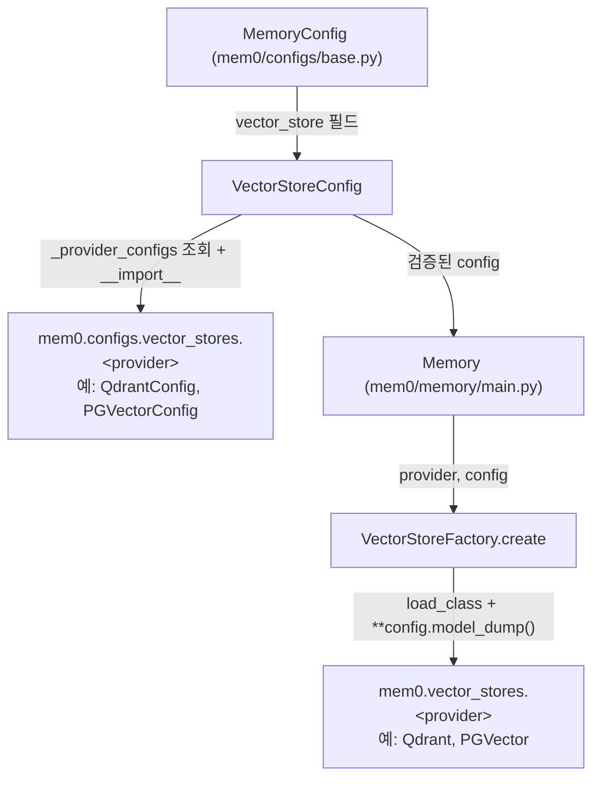
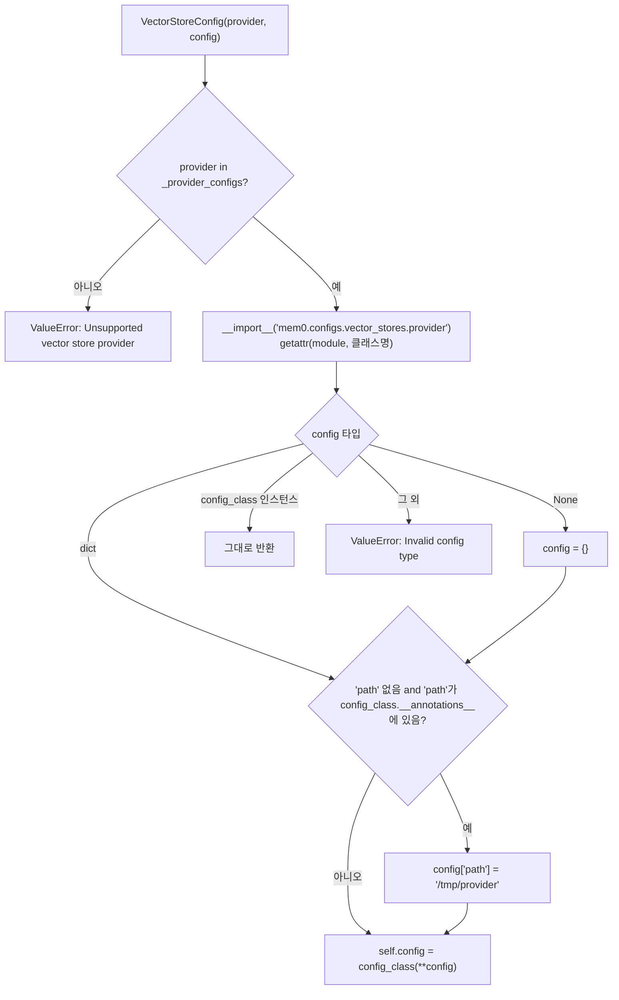

# vector_store_config_registry 모듈

## 소개

`vector_store_config_registry`는 `mem0/vector_stores/configs.py`의 `VectorStoreConfig` 하나로 구성된 모듈입니다. 사용자가 지정한 `provider` 문자열(예: `"qdrant"`, `"pgvector"`)을 해당 벡터 스토어 전용 Pydantic 설정 클래스(`mem0/configs/vector_stores/<provider>.py`)로 연결하는 **설정 레지스트리 겸 검증기** 역할을 합니다. 실제 벡터 스토어 인스턴스는 만들지 않으며, 인스턴스화는 `VectorStoreFactory`가 담당합니다.

## 구성 요소

| 항목 | 설명 |
|------|------|
| `provider` | 벡터 스토어 식별자. 기본값 `"qdrant"` |
| `config` | 프로바이더별 설정. 입력은 `dict`/`None`/설정 객체, 검증 후에는 프로바이더 설정 클래스 인스턴스가 됨 |
| `_provider_configs` | `provider` → 설정 클래스 이름 매핑 (25개 프로바이더) |
| `validate_and_create_config` | `model_validator(mode="after")`. 레지스트리 조회, 동적 import, 설정 객체 생성 |

## 아키텍처



레지스트리는 **설정 계층**(`mem0.configs.vector_stores.*`)을, 팩토리는 **구현 계층**(`mem0.vector_stores.*`)을 가리킵니다. 두 매핑은 별도로 유지되므로 새 프로바이더 추가 시 양쪽 모두 등록해야 합니다.

## 검증 흐름



핵심 동작:

1. **미지원 프로바이더 차단**: 레지스트리에 없는 이름은 즉시 `ValueError`.
2. **지연 로딩**: `__import__`로 해당 프로바이더 모듈만 import하므로, 사용하지 않는 스토어의 선택적 의존성은 로드되지 않습니다.
3. **기본 경로 주입**: 설정 클래스가 `path` 필드를 가지고 있고 사용자가 지정하지 않았다면 `/tmp/<provider>`를 채웁니다(`faiss`, `chroma` 같은 로컬 스토어 대상).
4. **타입 정규화**: 최종 `config`는 항상 프로바이더 설정 클래스 인스턴스(또는 이미 해당 클래스 인스턴스인 입력)입니다.

## 지원 프로바이더 매핑

| provider | 설정 클래스 | 상세 문서 |
|----------|-------------|-----------|
| `qdrant`, `pinecone`, `weaviate`, `milvus`, `turbopuffer`, `upstash_vector`, `baidu` | `QdrantConfig`, `PineconeConfig`, `WeaviateConfig`, `MilvusDBConfig`, `TurbopufferConfig`, `UpstashVectorConfig`, `BaiduDBConfig` | [dedicated_vector_database_stores](dedicated_vector_database_stores.md) |
| `chroma`, `faiss`, `langchain` | `ChromaDbConfig`, `FAISSConfig`, `LangchainConfig` | [local_and_adapter_vector_stores](local_and_adapter_vector_stores.md) |
| `elasticsearch`, `opensearch`, `azure_ai_search`, `redis`, `valkey` | `ElasticsearchConfig`, `OpenSearchConfig`, `AzureAISearchConfig`, `RedisDBConfig`, `ValkeyConfig` | [search_engine_and_keyvalue_stores](search_engine_and_keyvalue_stores.md) |
| `pgvector`, `supabase`, `azure_mysql`, `oracledb`, `mongodb`, `cassandra` | `PGVectorConfig`, `SupabaseConfig`, `AzureMySQLConfig`, `OracleAIVectorSearchConfig`, `MongoDBConfig`, `CassandraConfig` | [database_backed_vector_stores](database_backed_vector_stores.md) |
| `s3_vectors`, `vertex_ai_vector_search`, `neptune`, `databricks` | `S3VectorsConfig`, `GoogleMatchingEngineConfig`, `NeptuneAnalyticsConfig`, `DatabricksConfig` | [cloud_platform_vector_stores](cloud_platform_vector_stores.md) |

## 사용 예

```python
from mem0.vector_stores.configs import VectorStoreConfig

cfg = VectorStoreConfig(
    provider="qdrant",
    config={"host": "localhost", "port": 6333},
)
type(cfg.config)  # QdrantConfig

VectorStoreConfig(provider="unknown")  # ValueError: Unsupported vector store provider: unknown
```

## 새 프로바이더 추가 시 체크리스트

1. `mem0/configs/vector_stores/<provider>.py`에 Pydantic 설정 클래스 작성.
2. `VectorStoreConfig._provider_configs`에 `"<provider>": "<ConfigClass>"` 추가.
3. `mem0/vector_stores/<provider>.py`에 구현 클래스 작성 후 `VectorStoreFactory.provider_to_class`에 등록 (`mem0/utils/factory.py`).
4. 공개 API가 바뀌므로 `docs/`를 함께 갱신 (저장소 규칙, `CLAUDE.md` 참고).

## 주의사항

- **파일명 규약**: `provider` 값은 모듈 파일명과 같아야 합니다(`mem0.configs.vector_stores.{provider}`). `neptune`은 `configs/vector_stores/neptune.py`, 구현은 `vector_stores/neptune_analytics.py`로 이름이 다르지만 설정 쪽은 규약을 지킵니다.
- **입력 dict 변이**: `path` 기본값 주입 시 호출자가 넘긴 `dict`가 직접 수정됩니다.
- **`path` 기본값은 `/tmp`**: 재부팅 시 데이터가 사라질 수 있으므로 로컬 스토어는 운영 환경에서 `path`를 명시하세요.
- **이중 등록**: 레지스트리와 `VectorStoreFactory`의 키 집합이 어긋나면 설정은 통과하지만 생성 단계에서 `Unsupported VectorStore provider`가 발생할 수 있습니다.

## 관련 문서

- [py_vector_stores 상위 모듈](py_vector_stores.md): 전체 벡터 스토어 계층
- [py_utils](py_utils.md): `VectorStoreFactory`가 포함된 `mem0/utils/factory.py`
- [py_memory_core](py_memory_core.md): `Memory`가 이 설정을 소비하는 방식
