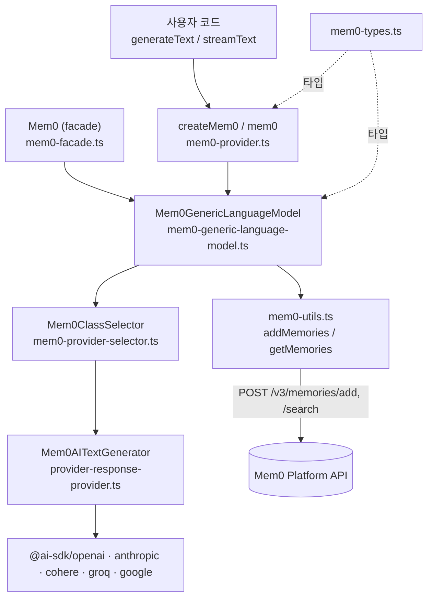
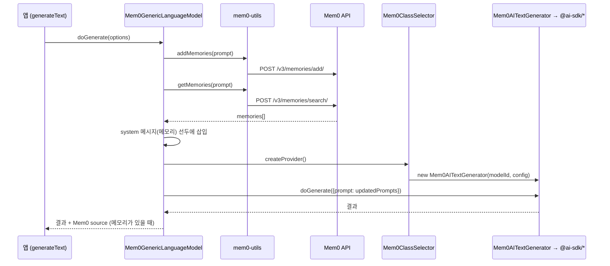

# vercel_ai_sdk 모듈

`integrations/vercel-ai-sdk`는 npm 패키지 **`@mem0/vercel-ai-provider`**(현재 `3.0.3`)를 구현한다. [Vercel AI SDK](https://sdk.vercel.ai)(`ai` v6, `LanguageModelV3` 스펙)용 provider로, 기존 LLM(OpenAI, Anthropic, Cohere, Groq, Google/Gemini)을 감싸서 **호출 전에 Mem0 메모리를 검색해 system 프롬프트에 주입하고, 호출 시 대화를 Mem0에 저장**한다. 사용자는 `generateText`/`streamText`에 `mem0(...)` 모델만 넘기면 된다.

Mem0 플랫폼 REST API(`/v3/memories/add/`, `/v3/memories/search/`)를 `fetch`로 직접 호출하며, `mem0ai` SDK에는 의존하지 않는다. 호스티드 클라이언트 자체는 [TypeScript_SDK_Core_(Hosted_Client_and_OSS_Engine)](TypeScript_SDK_Core_(Hosted_Client_and_OSS_Engine).md)를 참고한다. 같은 계열의 다른 연동은 [Framework_and_Workflow-Tool_Integrations](Framework_and_Workflow-Tool_Integrations.md)에 있다.

## 1. 아키텍처



| 파일 | 역할 |
|------|------|
| `src/index.ts` | 공개 export: `createMem0`, `mem0`, `Mem0`(facade), `addMemories`, `retrieveMemories`, `searchMemories`, `getMemories`, 타입들 |
| `src/mem0-provider.ts` | `createMem0(options)` 팩토리. `ProviderV3`를 구현하는 callable provider를 만들고 `chat`/`completion`/`languageModel`을 노출. 기본 인스턴스 `mem0 = createMem0()` 포함 |
| `src/mem0-generic-language-model.ts` | `Mem0GenericLanguageModel` (`LanguageModelV3`). `doGenerate`/`doStream`에서 메모리 처리 후 실제 모델에 위임 |
| `src/mem0-provider-selector.ts` | `Mem0ClassSelector`. 지원 provider(`openai`, `anthropic`, `cohere`, `groq`, `google`, `gemini`) 검증 후 래퍼 생성 |
| `src/provider-response-provider.ts` | `Mem0AITextGenerator`. provider 이름에 따라 `@ai-sdk/*`의 `create*` 팩토리로 실제 `languageModel` 생성 후 `doGenerate`/`doStream` 위임 |
| `src/mem0-utils.ts` | Mem0 REST 호출, 프롬프트 평탄화(`flattenPrompt`), 멀티모달 변환(`convertToMem0Format`) |
| `src/mem0-types.ts` | `Mem0ConfigSettings`, `Mem0ChatConfig`, `Mem0ChatSettings`, `Mem0Config`, `LLMProviderSettings` |
| `src/mem0-facade.ts` | `Mem0` 클래스. `chat()`/`completion()`으로 `Mem0GenericLanguageModel` 생성 (레거시 진입점) |
| `src/stream-utils.ts` | `filterStream`: 스트림에서 `step-finish` 청크를 제거하는 유틸 (index에서 export되지 않음) |
| `config/test-config.ts` | 테스트용 provider 목록·API 키, 테스트 사용자 엔티티 조회/삭제 헬퍼 |

## 2. 핵심 컴포넌트

### 2.1 `createMem0` (`mem0-provider.ts`)
- 옵션 `Mem0ProviderSettings`: `provider`(기본 `"openai"`), `mem0ApiKey`, `apiKey`(하위 LLM 키), `baseURL`, `headers`, `fetch`, `modelType`, `mem0Config`, `config`(하위 provider 설정).
- `new`로 호출하면 에러를 던진다. `provider.specificationVersion = 'v3'`.
- `provider(modelId, settings)`와 `languageModel`은 generic 모델, `.chat`/`.completion`은 `modelType`을 지정한 모델을 반환한다.

### 2.2 `Mem0GenericLanguageModel`
`processMemories`가 공통 로직이다.

1. `addMemories(prompt, mem0Config)`로 현재 대화를 저장 (`await`; 실패해도 로그만 남기고 계속).
2. `getMemories(prompt, mem0Config)`로 관련 메모리 검색.
3. 메모리가 있으면 "System Message: …Memory: …" 형태의 `system` 메시지를 프롬프트 맨 앞에 추가(원본 배열은 복사해 변경하지 않음).
4. `Mem0ClassSelector(...).createProvider()`로 실제 모델을 만들어 위임.

`doGenerate`는 메모리가 있으면 결과 `content`에 `type: "source"` 항목(`providerMetadata.mem0.memories`, `memoriesText`)을 덧붙인다. `doStream`은 메모리 주입 후 하위 모델의 스트림 결과를 그대로 반환하며 소스는 추가하지 않는다. 실패 시 `"Streaming failed or method not implemented."` 에러로 변환된다.

설정 병합 순서: `{ mem0ApiKey, ...config.mem0Config, ...settings }` — 모델별 `settings`가 provider 수준 `mem0Config`를 덮어쓴다.

### 2.3 `mem0-utils.ts`
- `searchInternalMemories`: `POST {host||https://api.mem0.ai}/v3/memories/search/`. v3 규격에 맞춰 `user_id`/`app_id`/`agent_id`/`run_id`를 `filters` 안에 넣고, `top_k`(기본 10), `threshold`, `rerank`, `metadata`를 선택적으로 전달.
- `updateMemories`/`addMemories`: `POST /v3/memories/add/`. 엔티티 ID는 최상위 필드, `infer`, `metadata` 지원.
- API 키는 `loadApiKey`로 `config.mem0ApiKey` 또는 환경변수 `MEM0_API_KEY`에서 읽는다. 인증 헤더는 `Authorization: Token <key>`.
- 모든 요청에 `X-Mem0-Source: VERCEL_AI_SDK`, `X-Mem0-Client: mem0-vercel-ai-provider/<version>` 헤더가 붙는다. 버전은 `tsup.config.ts`의 `define`(`__MEM0_PROVIDER_VERSION__`)이 `package.json`에서 빌드 시 주입하며, 번들 없이 실행하면 `"dev"`.
- `convertToMem0Format`: AI SDK 프롬프트를 Mem0 메시지로 변환. `file` 파트는 `mediaType`에 따라 `pdf_url`, `mdx_url`, `image_url`로 매핑.
- 반환 동작 차이: `getMemories`/`retrieveMemories`는 오류를 던지고, `searchMemories`는 오류 시 `[]`을 반환한다. 응답이 배열이든 `{results}`든 평탄 배열로 정규화한다. `retrieveMemories`는 메모리가 없으면 `""`, 있으면 system 프롬프트 문자열을 반환한다 (직접 프롬프트를 조립할 때 사용).

## 3. 데이터 흐름



## 4. 사용 예

```typescript
import { createMem0 } from "@mem0/vercel-ai-provider";
import { generateText } from "ai";

const mem0 = createMem0({
  provider: "openai",
  mem0ApiKey: process.env.MEM0_API_KEY,
  apiKey: process.env.OPENAI_API_KEY,
  mem0Config: { user_id: "alice" },
});

const { text } = await generateText({ model: mem0("gpt-4-turbo"), prompt: "내가 좋아하는 음식은?" });
```

## 5. 빌드·테스트·배포

- **빌드**: `tsup`(`tsup.config.ts`) — `src/index.ts`를 CJS/ESM + `.d.ts` + sourcemap으로 출력(`dist/`). `tsconfig.json`은 `strict`, `module: Node16`, `target: ES2018`.
- **스크립트** (`package.json`): `build`, `clean`, `dev`(nodemon), `lint`(ESLint), `type-check`, `prettier-check`, `test`(jest, `jest.config.js`: `ts-jest`, node 환경, `globalTeardown: ./teardown.ts`), `test:edge`/`test:node`(vitest 설정 파일 사용).
- **패키지 관리**: pnpm 전용(`pnpm-workspace.yaml`에 보안 `overrides`와 `onlyBuiltDependencies`). Node ≥ 18. `zod`는 선택적 peer 의존성.
- **의존성**: `ai`, `@ai-sdk/provider`, `@ai-sdk/provider-utils`, 그리고 `@ai-sdk/{openai,anthropic,cohere,groq,google}`.
- **테스트 설정** (`config/test-config.ts`): `MEM0_API_KEY`, `OPENAI_API_KEY`, `ANTHROPIC_API_KEY`, `COHERE_API_KEY` 환경변수 필요. `fetchDeleteId`/`deleteUser`가 `https://api.mem0.ai/v1/entities/`로 테스트 사용자를 정리한다.
- **배포**: `.github/workflows/vercel-ai-cd.yml`. `release.yml`(Release Router)이 `vercel-ai-v*` 태그 릴리스에서 dispatch하며, Node 22 + pnpm 10으로 빌드 후 `npm publish --provenance --access public`. 프리릴리스는 버전의 preid를 dist-tag로 사용. 자세한 내용은 [CI_CD_and_Repository_Governance](CI_CD_and_Repository_Governance.md).

## 6. 유의 사항

- 지원 provider 외 값은 `Mem0ClassSelector`(`Model not supported`) 또는 `Mem0AITextGenerator`(`Invalid provider`)에서 에러.
- `Mem0` facade는 `provider: 'openai'`와 `baseURL`/`headers`만 설정하며, `mem0ApiKey`/`apiKey`를 전달하지 않는다. 일반적으로는 `createMem0` 사용을 권장.
- `doGenerate`마다 `addMemories`와 `search`가 모두 실행되므로 호출당 Mem0 API 왕복이 2회 발생하고, 저장 완료를 `await`하므로 지연이 늘어난다.
- 모델 호출 전 메모리 저장 실패는 삼켜진다(콘솔 로그만). 검색 실패 시에도 메모리 없이 원 프롬프트로 진행한다.
