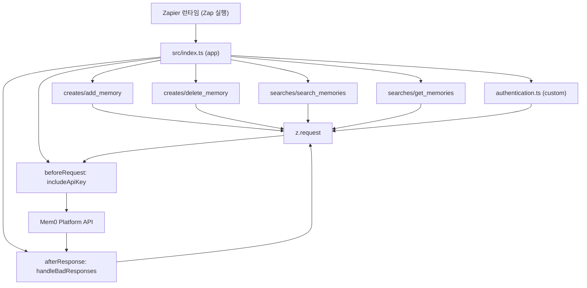
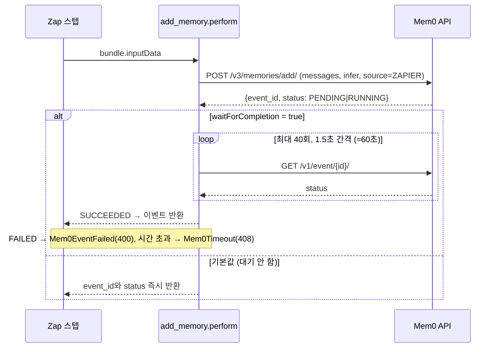
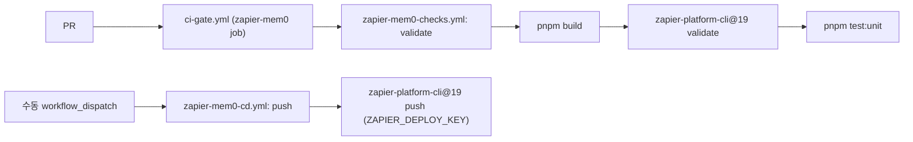

# zapier_mem0 모듈

`integrations/zapier-mem0/`는 Mem0 호스팅 플랫폼(`https://api.mem0.ai`)을 Zapier에서 사용할 수 있게 해 주는 **Zapier Platform CLI 앱**(`@mem0/zapier`, v0.1.2)입니다. 메모리 추가·삭제(creates)와 시맨틱 검색·사용자별 조회(searches)를 제공합니다. 다른 통합과 달리 npm이 아니라 **Zapier 플랫폼으로 배포**되며, 릴리스 라우터(`release.yml`)에 포함되지 않습니다.

상위 문맥: [Framework_and_Workflow-Tool_Integrations](Framework_and_Workflow-Tool_Integrations.md), CI/CD 파이프라인은 [CI_CD_and_Repository_Governance](CI_CD_and_Repository_Governance.md) 참고. 같은 REST API를 쓰는 다른 클라이언트는 [Node_CLI](Node_CLI.md), [Python_CLI](Python_CLI.md), [TypeScript_SDK_Core_(Hosted_Client_and_OSS_Engine)](TypeScript_SDK_Core_(Hosted_Client_and_OSS_Engine).md) 문서를 참고하세요.

## 1. 디렉터리 구성

| 파일 | 역할 |
|------|------|
| `src/index.ts` | 앱 정의. 인증, 미들웨어, creates/searches를 조립 (`export = app`) |
| `src/authentication.ts` | `custom` 인증 (API Key + 선택적 Base URL), `/v1/ping/`으로 연결 테스트 |
| `src/middleware.ts` | `includeApiKey`(beforeRequest), `handleBadResponses`(afterResponse) |
| `src/creates/add_memory.ts` | `add_memory` 액션 (비동기 이벤트 폴링 지원) |
| `src/creates/delete_memory.ts` | `delete_memory` 액션 |
| `src/searches/search_memories.ts` | `search_memories` 검색 |
| `src/searches/get_memories.ts` | `get_memories` 검색 (사용자별 목록) |
| `src/types.ts` | `ZObject`, `Bundle`, `AddResponse`, `EventResponse`, `Memory` 등 타입 |
| `package.json`, `pnpm-workspace.yaml`, `tsconfig.json` | 빌드/테스트/의존성 설정 |

## 2. 아키텍처

모든 HTTP 호출은 `z.request`를 통하며 두 미들웨어가 공통 처리합니다. 각 액션은 상대 경로(`/v3/...`)만 지정합니다.

## 3. 핵심 컴포넌트

### 3.1 인증 (`authentication.ts`)
- 필드: `apiKey`(password 타입, `m0-` 접두), `baseUrl`(기본 `https://api.mem0.ai`, 셀프호스팅용 재정의).
- 테스트: `GET /v1/ping/`. 응답의 `user_email`을 `connectionLabel`로 사용.

### 3.2 미들웨어 (`middleware.ts`)
- **`includeApiKey`**: `Authorization: Token <apiKey>` 헤더 주입, `/`로 시작하는 URL에 `baseUrl`(끝 슬래시 제거)을 앞에 붙임.
- **`handleBadResponses`**: `z.request`는 non-2xx에서 예외를 던지지 않으므로 직접 처리.
  - 401/403 → `AuthenticationError`
  - 그 외 ≥400 → `Mem0ApiError` (`detail`/`error`/`message`/`content` 순으로 추출, 객체는 JSON 문자열화)

### 3.3 액션 / 검색

| 키 | 종류 | 엔드포인트 | 비고 |
|----|------|-----------|------|
| `add_memory` | create | `POST /v3/memories/add/` | `source: 'ZAPIER'` 고정, `infer` 기본 true, `waitForCompletion` 선택 |
| `delete_memory` | create | `DELETE /v1/memories/{id}/` | ID는 `encodeURIComponent`, 말미 슬래시 필수 |
| `search_memories` | search | `POST /v3/memories/search/` | `output_format: 'v1.1'`, `top_k`=limit(기본 50), `filters.user_id` |
| `get_memories` | search | `POST /v3/memories/?page=&page_size=` | `limit` 기본 50, `page` 기본 1 (1-based) |

검색 결과는 배열 또는 `{results: [...]}` 모두 수용하고, null 본문이면 `[]`을 반환합니다.

#### add_memory 입력 필드
`content`(필수), `role`(user/assistant/system), `user_id`(필수), `agent_id`, `run_id`, `metadata`(JSON), `custom_instructions`, `custom_categories`(JSON), `includes`, `excludes`, `infer`, `waitForCompletion`.
- `metadata`, `custom_categories`가 잘못된 JSON이면 `InvalidInput`(400) 오류.
- Zapier 불리언이 문자열로 올 수 있어 `String(...)`으로 명시 변환합니다.

## 4. add_memory 데이터 흐름

폴링은 Zapier 스텝 타임아웃 아래로 제한된 60초 예산을 가지며 기본적으로 꺼져 있습니다. 타임아웃은 추가 실패가 아니라 서버에서 아직 처리 중일 수 있다는 의미입니다(오류 메시지에도 명시).

## 5. 빌드·테스트·배포

- 빌드: `pnpm build` (`tsc`, CommonJS, ES2020, `rootDir: src` → `dist`).
- 테스트: `pnpm test:unit`(`test/unit.test.ts`, 네트워크 없는 mock) / `pnpm test`(`jest --testTimeout 180000`, 실제 API 호출, `MEM0_API_KEY` 필요).
- 의존성: 런타임은 `zapier-platform-core` 19.0.0 하나. 보안 패치용 `pnpm.overrides`가 `package.json`과 `pnpm-workspace.yaml`에 중복 정의되어 있으므로 함께 수정해야 합니다.
- Node ≥ 18, pnpm 사용 (npm/yarn 금지).

- **CI** (`.github/workflows/zapier-mem0-checks.yml`): Node 22, pnpm 9, `--frozen-lockfile` → build → `zapier validate` → 오프라인 단위 테스트. PR에서는 `ci-gate.yml`이 호출하며, `main` push(`integrations/zapier-mem0/**`)와 수동 실행도 가능합니다.
- **CD** (`.github/workflows/zapier-mem0-cd.yml`): `workflow_dispatch` 전용. `gh workflow run zapier-mem0-cd.yml --ref main`. 시크릿 `ZAPIER_DEPLOY_KEY` 필요. npm OIDC 배포 경로와 무관합니다.
- 워크플로 파일 이름은 배포 자격과 연결되어 있으므로 승인 없이 수정/변경하지 않습니다.

## 6. 유지보수 참고

- 새 액션 추가 시 `src/index.ts`의 `creates`/`searches`에 등록하고, 오류는 반드시 `z.errors.Error`로 던집니다.
- 엔드포인트 혼용 주의: 추가/검색/목록은 `/v3`, 삭제/ping/이벤트는 `/v1`입니다. Django `APPEND_SLASH` 때문에 말미 슬래시를 유지해야 합니다.
- 서버 측 출처 기록은 `source: 'ZAPIER'` 본문 필드로 합니다(`integrations/CLAUDE.md`의 Surface attribution 참고). 새 소스 값은 플랫폼 `EventSource` enum에 먼저 반영되어야 합니다.
- 공개 동작을 바꾸면 `docs/`도 같은 PR에서 갱신해야 합니다.
