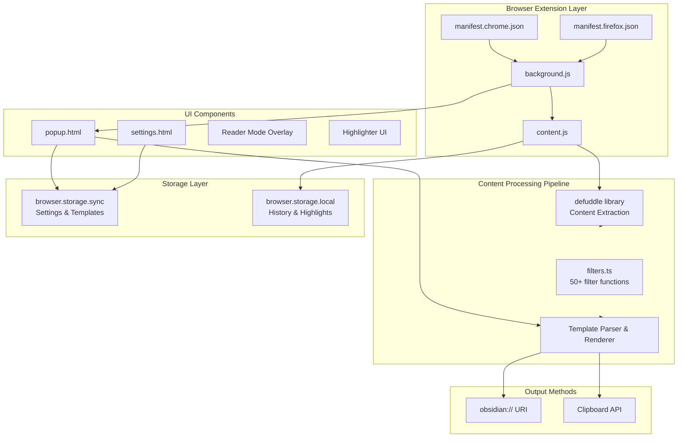
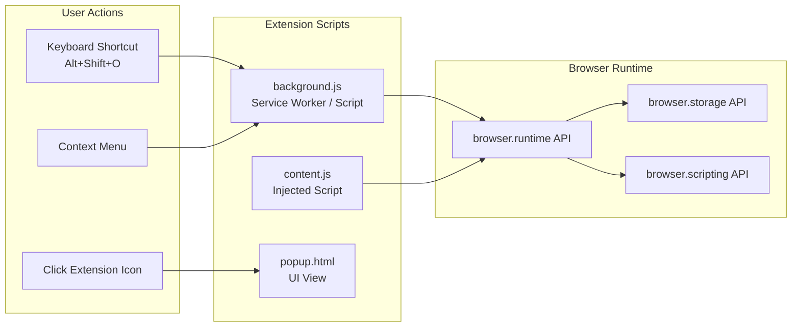
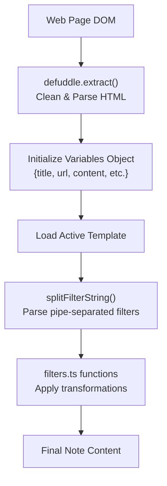

# Overview

<details>
<summary>Relevant source files</summary>

The following files were used as context for generating this wiki page:

- [README.md](README.md)
- [package-lock.json](package-lock.json)
- [package.json](package.json)
- [src/manifest.chrome.json](src/manifest.chrome.json)
- [src/manifest.firefox.json](src/manifest.firefox.json)
- [src/utils/filters.ts](src/utils/filters.ts)
- [src/utils/filters/replace.ts](src/utils/filters/replace.ts)
- [src/utils/filters/safe_name.ts](src/utils/filters/safe_name.ts)
- [src/utils/parser-utils.ts](src/utils/parser-utils.ts)
- [src/utils/string-utils.ts](src/utils/string-utils.ts)

</details>


## Purpose and Scope

The Obsidian Web Clipper is a browser extension that captures web content and saves it to Obsidian vaults as Markdown files. This wiki documents the technical architecture, implementation details, and development workflows for the extension codebase located at https://github.com/obsidianmd/obsidian-clipper.

The extension supports Chrome, Firefox, Safari, and Edge browsers through a multi-manifest build system [package.json:18-24](). It provides features for content extraction, HTML-to-Markdown conversion, text highlighting, reader mode, template-based transformation, and optional AI-powered content processing via an LLM interpreter.

This overview provides a high-level understanding of the system architecture and how major components interact. For specific subsystems, see:
- Code organization: [Project Structure](#1.1)
- Template and filter details: [Templates and Filters](#5)
- AI integration: [AI Integration](#6)
- Storage implementation: [Data Management](#8)
- Build system: [Build System](#10.1)

**Sources:** [README.md:1-13](), [package.json:2-4]()

## Core Concepts

The Web Clipper operates on three fundamental concepts that drive its architecture:

| Concept | Description | Implementation |
|---------|-------------|----------------|
| **Templates** | User-defined note formats that control structure and content | Template objects with behaviors (create/append/prepend), note name formats, and properties |
| **Variables** | Data extracted from web pages | `{{title}}`, `{{url}}`, `{{content}}`, `{{schema:...}}`, `{{meta:...}}`, and prompt variables |
| **Filters** | Transformation functions applied to variables | 50+ filters defined in [src/utils/filters.ts:133-186]() using pipe syntax |

Templates combine variables and filters to generate the final note. For example:
```
{{title | safe_name}}
{{date | date:"YYYY-MM-DD"}}
{{content | blockquote}}
```

**Sources:** [src/utils/filters.ts:133-186](), [src/utils/string-utils.ts:59-76](), [README.md:18]()

## System Architecture Overview

The extension follows a standard browser extension architecture with manifest-driven configuration, background scripts for coordination, content scripts for page interaction, and popup/settings UIs for user control.



**Architecture Diagram: Major System Components and Dependencies**

**Sources:** [src/manifest.chrome.json:1-88](), [src/manifest.firefox.json:1-97](), [README.md:98-105]()

## Extension Entry Points

The extension supports multiple interaction methods, including browser actions, keyboard shortcuts, and context menus.



**Extension Entry Points and Script Lifecycle**

**Sources:** [src/manifest.chrome.json:57-86](), [src/manifest.firefox.json:61-83]()

## Content Processing Pipeline

The pipeline transforms raw web DOM into formatted Markdown. It leverages `defuddle` for initial extraction and a custom filter/template engine for final formatting.



**Content Processing Pipeline: From DOM to Markdown**

**Sources:** [src/utils/filters.ts:189-216](), [src/utils/string-utils.ts:59-76](), [README.md:101]()

## Filter System Architecture

The filter system in [src/utils/filters.ts]() provides a modular way to transform data. Each filter is a discrete function that can be chained.

```mermaid
graph TB
    Input["Input Value<br/>string or array"]
    
    FilterString["Filter String<br/>'replace:\"old\":\"new\"|upper'"]
    
    splitFilterString["splitFilterString()<br/>Parse pipe-separated filters"]
    parseFilterString["parseFilterString()<br/>Extract name and params"]
    
    FilterRegistry["filters object<br/>Map names to FilterFunction"]
    
    ValidateParams["validateParams()<br/>ParamValidator functions"]
    
    ApplyFilter["Filter Implementation<br/>e.g., replace.ts"]
    
    Output["Output Value"]
    
    Input --> FilterString
    FilterString --> splitFilterString
    splitFilterString --> parseFilterString
    
    parseFilterString --> FilterRegistry
    FilterRegistry --> ValidateParams
    ValidateParams --> ApplyFilter
    ApplyFilter --> Output
```

**Filter System: Registration, Validation, and Execution**

**Sources:** [src/utils/filters.ts:133-186](), [src/utils/filters/replace.ts:28-98](), [src/utils/filters/safe_name.ts:21-66]()

## Browser Extension Manifest System

The project maintains multiple manifest files to handle browser-specific requirements while sharing a common codebase.

| Manifest | Key Differences |
|----------|-----------------|
| `manifest.chrome.json` | Uses `service_worker` for background [src/manifest.chrome.json:39](); includes `side_panel` [src/manifest.chrome.json:26](). |
| `manifest.firefox.json` | Uses `background.scripts` [src/manifest.firefox.json:43](); includes `browser_specific_settings` for Gecko [src/manifest.firefox.json:84](). |

**Sources:** [src/manifest.chrome.json:1-88](), [src/manifest.firefox.json:1-99]()

## Third-Party Libraries

- **webextension-polyfill**: Cross-browser compatibility for extension APIs [README.md:100]().
- **defuddle**: Core library for content extraction and Markdown conversion [README.md:101]().
- **dayjs**: Date parsing and formatting for `date` and `date_modify` filters [README.md:102]().
- **lz-string**: Compression for templates to reduce storage space [README.md:103]().
- **dompurify**: Sanitizing HTML content [README.md:105]().
- **lucide**: Icon set for the user interface [README.md:104]().

## Build and CLI

The project includes a CLI tool and a build system that produces three browser-specific distributions.

- **Build command**: `npm run build` generates `dist/` (Chrome), `dist_firefox/`, and `dist_safari/` [README.md:48-55]().
- **CLI tool**: A standalone version defined in `package.json` [package.json:5-7]().
- **API**: A programmatic API exported via `dist/api.mjs` [package.json:13]().

**Sources:** [package.json:15-34](), [README.md:43-54]()
