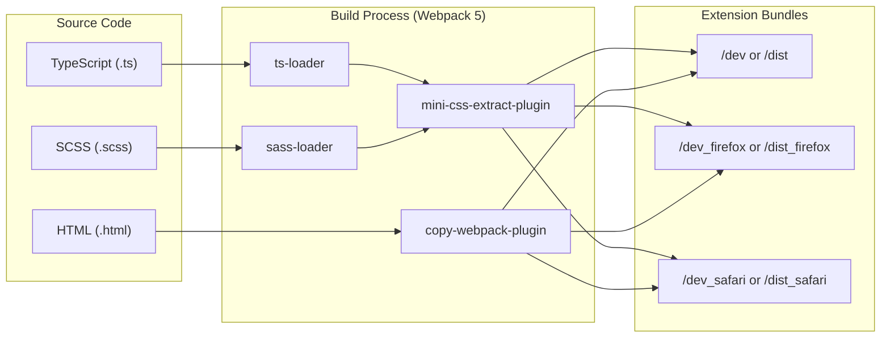
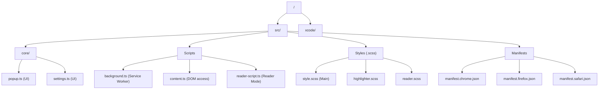

# Development Guide

<details>
<summary>Relevant source files</summary>

The following files were used as context for generating this wiki page:

- [.editorconfig](.editorconfig)
- [.eslintrc.json](.eslintrc.json)
- [.gitignore](.gitignore)
- [package.json](package.json)
- [scripts/bump-version.sh](scripts/bump-version.sh)
- [scripts/generate-changelog.sh](scripts/generate-changelog.sh)
- [scripts/readme.md](scripts/readme.md)
- [src/manifest.chrome.json](src/manifest.chrome.json)
- [src/manifest.firefox.json](src/manifest.firefox.json)
- [webpack.config.js](webpack.config.js)

</details>


This guide covers the development environment setup, build processes, and contribution guidelines for the Obsidian Web Clipper browser extension.

The project uses a Webpack-based build system with TypeScript, SCSS, and multi-browser support. See the subsections for details on [Build System](#10.1), [Code Quality and Setup](#10.2), and [UI Component Development](#10.3).

## Prerequisites

Before contributing to the Web Clipper, ensure you have:

- **Node.js** v25 or higher (recommended for compatibility with modern build tools) [package.json:38]()
- **npm** (comes with Node.js)
- A modern web browser (Chrome, Firefox, or Safari)
- A code editor with TypeScript support (e.g., VS Code)

## Quick Start

1. Clone the repository:
```bash
git clone https://github.com/obsidianmd/obsidian-clipper.git
cd obsidian-clipper
```

2. Install dependencies:
```bash
npm install
```

3. Start development mode:
```bash
npm run dev              # Chrome
npm run dev:firefox      # Firefox
npm run dev:safari       # Safari
```

4. Load the extension in your browser:
   - **Chrome**: Navigate to `chrome://extensions/`, enable "Developer mode", click "Load unpacked", select the `dev/` directory.
   - **Firefox**: Navigate to `about:debugging#/runtime/this-firefox`, click "Load Temporary Add-on", select any file in `dev_firefox/`.
   - **Safari**: Open the Xcode project in `xcode/`, build and run the macOS or iOS target.

Sources: [package.json:18-20](), [webpack.config.js:28-34]()

## Development Stack

### Technology Overview

The build pipeline transforms source TypeScript and SCSS into browser-compatible bundles.

**Build Pipeline:**



**Key Dependencies:**

| Category | Package | Purpose |
|----------|---------|---------|
| Content Extraction | `defuddle` | Core DOM parsing and content extraction [package.json:60]() |
| Sanitization | `dompurify` | HTML sanitization for security [package.json:61]() |
| Highlighting | `highlight.js` | Code syntax highlighting in reader mode [package.json:62]() |
| Icons | `lucide` | SVG icon library for UI components [package.json:64]() |
| Compression | `lz-string` | Template compression for storage [package.json:65]() |
| Date Handling | `dayjs` | Date/time manipulation for templates [package.json:59]() |

Sources: [package.json:57-66](), [webpack.config.js:100-155]()

### Build Commands

The project uses `webpack` with environment flags to target different browsers.

| Command | Target | Mode | Output |
|---------|--------|------|--------|
| `npm run dev` | Chrome | Development | `dev/` |
| `npm run dev:firefox` | Firefox | Development | `dev_firefox/` |
| `npm run dev:safari` | Safari | Development | `dev_safari/` |
| `npm run build:chrome` | Chrome | Production | `dist/` |
| `npm run build:firefox` | Firefox | Production | `dist_firefox/` |
| `npm run build:safari` | Safari | Production | `dist_safari/` |

Sources: [package.json:18-23](), [webpack.config.js:28-34]()

## Project Structure

The codebase is organized into core logic, browser scripts, and styling.



Sources: [webpack.config.js:41-50](), [webpack.config.js:139-143]()

## Browser-Specific Manifests

The extension maintains separate manifest files to handle API differences between browsers.

**Manifest Differences:**

| Feature | Chrome (`manifest.chrome.json`) | Firefox (`manifest.firefox.json`) |
|---------|--------|---------|
| Background | `service_worker` [src/manifest.chrome.json:39]() | `scripts` array [src/manifest.firefox.json:43]() |
| Side Panel | Supported [src/manifest.chrome.json:26]() | Not supported |
| Permissions | `declarativeNetRequest` [src/manifest.chrome.json:16]() | `webRequestBlocking` [src/manifest.firefox.json:15]() |
| Browser ID | N/A | `gecko.id` required [src/manifest.firefox.json:86]() |

Sources: [src/manifest.chrome.json:1-88](), [src/manifest.firefox.json:1-99]()

## Code Style and Quality

### ESLint Configuration

The project enforces code quality through ESLint.
- **Indentation**: Tabs are required [ .eslintrc.json:13]().
- **Environments**: Configured for `browser`, `es2021`, and `webextensions` [ .eslintrc.json:2-6]().

### EditorConfig Settings

Consistent formatting is maintained via `.editorconfig`:
- **Tabs**: Used for indentation across all file types [ .editorconfig:7]().
- **TS/JS Style**: Prefers single quotes (`false` for double quotes) and enforces semicolons [ .editorconfig:20-22](), [ .editorconfig:34-36]().

Sources: [.eslintrc.json:1-15](), [.editorconfig:1-36]()

## Testing and Localization

### Testing

The project uses `vitest` for unit testing.
- `npm test`: Runs the test suite once [package.json:28]().
- `npm run test:watch`: Runs tests in interactive watch mode [package.json:29]().

### Localization

The clipper supports multiple languages via `_locales`.
- `npm run update-locales`: Synchronizes translation files [package.json:30]().
- `npm run check-strings`: Identifies unused translation keys [package.json:31]().
- `npm run add-locale [code]`: Adds a new locale using AI translation [package.json:32](), [scripts/readme.md:25]().

Sources: [package.json:28-32](), [scripts/readme.md:13-27]()

## Versioning and Releases

Releases are managed through automated scripts that sync versions across all manifest files and the Xcode project.

- `scripts/bump-version.sh`: Updates version strings in `package.json`, browser manifests, and increments the Xcode project build number [scripts/bump-version.sh:35-54]().
- `scripts/generate-changelog.sh`: Generates a Markdown changelog based on git commits since the last tag, categorizing them into New, Improved, and Fixes [scripts/generate-changelog.sh:45-67]().

Sources: [scripts/bump-version.sh:1-58](), [scripts/generate-changelog.sh:1-70]()

## Debugging

### Development Mode

In development mode (`--mode development`), Webpack generates source maps (`devtool: 'source-map'`) to allow debugging original TypeScript code in browser DevTools [webpack.config.js:58]().

### Production Optimization

In production mode, the `TerserPlugin` is used for minification. It is configured to:
- Preserve class and function names (`keep_classnames: true`, `keep_fnames: true`) to maintain compatibility with Obsidian's integration [webpack.config.js:83-84]().
- Define a `DEBUG_MODE` constant as `false` for conditional logging [webpack.config.js:172-173]().

Sources: [webpack.config.js:58-91](), [webpack.config.js:170-173]()

## Next Steps

For detailed information on specific development topics:

- **Build System**: See [Build System](#10.1) for Webpack details, manifest generation, and CLI/API builds.
- **Code Quality**: See [Code Quality and Setup](#10.2) for environment setup and linting rules.
- **UI Components**: See [UI Component Development](#10.3) for SCSS architecture and UI patterns.
