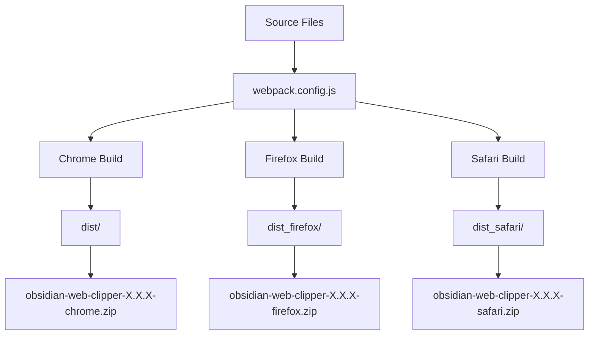
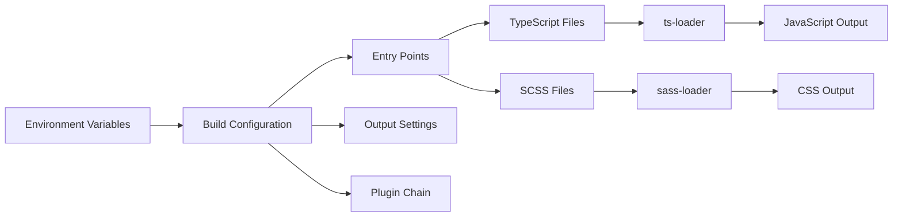
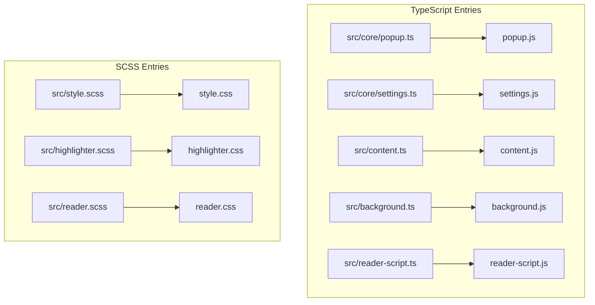
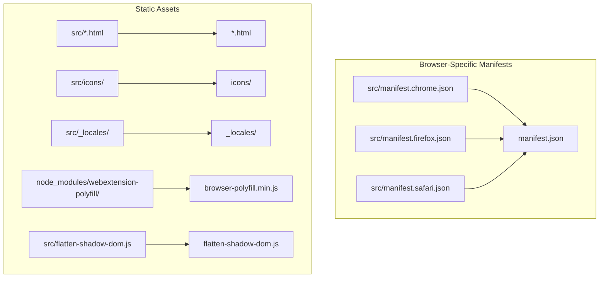

# Build System

<details>
<summary>Relevant source files</summary>

The following files were used as context for generating this wiki page:

- [.gitignore](.gitignore)
- [package.json](package.json)
- [scripts/bump-version.sh](scripts/bump-version.sh)
- [scripts/generate-changelog.sh](scripts/generate-changelog.sh)
- [scripts/readme.md](scripts/readme.md)
- [scripts/set-defuddle-dev.js](scripts/set-defuddle-dev.js)
- [scripts/set-defuddle-prod.js](scripts/set-defuddle-prod.js)
- [src/manifest.chrome.json](src/manifest.chrome.json)
- [src/manifest.firefox.json](src/manifest.firefox.json)
- [webpack.config.js](webpack.config.js)

</details>


This document covers the webpack-based build system that compiles the Obsidian Web Clipper source code into browser-ready extension packages and standalone CLI/API modules. The build system handles TypeScript compilation, SCSS processing, asset copying, and multi-browser packaging.

## Overview

The build system is centered around a webpack configuration that transforms TypeScript source files, SCSS stylesheets, and static assets into distributable browser extensions. It supports three target browsers (Chrome, Firefox, Safari) with browser-specific manifests and optimizations.



**Build Process Flow**

Sources: [webpack.config.js:1-185]()

## Build Configuration

The main build configuration is defined in `webpack.config.js` as a function that accepts environment variables to determine the target browser and build mode. The configuration dynamically adjusts output directories, manifest files, and optimization settings based on these parameters.

| Environment Variable | Values | Purpose |
|---------------------|--------|---------|
| `BROWSER` | `chrome`, `firefox`, `safari` | Target browser platform |
| `mode` | `development`, `production` | Build optimization level |



**Configuration Pipeline**

The build process determines output directories using the `getOutputDir()` function:
- Production: `dist`, `dist_firefox`, `dist_safari` [webpack.config.js:28-30]()
- Development: `dev`, `dev_firefox`, `dev_safari` [webpack.config.js:31-33]()

Sources: [webpack.config.js:23-37]()

## Entry Points and Outputs

The build system defines multiple entry points that correspond to different components of the browser extension:

| Entry Point | Source File | Output | Purpose |
|-------------|-------------|---------|---------|
| `popup` | `src/core/popup.ts` | `popup.js` | Main popup interface |
| `settings` | `src/core/settings.ts` | `settings.js` | Settings page |
| `highlights` | `src/core/highlights.ts` | `highlights.js` | Highlights management page |
| `reader-page` | `src/core/reader-view.ts` | `reader-page.js` | Reader mode UI |
| `content` | `src/content.ts` | `content.js` | Main content script |
| `background` | `src/background.ts` | `background.js` | Background service worker/script |
| `style` | `src/style.scss` | `style.css` | Global styles |
| `highlighter` | `src/highlighter.scss` | `highlighter.css` | Highlighter-specific styles |
| `reader` | `src/reader.scss` | `reader.css` | Reader mode theme styles |
| `reader-script` | `src/reader-script.ts` | `reader-script.js` | Reader mode logic script |



**Entry Point Compilation**

Sources: [webpack.config.js:41-52]()

## Script Commands

The `package.json` file defines the primary interface for triggering builds and development workflows.

### Browser Extension Commands
- `npm run dev:chrome`: Runs webpack in watch mode for Chrome development [package.json:18]().
- `npm run build:chrome`: Produces a production-ready Chrome build [package.json:21]().
- `npm run build`: Orchestrates production builds for all three supported browsers (Chrome, Firefox, Safari) [package.json:24]().

### Standalone and API Commands
- `npm run build:cli`: Executes `scripts/build-cli.mjs` to bundle the command-line interface [package.json:25]().
- `npm run build:api`: Executes `scripts/build-api.mjs` to bundle the programmatic API [package.json:26]().

### Maintenance Scripts
- `npm run update-locales`: Synchronizes translation files using `scripts/update-locales.ts` [package.json:30]().
- `npm run add-locale`: Adds a new language locale via `scripts/add-locale.ts` [package.json:32]().
- `npm run defuddle-dev`: Swaps the `defuddle` dependency to a local development version via `scripts/set-defuddle-dev.js` [package.json:16]().
- `npm run defuddle-prod`: Reinstalls the standard `defuddle` dependency via `scripts/set-defuddle-prod.js` [package.json:17]().

Sources: [package.json:15-34]()

## Asset Processing Pipeline

The build system processes various types of assets through different loaders and plugins:

### TypeScript Compilation
TypeScript files are processed using `ts-loader` with `compilerOptions` set to `ES2020` [webpack.config.js:104-117]().

### SCSS Processing
SCSS files are processed through a three-stage pipeline:
1. `sass-loader`: Compiles SCSS to CSS [webpack.config.js:128-134]().
2. `css-loader`: Resolves CSS imports and URLs [webpack.config.js:122-127]().
3. `MiniCssExtractPlugin.loader`: Extracts CSS into standalone files like `style.css` and `highlighter.css` [webpack.config.js:121-135]().

### Static Asset Copying
The `CopyPlugin` handles copying static assets with browser-specific manifest selection:



**Asset Copy Operations**

Sources: [webpack.config.js:138-159]()

## Multi-Browser Support

The build system supports three browser platforms with specific optimizations and manifest files for each:

### Browser Detection and Configuration
The build process uses environment variables to determine the target browser and applies appropriate configurations:
```javascript
const isFirefox = env.BROWSER === 'firefox';
const isSafari = env.BROWSER === 'safari';
const browserName = isFirefox ? 'firefox' : (isSafari ? 'safari' : 'chrome');
```
Sources: [webpack.config.js:24-37]()

### Manifest Selection
Each browser requires a different manifest file:
- **Chrome**: Uses `src/manifest.chrome.json`, defining a `service_worker` for the background script [src/manifest.chrome.json:39]().
- **Firefox**: Uses `src/manifest.firefox.json`, defining standard `scripts` for the background page [src/manifest.firefox.json:43]() and requiring `browser_specific_settings` for the Gecko engine [src/manifest.firefox.json:84-98]().
- **Safari**: Uses `src/manifest.safari.json`, which includes specific permissions and configurations for the Safari Web Extension format.

### Version Management
The `scripts/bump-version.sh` script automates version updates across all platform-specific manifests and the project's metadata:
1. Updates `package.json` [scripts/bump-version.sh:22]().
2. Updates Chrome, Firefox, and Safari manifests [scripts/bump-version.sh:23-25]().
3. Updates `MARKETING_VERSION` and `CURRENT_PROJECT_VERSION` in the Xcode project file [scripts/bump-version.sh:42-54]().

Sources: [webpack.config.js:141-144](), [src/manifest.chrome.json:1-87](), [src/manifest.firefox.json:1-99](), [scripts/bump-version.sh:1-58]()

## Development vs Production Builds

### Development Features
- **Source Maps**: Enabled via `devtool: 'source-map'` to allow debugging of original TypeScript source [webpack.config.js:58]().
- **DEBUG_MODE**: Set to `true` via `DefinePlugin` and `TerserPlugin` global definitions [webpack.config.js:68](), [webpack.config.js:172]().
- **Output**: Unminified code (with source maps) in `dev/` directories [webpack.config.js:31-33]().

### Production Optimizations
- **Minification**: Uses `TerserPlugin` with `mangle: false` to keep classnames and function names recognizable for Obsidian integration while compressing logic [webpack.config.js:62-87]().
- **Zip Generation**: `ZipPlugin` packages the build into `builds/obsidian-web-clipper-{version}-{browser}.zip` [webpack.config.js:175-179]().
- **Cleanup**: A custom `RemoveDSStore` hook removes macOS metadata files from the output directory after emission [webpack.config.js:11-21](), [webpack.config.js:163-169]().

Sources: [webpack.config.js:58-91](), [webpack.config.js:163-181]()
