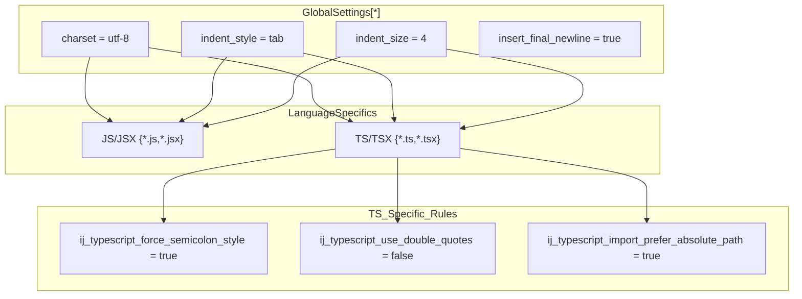
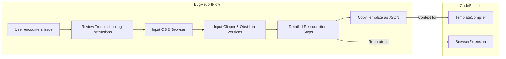

# Code Quality and Setup

Relevant source files

The following files were used as context for generating this wiki page:

- [.editorconfig](.editorconfig)
- [.eslintrc.json](.eslintrc.json)
- [package-lock.json](package-lock.json)

This document details the development environment configuration, code quality standards, and the technical setup required for contributing to the Obsidian Web Clipper. The project leverages a robust suite of configuration files and dependencies to ensure consistency across its multi-browser architecture (Chrome, Firefox, and Safari) and its standalone CLI.

## Development Environment Setup

The Obsidian Web Clipper uses standardized tooling to maintain code quality and a unified style across different development environments.

### Dependency Management

The project relies on a variety of production and development dependencies to handle content extraction, DOM manipulation, and the build process.

| Category | Key Packages | Purpose |
| :--- | :--- | :--- |
| **Core Processing** | `defuddle`, `dompurify`, `linkedom` | Handles DOM extraction and sanitization [package-lock.json:13-16](). |
| **Formatting** | `dayjs`, `highlight.js`, `lucide` | Date manipulation, syntax highlighting, and iconography [package-lock.json:12-17](). |
| **Build System** | `webpack`, `esbuild`, `ts-loader`, `sass-loader` | Compiles TypeScript and SCSS for extension targets [package-lock.json:32-42](). |
| **Testing** | `vitest` | Unit testing framework [package-lock.json:39-39](). |
| **Polyfills** | `webextension-polyfill` | Provides cross-browser compatibility for Extension APIs [package-lock.json:40-40](). |

Sources: [package-lock.json:7-45]()

### TypeScript Configuration

The project is built using TypeScript, targeting `es6` to balance modern language features with browser compatibility. The configuration ensures strict type safety and defines path aliases for cleaner imports.

| Option | Value | Purpose |
| :--- | :--- | :--- |
| `target` | `es6` | Sets the JavaScript language version for output [tsconfig.json:10-10](). |
| `strict` | `true` | Enables all strict type-checking options [tsconfig.json:12-12](). |
| `baseUrl` | `src` | Specifies the base directory for non-relative module names [tsconfig.json:3-3](). |
| `paths` | `managers/*`, `utils/*` | Maps specific module names to locations in `src` [tsconfig.json:4-9](). |
| `types` | `chrome`, `webextension-polyfill`, `node`, `webpack-env` | Includes type definitions for extension APIs and environment [tsconfig.json:21-21](). |

**Key Path Aliases:**
- `managers/*`: Maps to `src/managers/*` [tsconfig.json:6-6]().
- `utils/*`: Maps to `src/utils/*` [tsconfig.json:7-7]().
- `icons`: Maps to `src/icons` [tsconfig.json:8-8]().

Sources: [tsconfig.json:1-28]()

### Editor Configuration

The project uses `.editorconfig` to enforce consistent coding styles across various IDEs. This is the "top-most" configuration file for the repository [ .editorconfig:1-2]().

**Style Enforcement:**
- **Indentation**: Tabs are strictly enforced with a width of 4 [ .editorconfig:7-9]().
- **Quotes**: Single quotes are forced for both JavaScript and TypeScript [ .editorconfig:20-21](), [ .editorconfig:34-35]().
- **Imports**: TypeScript is configured to prefer absolute paths and sort members automatically [ .editorconfig:29-31]().

Sources: [ .editorconfig:1-36]()

## Code Quality Standards

Code quality is maintained through automated linting and structured issue management.

### ESLint Configuration

The ESLint setup targets modern browser environments and specifically includes the `webextensions` environment to support browser-specific globals [ .eslintrc.json:2-6]().

- **Base Rules**: Extends `eslint:recommended` [ .eslintrc.json:7-7]().
- **Parser Options**: Configured for `ecmaVersion: 12` (ES2021) using ES modules [ .eslintrc.json:8-11]().
- **Key Rule**: Explicitly enforces `indent` using `tab` to match EditorConfig [ .eslintrc.json:13-13]().

Sources: [ .eslintrc.json:1-15]()

### Bug Reporting and Quality Feedback

To maintain high software quality, the project uses a detailed bug report template that acts as a quality gate for community contributions.

**Quality Requirements for Reports:**
- **Troubleshooting**: Users must confirm they reviewed the troubleshooting guide [ .github/ISSUE_TEMPLATE/bug_report.md:8-14]().
- **Environment Context**: Operating System, Browser, Clipper Version, and Obsidian Version are required fields [ .github/ISSUE_TEMPLATE/bug_report.md:15-39]().
- **Configuration Context**: For custom template issues, users are directed to use the **More → Copy as JSON** feature in settings to provide their configuration [ .github/ISSUE_TEMPLATE/bug_report.md:60-66]().

Sources: [ .github/ISSUE_TEMPLATE/bug_report.md:1-67](), [ .github/ISSUE_TEMPLATE/feature_request.md:1-12]()

## Project Funding and Support

The project is maintained by Obsidian MD. Funding and official support links are centralized in the repository metadata.

- **GitHub Funding**: `obsidianmd` [ .github/.FUNDING:1-1]().
- **Official Site**: `https://obsidian.md/` [ .github/.FUNDING:2-2]().

Sources: [ .github/.FUNDING:1-2]()
