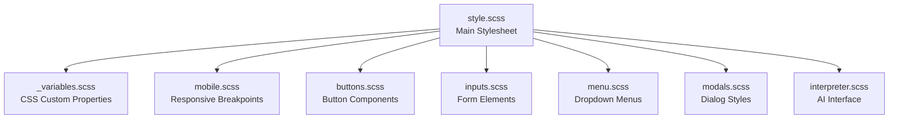
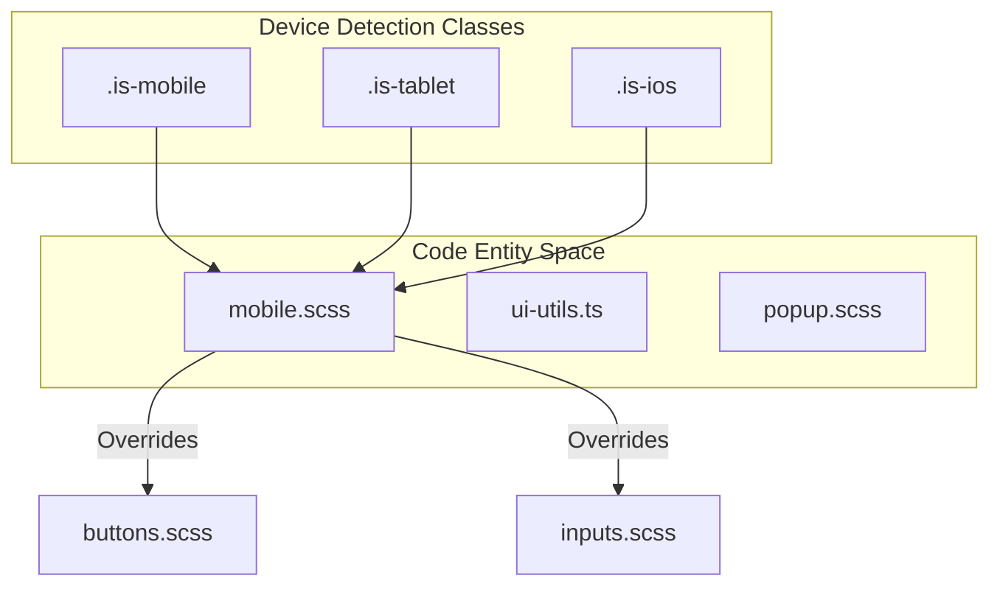
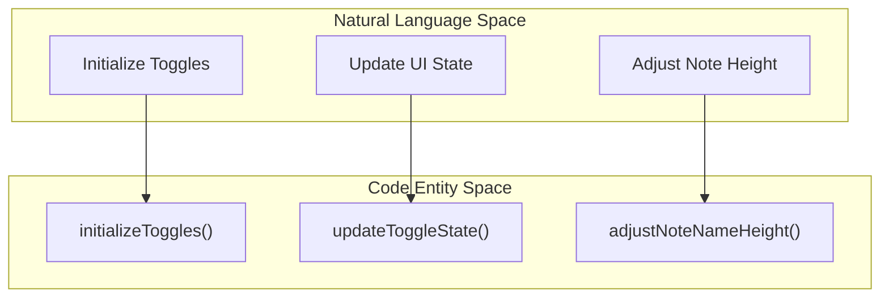

# UI Component Development

Relevant source files

The following files were used as context for generating this wiki page:

- [src/managers/menu.ts](src/managers/menu.ts)
- [src/styles/_variables.scss](src/styles/_variables.scss)
- [src/styles/buttons.scss](src/styles/buttons.scss)
- [src/styles/inputs.scss](src/styles/inputs.scss)
- [src/styles/interpreter.scss](src/styles/interpreter.scss)
- [src/styles/menu.scss](src/styles/menu.scss)
- [src/styles/mobile.scss](src/styles/mobile.scss)
- [src/styles/modals.scss](src/styles/modals.scss)
- [src/utils/auto-save.ts](src/utils/auto-save.ts)
- [src/utils/debounce.ts](src/utils/debounce.ts)
- [src/utils/drag-and-drop.ts](src/utils/drag-and-drop.ts)
- [src/utils/routing.ts](src/utils/routing.ts)
- [src/utils/ui-utils.ts](src/utils/ui-utils.ts)

This page provides guidance for developing UI components in the Obsidian Web Clipper extension. It covers the SCSS architecture, CSS variable system, component patterns for buttons/inputs/menus, and responsive design practices.

## SCSS Architecture

The extension uses a modular SCSS architecture with separate files for different component types. The main stylesheet `src/style.scss` imports all modules, ensuring a clear separation of concerns and a predictable cascade.

The SCSS files are organized by component type. Base styles and variables are loaded first, followed by component-specific styles. Browser-specific fixes and mobile overrides are loaded to ensure proper priority.

Sources: [src/styles/_variables.scss:1-176](), [src/styles/mobile.scss:1-135]()

## CSS Variable System

The extension uses CSS custom properties extensively for theming and responsive design. Variables are defined in `src/styles/_variables.scss` and consumed throughout the component styles.

| Variable Category | Examples | Purpose |
|------------------|----------|---------|
| Colors | `--background-primary`, `--text-normal`, `--interactive-accent` | Theme colors for backgrounds, text, and interactive elements [src/styles/_variables.scss:13-146]() |
| Typography | `--font-default`, `--font-ui-medium`, `--font-ui-smaller` | Font families and sizes [src/styles/_variables.scss:65-75]() |
| Spacing | `--popup-padding`, `--metadata-gap` | Consistent spacing and sizing [src/styles/_variables.scss:96-132]() |
| Borders | `--radius-s`, `--radius-l`, `--background-modifier-border` | Border radii and border colors [src/styles/_variables.scss:17-137]() |
| Checkboxes | `--checkbox-size`, `--checkbox-color`, `--checkbox-radius` | Form element styling [src/styles/_variables.scss:34-40]() |
| Dialogs | `--dialog-width`, `--dialog-height`, `--modal-radius` | Modal and dialog dimensions [src/styles/_variables.scss:50-129]() |

The system supports platform-specific adjustments, such as the `.is-macos` class which applies `superellipse` corner shapes and adjusted slider/toggle dimensions [src/styles/_variables.scss:179-196]().

Sources: [src/styles/_variables.scss:1-196]()

## Responsive Design System

The extension implements a comprehensive responsive design system that adapts to different screen sizes and device types, specifically targeting mobile browsers like Safari on iOS and Firefox on Android.

### Device-Specific Logic

The system uses browser and device detection to apply specific classes like `.is-mobile`, `.is-tablet`, `.is-ios`, or `.is-firefox-mobile` to the UI root [src/styles/mobile.scss:15-28](). These classes trigger specific SCSS overrides.

### Key Responsive Patterns
- **Touch Targets**: On mobile/tablet, interactive elements are enlarged. The `--input-height` increases to `2.25rem` [src/styles/mobile.scss:39]() and `--clickable-icon-size` increases to `2rem` [src/styles/mobile.scss:31]().
- **Mobile Footer**: On mobile, the `.clipper-footer` is positioned absolutely at the bottom with transitions to handle keyboard appearance during resizing [src/styles/mobile.scss:109-125]().
- **iOS Specifics**: iOS devices receive specific styling for toggles and sliders, including wider thumb widths and superellipse corner shapes [src/styles/mobile.scss:85-103]().

Sources: [src/styles/mobile.scss:1-135]()

## Component Patterns

### Button Components
Buttons use a base style with modifiers for functional roles.
- **Base Buttons**: Defined with `display: inline-flex`, `width: 100%`, and `box-shadow` [src/styles/buttons.scss:1-15]().
- **Primary Action (`.mod-cta`)**: Uses `--interactive-accent` background for high-visibility actions [src/styles/buttons.scss:47-61]().
- **Clickable Icons**: Transparent backgrounds with hover effects, used for secondary actions. They use a specific `--clickable-icon-size` variable [src/styles/buttons.scss:64-95]().
- **Add Buttons**: Specialized `.add-btn` class for "add item" interactions, often found in lists [src/styles/buttons.scss:97-117]().

### Input Components
- **Text & Textarea**: Shared styles for borders and focus states. Textareas default to `resize: vertical` [src/styles/inputs.scss:1-46]().
- **Custom Checkboxes**: Implemented using `appearance: none` and an SVG mask for the checkmark [src/styles/inputs.scss:109-173]().
- **Range Sliders**: Custom-styled webkit sliders using `--slider-track-background` and `--slider-thumb-height` [src/styles/inputs.scss:58-94]().
- **Toggles**: Built as `.checkbox-container` wrappers around checkboxes, initialized via `initializeToggles()` [src/utils/ui-utils.ts:1-63]().

### Menu Components
Menus consist of a `.menu-btn` container, a `.menu-toggle`, and a `.menu` list [src/styles/menu.scss:1-31]().
- **Mobile Adaptation**: On mobile, menus transform into fixed bottom sheets that span the full width of the screen [src/styles/menu.scss:59-76]().
- **Menu Logic**: Managed by `src/managers/menu.ts`, which handles `toggleMenu`, `closeMenu`, and click-outside behavior [src/managers/menu.ts:1-41]().

Sources: [src/styles/buttons.scss:1-117](), [src/styles/inputs.scss:1-226](), [src/styles/menu.scss:1-91](), [src/managers/menu.ts:1-60]()

## AI Interpreter UI
The AI Interpreter component (`#interpreter`) features dynamic states based on the processing lifecycle:
- **Lifecycle States**: The component toggles between `.processing`, `.done`, and `.error` classes [src/styles/interpreter.scss:13-29]().
- **Success State**: Switches to success colors (`--text-success`) and enables model selection opacity [src/styles/interpreter.scss:13-20]().
- **Error State**: Displays a red-themed error container (`#interpreter-error`) with word-wrapping for long stack traces [src/styles/interpreter.scss:22-29](), [src/styles/interpreter.scss:176-188]().
- **Token Counter**: A dedicated `.token-counter` displays usage and can trigger `warning` or `error` colors based on context [src/styles/interpreter.scss:159-174]().

Sources: [src/styles/interpreter.scss:1-298]()

## UI Utilities and State Management

### Drag and Drop
The extension provides a centralized drag-and-drop utility for reordering lists like templates, properties, and vaults.
- **Initialization**: `initializeDragAndDrop()` attaches listeners to specific container IDs [src/utils/drag-and-drop.ts:11-27]().
- **Handlers**: Logic for reordering is split into specific handlers like `handleTemplateReorder` and `handlePropertyReorder` [src/utils/drag-and-drop.ts:91-151]().

### Initialization and State
The `ui-utils.ts` file provides helper functions for syncing DOM state with internal data.

- **Toggle Initialization**: `initializeToggles` scans a container for `.checkbox-container` elements and sets up click listeners that trigger `settings-changed` events [src/utils/ui-utils.ts:1-63]().
- **Auto-Save**: Changes to the template form trigger a debounced save operation via `initializeAutoSave()`, ensuring persistence without explicit save buttons [src/utils/auto-save.ts:6-42]().

Sources: [src/utils/ui-utils.ts:1-123](), [src/utils/drag-and-drop.ts:1-185](), [src/utils/auto-save.ts:1-72]()
