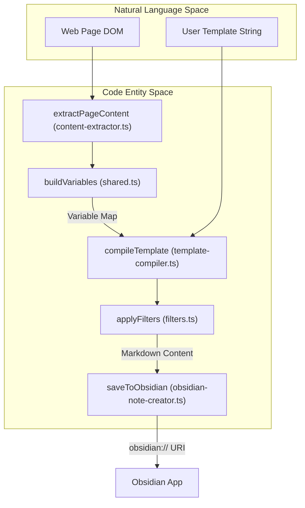
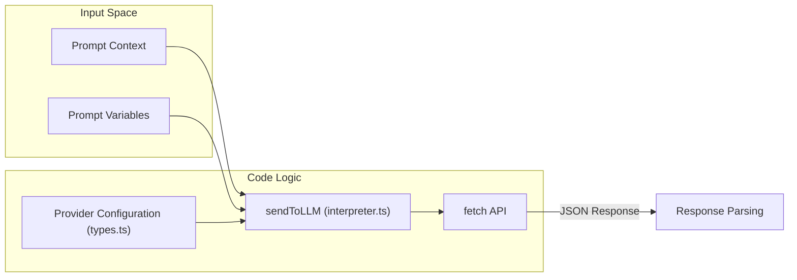

# Glossary

Relevant source files

The following files were used as context for generating this wiki page:

- [README.md](README.md)
- [docs/Filters.md](docs/Filters.md)
- [docs/Templates.md](docs/Templates.md)
- [docs/Troubleshoot Web Clipper.md](docs/Troubleshoot Web Clipper.md)
- [docs/Variables.md](docs/Variables.md)
- [package.json](package.json)
- [src/background.ts](src/background.ts)
- [src/content.ts](src/content.ts)
- [src/managers/general-settings.ts](src/managers/general-settings.ts)
- [src/managers/interpreter-settings.ts](src/managers/interpreter-settings.ts)
- [src/manifest.chrome.json](src/manifest.chrome.json)
- [src/manifest.firefox.json](src/manifest.firefox.json)
- [src/styles/icons.scss](src/styles/icons.scss)
- [src/utils/charts.ts](src/utils/charts.ts)
- [src/utils/content-extractor.ts](src/utils/content-extractor.ts)
- [src/utils/filters.ts](src/utils/filters.ts)
- [src/utils/filters/fragment_link.ts](src/utils/filters/fragment_link.ts)
- [src/utils/filters/replace.ts](src/utils/filters/replace.ts)
- [src/utils/filters/reverse.ts](src/utils/filters/reverse.ts)
- [src/utils/filters/safe_name.ts](src/utils/filters/safe_name.ts)
- [src/utils/interpreter.ts](src/utils/interpreter.ts)
- [src/utils/obsidian-note-creator.ts](src/utils/obsidian-note-creator.ts)
- [src/utils/parser-utils.ts](src/utils/parser-utils.ts)
- [src/utils/renderer.test.ts](src/utils/renderer.test.ts)
- [src/utils/renderer.ts](src/utils/renderer.ts)
- [src/utils/storage-utils.ts](src/utils/storage-utils.ts)
- [src/utils/string-utils.ts](src/utils/string-utils.ts)
- [src/utils/template-compiler.ts](src/utils/template-compiler.ts)

This glossary defines codebase-specific terms, abbreviations, and domain concepts used within the Obsidian Web Clipper project. It serves as a technical reference for engineers to understand the implementation details and data flow of the extension.

## Extension Components

### Content Script
A script that runs in the context of a web page. It can read details of the web pages the browser visits and make changes to them. In this project, `content.js` is responsible for DOM extraction, highlighting, and rendering the iframe-based UI.
*   **Implementation**: [src/content.ts:23-32]()
*   **Key Function**: `initializePageContent` prepares the variables for the template engine by gathering metadata and processing highlights. [src/utils/content-extractor.ts:127-202]()

### Background Script
A long-running script that manages the extension's lifecycle, listens for browser events, and coordinates communication between different parts of the extension. It handles tasks like opening the Obsidian URI and managing the context menu.
*   **Implementation**: [src/background.ts:1-8]()
*   **Key Function**: `ensureContentScriptLoadedInBackground` ensures that the content script is active before sending extraction requests. [src/background.ts:150-173]()

### Popup / Side Panel
The primary user interface for configuring a "clip". It allows users to select templates, edit note properties, and trigger the save action. In Chromium, this can manifest as a side panel or a popup.
*   **Implementation**: [src/content.ts:47-85]() (Iframe injection logic)
*   **Manifest Config**: [src/manifest.chrome.json:23-28]()

## Template Engine Concepts

### Variable
A placeholder in a template (e.g., `{{title}}`) that is replaced with actual data during the clipping process. Variables are built from page metadata, schema.org data, and highlights.
*   **Source**: [src/utils/content-extractor.ts:166-186]()
*   **Built-in Variables**: `title`, `author`, `content`, `url`, `description`, `published`, `site`, `wordCount`, etc. [src/utils/content-extractor.ts:167-185]()

### Filter
A function applied to a variable using the pipe `|` syntax to transform its value. For example, `{{title | safe_name}}`.
*   **Implementation**: [src/utils/filters.ts:133-186]()
*   **Filter Chaining**: Multiple filters can be applied in sequence by splitting the filter string on the pipe character. [src/utils/filters.ts:189-216]()

### Behavior
Defines how the clipped content is integrated into the Obsidian vault via the URL scheme.
*   **create**: Creates a new file.
*   **append/prepend**: Adds content to the end or beginning of an existing file.
*   **append-daily/prepend-daily**: Targets the Obsidian Daily Note plugin. [src/utils/obsidian-note-creator.ts:55-58]()
*   **overwrite**: Replaces the content of an existing file. [src/utils/obsidian-note-creator.ts:73-75]()

### Template Flow Diagram
The following diagram illustrates how data flows from the browser DOM through the extraction and template engine to produce a result for Obsidian.

"Data Transformation Flow"

Sources: [src/utils/content-extractor.ts:104-125](), [src/utils/content-extractor.ts:166-186](), [src/utils/filters.ts:133-186](), [src/utils/obsidian-note-creator.ts:46-52]()

## AI & Interpreter Terms

### Interpreter
The AI-powered component that uses Large Language Models (LLMs) to transform or extract specific information from the page content based on custom prompts.
*   **Implementation**: [src/utils/interpreter.ts:17-154]()

### Provider
A service that hosts LLMs (e.g., OpenAI, Anthropic, Ollama). Each provider has a `baseUrl` and may require an `apiKey`.
*   **Reference**: [src/managers/interpreter-settings.ts:9-21]()

### Prompt Variable
A special type of variable where the value is generated by the LLM using a user-defined prompt.
*   **Reference**: [src/utils/interpreter.ts:41-45]()

"Interpreter Request Architecture"

Sources: [src/utils/interpreter.ts:17-35](), [src/utils/interpreter.ts:158-181](), [src/managers/interpreter-settings.ts:40-67]()

## Storage & Data Patterns

### Dual-Tier Storage
The extension uses two different browser storage areas:
1.  **`browser.storage.sync`**: Used for small, user-specific data like settings and templates that should sync across devices.
2.  **`browser.storage.local`**: Used for larger data or device-specific data like history and iframe dimensions. [src/content.ts:60-66]()

### Storage Management
The clipper manages persistence through utility functions that handle cross-browser differences.
*   **Implementation**: [src/utils/storage-utils.ts:1-10]() (Referenced by managers)

## Obsidian Specifics

### Legacy Mode
A fallback setting where the entire note content is passed directly in the `obsidian://` URI. When disabled (default), the extension uses the clipboard to transfer large amounts of text to avoid URI length limits.
*   **Implementation**: [src/utils/obsidian-note-creator.ts:85-93]()

### Frontmatter (Properties)
The YAML metadata block at the top of a Markdown file. In the clipper, these are generated from `Property` objects using a mapping of property names to types.
*   **Implementation**: [src/utils/obsidian-note-creator.ts:9-15]()

## Abbreviations
| Abbreviation | Full Term | Context |
| :--- | :--- | :--- |
| **LLM** | Large Language Model | Used in the Interpreter for AI processing. |
| **MV3** | Manifest V3 | The modern browser extension platform used. [src/manifest.chrome.json:2]() |
| **XPath** | XML Path Language | Used to locate elements in the DOM for highlighting. [src/utils/content-extractor.ts:11-14]() |
| **AST** | Abstract Syntax Tree | The internal representation of a template during parsing. |
| **IIFE** | Immediately Invoked Function Expression | Used in `content.ts` to scope variables. [src/content.ts:23-23]() |

Sources: [README.md:98-106](), [src/utils/filters.ts:1-56](), [src/utils/interpreter.ts:1-12](), [src/utils/obsidian-note-creator.ts:1-8]()
