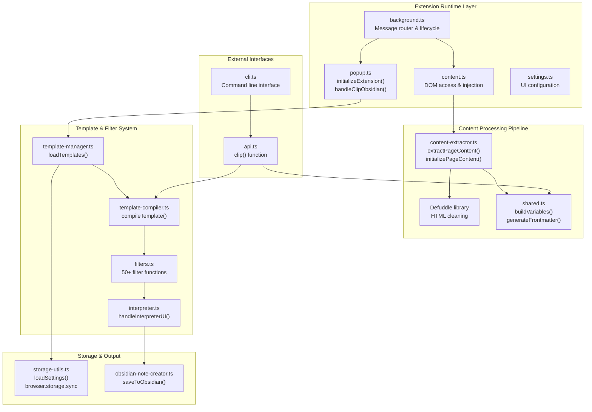
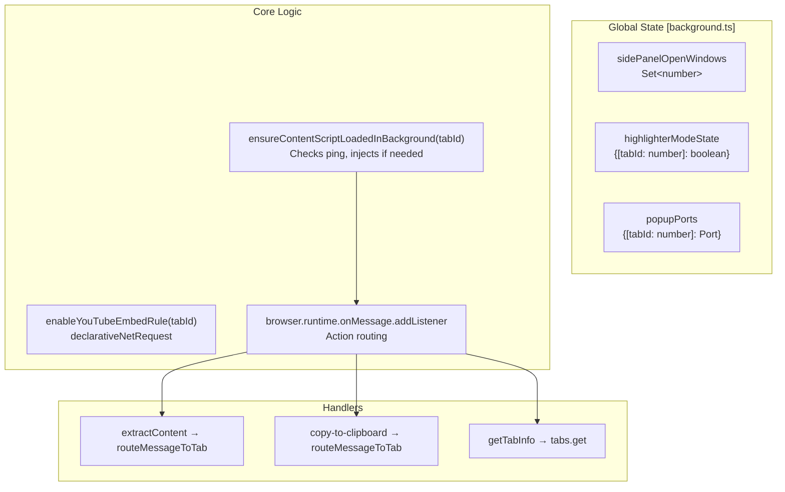
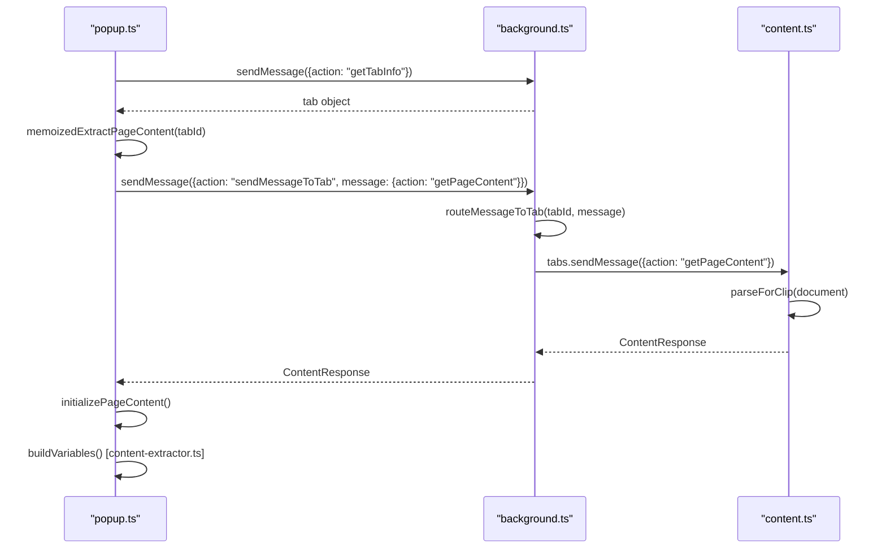
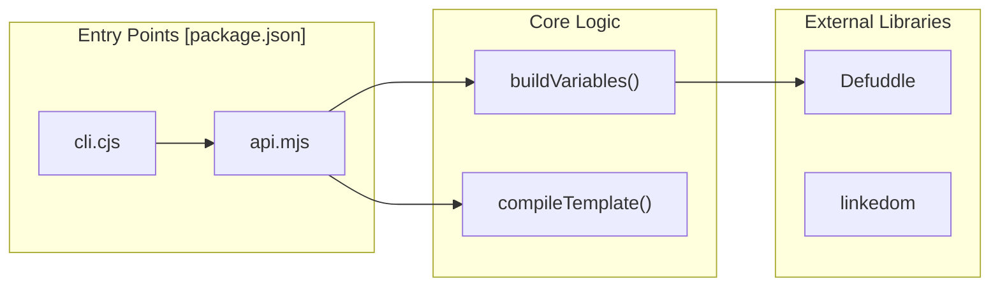

# Architecture

Relevant source files

The following files were used as context for generating this wiki page:

- [package.json](package.json)
- [src/background.ts](src/background.ts)
- [src/content.ts](src/content.ts)
- [src/core/popup.ts](src/core/popup.ts)
- [src/manifest.chrome.json](src/manifest.chrome.json)
- [src/manifest.firefox.json](src/manifest.firefox.json)
- [src/styles/popup.scss](src/styles/popup.scss)
- [src/utils/content-extractor.ts](src/utils/content-extractor.ts)

This document describes the high-level architecture of the Obsidian Web Clipper browser extension, covering the core system components, their relationships, and data flow patterns. It focuses on the structural organization of the codebase and how the major subsystems interact to enable web content clipping functionality.

For detailed information about specific extension components, see [Extension Architecture](#2.1). For details on message passing, see [Communication Flow](#2.2). For using the clipper outside of a browser, see [CLI and Programmatic API](#2.3).

## System Overview

The Obsidian Web Clipper is a cross-browser extension built with TypeScript and bundled using Webpack. The architecture follows the standard browser extension model (Manifest V3) with background scripts, content scripts, and multiple UI components. The system is organized into distinct layers: extension runtime, content processing, template transformation, and external integration.

### Core Architecture Components

**Sources:** [src/background.ts:1-125](), [src/core/popup.ts:1-182](), [src/content.ts:23-85](), [src/utils/content-extractor.ts:104-202](), [package.json:5-14]()

## Browser Extension Core

The extension implements the standard Manifest V3 architecture with browser-specific adaptations handled through conditional build processes. It relies on a polyfill layer to maintain compatibility across Chrome, Firefox, and Safari.

For details, see [Extension Architecture](#2.1).

### Background Script Architecture

The background script (`background.ts`) manages extension lifecycle, maintains state across tabs, handles message routing, and coordinates content script injection. It acts as the central hub for the extension's event-driven logic.

#### Background Script State and Functions

**Sources:** [src/background.ts:111-116](), [src/background.ts:118-148](), [src/background.ts:150-173](), [src/background.ts:177-189](), [src/background.ts:12-35]()

## Communication Architecture

The extension uses multiple communication patterns to coordinate between different execution contexts. The `popup.ts` script frequently communicates with `background.ts` to request data from the active tab's `content.ts`.

For details, see [Communication Flow](#2.2).

### Content Extraction Flow

The extraction process involves multiple steps to transform raw DOM data into a structured format suitable for templates. The `extractPageContent` function handles the retry logic and script injection if the initial communication fails.

**Sources:** [src/core/popup.ts:75-90](), [src/core/popup.ts:113-125](), [src/utils/content-extractor.ts:67-102](), [src/utils/content-extractor.ts:127-186](), [src/background.ts:177-189]()

## CLI and Programmatic API

Beyond the browser extension, the clipper provides a programmatic API and a CLI tool. These components allow the clipping logic to be executed in Node.js environments by providing a `DocumentParser` interface.

For details, see [CLI and Programmatic API](#2.3).

### Environment-Agnostic Logic

The CLI and API entry points leverage the core processing pipeline while abstracting away browser-specific APIs.

**Sources:** [package.json:5-14](), [src/utils/content-extractor.ts:1-8](), [src/content.ts:1-14]()

## Data Management

The extension uses a dual-storage strategy: `browser.storage.sync` for user settings and templates (synced across devices), and `browser.storage.local` for usage data and highlights (device-specific).

| Storage Type | Key Examples | Purpose |
|--------------|--------------|---------|
| **Sync** | `general_settings`, `templates` | Configuration and user templates |
| **Local** | `history`, `clipperIframeWidth`, `clipperIframeHeight` | Local history, UI state, and stats |

**Sources:** [src/core/popup.ts:9-11](), [src/utils/storage-utils.ts:3](), [src/content.ts:60-66](), [src/manifest.chrome.json:8-17]()
