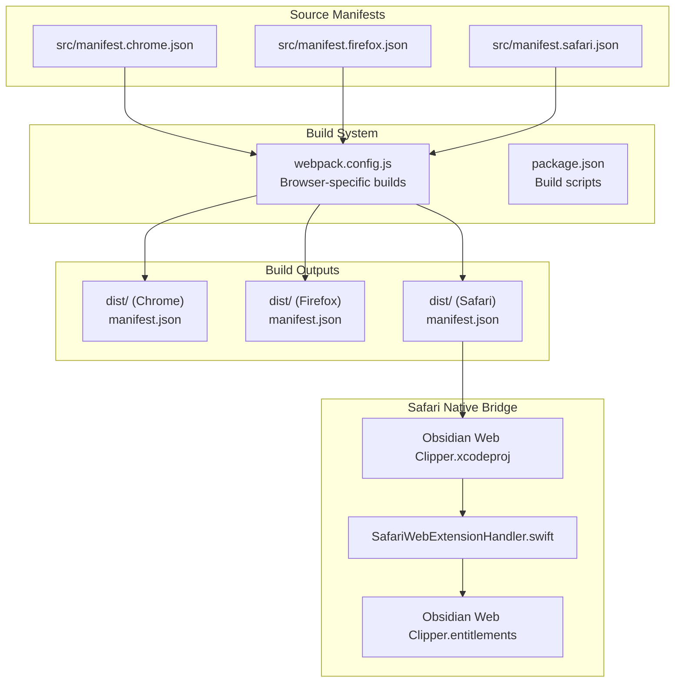
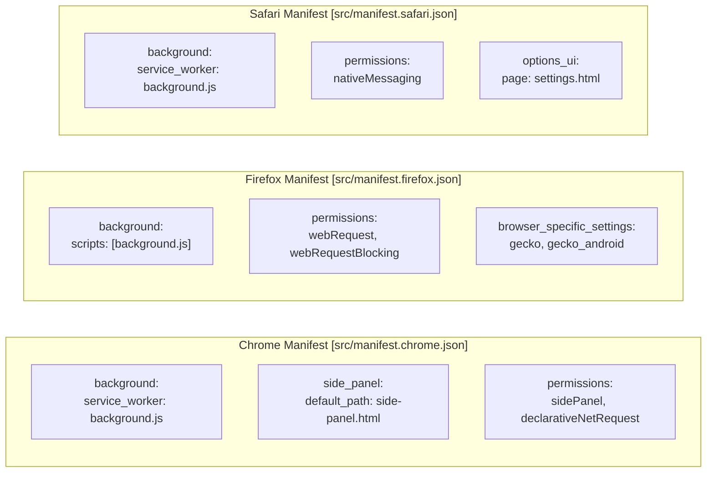
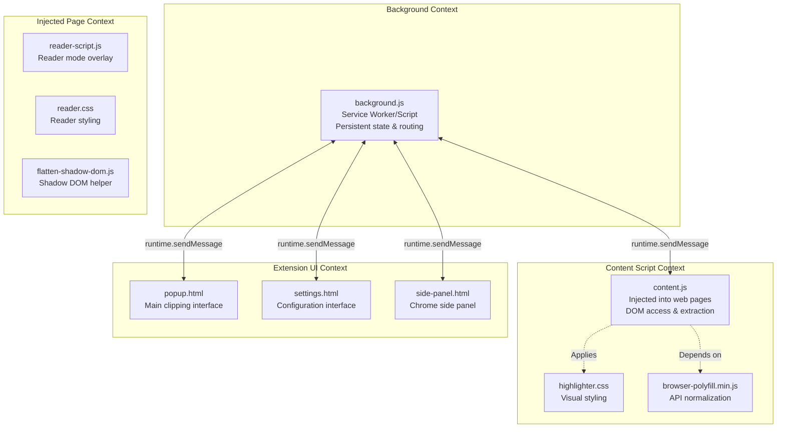
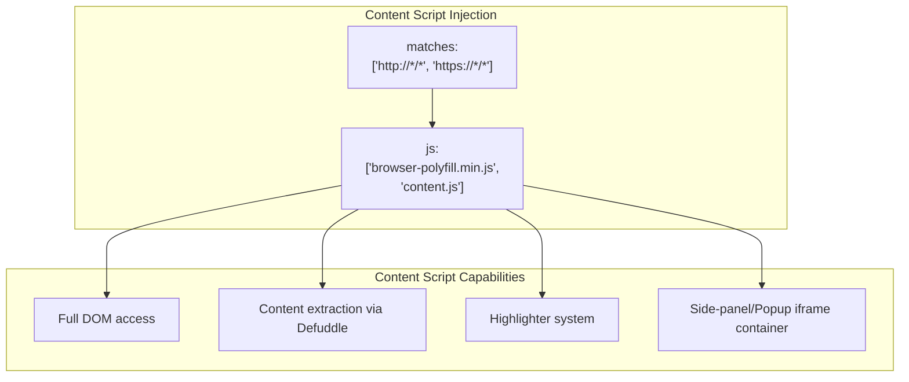
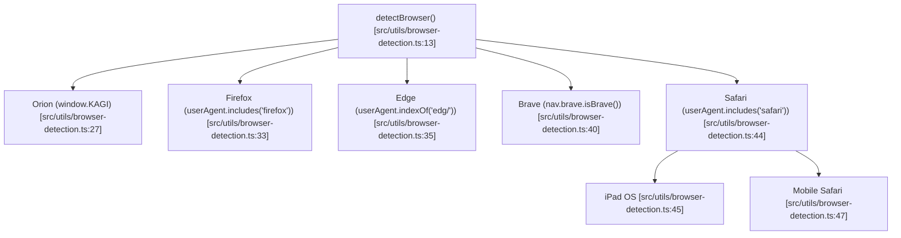

# Extension Architecture

<details>
<summary>Relevant source files</summary>

The following files were used as context for generating this wiki page:

- [package.json](package.json)
- [src/manifest.chrome.json](src/manifest.chrome.json)
- [src/manifest.firefox.json](src/manifest.firefox.json)
- [src/manifest.safari.json](src/manifest.safari.json)
- [src/styles/safari.scss](src/styles/safari.scss)
- [src/utils/browser-detection.ts](src/utils/browser-detection.ts)
- [xcode/Obsidian Web Clipper/Obsidian Web Clipper.xcodeproj/project.pbxproj](xcode/Obsidian Web Clipper/Obsidian Web Clipper.xcodeproj/project.pbxproj)
- [xcode/Obsidian Web Clipper/Obsidian Web Clipper.xcodeproj/xcuserdata/kepano.xcuserdatad/xcschemes/xcschememanagement.plist](xcode/Obsidian Web Clipper/Obsidian Web Clipper.xcodeproj/xcuserdata/kepano.xcuserdatad/xcschemes/xcschememanagement.plist)
- [xcode/Obsidian Web Clipper/Shared (Extension)/SafariWebExtensionHandler.swift](xcode/Obsidian Web Clipper/Shared (Extension)/SafariWebExtensionHandler.swift)
- [xcode/Obsidian Web Clipper/macOS (App)/Obsidian Web Clipper.entitlements](xcode/Obsidian Web Clipper/macOS (App)/Obsidian Web Clipper.entitlements)
- [xcode/Obsidian Web Clipper/macOS (Extension)/Obsidian Web Clipper.entitlements](xcode/Obsidian Web Clipper/macOS (Extension)/Obsidian Web Clipper.entitlements)

</details>


This document details the browser extension architecture of Obsidian Web Clipper, including manifest configurations for Chrome, Firefox, and Safari, the permissions model, content script injection, background worker implementation, and the polyfill system enabling cross-browser compatibility.

For information about how these components communicate, see [Communication Flow](#2.2). For details on the UI components themselves, see [User Interface](#3).

## Manifest V3 Architecture

The extension is built on the Manifest V3 standard, with browser-specific adaptations to accommodate differences between Chrome, Firefox, and Safari implementations. Three separate manifest files define the extension configuration for each target browser.

### Multi-Browser Strategy



The build system uses environment variables to generate browser-specific builds:

- `npm run build:chrome` - Chrome extension build [package.json:21]()
- `npm run build:firefox` - Firefox extension build [package.json:22]()
- `npm run build:safari` - Safari extension build [package.json:23]()

**Sources:** [package.json:18-24](), [xcode/Obsidian Web Clipper/Obsidian Web Clipper.xcodeproj/project.pbxproj]()

### Manifest Configurations

Each browser's manifest defines the extension metadata, permissions, and component entry points. All three manifests use `manifest_version: 3` but differ in several key areas.

| Property | Chrome | Firefox | Safari |
|----------|--------|---------|--------|
| Version | 1.6.2 | 1.6.2 | 1.6.2 |
| Background | `service_worker` | `scripts` array | `service_worker` |
| Default locale | `en` | `en` | Not specified |
| Side panel | Supported | Not supported | Not supported |
| Declarative Net Request | Supported | Not supported | Not supported |



**Sources:** [src/manifest.chrome.json:1-88](), [src/manifest.firefox.json:1-97](), [src/manifest.safari.json:1-85]()

## Extension Components

The extension architecture consists of four primary component types, each with distinct responsibilities and execution contexts.



**Sources:** [src/manifest.chrome.json:23-53](), [src/manifest.firefox.json:25-57]()

### Background Worker

The background component differs between browsers due to Manifest V3 implementation variations:

**Chrome/Safari:** Uses a service worker model (`background.service_worker`) [src/manifest.chrome.json:38-40](), [src/manifest.safari.json:36-38]()
- Non-persistent, event-driven execution.
- Automatically terminated when idle.
- State must be persisted to storage.

**Firefox:** Uses a background script array (`background.scripts`) [src/manifest.firefox.json:42-44]()
- In Firefox's implementation of MV3, this is treated as a non-persistent script by default unless specified otherwise.

The background component is responsible for:
- Message routing between extension contexts.
- Context menu creation via `contextMenus` permission [src/manifest.chrome.json:12]().
- Keyboard command registration via `commands` API [src/manifest.chrome.json:57]().

**Sources:** [src/manifest.chrome.json:38-40](), [src/manifest.firefox.json:42-44](), [src/manifest.safari.json:36-38]()

### Content Scripts

Content scripts execute within the context of web pages, providing DOM access and extraction capabilities. They are automatically injected into all HTTP/HTTPS pages.



Key content script responsibilities:
- **Injection:** Injected into all matching web pages [src/manifest.chrome.json:41-46]().
- **Polyfill:** Loads `browser-polyfill.min.js` first to ensure cross-browser API compatibility [src/manifest.chrome.json:44]().
- **Styling:** Uses `highlighter.css` and `reader.css` as web accessible resources to be injected as needed [src/manifest.chrome.json:49]().

**Sources:** [src/manifest.chrome.json:41-47](), [src/manifest.firefox.json:45-50](), [src/manifest.safari.json:39-44]()

### UI Components

The extension provides multiple user interface entry points.

**Popup Interface** (`popup.html`):
- Default action when clicking toolbar icon [src/manifest.chrome.json:24]().
- Primary interface for template selection and note configuration.

**Settings Interface** (`settings.html`):
- Configured via `options_ui` [src/manifest.chrome.json:29-32]().
- Allows for persistent configuration of templates, AI interpreters, and general settings.

**Side Panel** (`side-panel.html`):
- Supported natively in Chrome via the `side_panel` manifest key [src/manifest.chrome.json:26-28]().
- Declared as a web accessible resource for injection into pages in other contexts [src/manifest.chrome.json:49]().

**Sources:** [src/manifest.chrome.json:23-32](), [src/manifest.firefox.json:25-36]()

## Permissions Model

The extension requires specific permissions to access browser APIs and web page content.

### Required Permissions

| Permission | Purpose |
|------------|---------|
| `activeTab` | Access current tab's content when triggered [src/manifest.chrome.json:9]() |
| `clipboardWrite` | Write generated markdown to the system clipboard [src/manifest.chrome.json:10]() |
| `storage` | Persist settings, templates, and history [src/manifest.chrome.json:14]() |
| `scripting` | Execute scripts in the context of web pages [src/manifest.chrome.json:15]() |
| `contextMenus` | Add clipping options to the browser right-click menu [src/manifest.chrome.json:12]() |
| `declarativeNetRequest` | (Chrome only) Modify network requests for header manipulation [src/manifest.chrome.json:16]() |
| `webRequest` | (Firefox only) Monitor and block network requests [src/manifest.firefox.json:14-15]() |
| `nativeMessaging` | (Safari only) Communicate with the native app host [src/manifest.safari.json:11]() |

### Host Permissions

The extension requests access to all URLs to enable clipping functionality on any website the user visits.

```json
"host_permissions": [
    "<all_urls>",
    "http://*/*",
    "https://*/*"
]
```

**Sources:** [src/manifest.chrome.json:18-22](), [src/manifest.firefox.json:17-21](), [src/manifest.safari.json:15-19]()

## Browser Detection and Polyfills

To handle the diversity of browser environments, the extension uses a detection utility and the standard WebExtension polyfill.

### Browser Detection

The `detectBrowser` function identifies the specific browser and platform (e.g., Brave, Edge, Orion, Mobile Safari) to apply specific CSS classes or logic adjustments.



The `addBrowserClassToHtml` function applies these detections to the `<html>` element as classes (e.g., `is-chromium`, `is-firefox`, `is-safari`) [src/utils/browser-detection.ts:76-131]().

**Sources:** [src/utils/browser-detection.ts:13-131](), [src/styles/safari.scss:1-4]()

### Polyfill Integration

The `browser-polyfill.min.js` is included in all content script bundles [src/manifest.chrome.json:44]() and declared as a web accessible resource [src/manifest.chrome.json:49](). This allows the codebase to use the `browser.*` namespace (Promises) instead of the callback-based `chrome.*` namespace.

## Safari Native Integration

Safari requires a native app wrapper. The communication between the browser extension and the native side is handled by `SafariWebExtensionHandler.swift`.

- **Fetch Proxy:** The native handler implements `handleFetchRequest` to bypass browser CORS limitations when the extension needs to make network requests with specific headers like `Origin` [xcode/Obsidian Web Clipper/Shared (Extension)/SafariWebExtensionHandler.swift:47-91]().
- **Native Messaging:** Uses `NSExtensionRequestHandling` to receive messages from `browser.runtime.sendNativeMessage` [xcode/Obsidian Web Clipper/Shared (Extension)/SafariWebExtensionHandler.swift:11-45]().

**Sources:** [xcode/Obsidian Web Clipper/Shared (Extension)/SafariWebExtensionHandler.swift:11-102](), [xcode/Obsidian Web Clipper/macOS (Extension)/Obsidian Web Clipper.entitlements:5-6]()

## Web Accessible Resources

Resources that need to be loaded into the context of a web page must be explicitly declared.

| Resource | Usage |
|----------|-------|
| `reader.css` | Styles for the reader mode overlay [src/manifest.chrome.json:49]() |
| `reader-script.js` | Logic for the reader mode interface [src/manifest.chrome.json:49]() |
| `side-panel.html` | The HTML container for the clipper UI when embedded [src/manifest.chrome.json:49]() |
| `flatten-shadow-dom.js` | Utility for accessing content inside Shadow DOMs [src/manifest.chrome.json:49]() |
| `highlighter.css` | Styles for the highlighter system [src/manifest.chrome.json:49]() |

**Sources:** [src/manifest.chrome.json:47-53](), [src/manifest.firefox.json:51-57]()

## Keyboard Commands

Commands are defined in the manifest to allow users to trigger extension actions via keyboard shortcuts.

| Command | Default Key (Win/Mac) | Description |
|---------|-----------------------|-------------|
| `_execute_action` | `Ctrl+Shift+O` / `Cmd+Shift+O` | Open the main clipper popup [src/manifest.chrome.json:58-64]() |
| `quick_clip` | `Alt+Shift+O` | Trigger a clip using the default template [src/manifest.chrome.json:65-71]() |
| `toggle_highlighter`| `Alt+Shift+H` | Toggle the highlighting mode [src/manifest.chrome.json:72-78]() |
| `toggle_reader` | `Alt+Shift+R` | Toggle the reader mode view [src/manifest.chrome.json:79-85]() |

**Sources:** [src/manifest.chrome.json:57-86](), [src/manifest.firefox.json:61-83](), [src/manifest.safari.json:55-84]()
