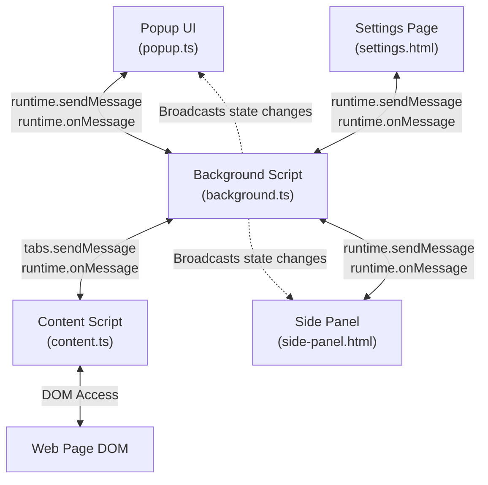
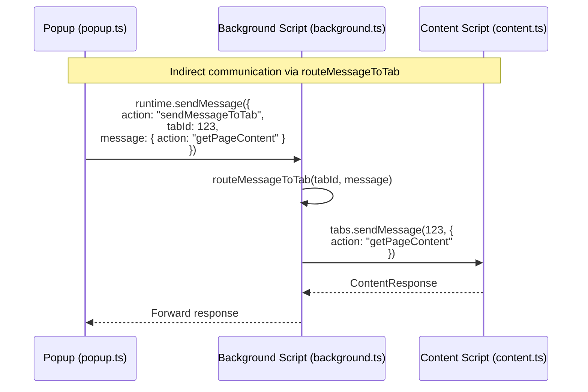
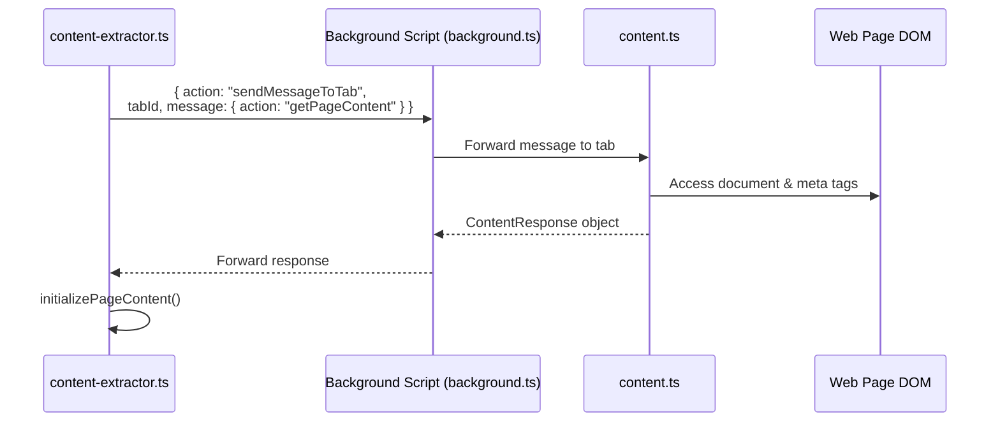
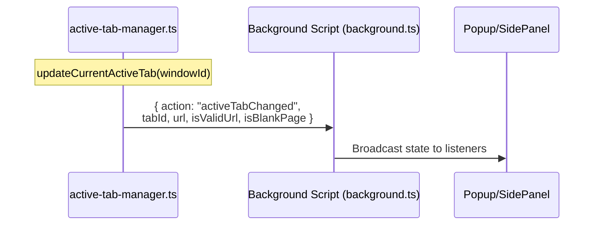
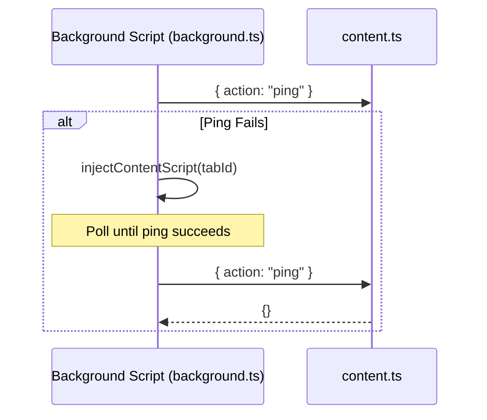
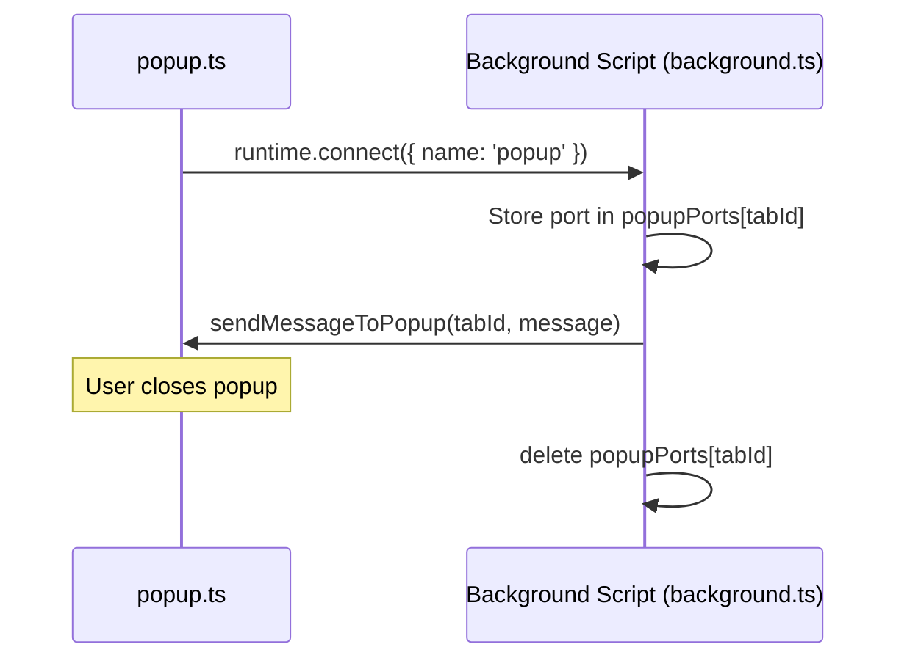
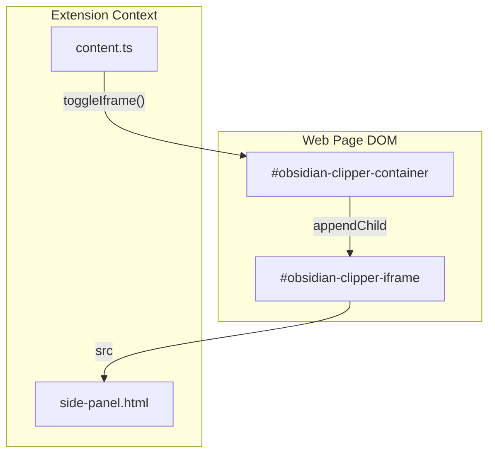

# Communication Flow

<details>
<summary>Relevant source files</summary>

The following files were used as context for generating this wiki page:

- [src/_locales/en/messages.json](src/_locales/en/messages.json)
- [src/background.ts](src/background.ts)
- [src/content.ts](src/content.ts)
- [src/core/popup.ts](src/core/popup.ts)
- [src/styles/popup.scss](src/styles/popup.scss)
- [src/utils/active-tab-manager.test.ts](src/utils/active-tab-manager.test.ts)
- [src/utils/active-tab-manager.ts](src/utils/active-tab-manager.ts)
- [src/utils/content-extractor.ts](src/utils/content-extractor.ts)

</details>


This document describes how different components of the Obsidian Web Clipper communicate with each other through the browser's message passing API. The extension uses a centralized message routing pattern where the background script coordinates communication between the popup, content scripts, and other UI components.

## Message Passing Architecture

The extension uses `browser.runtime.sendMessage()` and `browser.runtime.onMessage` for inter-component communication. All messages flow through a central background script that routes them to the appropriate destination.

### Communication Topology



**Sources:** [src/content.ts:111-250](), [src/background.ts:241-350]()

### Message Router Pattern

The background script acts as a central message router. UI components typically do not directly communicate with content scripts; instead, they send messages through the background script using the `sendMessageToTab` action.



**Sources:** [src/utils/content-extractor.ts:67-102](), [src/background.ts:177-189](), [src/background.ts:269-272]()

## Core Message Flows

### Content Extraction Flow

When the popup needs to extract content from a web page, it initiates a multi-step message exchange. The `extractPageContent` function in `content-extractor.ts` handles the retry logic and initial request.



The `ContentResponse` object returned includes:
- `content`: Main page content (HTML) [src/content.ts:91]()
- `selectedHtml`: User-selected content [src/content.ts:92]()
- `extractedContent`: Custom extracted data via Defuddle [src/content.ts:93]()
- `schemaOrgData`: Structured data [src/content.ts:94]()
- `fullHtml`: Complete page HTML [src/content.ts:95]()
- `highlights`: Saved highlights [src/content.ts:96]()
- `title`, `author`, `description`, `domain`, `favicon`, `image`, `published`, `site`, `wordCount` [src/content.ts:97-106]()
- `metaTags`: All meta tags [src/content.ts:108]()

**Sources:** [src/utils/content-extractor.ts:67-125](), [src/content.ts:90-109](), [src/utils/content-extractor.ts:127-202]()

### Tab State Synchronization

The `active-tab-manager.ts` utility tracks the active tab and broadcasts changes via the background script to UI components.



**Sources:** [src/utils/active-tab-manager.ts:6-20](), [src/background.ts:3-7]()

### Content Script Injection and Health Checks

To ensure communication is possible, the background script performs health checks ("pings") and re-injects the content script if necessary. This is particularly important for handling "zombie" content scripts after extension updates [src/background.ts:118-148]().



**Sources:** [src/background.ts:118-173](), [src/content.ts:118-121]()

## Message Types and Actions

### Messages from Components to Background

| Action | Parameters | Purpose | Response |
|--------|-----------|---------|----------|
| `sendMessageToTab` | `tabId`, `message` | Routes message to specific tab | Result from tab |
| `getTabInfo` | `tabId` | Retrieves tab URL and metadata | `{ success, tab }` |
| `forceInjectContentScript` | `tabId` | Forces script re-injection | `{ success: true }` |
| `contentScriptLoaded` | None | Content script initialization signal | None |

**Sources:** [src/background.ts:241-350](), [src/content.ts:88](), [src/core/popup.ts:76]()

### Messages to Content Script

| Action | Parameters | Purpose | Response |
|--------|-----------|---------|----------|
| `ping` | None | Check if script is alive | `{}` |
| `toggle-iframe` | None | Open/close the clipper iframe | `{ success: true }` |
| `close-iframe` | None | Close the clipper iframe | None |
| `copy-text-to-clipboard` | `text` | Execute clipboard write | `{ success: boolean }` |
| `getPageContent` | None | Full page extraction | `ContentResponse` |

**Sources:** [src/content.ts:111-250]()

## Connection Management

### Popup and Port Communication

The background script tracks open popups using `browser.runtime.onConnect`. This allows the background script to send messages back to the popup specifically when it is open, identified by `tabId` [src/background.ts:221-239]().



**Sources:** [src/background.ts:221-239]()

## Embedded Iframe Communication

The clipper can run inside an iframe on the host page. The content script manages the lifecycle of this iframe and its container, using `side-panel.html?context=iframe` as the source [src/content.ts:71]().



**Sources:** [src/content.ts:47-85](), [src/content.ts:123-128]()

## Error Handling and Retries

The extension implements a retry mechanism for communication failures, particularly in Safari where extension updates can invalidate content script contexts. If the first extraction fails, it forces a script injection before retrying [src/utils/content-extractor.ts:113-119]().

```typescript
export async function extractPageContent(tabId: number): Promise<ContentResponse | null> {
	try {
		return await sendExtractRequest(tabId);
	} catch (firstError) {
		// Force a fresh injection so the new generation takes over
		await browser.runtime.sendMessage({ action: "forceInjectContentScript", tabId });
		try {
			return await sendExtractRequest(tabId);
		} catch (retryError) {
			throw new Error('Web Clipper was not able to start. Please try reloading the page.');
		}
	}
}
```

**Sources:** [src/utils/content-extractor.ts:104-125]()
