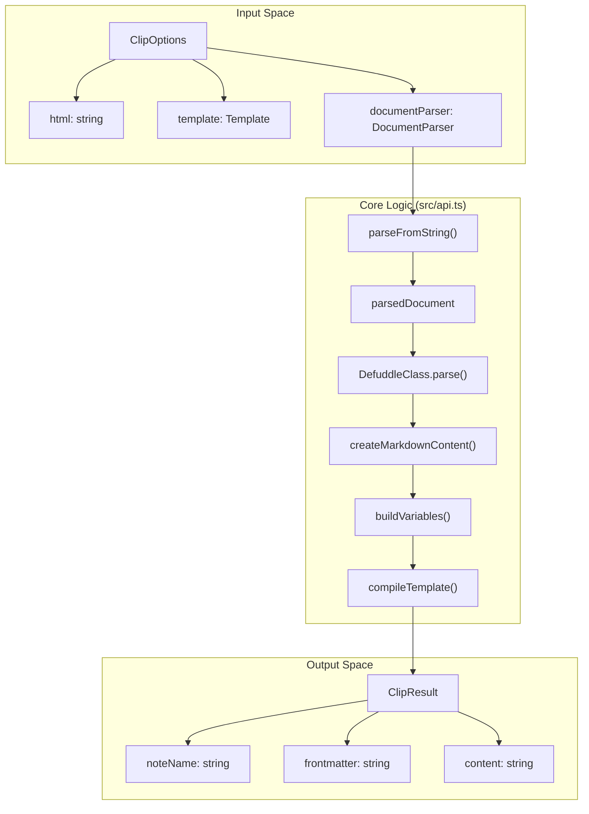
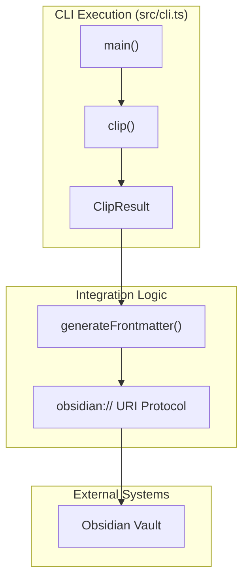

# CLI and Programmatic API

<details>
<summary>Relevant source files</summary>

The following files were used as context for generating this wiki page:

- [package.json](package.json)
- [src/api.ts](src/api.ts)
- [src/manifest.chrome.json](src/manifest.chrome.json)
- [src/manifest.firefox.json](src/manifest.firefox.json)
- [src/utils/cli-stubs.ts](src/utils/cli-stubs.ts)
- [src/utils/shared.test.ts](src/utils/shared.test.ts)
- [src/utils/shared.ts](src/utils/shared.ts)
- [src/utils/variables/selector.ts](src/utils/variables/selector.ts)

</details>


The Obsidian Web Clipper provides both a Command Line Interface (CLI) and a programmatic API, allowing the clipping engine to function outside of a browser extension context. This enables automated clipping workflows, server-side processing, and integration with other Node.js applications.

## Programmatic API

The core clipping logic is decoupled from browser APIs in `src/api.ts`. This environment-agnostic API allows developers to pass in raw HTML and a custom `DocumentParser` to generate structured `ClipResult` data.

### DocumentParser Interface
Because the clipper relies on DOM traversal (via `querySelectorAll`), environments outside the browser (like Node.js) must provide a compatible parser.

[src/api.ts:18-20]()
```typescript
export interface DocumentParser {
	parseFromString(html: string, mimeType: string): any;
}
```

### Key Functions

| Function | Description | Source |
| :--- | :--- | :--- |
| `clip(options: ClipOptions)` | The primary entry point. Extracts content using **Defuddle**, builds variables, and compiles the provided template. | [src/api.ts:176-218]() |
| `matchTemplate(templates, url, schemaOrgData)` | Matches a URL or Schema.org data against a list of templates to find the most appropriate one based on triggers. | [src/api.ts:138-162]() |
| `createAsyncResolver(doc)` | Creates a resolver for `{{selector:...}}` variables that works against any object implementing `querySelectorAll`. | [src/api.ts:47-67]() |

### Data Flow: Clipping Pipeline
The following diagram illustrates how the `clip` function processes raw input into a final `ClipResult`.

**Clipping Execution Flow**

**Sources:** [src/api.ts:176-218](), [src/utils/shared.ts:40-93]()

---

## Command Line Interface (CLI)

The CLI tool is the executable entry point for terminal-based clipping. It is defined as `obsidian-clipper` in the `package.json` bin configuration.

[package.json:5-7]()

### CLI Implementation Details
The CLI is bundled into `dist/cli.cjs`. During the build process, specific polyfills are injected to ensure that `globalThis.window` and `globalThis.DOMParser` are available before any module code executes, which is required by libraries like **Turndown**.

### Usage and Arguments
The CLI supports fetching HTML directly from a URL or reading from a local file/stdin. It uses `linkedom` as the `DocumentParser` to simulate a browser DOM in Node.js.

[src/api.ts:184-185](), [package.json:63-63]()

---

## Obsidian Integration

When used outside the browser, the clipper can still send data to Obsidian. This is handled by utility functions that bridge the gap between the CLI environment and the Obsidian application.

### Communication Strategy
The system uses the `obsidian://` URI scheme or direct CLI calls to communicate with the vault. It supports various behaviors such as creating new notes, appending to existing ones, or overwriting content based on the template configuration.

**CLI to Obsidian Communication**

**Sources:** [src/api.ts:210-218](), [src/utils/shared.ts:145-205]()

---

## Shared Utilities

Both the Browser Extension and the CLI/API share a set of "pure" functions in `src/utils/shared.ts`. These functions are strictly prohibited from importing `webextension-polyfill` or any browser globals to ensure compatibility across environments.

[src/utils/shared.ts:1-5]()

### buildVariables
Transforms raw extraction data (title, author, content) into the `{{variable}}` dictionary used by the template engine. It also handles:
*   **Meta Tags:** Maps `<meta>` tags to `{{meta:name:...}}` or `{{meta:property:...}}`. [src/utils/shared.ts:76-85]()
*   **Schema.org:** Recursively flattens JSON-LD data into template variables using `addSchemaOrgDataToVariables`. [src/utils/shared.ts:88-90](), [src/utils/shared.test.ts:177-182]()
*   **Cleaning:** Strips text fragments (e.g., `#:~:text=...`) from URLs to ensure clean source links. [src/utils/shared.ts:41-41]()

### generateFrontmatter
Converts an array of `Property` objects into a YAML block. It respects `propertyTypes` (e.g., `multitext`, `checkbox`, `number`, `date`) to ensure Obsidian-compatible formatting. For example, `multitext` properties are formatted as YAML sequences.

[src/utils/shared.ts:145-205]()

### Selector Processing
The API provides utilities to extract content using CSS selectors, which is used to resolve `{{selector:...}}` variables in templates. This logic is shared via `extractContentBySelector` and `selectorContentToString`.

[src/api.ts:10-10](), [src/utils/variables/selector.ts:29-55]()

**Sources:** [src/utils/shared.ts:1-5](), [src/utils/shared.ts:40-93](), [src/api.ts:10-12](), [src/api.ts:69-84]()
