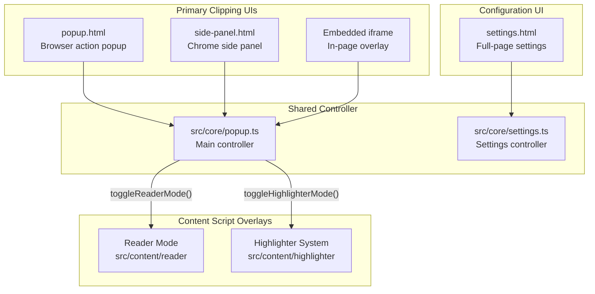
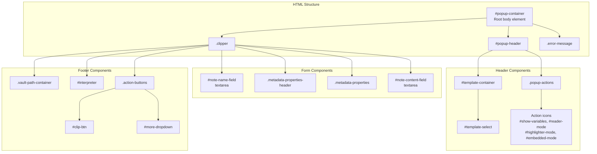
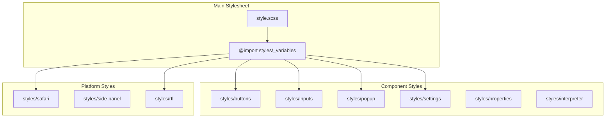

# User Interface

Relevant source files

The following files were used as context for generating this wiki page:

- [src/core/popup.ts](src/core/popup.ts)
- [src/icons/icons.ts](src/icons/icons.ts)
- [src/popup.html](src/popup.html)
- [src/settings.html](src/settings.html)
- [src/side-panel.html](src/side-panel.html)
- [src/style.scss](src/style.scss)
- [src/styles/popup.scss](src/styles/popup.scss)
- [src/styles/properties.scss](src/styles/properties.scss)
- [src/styles/settings.scss](src/styles/settings.scss)

The User Interface system provides all user-facing components for the Obsidian Web Clipper extension. The UI is distributed across three main contexts: the popup/side-panel clipping interface, the settings configuration page, and content script overlays that modify web pages directly.

For detailed documentation:
- Popup clipping workflow and logic: [Popup Interface](#3.1)
- Settings configuration and template management: [Settings Interface](#3.2)
- Styling system and responsive patterns: [Styling and Responsive Design](#3.3)

## UI Architecture Overview

The extension provides four distinct UI contexts, each serving different user workflows:

**UI Context Overview**

Sources: [src/popup.html:1-85](), [src/side-panel.html:1-89](), [src/settings.html:1-135](), [src/core/popup.ts:39-41]()

### UI Context Detection

The popup can open in three different modes. The context is detected during initialization in `popup.ts`:

| Context | Trigger | Detection Logic | Description |
|---------|---------|-----------------|-------------|
| **Popup** | Browser action click | Default | Standard browser action popup |
| **Side Panel** | User preference | `window.location.pathname.includes('side-panel.html')` | Chrome/Firefox side panel API |
| **Embedded** | `openBehavior: 'embedded'` | `urlParams.get('context') === 'iframe'` | Iframe injected into current page |

Sources: [src/core/popup.ts:39-41](), [src/side-panel.html:2-2]()

### Component Architecture

**Popup/Side Panel Shared Structure**

Sources: [src/popup.html:9-81](), [src/side-panel.html:9-85]()

## Popup State Management

The popup interface is controlled by `src/core/popup.ts`, which manages state through several global variables and event handlers.

### Core State Variables

| Variable | Type | Purpose |
|----------|------|---------|
| `loadedSettings` | `Settings` | General extension settings loaded from storage |
| `currentTemplate` | `Template \| null` | Active template configuration used for rendering |
| `templates` | `Template[]` | All available templates for the dropdown |
| `currentVariables` | `{ [key: string]: string }` | Extracted page variables for template compilation |
| `currentTabId` | `number \| undefined` | Active browser tab ID being clipped |
| `lastSelectedVault` | `string \| null` | Most recently used vault name |

Sources: [src/core/popup.ts:32-37]()

### Layout and Dimensions

The popup uses dynamic height calculation to handle browser-specific scaling (especially in Chromium).

- **Chromium Popup Height**: Set via `--chromium-popup-height` CSS variable [src/core/popup.ts:142-142]().
- **Side Panel/Mobile**: Styles override dimensions to `100vh/100vw` [src/styles/popup.scss:16-23]().
- **Note Name Field**: Automatically adjusts height based on content using `adjustNoteNameHeight` [src/core/popup.ts:151-151]().

## Action Button System

The popup footer contains a dynamic action system that adapts based on user settings and context.

**Primary Action Determination**

The `#clip-btn` text and behavior is determined by the `saveBehavior` setting.

| Save Behavior | Handler Function | Button Label (i18n) |
|---------------|------------------|---------------------|
| `addToObsidian` | `handleClipObsidian()` | `addToObsidian` |
| `copyToClipboard` | `handleCopyToClipboard()` | `copyToClipboard` |
| `saveFile` | `handleSaveToDownloads()` | `saveFile` |

The `#more-btn` opens a dropdown (`#more-dropdown`) containing the alternative actions not currently set as the primary button [src/popup.html:69-76]().

Sources: [src/popup.html:67-81](), [src/styles/popup.scss:184-242]()

## Styling Architecture

The styling system uses SCSS with a modular architecture built around CSS custom properties.

### Style Organization

Sources: [src/style.scss:1-41]()

### Theming and Variables

The UI relies heavily on CSS variables for consistent theming.

- **Pop-up Dimensions**: Default widths and heights are defined in `:root` [src/styles/popup.scss:1-7]().
- **Metadata Properties**: Specific spacing and sizing for property inputs [src/styles/properties.scss:29-45]().
- **Settings Colors**: Dedicated variables for the settings page background and items [src/styles/settings.scss:25-31]().

### Component Patterns

- **Metadata Properties**: Uses a flexbox-based grid with `.metadata-property-key` and `.metadata-property-value` for alignment [src/styles/properties.scss:82-143]().
- **Action Buttons**: Primary action uses `.mod-cta`, while secondary actions are nested in `.menu-btn` [src/styles/popup.scss:184-210]().
- **Lucide Icons**: Integrated via `src/icons/icons.ts` and styled with the `.lucide-icon` class [src/icons/icons.ts:75-84]().

Sources: [src/styles/properties.scss:1-143](), [src/styles/popup.scss:184-260](), [src/icons/icons.ts:1-98]()

## Settings Interface

The settings page (`src/settings.html`) provides a full-page configuration environment with a sidebar navigation system.

**Settings Navigation**

| Section | Description |
|---------|-------------|
| **General** | Language, versioning, and activity activity stats [src/settings.html:43-135](). |
| **Reader** | Reader mode themes and behavior [src/settings.html:21-21](). |
| **Highlighter** | Behavior and shortcut settings for the highlighter [src/settings.html:22-22](). |
| **Interpreter** | AI provider and model configuration [src/settings.html:23-23](). |
| **Properties** | Configuration for Obsidian property types and icons [src/settings.html:24-24](). |
| **Templates** | Sidebar list for managing and editing templates [src/settings.html:25-28](). |

Sources: [src/settings.html:13-30](), [src/styles/settings.scss:199-296]()
