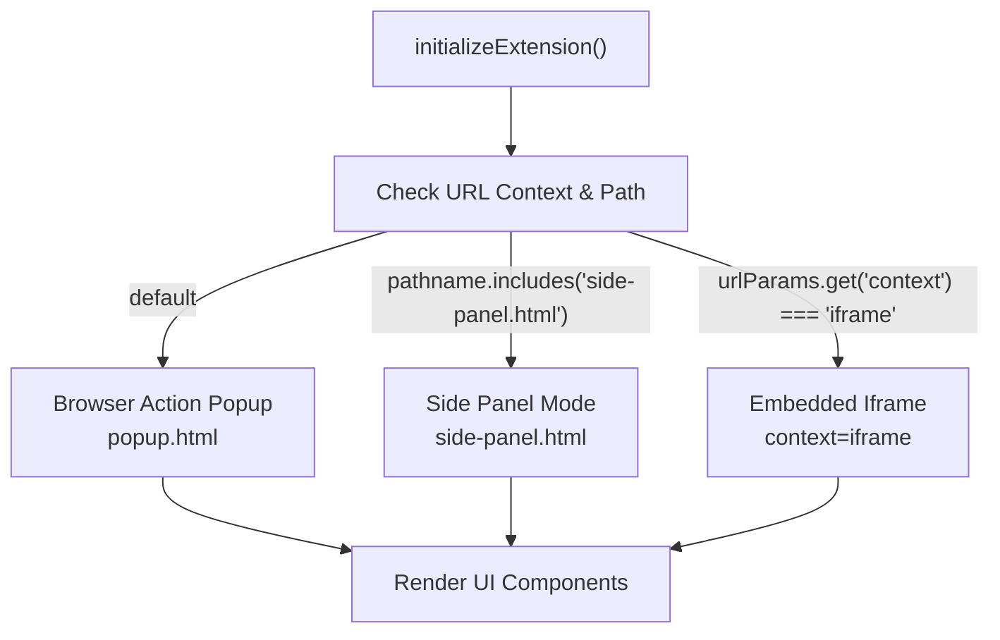
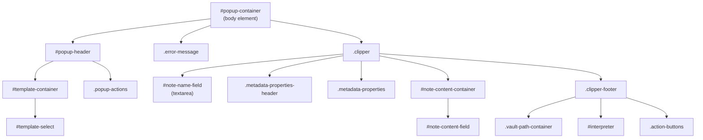
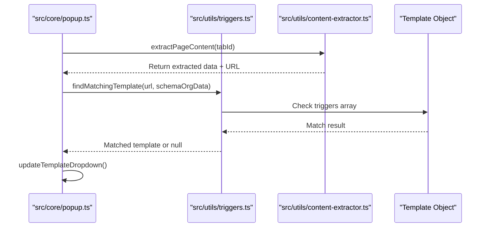
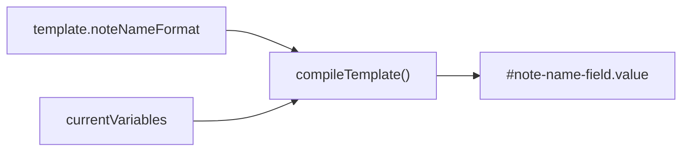
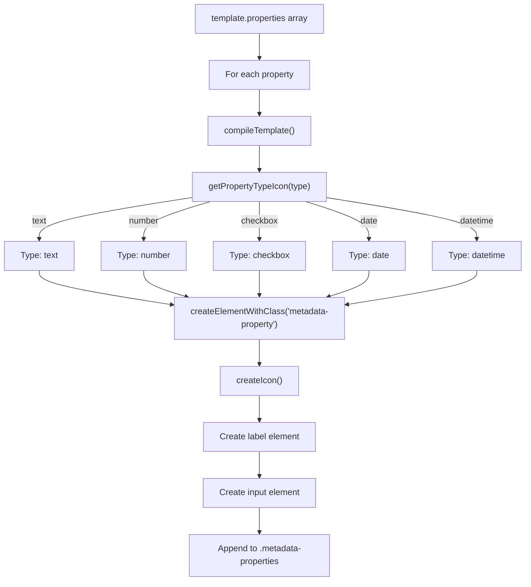
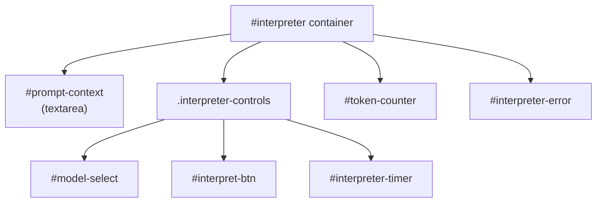

# Popup Interface

Relevant source files

The following files were used as context for generating this wiki page:

- [src/core/popup.ts](src/core/popup.ts)
- [src/icons/icons.ts](src/icons/icons.ts)
- [src/popup.html](src/popup.html)
- [src/side-panel.html](src/side-panel.html)
- [src/styles/popup.scss](src/styles/popup.scss)
- [src/styles/properties.scss](src/styles/properties.scss)
- [src/utils/auto-save.ts](src/utils/auto-save.ts)
- [src/utils/debounce.ts](src/utils/debounce.ts)
- [src/utils/drag-and-drop.ts](src/utils/drag-and-drop.ts)
- [src/utils/routing.ts](src/utils/routing.ts)
- [src/utils/ui-utils.ts](src/utils/ui-utils.ts)

The popup interface is the primary user-facing component for clipping web content to Obsidian. It provides a compact, focused interface for selecting templates, editing note fields, configuring metadata properties, and triggering the clipping action. The popup can be opened as a browser action popup, side panel, or embedded iframe depending on browser capabilities and user settings.

## Interface Modes

The popup interface supports three distinct presentation modes:

1.  **Browser Action Popup** - Traditional extension popup with fixed dimensions.
2.  **Side Panel** - Full-height panel in Chromium browsers (via `side-panel.html`).
3.  **Embedded Iframe** - Picture-in-picture overlay injected into the current page.

The mode is determined at initialization based on browser capabilities and user preferences stored in `generalSettings.openBehavior` [src/core/popup.ts:39-41]().

**Popup Mode Detection**
Sources: [src/core/popup.ts:39-41](), [src/core/popup.ts:158-185]()

## HTML Structure

The popup interface uses a hierarchical DOM structure defined in `popup.html` and `side-panel.html`. Both files share a similar structure to ensure consistent logic in `popup.ts`.

**DOM Hierarchy**
Sources: [src/popup.html:9-82](), [src/side-panel.html:9-86]()

## Template Selection

The template dropdown (`#template-select`) allows users to switch between configured templates. Template selection drives the entire form structure by controlling which properties are displayed and how content is formatted.

### Template Matching and Auto-Selection

Templates can be automatically selected based on URL triggers defined in the template configuration. The system uses `findMatchingTemplate()` to evaluate triggers against the current page URL and schema.org data.

**Template Matching Flow**
Sources: [src/core/popup.ts:180-184](), [src/utils/triggers.ts:8-15]()

### Template Dropdown Population

The dropdown is populated during initialization by loading templates from storage and iterating through them to create option elements.

| Function | Purpose | Location |
| :--- | :--- | :--- |
| `loadTemplates()` | Loads templates from storage | [src/core/popup.ts:180]() |
| `createElementWithClass()` | Utility to build DOM elements | [src/core/popup.ts:14]() |
| `findMatchingTemplate()` | Determines initial selection | [src/core/popup.ts:8]() |

Sources: [src/core/popup.ts:180-184](), [src/popup.html:12-14]()

## Note Fields

The popup displays three primary editable fields for note content:

### Note Name Field

The `#note-name-field` is an auto-resizing textarea that displays the compiled `noteNameFormat` from the active template. It uses `adjustNoteNameHeight()` to dynamically resize based on content.

**Field Characteristics:**
*   Auto-expanding textarea (min-height: 2rem, max-height: 6rem) [src/styles/popup.scss:107-125]().
*   Initialized from `template.noteNameFormat` compiled with page variables.
*   The `adjustNoteNameHeight` function ensures the field fits its content exactly [src/utils/ui-utils.ts:74-77]().

**Note Name Field Flow**
Sources: [src/core/popup.ts:149-153](), [src/utils/ui-utils.ts:74-77]()

### Metadata Properties

The `.metadata-properties` container is dynamically generated based on the `template.properties` array. Each property is rendered as a labeled input field with a type-aware icon.

**Property Type Handling:**

| Property Type | Input Type | Value Processing | Icon |
| :--- | :--- | :--- | :--- |
| `text` | `text` | Raw string | `align-left` |
| `number` | `text` | Numeric extraction | `binary` |
| `checkbox` | `checkbox` | Boolean conversion | `square-check-big` |
| `date` | `text` | YYYY-MM-DD format | `calendar` |
| `datetime` | `text` | ISO 8601 format | `clock` |

**Property Rendering Algorithm:**

**Property Rendering Flow**
Sources: [src/core/popup.ts:63-72](), [src/icons/icons.ts:86-97](), [src/styles/properties.scss:29-45]()

### Note Content Field

The `#note-content-field` textarea displays the compiled `template.noteContentFormat`. Unlike the note name field, this allows multi-line content and serves as the main body of the note.

Sources: [src/popup.html:48](), [src/styles/popup.scss:131-142]()

## Vault and Path Selection

### Vault Dropdown

The `#vault-select` dropdown is populated from the `generalSettings.vaults` array. The selected vault is persisted as `lastSelectedVault` in local storage.

**Vault Selection Logic:**
1.  If template specifies a `vault`, use that value.
2.  Otherwise, use `lastSelectedVault` from storage [src/core/popup.ts:37]().
3.  If no vaults are configured, the container is hidden [src/popup.html:52]().

Sources: [src/core/popup.ts:37](), [src/popup.html:51-54]()

### Path Field

The `#path-name-field` input displays the compiled `template.path`. For daily note behaviors, the path field is often hidden as the path is determined by Obsidian's daily notes configuration.

Sources: [src/popup.html:55](), [src/styles/popup.scss:157-170]()

## Interpreter Integration

When `generalSettings.interpreterEnabled` is true, the `#interpreter` container is displayed, providing AI-powered content extraction via LLM providers.

### Interpreter UI Components

**Interpreter UI Structure**
Sources: [src/popup.html:57-66](), [src/core/popup.ts:15]()

### Interpreter Workflow

The interpreter is initialized via `initializeInterpreter()` which:
1.  Collects prompt variables from the template using `collectPromptVariables()` [src/core/popup.ts:15]().
2.  Sets up the model dropdown from settings.
3.  Attaches a click handler to `#interpret-btn` that calls `handleInterpreterUI()` [src/core/popup.ts:15]().

Sources: [src/core/popup.ts:15](), [src/popup.html:57-66]()

## Action Buttons

The `.action-buttons` container includes the primary clip button and a dropdown menu for secondary actions.

### Primary Clip Button

The `#clip-btn` button triggers the clipping process. Its text is dynamically set based on the template's behavior (e.g., "Clip to Obsidian", "Append to note").

Sources: [src/popup.html:68](), [src/styles/popup.scss:190-193]()

### More Menu

The `#more-btn` button toggles the `#more-dropdown` menu which contains secondary actions.

**Secondary Actions:**
*   Copy content to clipboard.
*   Save to Downloads folder.
*   Share via Web Share API (mobile/Safari only).

Sources: [src/popup.html:70-76](), [src/styles/popup.scss:172-182]()

## State Management

### Memoization

To optimize performance, the popup uses memoized versions of expensive operations defined in `src/core/popup.ts`.

**Memoized Functions:**

| Function | Expiration | Key Function |
| :--- | :--- | :--- |
| `memoizedCompileTemplate` | 5000ms | `${tabId}-${template}-${currentUrl}` |
| `memoizedGenerateFrontmatter` | 5000ms | Default |
| `memoizedExtractPageContent` | 5000ms | `${tabId}-${tab.url}` |

Sources: [src/core/popup.ts:43-125]()

### Dimension Management

For Chromium browsers, the popup dynamically measures and sets its height using the CSS variable `--chromium-popup-height`.

1.  Set initial large height (2000px) in `initializeExtension` [src/core/popup.ts:171]().
2.  Call `setPopupDimensions()` via `debouncedSetPopupDimensions` [src/core/popup.ts:156]().
3.  Calculate `Math.min(actualHeight, viewportHeight)` [src/core/popup.ts:139]().
4.  Adjust note name field height if width changes [src/core/popup.ts:149-153]().

Sources: [src/core/popup.ts:130-157](), [src/styles/popup.scss:25-28]()
