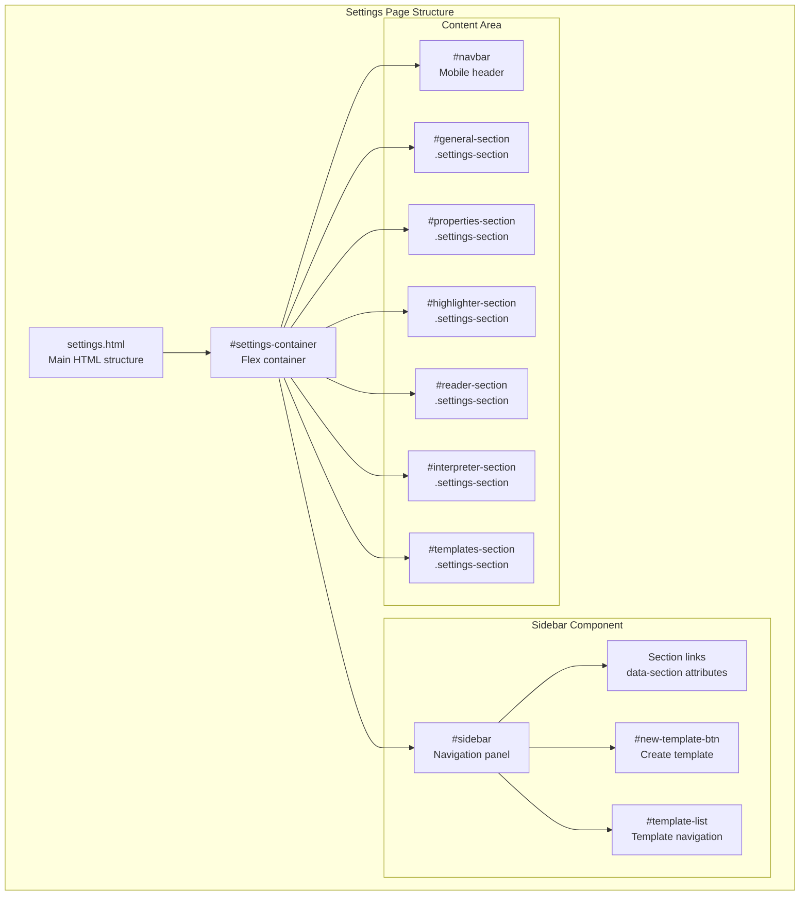
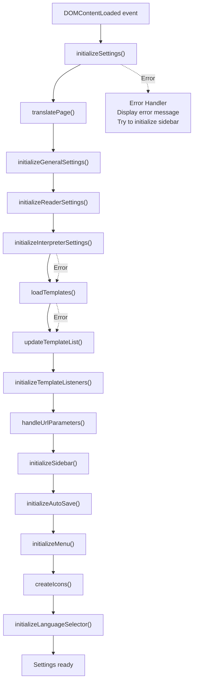
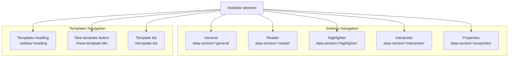
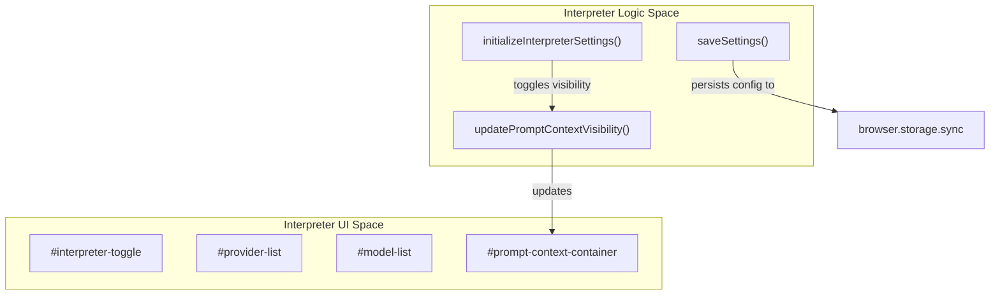

# Settings Interface

Relevant source files

The following files were used as context for generating this wiki page:

- [src/core/settings.ts](src/core/settings.ts)
- [src/managers/general-settings.ts](src/managers/general-settings.ts)
- [src/managers/settings-section-ui.ts](src/managers/settings-section-ui.ts)
- [src/managers/template-manager.ts](src/managers/template-manager.ts)
- [src/settings.html](src/settings.html)
- [src/style.scss](src/style.scss)
- [src/styles/settings.scss](src/styles/settings.scss)
- [src/types/types.ts](src/types/types.ts)
- [src/utils/obsidian-note-creator.ts](src/utils/obsidian-note-creator.ts)
- [src/utils/storage-utils.ts](src/utils/storage-utils.ts)

The Settings Interface provides the configuration and management interface for the Obsidian Web Clipper extension. It is a full-page application accessible via the browser extension's settings button, offering controls for general preferences, template editing, interpreter configuration, property type management, and highlighter/reader settings.

For information about the main clipping interface, see [Popup Interface](#3.1). For details on template structure and editing, see [Template System](#5.1).

## Architecture Overview

The settings interface follows a sidebar-content layout pattern with section-based navigation. The interface is composed of a fixed sidebar containing navigation items and a scrollable content area displaying the active settings section.

**Sources:** [src/settings.html:10-43](), [src/styles/settings.scss:41-48](), [src/styles/settings.scss:199-222]()

## Initialization Flow

The settings interface initializes through a coordinated sequence managed by `settings.ts`. The initialization handles error recovery, language setup, and module loading in a specific order.

**Sources:** [src/core/settings.ts:38-85](), [src/core/settings.ts:87-115]()

### Key Initialization Functions

| Function | Purpose | File Location |
|----------|---------|---------------|
| `initializeSettings()` | Main initialization coordinator with error handling | [src/core/settings.ts:49-115]() |
| `initializeGeneralSettings()` | Sets up vaults, version checking, and rating logic | [src/managers/general-settings.ts:171-205]() |
| `initializeReaderSettings()` | Configures reader mode settings and CSS | [src/managers/reader-settings.ts:1]() (Referenced [src/core/settings.ts:54]()) |
| `initializeInterpreterSettings()` | Sets up AI provider and model configuration | [src/managers/interpreter-settings.ts:1]() (Referenced [src/core/settings.ts:58]()) |
| `loadTemplates()` | Loads templates from `browser.storage.sync` with decompression | [src/managers/template-manager.ts:20-69]() |
| `initializeTemplateListeners()` | Attaches handlers for duplicate, delete, and import/export | [src/core/settings.ts:154-166]() |
| `initializeSidebar()` | Sets up sidebar navigation and hamburger menu | [src/managers/settings-section-ui.ts:57-113]() |

**Sources:** [src/core/settings.ts:49-115](), [src/managers/template-manager.ts:20-69](), [src/managers/settings-section-ui.ts:57-113]()

## Sidebar Navigation

The sidebar provides hierarchical navigation with two main sections: Settings and Templates. Navigation items use `data-section` attributes for routing, and the template list is dynamically populated from stored templates.

### Sidebar Structure

**Sources:** [src/settings.html:13-30](), [src/styles/settings.scss:199-258]()

### Navigation Behavior

The sidebar uses event delegation for click handling, managed by `initializeSidebar()`:

| Element | Click Behavior | Code Reference |
|---------|----------------|----------------|
| Section items (`data-section`) | Call `showSettingsSection()` with section name | [src/managers/settings-section-ui.ts:71-81]() |
| Template list items (`data-id`) | Call `showSettingsSection('templates', templateId)` | [src/managers/settings-section-ui.ts:91-105]() |
| Hamburger menu (mobile) | Toggle `.sidebar-open` class on container | [src/managers/settings-section-ui.ts:107-112]() |

**Sources:** [src/managers/settings-section-ui.ts:57-113]()

## Settings Sections

### General Settings Section

The general settings section (`#general-section`) contains configuration for:

- **Activity Chart**: Usage statistics visualization created via `createUsageChart` [src/managers/general-settings.ts:16](), [src/settings.html:50-68]().
- **Language Selection**: Interface language dropdown (`#language-select`) initialized by `initializeLanguageSelector` [src/core/settings.ts:117-152]().
- **Vaults**: Vault management with drag-and-drop reordering and removal [src/managers/general-settings.ts:31-68]().
- **Version Display**: Shows current version from manifest and checks for updates [src/managers/general-settings.ts:141-169]().

**Sources:** [src/settings.html:43-135](), [src/managers/general-settings.ts:31-68](), [src/core/settings.ts:117-152]()

### Interpreter Section

The interpreter section configures AI-powered content extraction. It handles multiple providers and model configurations.

**Data Persistence:** Interpreter settings are part of the `generalSettings` object in `storage-utils.ts` [src/utils/storage-utils.ts:8-51]().

**Sources:** [src/core/settings.ts:58-61](), [src/utils/storage-utils.ts:93-100]()

### Properties Section

The properties section manages global property types. When navigating to this section, `initializePropertyTypesManager()` is called to populate the UI [src/managers/settings-section-ui.ts:27-29]().

**Frontmatter Generation:** The `generateFrontmatter` function uses the global `propertyTypes` mapping to determine how to format properties (e.g., as strings, lists, or booleans) before sending data to Obsidian [src/utils/obsidian-note-creator.ts:9-15]().

**Sources:** [src/managers/settings-section-ui.ts:27-29](), [src/utils/obsidian-note-creator.ts:9-15]()

## Template Management

The settings interface serves as the primary hub for template lifecycle management.

- **Storage**: Templates are stored in `browser.storage.sync`. Due to storage limits, they are compressed using `lz-string` and split into chunks of 8000 characters [src/managers/template-manager.ts:11-15](), [src/managers/template-manager.ts:99-111]().
- **Default Template**: If no templates exist, `createDefaultTemplate()` generates a standard configuration including properties for title, source, author, and date [src/managers/template-manager.ts:113-133]().
- **Actions**: The interface supports duplicating templates (which generates a unique name) and deleting them with associated storage cleanup [src/managers/template-manager.ts:147-173](), [src/managers/template-manager.ts:175-201]().

**Sources:** [src/managers/template-manager.ts:99-133](), [src/managers/template-manager.ts:147-201]()

## Responsive Design and Styling

The interface adapts to mobile devices using SCSS media queries and a dedicated mobile stylesheet.

- **Desktop Layout**: Uses a flex container with a scrollable content area [src/styles/settings.scss:41-48]().
- **Mobile Layout**: The `#navbar` becomes visible for mobile [src/styles/settings.scss:59-78](). The sidebar is hidden by default and toggled via a hamburger menu [src/managers/settings-section-ui.ts:107-112]().
- **Theming**: The page uses Obsidian-compatible CSS variables for colors and spacing, such as `--background-primary` and `--color-accent-1` [src/styles/settings.scss:3-31]().

**Sources:** [src/styles/settings.scss:3-78](), [src/managers/settings-section-ui.ts:107-112]()
