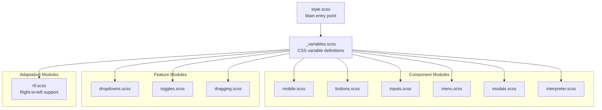
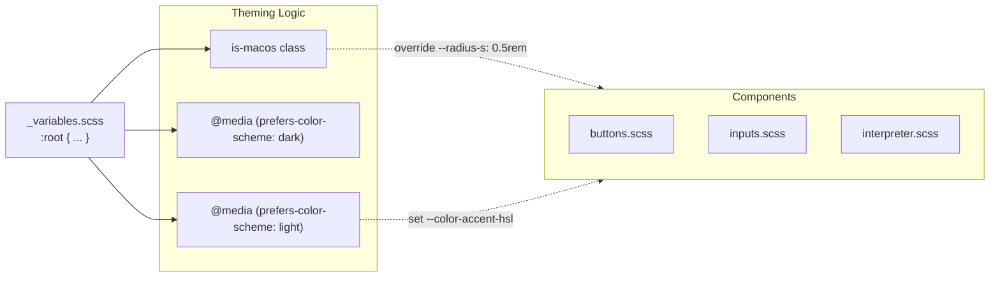

# Styling and Responsive Design

Relevant source files

The following files were used as context for generating this wiki page:

- [src/managers/menu.ts](src/managers/menu.ts)
- [src/styles/_variables.scss](src/styles/_variables.scss)
- [src/styles/buttons.scss](src/styles/buttons.scss)
- [src/styles/dragging.scss](src/styles/dragging.scss)
- [src/styles/dropdowns.scss](src/styles/dropdowns.scss)
- [src/styles/inputs.scss](src/styles/inputs.scss)
- [src/styles/interpreter.scss](src/styles/interpreter.scss)
- [src/styles/menu.scss](src/styles/menu.scss)
- [src/styles/mobile.scss](src/styles/mobile.scss)
- [src/styles/modals.scss](src/styles/modals.scss)
- [src/styles/rtl.scss](src/styles/rtl.scss)
- [src/styles/toggles.scss](src/styles/toggles.scss)

This document describes the SCSS-based styling system used throughout the Obsidian Web Clipper, including CSS variable theming, responsive design patterns, and component-specific styles. The styling system is modular, extensible, and optimized for cross-browser compatibility on both desktop and mobile devices.

## Styling Architecture

The clipper uses a modular SCSS architecture with CSS variables for theming. The main stylesheet imports component-specific modules and defines base styles.

### Component Map

**Sources:** [src/styles/_variables.scss:1-176](), [src/styles/mobile.scss:1-136](), [src/styles/inputs.scss:1-226](), [src/styles/buttons.scss:1-117](), [src/styles/interpreter.scss:1-334](), [src/styles/menu.scss:1-91](), [src/styles/dropdowns.scss:1-82](), [src/styles/dragging.scss:1-76](), [src/styles/modals.scss:1-110](), [src/styles/rtl.scss:1-26](), [src/styles/toggles.scss:1-99]()

## CSS Variable System

The styling system relies heavily on CSS custom properties defined in `_variables.scss` [src/styles/_variables.scss:1-176](). These variables enable consistent styling across all components and support light/dark mode transitions via `prefers-color-scheme` [src/styles/_variables.scss:198-221]().

### Core Variable Categories

| Variable Category | Example Variables | Purpose |
|------------------|-------------------|---------|
| Colors | `--background-primary`, `--background-secondary`, `--background-modifier-border` | Background and border colors [src/styles/_variables.scss:13-17]() |
| Text | `--text-normal`, `--text-muted`, `--text-faint`, `--text-on-accent` | Text color hierarchy [src/styles/_variables.scss:143-149]() |
| Interactive | `--interactive-accent`, `--interactive-accent-hover` | Interactive element states [src/styles/_variables.scss:77-78]() |
| Typography | `--font-default`, `--font-monospace-default` | Font families [src/styles/_variables.scss:74-75]() |
| Spacing/Radius | `--radius-s`, `--radius-m`, `--radius-l` | Border radii [src/styles/_variables.scss:135-137]() |
| Checkbox/Toggle | `--checkbox-size`, `--toggle-width`, `--toggle-radius` | Form element dimensions [src/styles/_variables.scss:35-169]() |

### Theme Integration Diagram

**Sources:** [src/styles/_variables.scss:1-221](), [src/styles/inputs.scss:18-24](), [src/styles/buttons.scss:8-12]()

## Responsive Design and Browser Adaptation

The extension adapts its layout based on the browser environment and device type.

### Mobile and Tablet Overrides
Mobile and tablet styles are managed in `mobile.scss` [src/styles/mobile.scss:1-136]().

- **Touch Optimization:** On mobile/tablet, touch targets are increased (`--clickable-icon-size: 2rem`) and tap highlights are disabled [src/styles/mobile.scss:31-56]().
- **Dialog Dimensions:** Dialogs expand to full viewport height (`100svh`) and width (`100svw`) on mobile devices [src/styles/mobile.scss:33-36]().
- **OS-Specific Logic:** iOS and macOS apply "superellipse" corner shapes and specific slider/toggle widths [src/styles/mobile.scss:85-103](), [src/styles/_variables.scss:179-196]().
- **Browser Detection:** Specific font-size adjustments are applied for `.is-firefox-mobile` and `.is-mobile-safari` [src/styles/mobile.scss:15-20]().

### Layout Breakpoints
The system uses a 768px breakpoint to toggle visibility between mobile headers (`.mh`) and desktop headers (`.dkh`) [src/styles/mobile.scss:1-13]().

**Sources:** [src/styles/mobile.scss:1-136](), [src/styles/_variables.scss:179-196]()

## Component-Specific Styles

### Input and Form Elements
Input fields use consistent styling with state-based visual feedback in `inputs.scss` [src/styles/inputs.scss:1-226]().
- **Text/Password Inputs:** Height is controlled by `--input-height` [src/styles/inputs.scss:8]().
- **Visual Feedback:** Active, focus, and focus-visible states trigger a 2px box-shadow using `--background-modifier-border-focus` [src/styles/inputs.scss:37-45]().
- **Checkboxes:** Custom-rendered using a data-URI SVG mask for the checkmark [src/styles/inputs.scss:134-147]().
- **Toggles:** The `.checkbox-container` class implements a sliding toggle switch using CSS transitions on the `:after` pseudo-element [src/styles/toggles.scss:1-99]().

### Button System
Buttons are styled in `buttons.scss` [src/styles/buttons.scss:1-117]().
- **CTA Style:** The `.mod-cta` class applies the interactive accent color [src/styles/buttons.scss:47-61]().
- **Clickable Icons:** The `.clickable-icon` class creates square, icon-only buttons that are transparent by default and gain a background on hover [src/styles/buttons.scss:64-95]().
- **Add Button:** A specialized `.add-btn` style is used for "Add Property" or similar actions [src/styles/buttons.scss:97-117]().

### Menu and Dropdown System
The menu system is managed by `menu.ts` [src/managers/menu.ts:1-60]() and styled in `menu.scss` [src/styles/menu.scss:1-91]().
- **Desktop:** Menus are absolute-positioned relative to the `.menu-btn` container [src/styles/menu.scss:9-26]().
- **Mobile:** Menus transform into bottom-sheets, fixed to the bottom of the screen with a `100%` width and backdrop overlay [src/styles/menu.scss:59-91]().
- **Interaction:** The `toggleMenu` function handles the `.show` class and toggles the `menu-open` class on the body to prevent background scrolling [src/managers/menu.ts:29-35]().

### AI Interpreter UI
The AI interpreter panel uses a distinct color scheme to indicate status [src/styles/interpreter.scss:1-334]().
- **Processing:** Background uses a light version of the accent color [src/styles/interpreter.scss:3-5]().
- **Success:** When the `.done` class is applied, the background shifts to `--background-modifier-success` [src/styles/interpreter.scss:13-20]().
- **Error:** The `.error` class shifts the UI to red tones using `--background-modifier-error` [src/styles/interpreter.scss:22-29]().

## RTL (Right-to-Left) Support
The `.mod-rtl` class [src/styles/rtl.scss:1-26]() provides overrides for languages like Hebrew or Arabic:
- **Icons:** Most Lucide icons are flipped using `transform: scale(-1, 1)` [src/styles/rtl.scss:5-11]().
- **Positioning:** Dropdown background positions and action button alignments are mirrored [src/styles/rtl.scss:2-16]().

**Sources:** [src/styles/inputs.scss:1-226](), [src/styles/buttons.scss:1-117](), [src/styles/menu.scss:1-91](), [src/managers/menu.ts:1-60](), [src/styles/interpreter.scss:1-334](), [src/styles/rtl.scss:1-26]()
