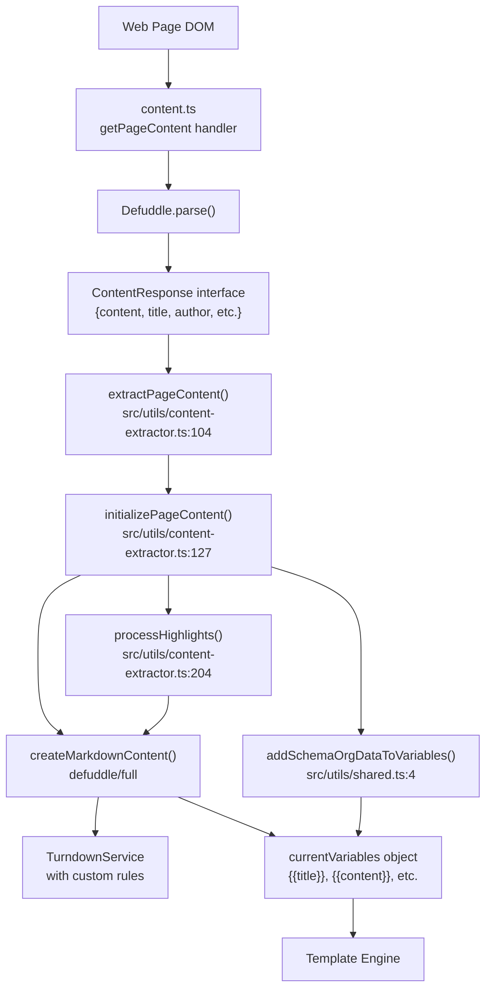
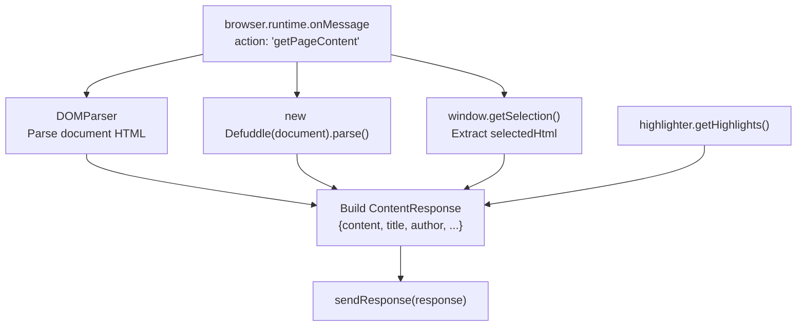
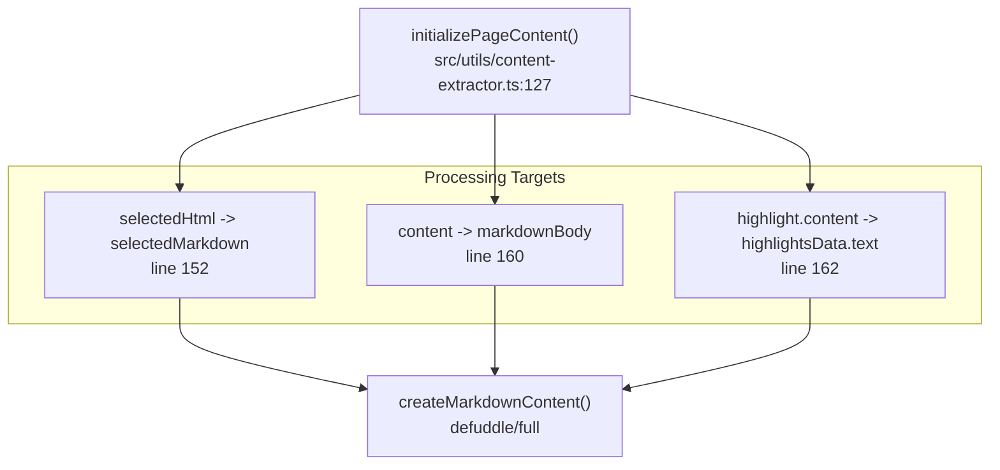

# Content Processing

Relevant source files

The following files were used as context for generating this wiki page:

- [README.md](README.md)
- [src/background.ts](src/background.ts)
- [src/content.ts](src/content.ts)
- [src/utils/content-extractor.ts](src/utils/content-extractor.ts)
- [src/utils/filters.ts](src/utils/filters.ts)
- [src/utils/filters/replace.ts](src/utils/filters/replace.ts)
- [src/utils/filters/safe_name.ts](src/utils/filters/safe_name.ts)
- [src/utils/parser-utils.ts](src/utils/parser-utils.ts)
- [src/utils/string-utils.ts](src/utils/string-utils.ts)

The Content Processing system transforms web page DOM structures into Markdown format suitable for Obsidian notes. It encompasses extraction of page content and metadata, conversion of HTML to Markdown, integration of user highlights, and preparation of template variables. For template-driven transformation and filtering of content, see [Templates and Filters](#5). For AI-powered content extraction, see [AI Integration](#6).

## Processing Pipeline Overview

Content processing occurs in three distinct phases: extraction, conversion, and variable initialization. The extraction phase uses `Defuddle` to parse the page DOM and extract clean content along with metadata. The conversion phase transforms HTML to Markdown using `Turndown` (via `defuddle/full`) with custom rules. The variable initialization phase creates a dictionary of template variables from the extracted content, metadata, highlights, and schema.org data.

**Pipeline Flow Diagram**

Sources: [src/content.ts:199-230](), [src/utils/content-extractor.ts:104-125](), [src/utils/content-extractor.ts:127-202]()

## Content Extraction

The extraction phase begins when the popup requests page content via message passing. The content script receives the `getPageContent` action and uses `Defuddle` to parse the document. `Defuddle` provides cleaned HTML content along with metadata including title, author, description, published date, schema.org data, and meta tags.

**Content Script Message Handler**

The content script maintains a `getPageContent` message handler that orchestrates extraction:

Sources: [src/content.ts:199-230](), [src/utils/content-extractor.ts:67-102]()

The `ContentResponse` interface returned by the content script includes:

| Field | Type | Description |
|-------|------|-------------|
| `content` | `string` | Cleaned HTML from Defuddle [src/utils/content-extractor.ts:47]() |
| `selectedHtml` | `string` | User-selected HTML if any [src/utils/content-extractor.ts:48]() |
| `extractedContent` | `ExtractedContent` | Additional extracted fields [src/utils/content-extractor.ts:49]() |
| `schemaOrgData` | `any` | Parsed schema.org JSON-LD [src/utils/content-extractor.ts:50]() |
| `fullHtml` | `string` | Complete page HTML [src/utils/content-extractor.ts:51]() |
| `highlights` | `AnyHighlightData[]` | Saved highlight data [src/utils/content-extractor.ts:52]() |
| `title` | `string` | Page title [src/utils/content-extractor.ts:53]() |
| `author` | `string` | Article author [src/utils/content-extractor.ts:54]() |
| `description` | `string` | Page description [src/utils/content-extractor.ts:55]() |
| `wordCount` | `number` | Word count [src/utils/content-extractor.ts:62]() |
| `metaTags` | `array` | All meta tags [src/utils/content-extractor.ts:64]() |

Sources: [src/utils/content-extractor.ts:46-65](), [src/content.ts:90-109]()

For details on site-specific extractors and metadata handling, see [Content Extraction](#4.1).

## Markdown Conversion

HTML content is converted to Markdown using the `defuddle/full` package, which includes a `TurndownService` implementation with custom rules. The conversion process handles complex structures including tables, mathematical notation, code blocks, and lists.

**Conversion Logic**

The `initializePageContent` function calls `createMarkdownContent` to transform HTML strings into Markdown. It handles both the main body content and individual user highlights.

Sources: [src/utils/content-extractor.ts:146-186](), [src/utils/content-extractor.ts:2-2]()

For details on custom Turndown rules for tables, math, and code blocks, see [Markdown Conversion](#4.2).

## Variable Initialization

After conversion, `initializePageContent()` creates the `currentVariables` object via `buildVariables()`. This object maps variable names like `{{title}}` to their values, providing the context for template rendering.

**Variable Construction Logic**

The function builds variables in several passes:

1. **Core variables** (lines 166-186): Basic page metadata, Markdown body, and HTML sources.
2. **Highlight variables** (line 182): JSON-serialized array of processed highlights via `collapseGroupsForExport`.
3. **Schema.org variables**: Integrated via `buildVariables` which incorporates data from `addSchemaOrgDataToVariables`.

Sources: [src/utils/content-extractor.ts:166-186](), [src/utils/shared.ts:4-4]()

For details on the available variables and schema.org parsing, see [Variables System](#5.3).

## Highlight Integration

If the highlighter is enabled, the `processHighlights()` function modifies the content HTML based on the `generalSettings.highlightBehavior` setting before Markdown conversion.

**Highlight Behaviors**

| Behavior | Processing |
|----------|------------|
| `no-highlights` | Return content unchanged [src/utils/content-extractor.ts:211]() |
| `replace-content` | Replace entire content with highlight HTML [src/utils/content-extractor.ts:215]() |
| `highlight-inline` | Wrap text/elements with `<mark>` tags in place [src/utils/content-extractor.ts:219]() |

Sources: [src/utils/content-extractor.ts:204-224]()

**Inline Highlight Processing**

For `highlight-inline` behavior, the system uses `DOMParser` to find the specific nodes indicated by XPaths or text offsets and wraps them using `wrapElementWithMark` or `wrapTextWithMark`.

Sources: [src/utils/content-extractor.ts:10-14](), [src/utils/dom-utils.ts:11-14]()

For details on the selection handling and overlay rendering, see [Highlighter System](#4.4).

## URL and String Utilities

Before conversion, URLs are made absolute to ensure images and links work within Obsidian. The `processUrls()` utility uses `DOMParser` to iterate through `img`, `a`, `video`, and `audio` tags.

Sources: [src/utils/string-utils.ts:137-161]()

**File Name Sanitization**

The `sanitizeFileName()` function ensures page titles are safe for the local file system by:
1. Removing Obsidian-specific characters: `#`, `|`, `^`, `[`, `]` [src/utils/string-utils.ts:27]()
2. Applying OS-specific rules for Windows, Mac, or Linux [src/utils/string-utils.ts:29-43]()
3. Trimming to 245 characters to allow room for file extensions [src/utils/string-utils.ts:49]()

Sources: [src/utils/string-utils.ts:21-57]()

## Reader Mode

The clipper includes a Reader Mode that provides a clean reading experience by stripping non-essential elements and applying a custom theme. It allows for interactive features like code highlighting and image lightboxes.

For details on the theme system and interactive outline, see [Reader Mode](#4.3).
