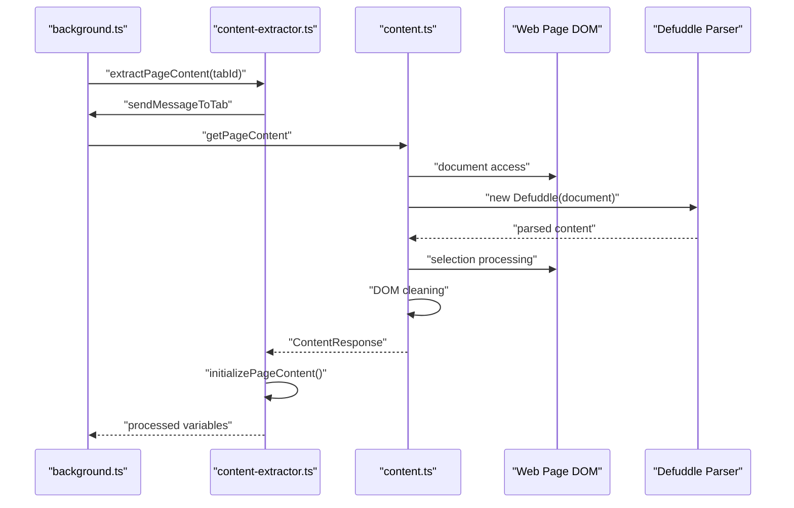
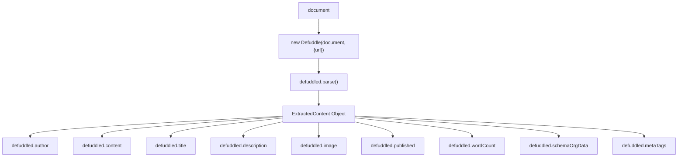
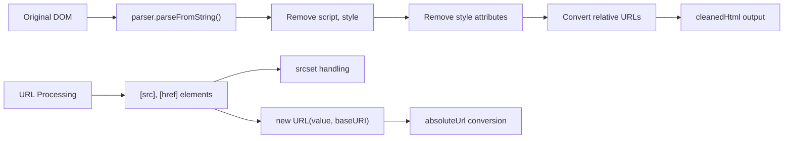
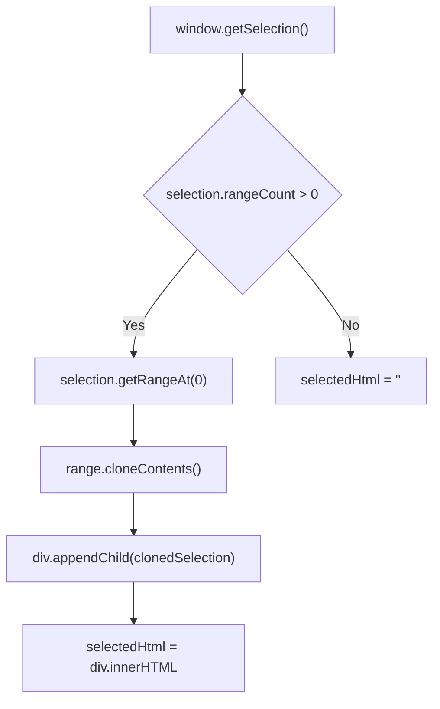

# Content Extraction

Relevant source files

The following files were used as context for generating this wiki page:

- [src/background.ts](src/background.ts)
- [src/content.ts](src/content.ts)
- [src/utils/content-extractor.ts](src/utils/content-extractor.ts)
- [src/utils/filters/date.test.ts](src/utils/filters/date.test.ts)
- [src/utils/filters/first.ts](src/utils/filters/first.ts)
- [src/utils/filters/footnote.ts](src/utils/filters/footnote.ts)
- [src/utils/filters/last.ts](src/utils/filters/last.ts)
- [src/utils/filters/slice.ts](src/utils/filters/slice.ts)
- [src/utils/reader-transcript.ts](src/utils/reader-transcript.ts)
- [src/utils/variables/prompt.ts](src/utils/variables/prompt.ts)
- [src/utils/variables/schema.ts](src/utils/variables/schema.ts)
- [src/utils/variables/simple.ts](src/utils/variables/simple.ts)

Content extraction is the core process of retrieving and processing web page content for transformation into Obsidian notes. This system handles DOM manipulation, text selection processing, metadata extraction, and integration with highlighting functionality. It leverages the **Defuddle** library for intelligent parsing and structured data retrieval.

## Communication Architecture

The content extraction system operates through a message-passing architecture between the extension's background script and content scripts injected into web pages.

The primary entry point is `extractPageContent` [src/utils/content-extractor.ts:104-125]() which sends a message to the active tab requesting page content via `sendExtractRequest` [src/utils/content-extractor.ts:67-102](). The content script `content.ts` responds with a `ContentResponse` object containing all extracted data [src/content.ts:199-368](). If the first attempt fails (common in Safari after updates), the system forces a fresh script injection and retries [src/utils/content-extractor.ts:113-124]().

Sources: [src/utils/content-extractor.ts:67-125](), [src/content.ts:199-368](), [src/background.ts:177-189]()

## Page Content Parsing

Content extraction relies on the **Defuddle** library for intelligent content parsing, which automatically identifies the main content area and extracts metadata.

The `getPageContent` message handler in `content.ts` creates a Defuddle instance and extracts structured content including article text, metadata, and semantic information [src/content.ts:270-335](). It also handles site-specific extraction for platforms like YouTube (transcripts), Twitter/X, and Reddit by passing the URL to the parser.

Sources: [src/content.ts:270-335](), [src/utils/content-extractor.ts:1-2]()

## DOM Processing and Cleaning

The system performs comprehensive DOM processing to prepare content for extraction while preserving essential structure and converting relative URLs to absolute paths.

### HTML Cleaning Pipeline

The cleaning process in `content.ts` involves:
- Creating a `DOMParser` instance to process the document HTML [src/content.ts:228]().
- Removing `script` and `style` elements that could interfere with content extraction [src/content.ts:233-234]().
- Stripping `style` attributes from all elements [src/content.ts:237-239]().
- Converting relative URLs in `src`, `href`, and `srcset` attributes to absolute URLs using `document.baseURI` [src/content.ts:241-266]().

Sources: [src/content.ts:228-268]()

### Text Selection Handling

When users select text on a page, the system captures the selection range and converts it to HTML for processing.

Sources: [src/content.ts:204-221]()

## Variable Generation

The `initializePageContent` function in `content-extractor.ts` and `buildVariables` in `shared.ts` transform extracted content into template variables.

### Core Variable Creation

The system creates a standard set of variables including content, metadata, and dynamically generated values like timestamps.

| Variable | Description | Source Entity |
| :--- | :--- | :--- |
| `{{author}}` | Page author | `params.author` |
| `{{content}}` | Markdown body | `createMarkdownContent()` |
| `{{title}}` | Page title | `params.title` |
| `{{url}}` | Cleaned URL | `params.url` (stripped of fragments) |
| `{{date}}` | Current timestamp | `dayjs().format()` |
| `{{domain}}` | Website domain | `getDomain(currentUrl)` |
| `{{words}}` | Word count | `params.wordCount` |

Sources: [src/utils/shared.ts:40-66](), [src/utils/content-extractor.ts:166-186]()

### Metadata and Schema.org Variables

Additional variables are generated from meta tags and structured data:

- **Meta Tags**: Variables are created for both `name` and `property` attributes, prefixed with `meta:name:` or `meta:property:` [src/utils/shared.ts:99-115]().
- **Schema.org**: Hierarchical variables are created using `addSchemaOrgDataToVariables`. This function recursively traverses the JSON-LD structure, using `@type` as a prefix (e.g., `{{schema:@Article:headline}}`) [src/utils/shared.ts:117-135](). The `processSchema` function handles variable resolution and filter application for these keys [src/utils/variables/schema.ts:15-83]().
- **Extracted Content**: Custom variables from Defuddle (like YouTube `{{transcript}}`) are merged into the variable dictionary [src/utils/shared.ts:68-93]().

Sources: [src/utils/shared.ts:99-135](), [src/utils/variables/schema.ts:15-83]()

## Site-Specific Extraction

### YouTube Transcripts
For YouTube, the system uses site-specific rules. The `reader-transcript.ts` file provides logic for wiring the transcript UI in Reader Mode, including CJK-aware text boundary detection for segments [src/utils/reader-transcript.ts:3-30](). In the background, `enableYouTubeInnertubeRule` ensures that API requests for transcripts include the correct `Origin` and `Referer` headers to bypass YouTube's security restrictions [src/background.ts:45-70]().

Sources: [src/utils/reader-transcript.ts:3-30](), [src/background.ts:45-109]()

## Integration Points

### Highlight System Integration

Content extraction integrates with the highlighting system during the variable generation phase. The `processHighlights` function determines how highlights are merged into the final content based on the `highlightBehavior` setting [src/utils/content-extractor.ts:204-234]():

- `no-highlights`: Highlights are ignored [src/utils/content-extractor.ts:211-213]().
- `replace-content`: The main content is replaced entirely by the user's highlights [src/utils/content-extractor.ts:215-217]().
- `highlight-inline`: Highlights are wrapped with `<mark>` tags in the HTML before markdown conversion [src/utils/content-extractor.ts:219-234]().

Sources: [src/utils/content-extractor.ts:204-234]()

### Simple Variable Processing
Simple variables (without special prefixes) are resolved using the `processSimpleVariable` function, which utilizes the unified `resolveVariable` utility and `applyFilters` for final string transformation [src/utils/variables/simple.ts:5-16]().

Sources: [src/utils/variables/simple.ts:5-16](), [src/utils/variables/prompt.ts:5-20]()
