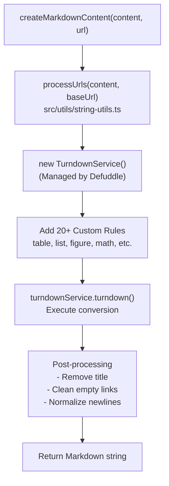
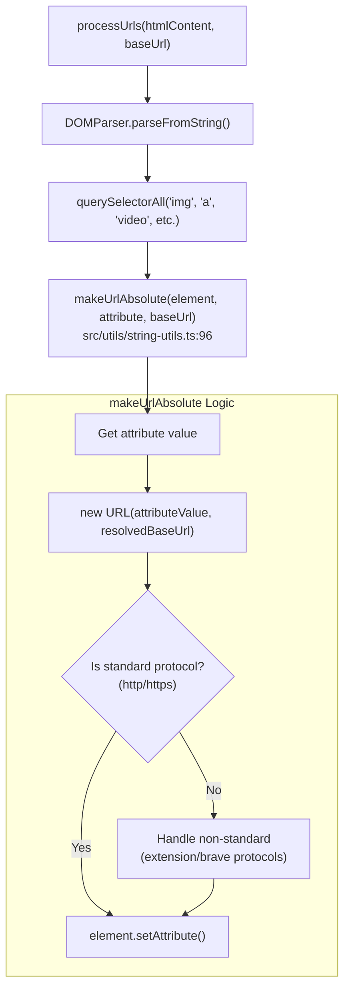

# Markdown Conversion

Relevant source files

The following files were used as context for generating this wiki page:

- [README.md](README.md)
- [src/utils/filters.ts](src/utils/filters.ts)
- [src/utils/filters/capitalize.ts](src/utils/filters/capitalize.ts)
- [src/utils/filters/kebab.ts](src/utils/filters/kebab.ts)
- [src/utils/filters/markdown.ts](src/utils/filters/markdown.ts)
- [src/utils/filters/remove_html.ts](src/utils/filters/remove_html.ts)
- [src/utils/filters/replace.ts](src/utils/filters/replace.ts)
- [src/utils/filters/safe_name.ts](src/utils/filters/safe_name.ts)
- [src/utils/filters/strip_md.ts](src/utils/filters/strip_md.ts)
- [src/utils/filters/table.ts](src/utils/filters/table.ts)
- [src/utils/filters/uncamel.ts](src/utils/filters/uncamel.ts)
- [src/utils/parser-utils.ts](src/utils/parser-utils.ts)
- [src/utils/string-utils.ts](src/utils/string-utils.ts)

## Purpose and Scope

This document describes the HTML to Markdown conversion system that transforms extracted web page content into Obsidian-compatible Markdown format. The conversion system is built on top of `TurndownService` with extensive customizations to handle complex HTML structures including tables, mathematical notation, embeds, figures, and site-specific markup patterns.

For information about how HTML content is initially extracted from web pages, see [4.1 Content Extraction](). For information about how the resulting Markdown is further processed through templates and filters, see [5.1 Template System]() and [5.2 Filter System]().

## Conversion Architecture

The markdown conversion system is centered around the `createMarkdownContent` function in `defuddle` (referenced in [src/utils/filters/markdown.ts:1-6]()), which orchestrates the transformation from HTML to Markdown. The system also utilizes a suite of custom filters to handle post-conversion or manual string-to-markdown transformations.

### Conversion Flow

**Sources:** [src/utils/filters/markdown.ts:1-11](), [src/utils/string-utils.ts:137-161]()

## Custom Conversion Rules and Filters

The conversion system supports specialized rules for various HTML structures. These are often exposed as filters within the template system to allow users to manually trigger conversion on specific variables.

### Table Conversion

The `table` filter [src/utils/filters/table.ts:1-98]() handles the conversion of JSON data into Markdown tables. It supports three primary input formats:

1.  **Single Object**: Converts key-value pairs into a two-column table [src/utils/filters/table.ts:28-39]().
2.  **Array of Objects**: Uses object keys as headers and values as row data [src/utils/filters/table.ts:42-51]().
3.  **Array of Arrays**: Creates a grid-based table [src/utils/filters/table.ts:54-65]().

The filter includes logic to escape pipe characters (`|`) within cell content to prevent breaking the Markdown table structure [src/utils/filters/table.ts:25-25]().

**Sources:** [src/utils/filters/table.ts:1-98]()

### List and Formatting Filters

| Filter | Logic | Source |
| :--- | :--- | :--- |
| `list` | Converts arrays into numbered or bulleted Markdown lists. | [src/utils/filters/list.ts]() |
| `strip_md` | Removes Markdown syntax (bold, italic, links, etc.) to produce plain text. | [src/utils/filters/strip_md.ts:1-37]() |
| `remove_html` | Removes specific HTML elements using CSS selectors (e.g., `.class`, `#id`, `tag`). | [src/utils/filters/remove_html.ts:3-57]() |
| `markdown` | Invokes the full `createMarkdownContent` pipeline on a string. | [src/utils/filters/markdown.ts:3-11]() |

**Sources:** [src/utils/filters/strip_md.ts:1-37](), [src/utils/filters/remove_html.ts:3-57](), [src/utils/filters/markdown.ts:3-11]()

## URL Processing

Before conversion begins, all URLs in the HTML content are processed through `processUrls()` to ensure links and images are valid in the final Markdown file [src/utils/string-utils.ts:137-161]().

### URL Resolution Logic

The `makeUrlAbsolute()` function ensures that relative links and images are correctly resolved to absolute URLs based on the source page's base URL [src/utils/string-utils.ts:96-135](). It specifically handles non-standard protocols like `chrome-extension://` by stripping extension-specific path segments and prepending the base URL's origin [src/utils/string-utils.ts:110-124]().

**Sources:** [src/utils/string-utils.ts:96-161]()

## File Name Sanitization

When converting content for storage in Obsidian, the system must ensure the resulting file names are valid across different operating systems. This is handled by `sanitizeFileName` [src/utils/string-utils.ts:21-57]() and the `safe_name` filter [src/utils/filters/safe_name.ts:21-67]().

### Sanitization Rules

The system implements platform-specific rules for Windows, macOS, and Linux:

*   **Obsidian-Specific**: Removes characters like `#`, `|`, `^`, `[`, `]` that have special meaning in Obsidian [src/utils/string-utils.ts:27-27]().
*   **Windows**: Removes `< > : " / \ | ? *` and reserved names like `CON`, `PRN`, `AUX` [src/utils/filters/safe_name.ts:31-34]().
*   **macOS/Linux**: Removes `/` and `:` and handles leading periods [src/utils/filters/safe_name.ts:37-45]().
*   **Length**: Truncates names to 245 characters to allow room for file extensions [src/utils/string-utils.ts:49-49]().

**Sources:** [src/utils/string-utils.ts:21-57](), [src/utils/filters/safe_name.ts:21-67]()

## String Transformation Utilities

The conversion process relies on several string manipulation utilities found in `src/utils/string-utils.ts`:

*   **`escapeMarkdown`**: Escapes square brackets to prevent accidental link or task creation [src/utils/string-utils.ts:5-7]().
*   **`escapeHtml`**: Sanitizes unsafe strings for display in the UI [src/utils/string-utils.ts:78-85]().
*   **`getDomain`**: Extracts the root domain from a URL, handling special TLDs like `.co.uk` [src/utils/string-utils.ts:171-196]().

**Sources:** [src/utils/string-utils.ts:1-196]()
