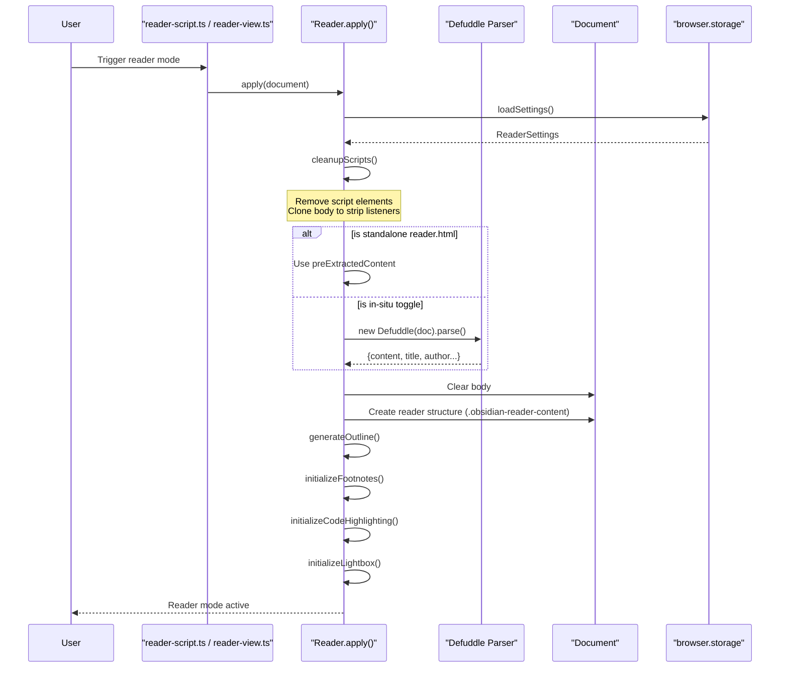
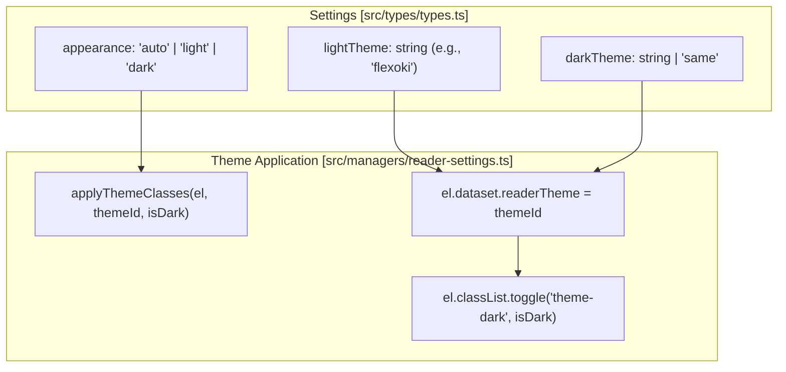

# Reader Mode

Relevant source files

The following files were used as context for generating this wiki page:

- [src/core/highlights.ts](src/core/highlights.ts)
- [src/core/reader-view.ts](src/core/reader-view.ts)
- [src/managers/reader-settings.ts](src/managers/reader-settings.ts)
- [src/reader-script.ts](src/reader-script.ts)
- [src/reader.scss](src/reader.scss)
- [src/styles/_reader-content.scss](src/styles/_reader-content.scss)
- [src/styles/highlights.scss](src/styles/highlights.scss)
- [src/styles/reader/comments.scss](src/styles/reader/comments.scss)
- [src/styles/reader/footnotes.scss](src/styles/reader/footnotes.scss)
- [src/styles/reader/headings.scss](src/styles/reader/headings.scss)
- [src/styles/reader/hr.scss](src/styles/reader/hr.scss)
- [src/utils/clip-utils.ts](src/utils/clip-utils.ts)
- [src/utils/dom-utils.ts](src/utils/dom-utils.ts)
- [src/utils/reader.ts](src/utils/reader.ts)

Reader Mode transforms web pages into a clean, distraction-free reading experience by extracting article content, removing scripts and styling, and applying a custom reading interface with typography controls, interactive features, and theme support.

For information about how extracted content is converted to Markdown, see [4.2 Markdown Conversion](). For details on the text highlighting system that integrates with Reader Mode, see [4.4 Highlighter System]().

## Purpose and Scope

Reader Mode provides a focused reading experience by:
- Extracting main article content using the **Defuddle** parser [src/utils/reader.ts:1]().
- Removing page scripts, stylesheets, and event listeners to prevent tracking and interference [src/utils/reader.ts:671-708]().
- Rendering content in a clean, customizable layout with a three-column grid [src/reader.scss:90-99]().
- Adding interactive features like footnote popovers, an image lightbox, and code syntax highlighting [src/utils/reader.ts:525-806]().
- Providing typography and theme controls via a floating settings bar [src/utils/reader.ts:180-299]().
- Generating an automatic table of contents from headings [src/utils/reader.ts:375-519]().

## Architecture

### Core Class Structure

The Reader Mode system is implemented as a static class `Reader` in [src/utils/reader.ts:52](). It manages the entire lifecycle from DOM extraction to UI rendering.

**Reader Class Overview**

| Category | Entity | Description |
| :--- | :--- | :--- |
| **State** | `isActive` | Boolean tracking if reader mode is currently visible [src/utils/reader.ts:54](). |
| **State** | `isReaderPage` | Distinguishes between in-situ toggle and standalone `reader.html` [src/utils/reader.ts:57](). |
| **State** | `settings` | Object of type `ReaderSettings` (fontSize, theme, etc.) [src/utils/reader.ts:147-163](). |
| **UI Refs** | `settingsBar` | Reference to the floating control overlay [src/utils/reader.ts:141](). |
| **UI Refs** | `lightbox` | Reference to the fullscreen image viewer element [src/utils/reader.ts:144](). |

**Core Implementation Diagram**

```mermaid
graph TB
    Reader["Reader (static class) [src/utils/reader.ts]"]
    
    subgraph "State Management"
        preExtractedContent["preExtractedContent: ReaderContent | null<br/>Avoid re-parsing on standalone page"]
        isActive["isActive: boolean<br/>Track reader mode state"]
        settings["settings: ReaderSettings<br/>fontSize, lightTheme, darkTheme, appearance"]
    end
    
    subgraph "UI References"
        settingsBar["settingsBar: HTMLElement<br/>Controls overlay"]
        lightbox["lightbox: HTMLElement<br/>Image viewer"]
        images["images: HTMLImageElement[]<br/>Lightbox image list"]
    end
    
    subgraph "Core Methods"
        apply["apply(doc: Document)<br/>Transform page to reader mode"]
        restore["restore(doc: Document)<br/>Revert to original HTML"]
        toggle["toggle(doc: Document)<br/>Switch between states"]
    end
    
    subgraph "Initialization Methods"
        loadSettings["loadSettings()<br/>Load from storage.sync"]
        saveSettings["saveSettings()<br/>Persist to storage.sync"]
        cleanupScripts["cleanupScripts(doc)<br/>Remove scripts/events"]
        extractContent["extractContent(doc)<br/>Parse with Defuddle"]
    end
    
    subgraph "UI Construction Methods"
        injectSettingsBar["injectSettingsBar(doc)<br/>Add controls overlay"]
        generateOutline["generateOutline(doc)<br/>Build TOC from headings"]
        initializeFootnotes["initializeFootnotes(doc)<br/>Add footnote popovers"]
        initializeLightbox["initializeLightbox(doc)<br/>Setup image viewer"]
        initializeCodeHighlighting["initializeCodeHighlighting(doc)<br/>Apply highlight.js"]
    end
    
    Reader --> preExtractedContent
    Reader --> isActive
    Reader --> settings
    Reader --> settingsBar
    Reader --> lightbox
    Reader --> images
    
    apply --> loadSettings
    apply --> cleanupScripts
    apply --> extractContent
    apply --> injectSettingsBar
    apply --> generateOutline
    apply --> initializeFootnotes
    apply --> initializeCodeHighlighting
    
    restore --> lightbox
```

**Sources:** [src/utils/reader.ts:52-163](), [src/utils/reader.ts:1035-1270](), [src/utils/reader.ts:1272-1321]()

### Reader Mode Lifecycle

The lifecycle is triggered by the `reader-script.ts` message listener [src/reader-script.ts:15-36]() or directly by `reader-view.ts` for standalone pages [src/core/reader-view.ts:84]().

**Sources:** [src/utils/reader.ts:1035-1270](), [src/reader-script.ts:15-36](), [src/core/reader-view.ts:16-123]()

## Content Extraction

### Defuddle Integration

Reader Mode uses the **Defuddle** library [src/utils/reader.ts:1]() to identify and extract the primary article content. On the standalone `reader.html` page, `reader-view.ts` handles the extraction and passes the result to `Reader.preExtractedContent` [src/core/reader-view.ts:57-65]().

The extraction process returns a `ReaderContent` object [src/utils/reader.ts:41-50]():
- **content**: Cleaned HTML of the main article.
- **title**: Article title.
- **author**: Author name.
- **published**: Publication date.
- **domain**: Extracted domain string [src/utils/string-utils.ts:7]().
- **wordCount**: Total words in the article.

**Sources:** [src/utils/reader.ts:41-74](), [src/core/reader-view.ts:50-65](), [src/utils/clip-utils.ts:4-21]()

### Script and Style Cleanup

The `cleanupScripts` function ensures a "frozen" reading state [src/utils/reader.ts:671-708]().

| Cleanup Action | Implementation | Purpose |
| :--- | :--- | :--- |
| **Clear Timeouts** | `window.clearTimeout` | Stop running timers [src/utils/reader.ts:674-681](). |
| **Remove Scripts** | `doc.querySelectorAll('script')` | Remove `<script>` tags [src/utils/reader.ts:692-693](). |
| **Clone Body** | `doc.body.cloneNode(true)` | Strips all event listeners [src/utils/reader.ts:696-697](). |
| **CSP Meta** | `http-equiv="Content-Security-Policy"` | Blocks new script execution [src/utils/reader.ts:700-703](). |
| **Remove Styles** | `doc.querySelectorAll('style, link[rel="stylesheet"]')` | Clears site-specific CSS [src/utils/reader.ts:1103-1108](). |

**Sources:** [src/utils/reader.ts:671-708](), [src/utils/reader.ts:1092-1108]()

## User Interface Components

### Document Structure

Reader Mode creates a specialized layout using SCSS variables for flexible width and typography [src/reader.scss:51-146]().

- **Sidebar**: The left sidebar contains the `obsidian-reader-outline` [src/reader.scss:83-85]().
- **Content Area**: The `.obsidian-reader-content` class manages padding and line width [src/reader.scss:90-99]().
- **Metadata**: Displays author, date, and domain at the top of the article [src/reader.scss:101-126]().

**Sources:** [src/reader.scss:51-146](), [src/utils/reader.ts:1130-1228]()

### Settings Bar

The settings bar (`obsidian-reader-settings`) provides interactive controls [src/utils/reader.ts:180-299]().

| Setting | CSS Variable / Logic | Implementation |
| :--- | :--- | :--- |
| **Theme** | `data-reader-theme` | Supports Ayu, Catppuccin, Gruvbox, Nord, etc. [src/managers/reader-settings.ts:9-19](). |
| **Font Size** | `--font-text-size` | Dynamic calculation: `calc(var(--font-text-size) + 0.25vw)` [src/styles/_reader-content.scss:6](). |
| **Appearance** | `.theme-light` / `.theme-dark` | Supports 'auto', 'light', and 'dark' [src/managers/reader-settings.ts:21-25](). |
| **Font Family** | `--font-text` | Custom font selection with system fallbacks [src/managers/reader-settings.ts:129-135](). |

**Sources:** [src/utils/reader.ts:180-299](), [src/managers/reader-settings.ts:1-168]()

### Interactive Outline

The `generateOutline` method builds a Table of Contents [src/utils/reader.ts:375-519]().

- **ID Assignment**: Headings are assigned `heading-{index}` if they lack an ID [src/utils/reader.ts:404]().
- **Active Tracking**: An `IntersectionObserver` updates the `.active` class on outline items during scroll [src/utils/reader.ts:457-511]().

**Sources:** [src/utils/reader.ts:375-519](), [src/reader.scss:743-796]()

## Interactive Features

### Footnote Popovers

Footnote references trigger a `footnote-popover` [src/utils/reader.ts:525-588]().

- **Positioning**: `positionPopover` determines if the popover should appear above or below the reference [src/utils/reader.ts:607-669]().
- **Interaction**: Popovers close when clicking outside or clicking a close button [src/utils/reader.ts:553-568]().

**Sources:** [src/utils/reader.ts:525-669](), [src/styles/reader/footnotes.scss:1-50]()

### Code Highlighting & Copy

Reader Mode uses **highlight.js** for syntax highlighting [src/utils/reader.ts:6]().

- **Highlighting**: `initializeCodeHighlighting` applies styles to `pre > code` blocks [src/utils/reader.ts:710-748]().
- **Copying**: `initializeCopyButtons` adds a button to each code block that uses `copyToClipboard` [src/utils/reader.ts:750-806]().

**Sources:** [src/utils/reader.ts:710-806](), [src/styles/reader/_code-highlighting.scss:1-30]()

### Image Lightbox

The `obsidian-reader-lightbox` allows fullscreen image viewing [src/utils/reader.ts:808-975]().

- **Collection**: Collects all images from the article into the `images` array [src/utils/reader.ts:863-888]().
- **Navigation**: Supports keyboard arrows and escape [src/utils/reader.ts:953-968]().
- **Captions**: Extracts text from `<figcaption>` to display below the image [src/utils/reader.ts:993-997]().

**Sources:** [src/utils/reader.ts:808-1033](), [src/styles/reader/lightbox.scss:1-120]()

## Theme System

The theme system is shared between Reader Mode and the Highlights view [src/core/highlights.ts:158-184]().

**Theme Mode Logic**

**Sources:** [src/managers/reader-settings.ts:27-35](), [src/core/highlights.ts:158-184](), [src/reader.scss:1-50]()
