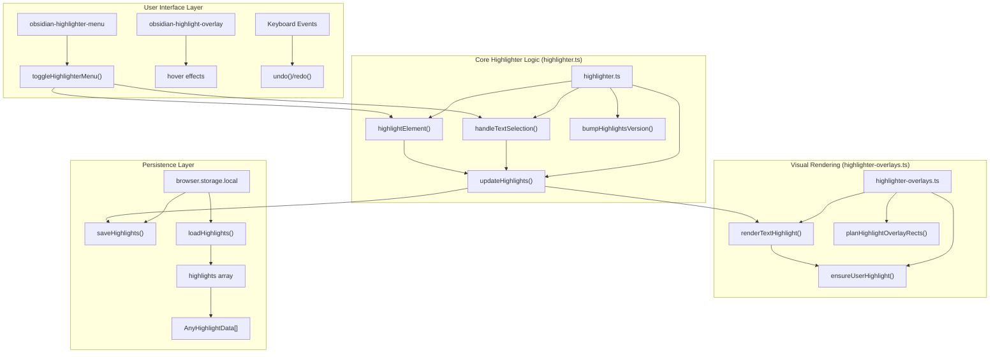
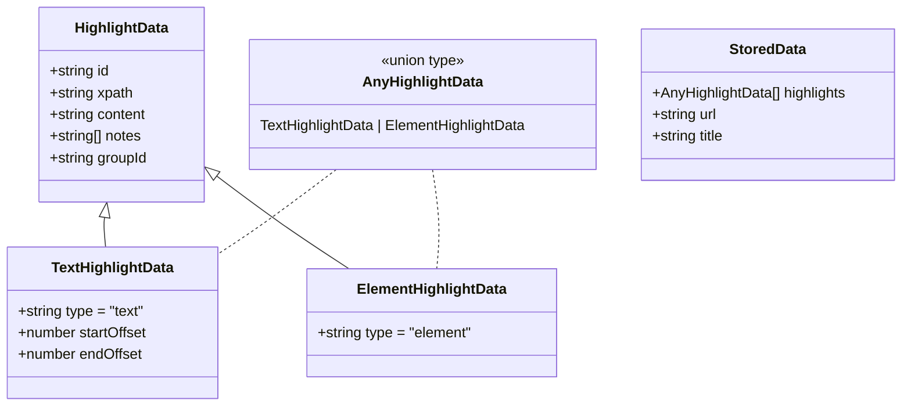
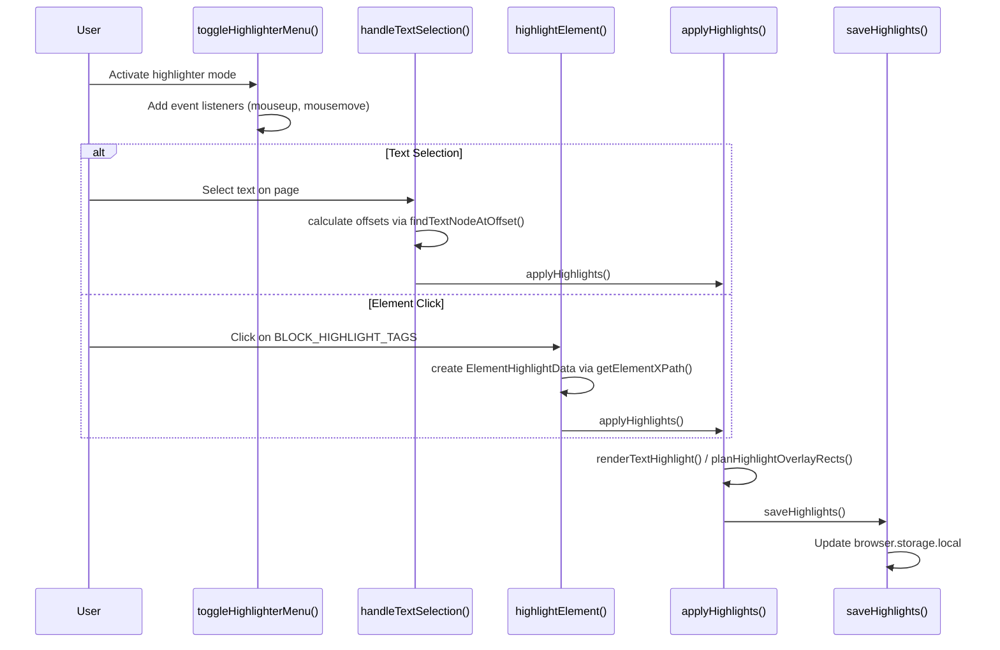

# Highlighter System

Relevant source files

The following files were used as context for generating this wiki page:

- [src/core/highlights.ts](src/core/highlights.ts)
- [src/core/reader-view.ts](src/core/reader-view.ts)
- [src/highlighter.scss](src/highlighter.scss)
- [src/managers/highlights-manager.ts](src/managers/highlights-manager.ts)
- [src/managers/reader-settings.ts](src/managers/reader-settings.ts)
- [src/styles/reader/hr.scss](src/styles/reader/hr.scss)
- [src/utils/clip-utils.ts](src/utils/clip-utils.ts)
- [src/utils/dom-utils.ts](src/utils/dom-utils.ts)
- [src/utils/highlighter-overlays.ts](src/utils/highlighter-overlays.ts)
- [src/utils/highlighter.ts](src/utils/highlighter.ts)

The Highlighter System provides interactive visual annotation capabilities for web pages, allowing users to select and highlight text or elements that can be persisted across browser sessions and included in clipped content. This system handles the full lifecycle of highlights from user interaction through visual rendering to storage persistence.

For information about content extraction and processing of highlighted content, see [4.1 Content Extraction](). For template integration with highlight data, see [5.1 Template System]().

## Architecture Overview

The Highlighter System consists of components that manage user interaction, DOM manipulation for visual overlays, and persistence via browser storage. It utilizes the **CSS Custom Highlight API** for modern text rendering while falling back to overlay DIVs for complex elements.

**Sources:** [src/utils/highlighter.ts:97-174](), [src/utils/highlighter-overlays.ts:26-77](), [src/highlighter.scss:142-168]()

## Data Model

The system uses a hierarchical data structure to represent different types of highlights, identifying them by `xpath` and a unique `id`.

**Sources:** [src/utils/highlighter.ts:66-66](), [src/utils/highlighter.ts:201-224](), [src/utils/highlighter.ts:241-251]()

## User Interaction Flow

The system differentiates between text selection (Range-based) and block element selection (DOM-based). Block elements like `FIGURE`, `IMG`, and `TABLE` are treated as atomic units.

**Sources:** [src/utils/highlighter.ts:193-193](), [src/utils/highlighter.ts:335-363](), [src/utils/highlighter-overlays.ts:83-104](), [src/utils/dom-utils.ts:53-71]()

## Visual Rendering System

The clipper employs a hybrid rendering strategy to ensure performance and layout stability.

### CSS Custom Highlight API
For `text` type highlights, the system uses the **CSS Custom Highlight API** (`obsidian-highlight`). This avoids DOM mutation by decorating text ranges directly in the browser's paint layer.
- **Priority**: Set to `-1` to allow other highlights (like transcript playback) to paint on top [src/utils/highlighter-overlays.ts:36-39]().
- **Range Logic**: `findTextNodeAtOffset` maps character offsets back to DOM text nodes for range creation [src/utils/highlighter-overlays.ts:83-104]().

### Overlay Strategy
Element-based highlights and complex selections use absolutely-positioned DIV overlays.

| Highlight Type | Rendering Method | Logic Source |
|:---|:---|:---|
| `text` | `CSS.highlights` (Range-based) | [src/utils/highlighter-overlays.ts:106-126]() |
| `element` | Bounding client rect of the node | [src/utils/highlighter-overlays.ts:405-415]() |
| `block` | `BLOCK_HIGHLIGHT_TAGS` unit selection | [src/utils/highlighter.ts:193-193]() |

### Floating Delete Interface
A floating remove button (`obsidian-highlight-delete`) appears when clicking a highlight or using `Alt+hover`.
- **Hit Testing**: `findTextHighlightAtPoint` uses `getClientRects()` with a 4px vertical padding to catch clicks between lines [src/utils/highlighter-overlays.ts:145-164]().

**Sources:** [src/utils/highlighter-overlays.ts:106-126](), [src/utils/highlighter-overlays.ts:145-180](), [src/utils/highlighter-overlays.ts:405-415]()

## Persistence and Storage

Highlights are stored in `browser.storage.local` under the `highlights` key, indexed by a normalized URL.

- **URL Normalization**: `normalizeUrl` strips fragments and ephemeral tracking parameters (UTM, etc.) to ensure highlights persist across slight URL variations [src/utils/highlighter.ts:78-95]().
- **Storage Structure**: Data is stored as `Record<string, StoredData>` [src/core/highlights.ts:204-206]().
- **Change Tracking**: A monotonic `highlightsVersion` counter is used to detect mutations efficiently without expensive JSON serialization on the render path [src/utils/highlighter.ts:174-176]().

**Sources:** [src/utils/highlighter.ts:78-95](), [src/utils/highlighter.ts:174-176](), [src/core/highlights.ts:204-206]()

## Menu and Controls

The `obsidian-highlighter-menu` provides session controls.

- **Undo/Redo**: Managed via `highlightHistory` and `redoHistory` stacks limited to 30 actions [src/utils/highlighter.ts:185-187]().
- **Clip Button**: Triggers a popup message to create a note from the current highlights [src/utils/highlighter.ts:424-444]().
- **Keyboard Shortcuts**: Supports `Escape` to exit, `Cmd/Ctrl+Z` to undo, and `Cmd/Ctrl+Shift+Z` to redo [src/utils/highlighter.ts:1330-1350]().

### Mobile Support
On mobile devices, the menu moves to the bottom of the screen [src/highlighter.scss:1-11](). The system also disables pinch-zoom (`touch-action: pan-x pan-y`) while highlighter mode is active to prevent interaction conflicts [src/highlighter.scss:121-129]().

**Sources:** [src/utils/highlighter.ts:185-187](), [src/utils/highlighter.ts:1330-1350](), [src/highlighter.scss:1-129]()
