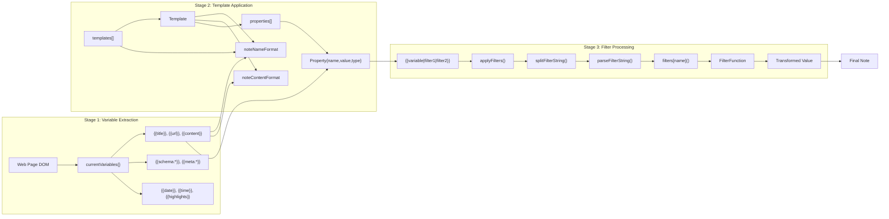
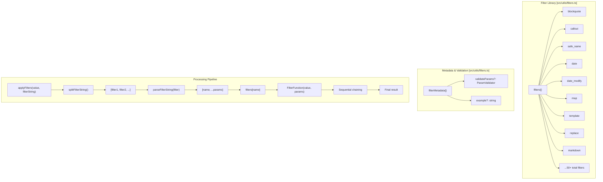

# Templates and Filters

<details>
<summary>Relevant source files</summary>

The following files were used as context for generating this wiki page:

- [README.md](README.md)
- [docs/Filters.md](docs/Filters.md)
- [docs/Templates.md](docs/Templates.md)
- [docs/Troubleshoot Web Clipper.md](docs/Troubleshoot Web Clipper.md)
- [docs/Variables.md](docs/Variables.md)
- [src/utils/filters.ts](src/utils/filters.ts)
- [src/utils/filters/replace.ts](src/utils/filters/replace.ts)
- [src/utils/filters/reverse.ts](src/utils/filters/reverse.ts)
- [src/utils/filters/safe_name.ts](src/utils/filters/safe_name.ts)
- [src/utils/parser-utils.ts](src/utils/parser-utils.ts)
- [src/utils/string-utils.ts](src/utils/string-utils.ts)

</details>


Templates and filters form the core content transformation system of the Obsidian Web Clipper. This system consists of three integrated components:

1.  **Templates** - Define note structure, behaviors, and property mappings.
2.  **Filters** - Transform and format variable values through 50+ functions.
3.  **Variables** - Extract and provide data from web pages and metadata.

Together, these components convert extracted web content into well-formatted Obsidian notes with proper metadata and formatting.

For detailed information:
*   Template structure and behaviors: [Template System](#5.1)
*   Filter functions and chaining: [Filter System](#5.2)
*   Variable extraction and types: [Variables System](#5.3)
*   Engine internals: [Template Parser and Renderer](#5.4)

## System Overview

The template and filter system operates as a multi-stage transformation pipeline that converts web content into formatted Obsidian notes.

### High-Level Processing Flow



**Processing Order:**
1.  Variables are extracted from the web page and stored in `currentVariables`.
2.  The selected template defines note structure via `noteNameFormat`, `noteContentFormat`, and `properties`.
3.  Variable references like `{{variable|filter}}` are resolved and filters are applied sequentially [src/utils/filters.ts:189-216]().
4.  Final processed values populate the note structure.

Sources: [src/utils/filters.ts:133-186](), [docs/Variables.md:4-13]()

## Template Architecture

Templates define how to structure notes and which behaviors to trigger upon saving. They are defined by the `Template` interface.

### Template Data Structure

```mermaid
graph TB
    subgraph "Template Entity [src/types/types.ts]"
        A["Template"] --> B["id: string"]
        A --> C["name: string"]
        A --> D["behavior: SaveBehavior"]
        A --> E["noteNameFormat: string"]
        A --> F["noteContentFormat: string"]
        A --> G["path: string"]
        A --> H["properties: Property[]"]
        A --> I["triggers?: string[]"]
        A --> K["context?: string"]
    end
    
    subgraph "Property Entity [src/types/types.ts]"
        H --> L["Property"]
        L --> N["name: string"]
        L --> O["value: string"]
        L --> P["type?: string"]
    end
    
    subgraph "Example Property Configuration"
        Q["author_prop"] --> R["name: 'author'"]
        Q --> S["value: '{{author|split:\", \"|wikilink|join}}'"]
        Q --> T["type: 'multitext'"]
    end
```

**Key Fields:**
*   **Behavior**: Defines how content is added (e.g., `create`, `append-daily`, `overwrite`) [docs/Templates.md:30-34]().
*   **Triggers**: Automatic selection based on URL patterns or `schema:` keys [docs/Templates.md:35-61]().
*   **Interpreter Context**: Defines the page context accessible to prompt variables [docs/Templates.md:63-66]().

Sources: [docs/Templates.md:25-66](), [src/utils/filters.ts:39-40]()

## Filter System Architecture

The filter system provides over 50 transformation functions registered in the `filters` object [src/utils/filters.ts:133-186](). Filters process string values through a parsing pipeline that handles complex syntax like quoted strings, regex patterns, and chained transformations.

### Filter Registry and Processing



**Core Logic:**
1.  `splitFilterString()` splits on `|` while respecting quotes, regex, and parentheses [src/utils/filters.ts:189-216]().
2.  `parseFilterString()` extracts the name and parameters [src/utils/filters.ts:219-238]().
3.  `replace` filter supports complex regex patterns via `parseRegexPattern` [src/utils/filters/replace.ts:67-78]().
4.  `safe_name` provides OS-specific sanitization (Windows, Mac, Linux) [src/utils/filters/safe_name.ts:29-54]().

Sources: [src/utils/filters.ts:133-186](), [src/utils/filters/replace.ts:1-98](), [src/utils/filters/safe_name.ts:21-66](), [src/utils/parser-utils.ts:89-96]()

## Variable System Integration

Variables are the data source flowing through templates and filters. The Web Clipper extracts variables from multiple sources:

*   **Preset variables**: Basic page metadata (`title`, `url`, `content`, `author`, `published`, `words`) [docs/Variables.md:20-39]().
*   **Prompt variables**: AI-generated content using the `{{"prompt"}}` syntax [docs/Variables.md:41-45]().
*   **Meta tag variables**: Data from HTML meta elements (`meta:property:*`, `meta:name:*`) [docs/Variables.md:71-76]().
*   **Selector variables**: Content extracted via CSS selectors (`selector:cssSelector?attribute`) [docs/Variables.md:78-89]().
*   **Schema.org variables**: Structured data found on the page [docs/Variables.md:12]().

For complete variable reference, see [Variables System](#5.3).

Sources: [docs/Variables.md:1-89](), [src/utils/string-utils.ts:59-76]()

## Filter Categories

The filter system provides several categories of transformations:

*   **String Manipulation**: `upper`, `lower`, `title`, `capitalize`, `trim`, `replace`, `camel`, `kebab`, `snake`, `pascal`, `uncamel` [docs/Filters.md:40-115]().
*   **Array & Object Operations**: `join`, `split`, `first`, `last`, `nth`, `reverse`, `unique`, `merge`, `length`, `map`, `object` [src/utils/filters.ts:13-52]().
*   **Formatting**: `date`, `date_modify`, `duration`, `number_format`, `safe_name`, `calc`, `round` [docs/Filters.md:9-35](), [src/utils/filters.ts:6-38]().
*   **Obsidian/Markdown**: `wikilink`, `callout`, `blockquote`, `image`, `link`, `footnote`, `fragment_link`, `markdown`, `table` [docs/Filters.md:120-186]().
*   **HTML Processing**: `remove_html`, `strip_tags`, `remove_attr`, `html_to_json`, `strip_md`, `unescape`, `decode_uri` [src/utils/filters.ts:16-51]().

Sources: [src/utils/filters.ts:5-54](), [docs/Filters.md:1-186]()
