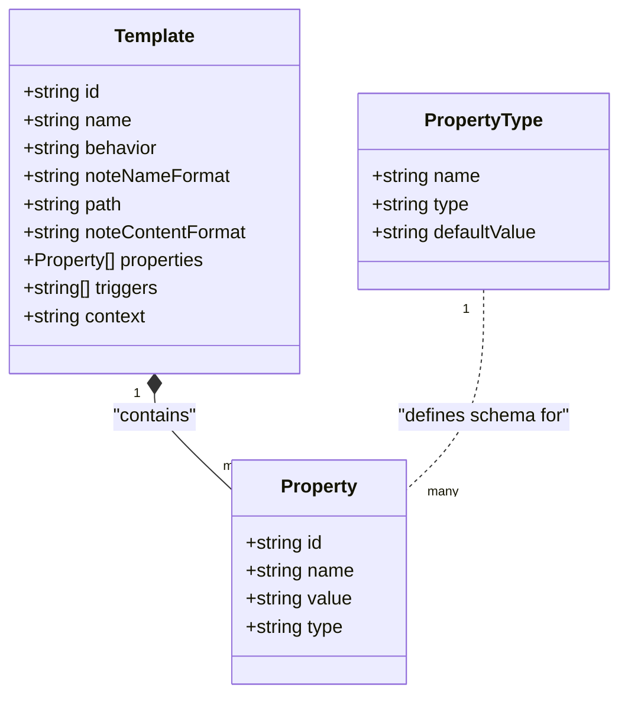
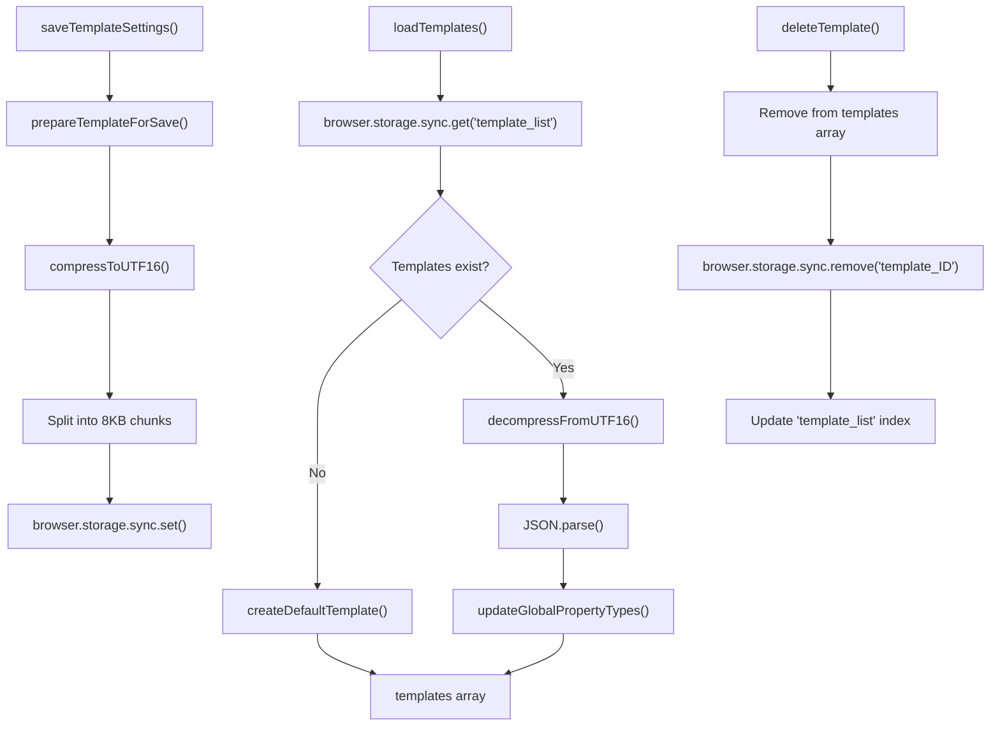
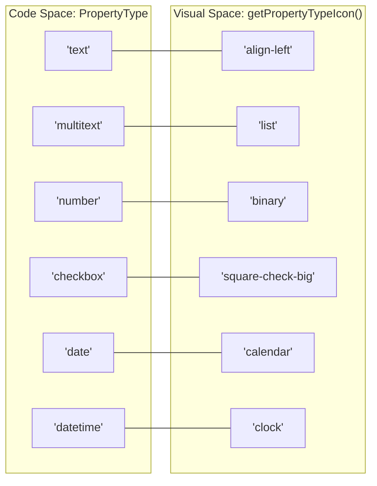
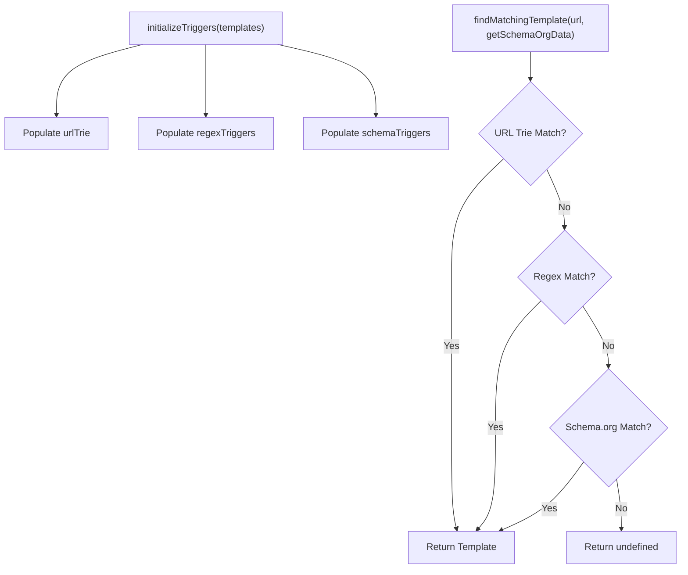

# Template System

Relevant source files

The following files were used as context for generating this wiki page:

- [src/core/settings.ts](src/core/settings.ts)
- [src/managers/property-types-manager.ts](src/managers/property-types-manager.ts)
- [src/managers/template-manager.ts](src/managers/template-manager.ts)
- [src/managers/template-ui.ts](src/managers/template-ui.ts)
- [src/styles/templates.scss](src/styles/templates.scss)
- [src/types/types.ts](src/types/types.ts)
- [src/utils/import-export.ts](src/utils/import-export.ts)
- [src/utils/import-modal.ts](src/utils/import-modal.ts)
- [src/utils/memoize.ts](src/utils/memoize.ts)
- [src/utils/triggers.ts](src/utils/triggers.ts)

The Template System provides the core functionality for creating, managing, and applying templates that define how web content is formatted into Obsidian notes. This system handles template storage, property management, and the configuration interface for defining note structures, behaviors, and content formatting rules.

For information about applying templates and processing variables, see [Filter System and Variables](5.2). For details about AI-powered content processing within templates, see [LLM Interpreter](6.1).

## Template Data Structure

Templates are the fundamental configuration units that define how clipped content should be structured and formatted. The template system revolves around the core `Template` interface and its associated properties.

### Natural Language to Code Entity Mapping: Data Model

The following diagram maps high-level template concepts to the TypeScript interfaces used in the codebase.

**Template Data Model Details**

The `Template` interface defines the complete structure for note generation:

| Field | Type | Description |
|-------|------|-------------|
| `id` | string | Unique identifier generated from timestamp and random string |
| `name` | string | User-defined template name displayed in the UI |
| `behavior` | string | Note creation behavior: `create`, `append-specific`, `append-daily`, `prepend-specific`, `prepend-daily`, `overwrite` |
| `noteNameFormat` | string | Template for generating note names (e.g., `{{title}}`) |
| `path` | string | Directory path within the Obsidian vault |
| `noteContentFormat` | string | Main content template with variable placeholders |
| `properties` | Property[] | Array of frontmatter properties |
| `triggers` | string[] | URL or Schema.org patterns that auto-select this template |
| `vault` | string | Specific Obsidian vault (optional) |
| `context` | string | AI interpreter context for LLM processing |

Sources: [src/types/types.ts:1-12](), [src/types/types.ts:14-19](), [src/types/types.ts:33-37]()

## Template Management

The `template-manager.ts` handles all CRUD operations, storage, and lifecycle management for templates.

**Core Management Functions**

- `loadTemplates()`: Retrieves and decompresses templates from browser sync storage, creates default template if none exist [src/managers/template-manager.ts:20-69]().
- `saveTemplateSettings()`: Compresses and stores templates with size validation and chunking [src/managers/template-manager.ts:71-97]().
- `createDefaultTemplate()`: Generates a default template with standard properties (title, source, author, published, created, description, tags) [src/managers/template-manager.ts:113-133]().
- `deleteTemplate()`: Removes template from storage and updates the template list [src/managers/template-manager.ts:175-206]().
- `duplicateTemplate()`: Creates a copy with a unique ID and name [src/managers/template-manager.ts:147-159]().
- `findTemplateById()`: Retrieves template by ID [src/managers/template-manager.ts:143-145]().

Sources: [src/managers/template-manager.ts:1-206]()

## Property and Type System

Templates contain an array of `Property` objects. The system uses a global property type registry managed by `property-types-manager.ts` to ensure consistency across templates.

### Natural Language to Code Entity Mapping: UI & Icons

This diagram shows how property types in the code are associated with specific visual elements and icons.

**Property Type Management**

- **Initialization**: `initializePropertyTypesManager()` ensures the 'tags' property exists as a `multitext` type by default [src/managers/property-types-manager.ts:12-27]().
- **Usage Tracking**: `countPropertyUsage()` scans all templates to determine how many times a property is used, preventing deletion of active properties [src/managers/property-types-manager.ts:72-79]().
- **Default Values**: Global default values can be set for property types, which are automatically applied when a new property of that type is added [src/managers/property-types-manager.ts:106-111]().

Sources: [src/managers/property-types-manager.ts:1-154](), [src/icons/icons.ts:76-87]()

## Template Behaviors

Templates support multiple note creation behaviors that determine how content is inserted into Obsidian:

- **create**: Creates a new note with the specified name format [src/types/types.ts:4]().
- **append-specific / prepend-specific**: Adds content to the end or beginning of an existing note identified by the `noteNameFormat` [src/types/types.ts:4]().
- **append-daily / prepend-daily**: Targets the current daily note. This behavior automatically disables the note name format and path fields in the UI [src/utils/import-export.ts:33-52]().
- **overwrite**: Replaces the entire content of an existing note [src/types/types.ts:4]().

Sources: [src/types/types.ts:4](), [src/managers/template-ui.ts:186-194]()

## Triggers and Auto-Selection

The `initializeTriggers` and `findMatchingTemplate` functions enable automatic template selection based on the current URL or page metadata.

**Trigger Types**

1.  **URL Prefix**: Simple string matching (e.g., `https://github.com/`) managed via a Trie structure for performance [src/utils/triggers.ts:19](), [src/utils/triggers.ts:42-73]().
2.  **Regex**: Patterns enclosed in slashes (e.g., `/reddit\.com\/r\/[a-z]+\/comments/`) [src/utils/triggers.ts:9-17]().
3.  **Schema.org**: Matches against JSON-LD metadata using the `schema:` prefix (e.g., `schema:@Recipe.name`) [src/utils/triggers.ts:149-188]().

Sources: [src/utils/triggers.ts:1-143]()

## Import and Export

Templates can be shared or backed up via JSON files using the `import-export.ts` utility.

- **Export**: `exportTemplate()` serializes the current template into a JSON file, including a `schemaVersion` and filtering out behavior-specific fields (like `path` for daily notes) [src/utils/import-export.ts:23-67]().
- **Import**: `importTemplate()` parses JSON, validates the structure via `validateImportedTemplate()`, and ensures unique naming by appending counters if a template with the same name exists [src/utils/import-export.ts:69-148]().
- **UI**: `showImportModal()` provides a drag-and-drop zone and JSON textarea for importing templates or property types [src/utils/import-modal.ts:5-126]().

Sources: [src/utils/import-export.ts:1-171](), [src/utils/import-modal.ts:1-168]()

## Storage and Compression

To circumvent the strict size limits of `browser.storage.sync` (typically 8KB per item), the system implements chunking and compression.

- **Compression**: Uses `lz-string` to compress the JSON string of a template [src/managers/template-manager.ts:100]().
- **Chunking**: Splits the compressed string into chunks of 8000 characters (`CHUNK_SIZE`) [src/managers/template-manager.ts:101-104]().
- **Monitoring**: `prepareTemplateForSave` returns a warning if a single template exceeds 6KB (`SIZE_WARNING_THRESHOLD`) after compression [src/managers/template-manager.ts:107-111]().

Sources: [src/managers/template-manager.ts:11-14](), [src/managers/template-manager.ts:99-111]()
