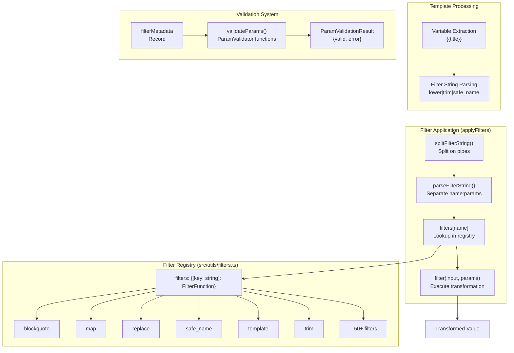
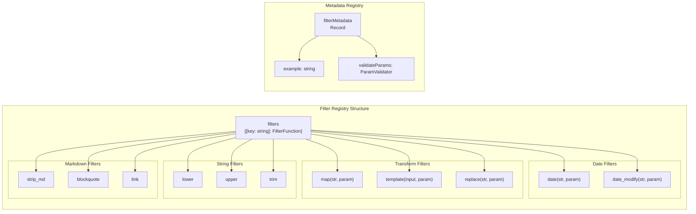

# Filter System

<details>
<summary>Relevant source files</summary>

The following files were used as context for generating this wiki page:

- [README.md](README.md)
- [docs/Filters.md](docs/Filters.md)
- [docs/Templates.md](docs/Templates.md)
- [docs/Troubleshoot Web Clipper.md](docs/Troubleshoot Web Clipper.md)
- [docs/Variables.md](docs/Variables.md)
- [src/utils/date-utils.ts](src/utils/date-utils.ts)
- [src/utils/filters.ts](src/utils/filters.ts)
- [src/utils/filters/blockquote.ts](src/utils/filters/blockquote.ts)
- [src/utils/filters/callout.ts](src/utils/filters/callout.ts)
- [src/utils/filters/camel.ts](src/utils/filters/camel.ts)
- [src/utils/filters/date.ts](src/utils/filters/date.ts)
- [src/utils/filters/date_modify.ts](src/utils/filters/date_modify.ts)
- [src/utils/filters/decode_uri.test.ts](src/utils/filters/decode_uri.test.ts)
- [src/utils/filters/decode_uri.ts](src/utils/filters/decode_uri.ts)
- [src/utils/filters/duration.test.ts](src/utils/filters/duration.test.ts)
- [src/utils/filters/duration.ts](src/utils/filters/duration.ts)
- [src/utils/filters/image.ts](src/utils/filters/image.ts)
- [src/utils/filters/join.test.ts](src/utils/filters/join.test.ts)
- [src/utils/filters/join.ts](src/utils/filters/join.ts)
- [src/utils/filters/link.ts](src/utils/filters/link.ts)
- [src/utils/filters/list.ts](src/utils/filters/list.ts)
- [src/utils/filters/lower.ts](src/utils/filters/lower.ts)
- [src/utils/filters/map.ts](src/utils/filters/map.ts)
- [src/utils/filters/merge.ts](src/utils/filters/merge.ts)
- [src/utils/filters/number_format.ts](src/utils/filters/number_format.ts)
- [src/utils/filters/remove_attr.ts](src/utils/filters/remove_attr.ts)
- [src/utils/filters/remove_tags.ts](src/utils/filters/remove_tags.ts)
- [src/utils/filters/replace.ts](src/utils/filters/replace.ts)
- [src/utils/filters/reverse.ts](src/utils/filters/reverse.ts)
- [src/utils/filters/round.ts](src/utils/filters/round.ts)
- [src/utils/filters/safe_name.ts](src/utils/filters/safe_name.ts)
- [src/utils/filters/split.ts](src/utils/filters/split.ts)
- [src/utils/filters/strip_attr.ts](src/utils/filters/strip_attr.ts)
- [src/utils/filters/strip_tags.ts](src/utils/filters/strip_tags.ts)
- [src/utils/filters/template.ts](src/utils/filters/template.ts)
- [src/utils/filters/title.ts](src/utils/filters/title.ts)
- [src/utils/filters/upper.ts](src/utils/filters/upper.ts)
- [src/utils/filters/wikilink.ts](src/utils/filters/wikilink.ts)
- [src/utils/parser-utils.ts](src/utils/parser-utils.ts)
- [src/utils/string-utils.ts](src/utils/string-utils.ts)

</details>


The filter system provides data transformation capabilities for template variables. Filters are applied using pipe notation (e.g., `{{title | lower | trim}}`) and enable sequential transformations of extracted content before insertion into notes. The system includes 50+ built-in filters for string manipulation, date formatting, markdown processing, array operations, and more.

For information about how filters integrate with templates, see [Template System](#5.1). For details on the variables that filters transform, see [Variables System](#5.3).

## Purpose and Architecture

The filter system transforms variable values through a pipeline of operations. Each filter receives an input value and optional parameters, performs a transformation, and returns the modified value. Filters are registered in a central registry and can be chained together using pipe (`|`) delimiters.

### Pipeline Logic



**Filter Application Flow**

Sources: [src/utils/filters.ts:305-365](), [src/utils/filters.ts:133-186]()

## Filter Registry

All filters are registered in the `filters` object, which maps filter names to their implementation functions. Each filter function conforms to the `FilterFunction` type signature.

| Filter Category | Filters |
|----------------|---------|
| **String Case** | `lower`, `upper`, `capitalize`, `title`, `camel`, `pascal`, `kebab`, `snake`, `uncamel` |
| **String Manipulation** | `trim`, `slice`, `replace`, `split`, `join`, `reverse`, `unique` |
| **Markdown** | `blockquote`, `callout`, `link`, `wikilink`, `image`, `footnote`, `fragment_link`, `markdown`, `strip_md`, `table` |
| **HTML Processing** | `remove_html`, `remove_tags`, `strip_tags`, `strip_attr`, `remove_attr`, `replace_tags`, `unescape` |
| **Array Operations** | `map`, `first`, `last`, `nth`, `length`, `merge`, `list` |
| **Date/Time** | `date`, `date_modify`, `duration` |
| **Numeric** | `calc`, `round`, `number_format` |
| **Object Operations** | `object`, `template`, `html_to_json` |
| **Utility** | `safe_name` |

### Code Entities and Registry



**Filter and Metadata Registry Structure**

Sources: [src/utils/filters.ts:133-186](), [src/utils/filters.ts:73-129]()

### Filter Metadata

The `filterMetadata` object stores validation and documentation information for each filter:

- **`example`**: Sample usage string for documentation (e.g., `"calc:\"+10\""`) [src/utils/filters.ts:75]()
- **`validateParams`**: Optional function that validates filter parameters before application [src/utils/filters.ts:70]()

The `validFilterNames` Set provides O(1) lookup for filter name validation. [src/utils/filters.ts:131]()

Sources: [src/utils/filters.ts:61-131]()

## Filter Syntax

Filters use pipe notation to chain transformations. The syntax follows these patterns:

### Basic Syntax
- **Chaining**: `{{variable | filter1 | filter2}}` [docs/Filters.md:7]()
- **Parameters**: `{{variable | filter:param}}` [docs/Filters.md:17]()
- **Quoted Params**: `{{variable | filter:"param with spaces"}}` [src/utils/filters.ts:229]()

### Parameter Formats
Filters accept parameters in various formats:
- **No parameters**: `{{title | lower}}`
- **Single parameter**: `{{date | date:"YYYY-MM-DD"}}` [docs/Filters.md:17]()
- **Multiple parameters**: `{{content | slice:0,5}}` [src/utils/filters.ts:79]()
- **Complex expressions**: `{{items | map:x => x.name}}` [src/utils/filters.ts:77]()
- **Quoted strings**: `{{title | replace:"old":"new"}}` [src/utils/filters.ts:78]()

### Special Characters in Parameters
The parser handles special characters within parameters:
- **Quotes**: Parameters can be single or double-quoted [src/utils/filters.ts:201]()
- **Colons**: Used to separate filter name and parameters [src/utils/filters.ts:227]()
- **Pipes**: Split filter chains when not inside quotes/parentheses [src/utils/filters.ts:201]()
- **Parentheses**: Tracked for nesting depth [src/utils/filters.ts:202]()
- **Regex**: Recognized by forward slash delimiters [src/utils/filters.ts:201]()

Sources: [src/utils/filters.ts:189-238](), [src/utils/parser-utils.ts:1-50]()

## Parameter Parsing

The filter system uses two main parsing functions to process filter strings:

### splitFilterString
The `splitFilterString` function splits the filter chain on pipe characters while respecting quoted strings, parentheses, and regex patterns. It uses a state machine created via `createParserState()` to track character context. [src/utils/filters.ts:189-216]()

### parseFilterString
Separates a single filter into its name and parameter components by splitting on the first unquoted colon. [src/utils/filters.ts:219-238]()

Sources: [src/utils/filters.ts:189-238](), [src/utils/parser-utils.ts:1-20]()

## Parameter Validation

Filters with required or structured parameters implement validator functions that return `ParamValidationResult`. [src/utils/filters.ts:61-64]()

### Example Validators

**map filter** - requires arrow function syntax:
```typescript
export const validateMapParams = (param: string | undefined): ParamValidationResult => {
	if (!param) {
		return { valid: false, error: 'requires an arrow function (e.g., map:x => x.name)' };
	}
	const match = param.match(/^\s*(\w+)\s*=>\s*(.+)$/);
	if (!match) {
		return { valid: false, error: 'invalid syntax. Use arrow function format (e.g., x => x.name)' };
	}
	return { valid: true };
};
```
Sources: [src/utils/filters/map.ts:4-15]()

**template filter** - requires template string:
```typescript
export const validateTemplateParams = (param: string | undefined): ParamValidationResult => {
	if (!param) {
		return { valid: false, error: 'requires a template string (e.g., template:"${name}")' };
	}
	return { valid: true };
};
```
Sources: [src/utils/filters/template.ts:4-10]()

**replace filter** - validates search and replacement pairs:
```typescript
export const validateReplaceParams = (param: string | undefined): ParamValidationResult => {
	if (!param) {
		return { valid: false, error: 'requires search and replacement (e.g., replace:"old":"new")' };
	}
    // ... regex checks for quoted pairs
	return { valid: true };
};
```
Sources: [src/utils/filters/replace.ts:4-26]()

## Filter Application

### applyFilters Function
The main entry point for filter application processes a filter string and applies each filter sequentially. It handles JSON parsing for intermediate steps in the pipeline. [src/utils/filters.ts:305-365]()

### applyFilterDirect Function
An optimized path for applying a single filter when the name and parameters are already separated. This function handles type coercion and the `currentUrl` injection for specific filters like `markdown` or `fragment_link`. [src/utils/filters.ts:251-298]()

### JSON Type Coercion
The filter system automatically handles JSON serialization:
1. **Input coercion**: Non-string inputs are stringified with `JSON.stringify()` in `applyFilterDirect`. [src/utils/filters.ts:258]()
2. **Output parsing**: If output starts with `[` or `{`, attempt to parse as JSON in `applyFilters`. [src/utils/filters.ts:346-354]()
3. **Type preservation**: Parsed JSON is passed to the next filter in the chain. [src/utils/filters.ts:352]()

Sources: [src/utils/filters.ts:251-365]()

## Key Filter Implementations

### map Filter
Transforms array elements using arrow function syntax. It supports object literals, string literals, and nested property expressions via `getNestedProperty`. [src/utils/filters/map.ts:17-89]()

### template Filter
Applies template strings to object properties, effectively acting as a sub-template engine for arrays of objects. It uses `replaceTemplateVariables` to substitute `${path}` tokens. [src/utils/filters/template.ts:12-86]()

### replace Filter
Supports literal string replacement and Regex patterns. It handles multiple replacements separated by commas and processes escape sequences like `\n` via `processEscapedCharacters`. [src/utils/filters/replace.ts:28-109]()

### date and date_modify Filters
Powered by `dayjs`, these filters allow for complex date formatting and relative date calculations (e.g., `date_modify:"+1 week"`). [src/utils/filters/date.ts:12-51](), [src/utils/filters/date_modify.ts:41-83]()

### safe_name Filter
Sanitizes strings for filenames based on OS constraints (Windows, Mac, Linux) using `sanitizeFileName` utility. [src/utils/string-utils.ts:21-57](), [src/utils/filters/safe_name.ts:1-25]()

### HTML Attribute Filters
- **remove_attr**: Removes specific attributes from HTML tags using `attributeOrSlashRegex`. [src/utils/filters/remove_attr.ts:1-63]()
- **strip_attr**: Removes all attributes except those specified. [src/utils/filters/strip_attr.ts:1-24]()

Sources: [src/utils/filters/map.ts:1-119](), [src/utils/filters/template.ts:1-113](), [src/utils/filters/replace.ts:1-109](), [src/utils/filters/date.ts:1-51](), [src/utils/filters/date_modify.ts:1-83](), [src/utils/string-utils.ts:21-57]()
