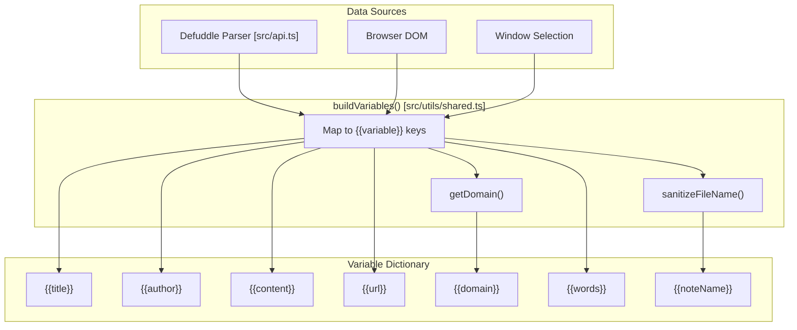
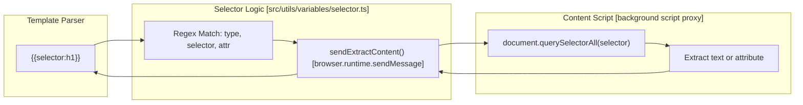

# Variables System

Relevant source files

The following files were used as context for generating this wiki page:

- [docs/Filters.md](docs/Filters.md)
- [docs/Templates.md](docs/Templates.md)
- [docs/Troubleshoot Web Clipper.md](docs/Troubleshoot Web Clipper.md)
- [docs/Variables.md](docs/Variables.md)
- [src/api.ts](src/api.ts)
- [src/utils/filters/date.test.ts](src/utils/filters/date.test.ts)
- [src/utils/filters/first.ts](src/utils/filters/first.ts)
- [src/utils/filters/footnote.ts](src/utils/filters/footnote.ts)
- [src/utils/filters/last.ts](src/utils/filters/last.ts)
- [src/utils/filters/reverse.ts](src/utils/filters/reverse.ts)
- [src/utils/filters/slice.ts](src/utils/filters/slice.ts)
- [src/utils/shared.test.ts](src/utils/shared.test.ts)
- [src/utils/shared.ts](src/utils/shared.ts)
- [src/utils/variables/prompt.ts](src/utils/variables/prompt.ts)
- [src/utils/variables/schema.ts](src/utils/variables/schema.ts)
- [src/utils/variables/selector.ts](src/utils/variables/selector.ts)
- [src/utils/variables/simple.ts](src/utils/variables/simple.ts)

The Variables System extracts structured data from web pages and makes it available for use in templates. Variables are created during the content extraction phase and stored in a dictionary, which is then used by the template engine for note generation. Variables use the `{{variableName}}` syntax and can be transformed using filters.

## Variable Types

The system provides several categories of variables, each extracted from different sources on the web page:

| Category | Prefix | Example | Source |
|----------|--------|---------|--------|
| Preset Variables | None | `{{title}}`, `{{url}}` | Defuddle parser and DOM |
| Prompt Variables | None | `{{"summarize this"}}` | AI Interpreter (LLM) |
| Selector Variables| `selector:` | `{{selector:.author}}` | CSS Selectors (DOM) |
| Schema.org Variables | `schema:` | `{{schema:@Article:author}}` | JSON-LD structured data |
| Meta Tag Variables | `meta:` | `{{meta:property:og:title}}` | HTML meta tags |

Sources: [src/utils/shared.ts:40-93](), [docs/Variables.md:14-115]()

## Variable Building and Data Flow

Variables are constructed in the `buildVariables` function, which serves as a pure mapping layer between extracted page data and the template system. This function is environment-agnostic and used by both the browser extension and the CLI [src/utils/shared.ts:1-4]().

### Core Preset Variables

**Implementation Details:**
- **URL Cleaning**: The system automatically strips text fragments (e.g., `#:~:text=...`) from the `{{url}}` variable to prevent messy links [src/utils/shared.ts:41]().
- **Note Name**: The `{{noteName}}` variable is a filesystem-safe version of the page title generated via `sanitizeFileName` [src/utils/shared.ts:42](), [src/utils/shared.ts:59]().
- **Content**: The `{{content}}` variable contains the main article content in Markdown format, while `{{contentHtml}}` provides the raw HTML extracted by Defuddle [src/utils/shared.ts:47-48]().
- **Timestamps**: Both `{{date}}` and `{{time}}` are initialized with the same ISO 8601 timestamp using `dayjs().format('YYYY-MM-DDTHH:mm:ssZ')` [src/utils/shared.ts:44-52]().

Sources: [src/utils/shared.ts:40-66](), [src/utils/shared.test.ts:37-52](), [src/api.ts:183-195]()

## Selector Variables

Selector variables allow dynamic extraction of content using CSS selectors. Unlike preset variables, these are often resolved asynchronously during the rendering process.

### Resolution Logic
The `resolveSelector` and `processSelector` functions handle the communication between the extension and the content script to fetch live DOM data.

- **Syntax**: `{{selector:cssSelector?attribute}}` or `{{selectorHtml:cssSelector}}` [src/utils/variables/selector.ts:33-41]().
- **Attribute Extraction**: If an attribute is specified (e.g., `?src`), the system retrieves that specific attribute value; otherwise, it returns the text content [src/utils/variables/selector.ts:32](), [src/api.ts:54-56]().

Sources: [src/utils/variables/selector.ts:11-55](), [src/api.ts:47-84]()

## Schema.org Variables

The system recursively parses JSON-LD data to create flattened variable keys. This allows templates to access deeply nested structured data.

### Extraction Algorithm
The `addSchemaOrgDataToVariables` function iterates through the `schemaOrgData` object:
1. **Typed Objects**: If an object has a `@type`, it uses it as a prefix (e.g., `{{schema:@Article:headline}}`). If `@type` is an array, it registers the variable under each type [src/utils/shared.ts:103-110]().
2. **Nested Paths**: Nested properties are joined with dots (e.g., `author.name`) [src/utils/shared.ts:131]().
3. **Arrays**: Arrays are stored as JSON strings but also have indexed access keys (e.g., `keywords[0]`) [src/utils/shared.ts:126-129]().

### Array Processing
The `processSchema` function provides advanced handling for schema arrays, including:
- **Shorthand**: Automatically finding the full typed key if only a property name is provided [src/utils/variables/schema.ts:32-37]().
- **Star Syntax**: Using `[*]` to map over all items in an array and return them as a JSON string [src/utils/variables/schema.ts:55-56]().
- **List Parsing**: Handling string-based lists (numbered or bulleted) by splitting them into arrays [src/utils/variables/schema.ts:3-13](), [src/utils/variables/schema.ts:43-50]().

Sources: [src/utils/shared.ts:99-135](), [src/utils/variables/schema.ts:15-83]()

## Meta Tag Variables

Meta variables are extracted from `<meta>` elements. The system supports both standard `name` attributes and Open Graph `property` attributes.

- **Name-based**: `{{meta:name:description}}` maps to `<meta name="description" content="...">` [src/utils/shared.ts:79]().
- **Property-based**: `{{meta:property:og:image}}` maps to `<meta property="og:image" content="...">` [src/utils/shared.ts:82]().

Sources: [src/utils/shared.ts:76-85](), [docs/Variables.md:71-77]()

## Prompt Variables (AI Interpreter)

Prompt variables `{{"prompt"}}` are unique because they require an external LLM call. These are typically the last variables to be resolved in the pipeline.

- **Syntax**: Must be enclosed in double quotes within the curly braces, e.g., `{{"summarize the page"}}` [docs/Variables.md:45]().
- **Execution**: The interpreter sends the prompt along with the page context to the configured AI provider [docs/Variables.md:51-52]().
- **Post-processing**: Responses can be piped into filters, such as `{{"summarize"|blockquote}}` [docs/Variables.md:45]().

Sources: [docs/Variables.md:41-70]()

## Variable Integration in Templates

Variables flow through the `clip` and `compileTemplate` functions where they are substituted and filtered.

| Step | Function | Description |
|------|----------|-------------|
| 1. Extraction | `buildVariables` | Gathers all static data (preset, meta, schema) into a dictionary [src/api.ts:192](). |
| 2. Parsing | `compileTemplate` | Identifies `{{...}}` blocks and logic in the template [src/api.ts:203](). |
| 3. Resolution | `AsyncResolver` | Fetches dynamic data like selectors or prompt variables [src/api.ts:47-67](). |
| 4. Filtering | `applyFilters` | Applies the chain of filters to the resolved value [src/api.ts:82](). |

Sources: [src/api.ts:176-210](), [src/utils/shared.ts:40-93]()
