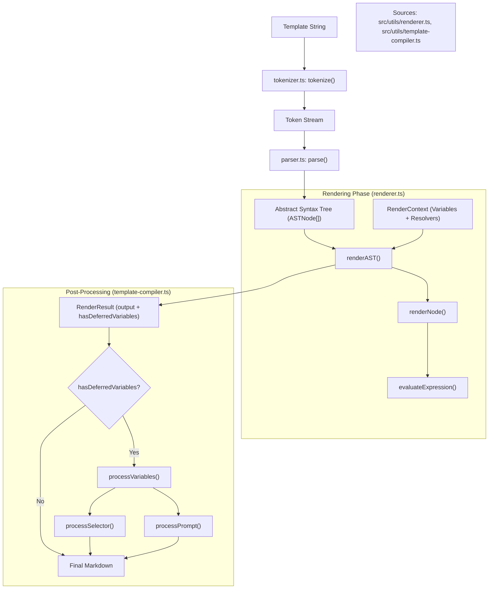

# Template Parser and Renderer

<details>
<summary>Relevant source files</summary>

The following files were used as context for generating this wiki page:

- [README.md](README.md)
- [src/utils/filters.ts](src/utils/filters.ts)
- [src/utils/filters/callout.test.ts](src/utils/filters/callout.test.ts)
- [src/utils/filters/fragment_link.ts](src/utils/filters/fragment_link.ts)
- [src/utils/filters/nth.test.ts](src/utils/filters/nth.test.ts)
- [src/utils/filters/replace.test.ts](src/utils/filters/replace.test.ts)
- [src/utils/filters/replace.ts](src/utils/filters/replace.ts)
- [src/utils/filters/safe_name.ts](src/utils/filters/safe_name.ts)
- [src/utils/filters/split.test.ts](src/utils/filters/split.test.ts)
- [src/utils/parser-utils.ts](src/utils/parser-utils.ts)
- [src/utils/parser.test.ts](src/utils/parser.test.ts)
- [src/utils/parser.ts](src/utils/parser.ts)
- [src/utils/renderer.test.ts](src/utils/renderer.test.ts)
- [src/utils/renderer.ts](src/utils/renderer.ts)
- [src/utils/string-utils.ts](src/utils/string-utils.ts)
- [src/utils/template-compiler.ts](src/utils/template-compiler.ts)

</details>


The template engine is a custom-built, AST-based system designed to transform web content into structured Markdown. It supports variable interpolation, conditional logic, loops, and a sophisticated filter pipeline. The engine is designed to be environment-agnostic, allowing it to function within the browser extension (using browser APIs for DOM selection) and in the CLI/Node.js context.

## System Architecture

The template processing pipeline follows a standard compilation flow:
1.  **Tokenization**: The raw template string is broken into a stream of tokens (text, variable starts, tags, etc.) [src/utils/tokenizer.ts]().
2.  **Parsing**: The token stream is converted into an **Abstract Syntax Tree (AST)** consisting of nodes like `IfNode`, `ForNode`, and `VariableNode` [src/utils/parser.ts:157-176]().
3.  **Rendering**: The AST is evaluated against a `RenderContext` to produce a string. This stage handles logic and standard variable resolution [src/utils/renderer.ts:103-123]().
4.  **Post-Processing**: Special variables that require external asynchronous resolution (like LLM prompts or CSS selectors) are processed after the initial render [src/utils/template-compiler.ts:71-73]().

### Template Compilation Flow

The following diagram illustrates how the `compileTemplate` function orchestrates the various components.

Title: Template Compilation Pipeline

Sources: [src/utils/renderer.ts:103-154](), [src/utils/template-compiler.ts:29-76]()

---

## Parser and AST Structure

The parser converts the template into a series of `ASTNode` objects. It supports complex expressions, including binary operations (`==`, `!=`, `>`, etc.), unary operations, and member access [src/utils/parser.ts:68-120]().

### Key Node Types
| Node Type | Description | File Reference |
| :--- | :--- | :--- |
| `TextNode` | Raw text content between tags | [src/utils/parser.ts:27-30]() |
| `VariableNode` | Expressions inside `{{ ... }}` including filters | [src/utils/parser.ts:32-37]() |
| `IfNode` | Conditional logic with `elseif` and `else` branches | [src/utils/parser.ts:39-47]() |
| `ForNode` | Iteration over arrays (e.g., highlights or selectors) | [src/utils/parser.ts:49-56]() |
| `SetNode` | Internal variable assignment within the template | [src/utils/parser.ts:58-64]() |

### Expression Evaluation
The parser handles **Filter Expressions**, which allow chaining transformations. For example, `{{ title | lower | replace:" ":"-" }}` is parsed into a nested `FilterExpression` where each filter takes the result of the previous one as its primary input [src/utils/parser.ts:94-99](). The parser also handles "unquoted identifier" fallbacks for filter arguments, treating them as string literals if no variable matches [src/utils/renderer.test.ts:108-113]().

Sources: [src/utils/parser.ts:19-66](), [src/utils/parser.ts:94-99](), [src/utils/renderer.test.ts:108-113]()

---

## Renderer Internals

The `renderer.ts` module evaluates the AST. It maintains a `RenderState` to track errors, pending whitespace trims, and whether the output contains "deferred" variables [src/utils/renderer.ts:160-166]().

### Variable Resolution
The renderer attempts to resolve variables in the following order:
1.  **Local Context**: Variables defined via `` or ``.
2.  **Global Variables**: Page metadata (title, url, etc.) provided in `RenderContext.variables` [src/utils/renderer.ts:47-65]().
3.  **Async Resolvers**: Special identifiers (like `selector:`) are passed to an `AsyncResolver`. In the browser, this triggers a `tabs.sendMessage` to the content script [src/utils/template-compiler.ts:41-46]().

### Deferred Variables (Prompts)
A unique feature of the renderer is its handling of **Prompts**. If a variable expression starts with a string literal (e.g., `{{ "Summarize this" | callout }}`), the renderer identifies it as a deferred prompt [src/utils/renderer.ts:209-221](). Instead of evaluating it immediately, it reconstructs the template syntax so that the `processPrompt` post-processor can send it to an LLM [src/utils/template-compiler.ts:110-111](). This reconstruction preserves complex filter arguments like those in `replace` or `callout` [src/utils/renderer.test.ts:131-153]().

Sources: [src/utils/renderer.ts:47-65](), [src/utils/renderer.ts:204-239](), [src/utils/template-compiler.ts:41-46](), [src/utils/renderer.test.ts:131-153]()

---

## Template Compiler and Contexts

The `compileTemplate` function in `src/utils/template-compiler.ts` acts as the high-level API. It adapts the engine for different environments by injecting specific `AsyncResolver` and `SelectorProcessor` implementations.

Title: Environment-Specific Implementations
```mermaid
classDiagram
    class TemplateCompiler {
        +compileTemplate()
        +processVariables()
    }
    class Renderer {
        +render()
        +renderAST()
    }
    class BrowserImplementation {
        +resolveSelector(tabId, expr)
        +processSelector(tabId, match)
    }
    class CLIImplementation {
        +createAsyncResolver(doc)
        +createSelectorProcessor(doc)
    }

    TemplateCompiler ..> Renderer : uses
    BrowserImplementation --|> TemplateCompiler : provides resolver (browser.tabs)
    CLIImplementation --|> TemplateCompiler : provides resolver (linkedom/JSDOM)

    Sources["Sources: src/utils/template-compiler.ts, src/utils/variables/selector.ts"]
```

### Browser Context
In the browser extension, `compileTemplate` uses a resolver that communicates with the page context. If a variable name starts with `selector:` or `selectorHtml:`, it calls `resolveSelector` which uses the `tabId` to query the live DOM [src/utils/template-compiler.ts:41-46]().

### Post-Processing Logic
After the AST rendering, `processVariables` performs a regex-based pass to handle:
- `selector:` / `selectorHtml:`: DOM extraction [src/utils/template-compiler.ts:102-107]().
- `schema:`: Schema.org metadata extraction [src/utils/template-compiler.ts:108-109]().
- `prompt:` or string literals: AI-powered transformations [src/utils/template-compiler.ts:110-111]().

Sources: [src/utils/template-compiler.ts:29-76](), [src/utils/template-compiler.ts:85-121](), [src/utils/variables/selector.ts:1-15]()

---

## Filter Execution

Filters are applied via `applyFilterDirect`. The engine supports over 50 filters, managed in `src/utils/filters.ts` [src/utils/filters.ts:133-186]().

### Complex Filter Logic: `replace`
The `replace` filter supports string literals, multiple replacements, and regular expressions [src/utils/filters/replace.ts:56-78](). It uses a custom parser state to handle quoted strings and escaped characters like `\n` or `\t` [src/utils/filters/replace.ts:38-54]().

### Specialized Filters
- **`safe_name`**: Sanitizes strings for file systems, with specific rules for Windows, Mac, and Linux [src/utils/filters/safe_name.ts:21-54]().
- **`fragment_link`**: Generates Google Chrome-style "Scroll to Text" fragments (`#:~:text=`) for captured highlights [src/utils/filters/fragment_link.ts:10-45]().
- **`callout`**: Wraps content in Obsidian callout syntax, supporting custom types and titles [src/utils/filters/callout.test.ts:6-22]().

Sources: [src/utils/filters.ts:133-186](), [src/utils/filters/replace.ts:56-78](), [src/utils/filters/safe_name.ts:21-54](), [src/utils/filters/fragment_link.ts:10-45]()
