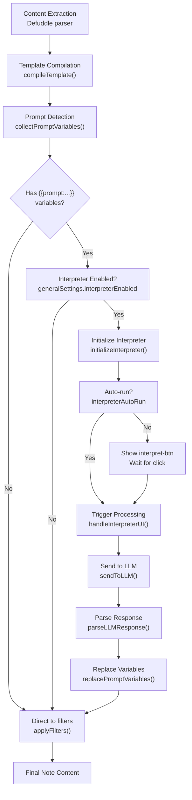
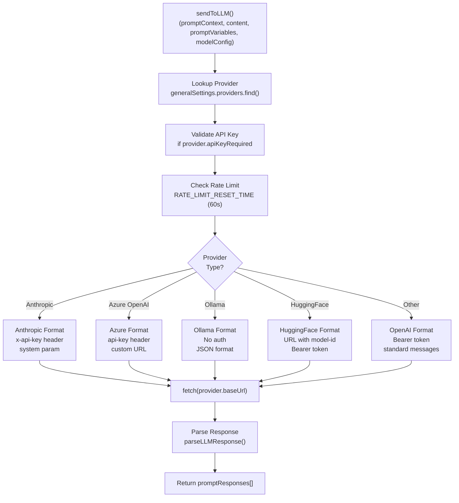

# AI Integration

<details>
<summary>Relevant source files</summary>

The following files were used as context for generating this wiki page:

- [docs/Clip web pages.md](docs/Clip web pages.md)
- [docs/Highlight web pages.md](docs/Highlight web pages.md)
- [docs/Interpret web pages.md](docs/Interpret web pages.md)
- [docs/Introduction to Obsidian Web Clipper.md](docs/Introduction to Obsidian Web Clipper.md)
- [docs/Logic.md](docs/Logic.md)
- [src/managers/interpreter-settings.ts](src/managers/interpreter-settings.ts)
- [src/styles/icons.scss](src/styles/icons.scss)
- [src/utils/charts.ts](src/utils/charts.ts)
- [src/utils/interpreter.ts](src/utils/interpreter.ts)

</details>


The AI Integration system enables LLM-powered content extraction and transformation during the web clipping process. Users can embed prompt variables in templates that trigger AI processing to generate summaries, extract metadata, create tags, or perform custom content transformations. The system supports multiple AI providers including OpenAI, Anthropic, Google Gemini, and local Ollama installations.

The interpreter can run automatically when a template loads or be triggered manually via the interpret button. Responses from the LLM replace prompt variables in the template, flowing through the same filter system as regular variables.

For detailed interpreter mechanics, see [LLM Interpreter](#6.1). For provider and model configuration, see [Provider Configuration](#6.2). For template syntax without AI, see [Variables System](#5.3).

## System Architecture

The AI Integration system integrates into the clipping workflow through the template system. When a template contains prompt variables (e.g., `{{prompt:"Extract key insights"}}`), the interpreter engine sends content to configured LLM providers and replaces the variables with responses.

### Integration with Clipping Pipeline



Sources: [src/utils/interpreter.ts:398-508](), [src/utils/interpreter.ts:510-636](), [src/utils/template-compiler.ts:1-20]()

### Core Components

| Component | File | Purpose |
|-----------|------|---------|
| `interpreterEnabled` setting | [src/managers/interpreter-settings.ts:165-182]() | Master toggle for AI features |
| `collectPromptVariables()` | [src/utils/interpreter.ts:358-396]() | Extracts `{{prompt:...}}` from templates |
| `sendToLLM()` | [src/utils/interpreter.ts:17-231]() | Handles provider-specific API calls |
| `parseLLMResponse()` | [src/utils/interpreter.ts:233-356]() | Parses JSON responses into key-value pairs |
| `replacePromptVariables()` | [src/utils/interpreter.ts:638-675]() | Replaces prompt variables with LLM output |
| `getPresetProviders()` | [src/managers/interpreter-settings.ts:109-163]() | Fetches and caches preset configs from GitHub |

Sources: [src/utils/interpreter.ts:1-675](), [src/managers/interpreter-settings.ts:109-163]()

## Prompt Variables

Prompt variables embed AI processing requests directly into templates. The interpreter collects these variables, sends them to the configured LLM, and replaces them with the responses.

### Prompt Variable Syntax

```
{{prompt:"Extract the main topics"}}
{{"List key points"|join:", "}}
{{prompt:"Generate 5 tags"|lowercase|join:", "}}
```

Prompt variables support the same filter syntax as regular template variables. The LLM response is processed through any specified filters before final insertion via `applyFilters`.

### Collection and Processing

```mermaid
flowchart LR
    A["Template Sources"] --> B["collectPromptVariables()"]
    
    A1["noteContentFormat"] --> A
    A2["properties[].value"] --> A
    A3["Form inputs<br/>(note-name-field)"] --> A
    
    B --> C["Regex Match<br/>/{{(?:prompt:)?\"(.*?)\"(\\|.*?)?}}/g"]
    
    C --> D["Build PromptVariable[]"]
    D --> E["key: prompt_1"]
    D --> F["prompt: extracted text"]
    D --> G["filters: optional"]
    
    D --> H["Send to sendToLLM()"]
    H --> I["Provider API<br/>with prompts_responses JSON"]
    I --> J["replacePromptVariables()<br/>in DOM inputs"]
```

The `collectPromptVariables()` function scans template content, property values, and form inputs to build a deduplicated list of prompts. Each prompt receives a sequential key (`prompt_1`, `prompt_2`, etc.) used to match responses.

Sources: [src/utils/interpreter.ts:358-396](), [src/utils/interpreter.ts:638-675]()

## Provider and Model Configuration

AI Integration requires configuration of providers (API endpoints) and models (specific LLM variants). This configuration is managed through the Settings interface and stored in `generalSettings`.

### Provider Structure

```typescript
export interface PresetProvider {
	id: string;
	name: string;
	baseUrl: string;
	apiKeyUrl?: string;
	apiKeyRequired?: boolean;
	modelsList?: string;
	popularModels?: Array<{
		id: string;
		name: string;
		recommended?: boolean;
	}>;
}
```

Providers are stored in `generalSettings.providers`. The system fetches preset configurations from a remote `PROVIDERS_URL` hosted on GitHub, which includes popular models and API documentation links for 11 providers including Anthropic, OpenAI, and Ollama.

| Provider | apiKeyRequired | Notable Features |
|----------|----------------|------------------|
| OpenAI | true | Standard bearer token auth |
| Anthropic | true | Custom `x-api-key` and `anthropic-version` headers |
| Azure OpenAI | true | Uses `api-key` header |
| Ollama | false | Local deployment, requires `OLLAMA_ORIGINS` config |
| Hugging Face | true | Model-id embedded in `baseUrl` |

### Model Structure

Models are stored in `generalSettings.models`. Users can configure multiple models per provider and toggle them on/off. The `model-select` dropdown in the popup shows only enabled models.

For detailed configuration workflows, see [Provider Configuration](#6.2).

Sources: [src/managers/interpreter-settings.ts:9-21](), [src/managers/interpreter-settings.ts:28-67](), [src/utils/interpreter.ts:21-30]()

## LLM Communication

The `sendToLLM()` function handles API communication with different providers, formatting requests according to each provider's specifications and parsing their responses into a consistent structure.

### Request Flow by Provider Type



The system includes provider-specific request formatting in [src/utils/interpreter.ts:53-154](). Each provider's API format is defined in the conditional blocks that set `requestUrl`, `requestBody`, and `headers` based on `provider.name` or `provider.baseUrl` patterns.

### Response Structure

The system instructs LLMs to respond with a single JSON object named `prompts_responses` containing keys like `prompt_1`. The `parseLLMResponse()` function handles multiple JSON sanitization strategies to account for provider variations, including nested content structures for Anthropic.

For detailed LLM communication mechanics, see [LLM Interpreter](#6.1).

Sources: [src/utils/interpreter.ts:17-231](), [src/utils/interpreter.ts:233-356]()

## Error Handling and Rate Limiting

The system includes comprehensive error handling for API failures, network issues, and response parsing problems.

### Rate Limiting

- 60-second cooldown between requests (`RATE_LIMIT_RESET_TIME`) [src/utils/interpreter.ts:11-12]()
- Request timing tracked in `lastRequestTime` [src/utils/interpreter.ts:12]()
- User-friendly countdown messages for rate limit violations [src/utils/interpreter.ts:33-34]()

### Provider-Specific Error Handling

- **Ollama**: Special handling for 403 errors with instructions to set `OLLAMA_ORIGINS` for browser extension access [src/utils/interpreter.ts:168-174]()
- **API Authentication**: Checks for mandatory API keys based on provider configuration [src/utils/interpreter.ts:27-29]()
- **Response Parsing**: Multiple fallback strategies for malformed JSON responses and nested structures [src/utils/interpreter.ts:182-188]()

Sources: [src/utils/interpreter.ts:11-35](), [src/utils/interpreter.ts:168-174](), [src/utils/interpreter.ts:182-188]()
