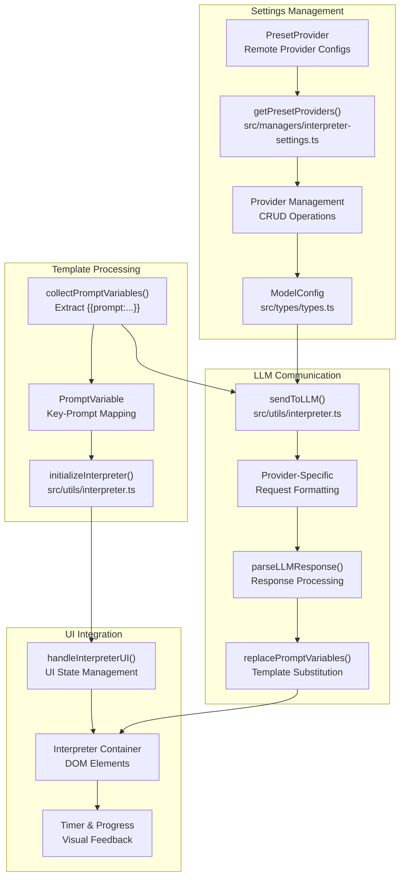
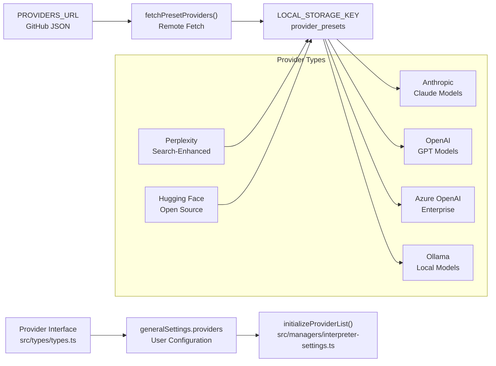
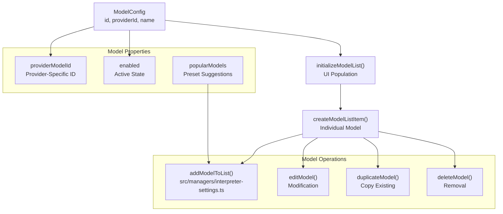
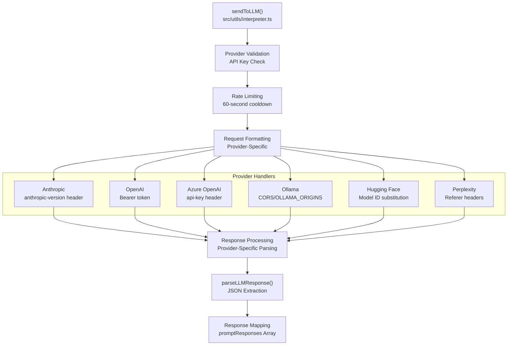
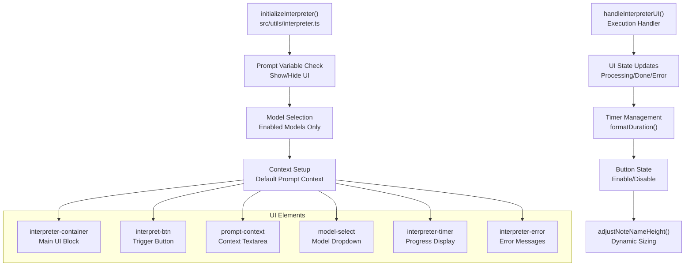

# LLM Interpreter

<details>
<summary>Relevant source files</summary>

The following files were used as context for generating this wiki page:

- [docs/Clip web pages.md](docs/Clip web pages.md)
- [docs/Highlight web pages.md](docs/Highlight web pages.md)
- [docs/Interpret web pages.md](docs/Interpret web pages.md)
- [docs/Introduction to Obsidian Web Clipper.md](docs/Introduction to Obsidian Web Clipper.md)
- [docs/Logic.md](docs/Logic.md)
- [src/managers/interpreter-settings.ts](src/managers/interpreter-settings.ts)
- [src/styles/icons.scss](src/styles/icons.scss)
- [src/utils/charts.ts](src/utils/charts.ts)
- [src/utils/interpreter.ts](src/utils/interpreter.ts)

</details>


The LLM Interpreter is an AI-powered system that allows users to dynamically generate content using Large Language Models (LLMs) within web clipper templates. It processes prompt variables embedded in templates, sends them to configured AI providers, and replaces the variables with generated responses.

For information about configuring LLM providers and models in the settings interface, see [Provider Configuration](#6.2).

## Architecture Overview

The LLM Interpreter consists of several interconnected components that manage provider configuration, prompt processing, and LLM communication:



Sources: [src/managers/interpreter-settings.ts:9-213](), [src/utils/interpreter.ts:1-669](), [src/types/types.ts:1-100]()

## Provider Configuration System

The interpreter supports multiple LLM providers through a flexible configuration system that fetches provider presets from a remote GitHub repository and allows custom configurations:



The system maintains provider presets with version checking and local caching:

| Component | Purpose | Key Functions |
|-----------|---------|---------------|
| `PresetProvider` | Remote provider definitions | `fetchPresetProviders()`, `shouldUpdatePresets()` |
| `Provider` | User-configured providers | `addProviderToList()`, `editProvider()`, `deleteProvider()` |
| Cache Management | Performance optimization | `getLocalPresets()`, 5-minute cache duration |

Sources: [src/managers/interpreter-settings.ts:9-87](), [src/managers/interpreter-settings.ts:109-163](), [src/managers/interpreter-settings.ts:317-365]()

## Model Management

Models are linked to providers and managed through a comprehensive CRUD system in the settings interface. The `ModelConfig` interface defines the relationship between a model and its parent provider.



The model management system includes validation and provider relationship enforcement:

- Models cannot exist without a valid provider [src/utils/interpreter.ts:21-24]().
- Provider deletion is blocked if models depend on it [src/managers/interpreter-settings.ts:450-460]().
- Model selection UI shows only enabled models [src/utils/interpreter.ts:450-465]().
- Popular models from presets provide quick configuration options [src/managers/interpreter-settings.ts:16-20]().

Sources: [src/managers/interpreter-settings.ts:541-950](), [src/utils/interpreter.ts:21-24](), [src/types/types.ts:70-85]()

## Prompt Variable Processing

The interpreter extracts and processes prompt variables from templates using a regex-based system defined in `src/utils/interpreter.ts`.

```mermaid
graph LR
    A["Template Content<br/>{{prompt:\"question\"}}"] --> B["promptRegex<br/>/\{\{(?:prompt:)?\"(.*?)\"(\\|.*?)?\}\}/g"]
    B --> C["collectPromptVariables()<br/>Extract & Map"]
    
    subgraph "Variable Structure"
        D["PromptVariable<br/>key, prompt, filters"]
        E["key: prompt_1<br/>Sequential Numbering"]
        F["prompt: Extracted Text<br/>User Question"]
        G["filters: |filter_name<br/>Optional Processing"]
    end
    
    C --> D
    D --> E
    D --> F
    D --> G
    
    H["Template Sources<br/>noteContentFormat, properties"] --> A
    I["UI Elements<br/>input, textarea values"] --> A
```

The system processes prompts from multiple sources:
- Template `noteContentFormat` [src/utils/interpreter.ts:373-375]().
- Template `properties` values [src/utils/interpreter.ts:377-380]().
- Current form input values [src/utils/interpreter.ts:382-385]().

Each unique prompt receives a sequential key (`prompt_1`, `prompt_2`, etc.) for LLM communication [src/utils/interpreter.ts:387-394]().

Sources: [src/utils/interpreter.ts:358-396]()

## LLM Communication

The `sendToLLM` function handles provider-specific API communication with comprehensive error handling and rate limiting. It constructs requests for 11+ supported providers, including specific handling for local providers like Ollama.



Each provider requires specific request formatting and response parsing:

| Provider | Request Format | Response Path |
|----------|----------------|---------------|
| Anthropic | `system` parameter, `x-api-key` header [src/utils/interpreter.ts:85-102]() | `data.content[0].text` [src/utils/interpreter.ts:195-197]() |
| OpenAI | `messages` array, `Authorization` header [src/utils/interpreter.ts:138-154]() | `data.choices[0].message.content` [src/utils/interpreter.ts:211-213]() |
| Azure OpenAI | `messages` array, `api-key` header [src/utils/interpreter.ts:70-84]() | `data.choices[0].message.content` [src/utils/interpreter.ts:211-213]() |
| Ollama | `format: 'json'`, no auth [src/utils/interpreter.ts:123-136]() | `data.message.content` [src/utils/interpreter.ts:207-209]() |
| Hugging Face | URL template replacement [src/utils/interpreter.ts:53-69]() | `data.choices[0].message.content` [src/utils/interpreter.ts:211-213]() |

Sources: [src/utils/interpreter.ts:17-231](), [docs/Interpret web pages.md:70-82]()

## Response Processing

The system parses LLM responses and handles various JSON formatting challenges using the `parseLLMResponse` function. The system enforces a specific system prompt to ensure the model returns a single JSON object named `prompts_responses` [src/utils/interpreter.ts:37-38]().

```mermaid
graph LR
    A["LLM Response<br/>Raw Text/JSON"] --> B["sanitizeJsonString()<br/>Clean Formatting"]
    B --> C["JSON.parse()<br/>Multiple Strategies"]
    
    subgraph "Parsing Strategies"
        D["Direct Parsing<br/>Clean JSON"]
        E["Regex Extraction<br/>Find JSON Block"]
        F["Manual Reconstruction<br/>Fallback Method"]
    end
    
    C --> D
    C --> E  
    C --> F
    
    G["prompts_responses<br/>Expected Structure"] --> H["Response Mapping<br/>Key-Value Pairs"]
    H --> I["replacePromptVariables()<br/>Template Substitution"]
    
    D --> G
    E --> G
    F --> G
```



The response processing handles multiple edge cases:
- Escaped newlines and quotes [src/utils/interpreter.ts:335-345]().
- Malformed JSON from LLMs using regex fallback [src/utils/interpreter.ts:245-255]().
- Provider-specific response structures [src/utils/interpreter.ts:195-215]().
- Content extraction and sanitization [src/utils/interpreter.ts:335-356]().

Sources: [src/utils/interpreter.ts:233-356]()

## UI Integration

The interpreter integrates with the popup interface through the `initializeInterpreter` function, which manages the lifecycle of LLM requests within the Clipper UI. It can be toggled on/off in settings, which affects the visibility of context and advanced sections [src/managers/interpreter-settings.ts:165-182]().



The UI provides real-time feedback during LLM processing:
- **Processing State**: Shows a timer using `formatDuration` [src/utils/interpreter.ts:575-585]().
- **Error Display**: Detailed error messages for API failures, such as Ollama `OLLAMA_ORIGINS` issues [src/utils/interpreter.ts:169-174]().
- **Dynamic Sizing**: Automatically adjusts textarea heights for generated content using `adjustNoteNameHeight` [src/utils/interpreter.ts:620-625]().

Key UI behaviors:
- **Auto-run Mode**: If configured in settings, the interpreter runs automatically when the popup opens [src/utils/interpreter.ts:480-495]().
- **Timer Management**: Shows elapsed processing time during the request [src/utils/interpreter.ts:570-580]().
- **Form Updates**: Generated content is automatically substituted into the respective form fields [src/utils/interpreter.ts:610-620]().

Sources: [src/utils/interpreter.ts:398-669](), [src/utils/string-utils.ts:1-20](), [src/utils/ui-utils.ts:1-50](), [src/managers/interpreter-settings.ts:165-182]()
