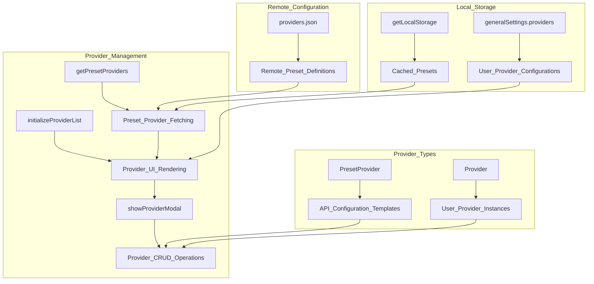
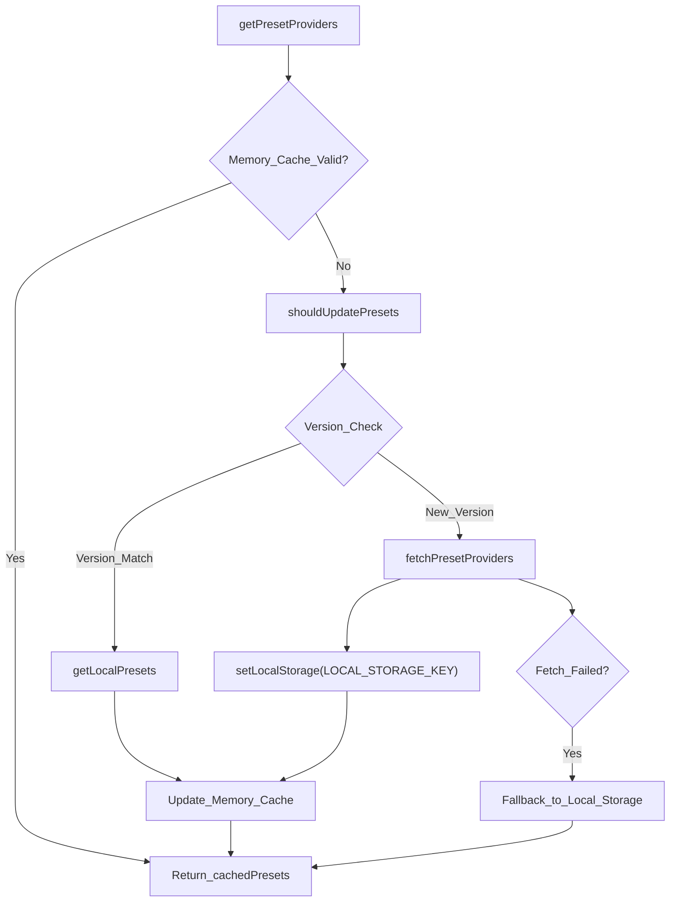
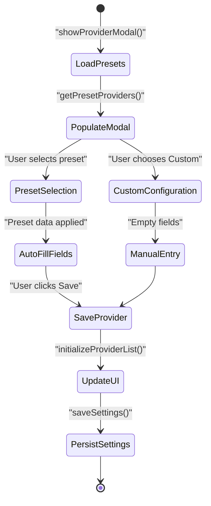
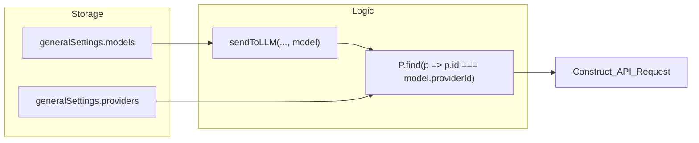

# Provider Configuration

Relevant source files

The following files were used as context for generating this wiki page:

- [providers.json](providers.json)
- [src/managers/interpreter-settings.ts](src/managers/interpreter-settings.ts)
- [src/styles/icons.scss](src/styles/icons.scss)
- [src/utils/charts.ts](src/utils/charts.ts)
- [src/utils/interpreter.ts](src/utils/interpreter.ts)

This document covers the configuration and management of LLM (Large Language Model) providers within the Obsidian Web Clipper's AI integration system. This includes setting up API credentials, managing provider presets, configuring custom providers, and understanding how providers integrate with the interpreter system.

For information about how these configured providers are used in the actual LLM interpretation process, see [LLM Interpreter](#6.1).

## Provider Architecture Overview

The provider configuration system manages external AI service connections through a preset-based architecture with custom provider support.

**Provider Configuration Architecture**

Sources: [src/managers/interpreter-settings.ts:23-163](), [src/managers/interpreter-settings.ts:227-248](), [src/types/types.ts:1-20]()

## Preset Provider System

The system maintains a centralized repository of provider configurations that are fetched from a remote JSON file and cached locally to ensure users always have access to the latest model endpoints and configurations.

### Preset Provider Structure

The `PresetProvider` interface defines the configuration template for each supported provider:

| Field | Type | Description |
|-------|------|-------------|
| `id` | string | Unique provider identifier (e.g., "anthropic") |
| `name` | string | Display name for the provider |
| `baseUrl` | string | API endpoint URL (supports placeholders like `{model-id}`) |
| `apiKeyUrl` | string (optional) | URL for obtaining API keys |
| `apiKeyRequired` | boolean (optional) | Whether API key is required (false for Ollama) |
| `modelsList` | string (optional) | URL to provider's model documentation |
| `popularModels` | Array (optional) | Predefined popular model configurations for quick setup |

**Preset Provider Loading Flow**

Sources: [src/managers/interpreter-settings.ts:9-26](), [src/managers/interpreter-settings.ts:40-163](), [providers.json:1-143]()

### Supported Preset Providers

The system includes 11 preset configurations as of the latest `providers.json` update:

- **Anthropic**: Claude 3.5/4.5 series via `api.anthropic.com`. [providers.json:3-17]()
- **OpenAI**: GPT-4o and GPT-5 series via `api.openai.com`. [providers.json:87-101]()
- **Google Gemini**: Gemini 2.5 Flash/Pro via `generativelanguage.googleapis.com`. [providers.json:42-55]()
- **Ollama**: Local AI via `11434/api/chat`. No API key required. [providers.json:74-86]()
- **Azure OpenAI**: Enterprise deployments via resource-specific endpoints. [providers.json:18-29]()
- **DeepSeek**: DeepSeek Chat and Reasoner models. [providers.json:30-41]()
- **OpenRouter**: Unified API for multiple models. [providers.json:102-113]()
- **Perplexity**: Sonar and reasoning models. [providers.json:114-128]()
- **xAI**: Grok 3/4 series. [providers.json:129-142]()
- **Hugging Face**: Inference API with `{model-id}` replacement. [providers.json:56-62]()
- **Meta**: Llama 3.3 Instruct models. [providers.json:63-73]()

## Provider Management Operations

### Provider Creation and Editing

The `showProviderModal` function handles the lifecycle of provider settings. When a user selects a preset, the modal auto-fills the `baseUrl` and documentation links.

**Provider Modal Workflow**

Sources: [src/managers/interpreter-settings.ts:367-539](), [src/managers/interpreter-settings.ts:227-248]()

### Provider List Management

The provider list is rendered in the settings UI, providing a high-level view of configured services.

- **Icon Rendering**: `initializeIcons` and specific CSS classes like `icon-anthropic` or `icon-ollama` are used to render provider logos. [src/styles/icons.scss:1-17](), [src/managers/interpreter-settings.ts:4]()
- **API Key Status**: The UI displays a warning icon if `apiKeyRequired` is true but no key is provided. [src/managers/interpreter-settings.ts:260-270]()
- **CRUD Operations**: Users can edit existing configurations or delete them, which triggers a cleanup of associated models. [src/managers/interpreter-settings.ts:351-365]()

## API Key Configuration and Security

### API Key Handling

API keys are stored in the browser's sync storage as part of the `Provider` object. The extension uses these keys to construct the `Authorization` header during LLM requests.

| Provider Type | Header Key | Format |
|---------------|------------|--------|
| Standard (OpenAI, DeepSeek) | `Authorization` | `Bearer {apiKey}` |
| Anthropic | `x-api-key` | `{apiKey}` |
| Azure OpenAI | `api-key` | `{apiKey}` |
| Ollama | N/A | No authentication header |

Sources: [src/utils/interpreter.ts:49-154](), [src/managers/interpreter-settings.ts:14-15]()

### Rate Limiting and Cooldowns

The system implements a client-side rate limit to prevent accidental spamming of AI APIs. The `RATE_LIMIT_RESET_TIME` is set to 60,000ms (1 minute). If a request is attempted before this cooldown expires, the `sendToLLM` function throws an error.

Sources: [src/utils/interpreter.ts:11-12](), [src/utils/interpreter.ts:31-35]()

## Model Association

Models are linked to providers through the `providerId`. This allows a single provider configuration (like OpenAI) to power multiple model configurations (like GPT-4o Mini and GPT-4o).

**Provider-Model Data Flow**

Sources: [src/utils/interpreter.ts:20-24](), [src/types/types.ts:10-20]()

## Storage and Persistence

### Data Storage Architecture

The provider configuration uses a multi-layer storage approach to balance performance and freshness.

1. **In-Memory Cache**: `cachedPresets` holds providers during the session. [src/managers/interpreter-settings.ts:33]()
2. **Local Storage**: `LOCAL_STORAGE_KEY` ("provider_presets") stores the fetched `providers.json` for offline access. [src/managers/interpreter-settings.ts:31](), [src/managers/interpreter-settings.ts:49]()
3. **Sync Storage**: `generalSettings.providers` stores the user's specific instances (including API keys) across browser profiles. [src/utils/storage-utils.ts:1-50]()

### Version-Based Updates

The `shouldUpdatePresets` function fetches the remote `providers.json` version and compares it against the local version. If a mismatch is found, the extension automatically refreshes the local cache with new provider definitions.

Sources: [src/managers/interpreter-settings.ts:89-107](), [src/managers/interpreter-settings.ts:129-149]()
