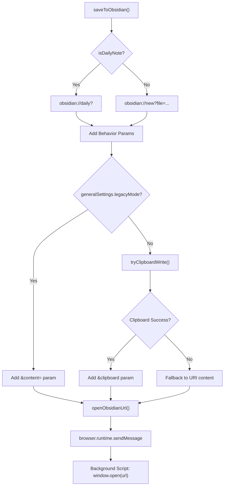
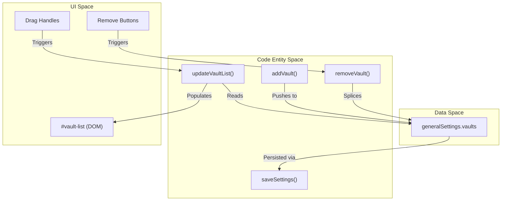
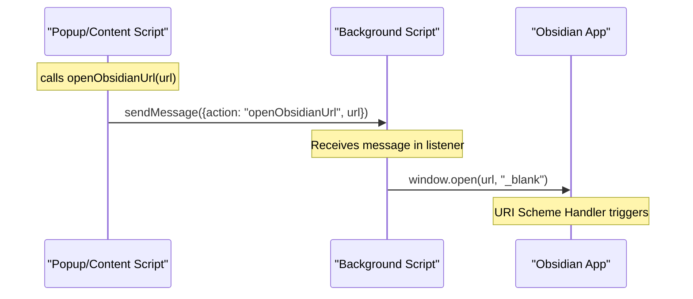

# Obsidian Integration

Relevant source files

The following files were used as context for generating this wiki page:

- [src/managers/general-settings.ts](src/managers/general-settings.ts)
- [src/utils/obsidian-note-creator.ts](src/utils/obsidian-note-creator.ts)
- [src/utils/storage-utils.ts](src/utils/storage-utils.ts)

This document covers how the Obsidian Web Clipper integrates with the Obsidian application to create and manage notes. This includes the note creation pipeline, vault management, URL scheme handling, and various integration modes.

## Integration Methods

The extension provides two primary methods for integrating with Obsidian, with automatic fallback mechanisms to ensure reliable note creation across different environments.

### URL Scheme Integration

The primary integration method uses Obsidian's custom URL schemes to communicate with the application. The `saveToObsidian()` function in `src/utils/obsidian-note-creator.ts` constructs URLs that follow Obsidian's URI specification.

**URL Construction Process**

Sources: [src/utils/obsidian-note-creator.ts:46-94](), [src/utils/obsidian-note-creator.ts:17-25]()

The system builds different URL schemes based on the note behavior defined in the `Template`:

| Behavior | URL Pattern | Parameters |
|----------|-------------|------------|
| Daily Note (`append-daily`, `prepend-daily`) | `obsidian://daily?` | `append=true`, `prepend=true` |
| New Note (`overwrite`, `create`) | `obsidian://new?file={path}` | `overwrite=true`, `append=true`, `prepend=true` |
| Regular | Base URL | `vault`, `silent`, `clipboard`, `content` |

Sources: [src/utils/obsidian-note-creator.ts:55-83]()

### Clipboard Method vs Legacy URI Method

The extension defaults to a modern clipboard-based approach to avoid URL length limitations in browsers and operating systems.

1.  **Clipboard Method (Default):** The `tryClipboardWrite()` function attempts to copy the note content to the system clipboard using `copyToClipboard()`. If successful, it appends `&clipboard` to the Obsidian URI. Obsidian then reads the content directly from the clipboard upon opening. It also includes a fallback error message in the `content` parameter for cases where Obsidian cannot access the clipboard (e.g., certain Linux configurations) [src/utils/obsidian-note-creator.ts:27-35]().
2.  **Legacy URI Method:** If `generalSettings.legacyMode` is enabled, or if the clipboard write fails, the extension encodes the entire note content into the `&content=` URI parameter [src/utils/obsidian-note-creator.ts:38-43](), [src/utils/obsidian-note-creator.ts:85-89]().

Sources: [src/utils/obsidian-note-creator.ts:27-44](), [src/utils/obsidian-note-creator.ts:85-93]()

## Vault Management

The extension maintains a list of configured Obsidian vaults that users can manage through the settings interface. Vault configuration is stored in `generalSettings.vaults`.

### Vault Configuration UI

The `updateVaultList()` function in `src/managers/general-settings.ts` dynamically renders the vault management UI, attaching drag-and-drop listeners for reordering and click listeners for removal.

**Vault Operations**

Sources: [src/managers/general-settings.ts:31-68](), [src/managers/general-settings.ts:70-80](), [src/utils/storage-utils.ts:8-51]()

## Note Creation Pipeline

The note creation pipeline transforms processed content into properly formatted Obsidian notes with frontmatter and appropriate file paths.

### Frontmatter Generation

The `generateFrontmatter()` function in `src/utils/obsidian-note-creator.ts` maps template properties to their configured types before calling the core generation utility. It retrieves property types from `generalSettings.propertyTypes` to ensure correct YAML formatting (e.g., arrays for multitext, booleans for checkboxes) [src/utils/obsidian-note-creator.ts:9-15]().

Sources: [src/utils/obsidian-note-creator.ts:9-15](), [src/utils/storage-utils.ts:24-24]()

### File Path Sanitization

Before sending the file path to Obsidian, the extension performs two critical steps:
1.  **Sanitization:** `sanitizeFileName(noteName)` removes characters that are illegal in file systems or problematic for Obsidian [src/utils/obsidian-note-creator.ts:65-65]().
2.  **Path Formatting:** Ensures the target folder path ends with a trailing slash before appending the formatted filename [src/utils/obsidian-note-creator.ts:60-63]().

## Settings and Configuration

The integration behavior is governed by `generalSettings`, which are loaded and saved via `browser.storage.sync`.

| Setting | Purpose | Implementation |
|---------|---------|----------------|
| `legacyMode` | Forces content into the URI instead of using the clipboard. | `generalSettings.legacyMode` |
| `silentOpen` | Appends `&silent=true` to the URI so Obsidian doesn't steal focus. | `generalSettings.silentOpen` |
| `vaults` | Array of vault names to target in the `&vault=` parameter. | `generalSettings.vaults` |
| `saveBehavior` | Determines if the action button adds to Obsidian, copies, or saves a file. | `generalSettings.saveBehavior` |

Sources: [src/utils/storage-utils.ts:8-51](), [src/utils/obsidian-note-creator.ts:77-83]()

### Background Communication

The extension uses message passing to handle URL opening. This allows the background script to manage the `window.open` call, which is more reliable than opening from a popup that might close immediately.

Sources: [src/utils/obsidian-note-creator.ts:17-25]()
