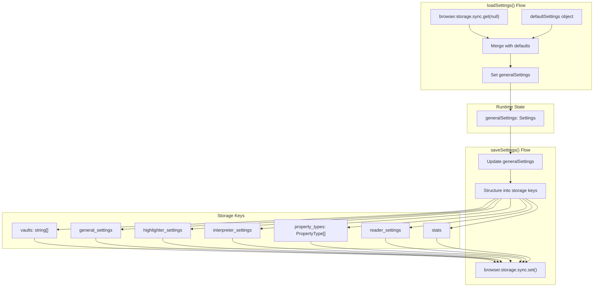
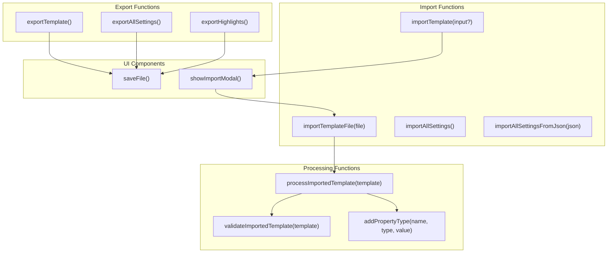
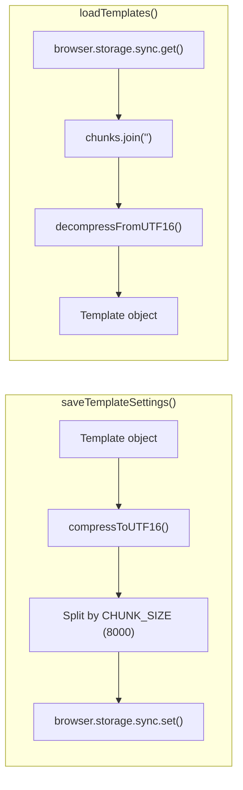

# Data Management

Relevant source files

The following files were used as context for generating this wiki page:

- [src/managers/general-settings.ts](src/managers/general-settings.ts)
- [src/managers/property-types-manager.ts](src/managers/property-types-manager.ts)
- [src/managers/template-ui.ts](src/managers/template-ui.ts)
- [src/utils/import-export.ts](src/utils/import-export.ts)
- [src/utils/import-modal.ts](src/utils/import-modal.ts)
- [src/utils/obsidian-note-creator.ts](src/utils/obsidian-note-creator.ts)
- [src/utils/storage-utils.ts](src/utils/storage-utils.ts)

The Data Management system handles storage, persistence, and synchronization of application data using browser storage APIs. The system manages settings, templates, property types, history, highlights, and usage statistics.

Data is stored in two browser storage contexts: `browser.storage.sync` for cross-device settings and templates, and `browser.storage.local` for device-specific history and highlights.

## Storage Architecture

The extension uses a dual-storage approach with browser storage APIs to handle different types of data based on their characteristics and usage patterns.

### Storage Architecture

```mermaid
graph TB
    subgraph BrowserAPIs["Browser Storage APIs"]
        Sync["browser.storage.sync"]
        Local["browser.storage.local"]
    end
    
    subgraph SyncKeys["Sync Storage Keys"]
        VaultsKey["vaults"]
        GeneralKey["general_settings"]
        HighlighterKey["highlighter_settings"]
        InterpreterKey["interpreter_settings"]
        PropertyKey["property_types"]
        ReaderKey["reader_settings"]
        StatsKey["stats"]
        TemplateListKey["template_list"]
        TemplateChunks["template_{id}[]"]
    end
    
    subgraph LocalKeys["Local Storage Keys"]
        HistoryKey["history"]
        RatingsKey["ratings"]
        HighlightsKey["highlights_{url}"]
    end
    
    subgraph Functions["Storage Functions"]
        LoadSettings["loadSettings()"]
        SaveSettings["saveSettings()"]
        GetLocal["getLocalStorage(key)"]
        SetLocal["setLocalStorage(key, value)"]
        LoadTemplates["loadTemplates()"]
        SaveTemplates["saveTemplateSettings()"]
    end
    
    subgraph Memory["In-Memory State"]
        GeneralSettings["generalSettings: Settings"]
        TemplatesArray["templates: Template[]"]
    end
    
    Sync --> VaultsKey
    Sync --> GeneralKey
    Sync --> HighlighterKey
    Sync --> InterpreterKey
    Sync --> PropertyKey
    Sync --> ReaderKey
    Sync --> StatsKey
    Sync --> TemplateListKey
    Sync --> TemplateChunks
    
    Local --> HistoryKey
    Local --> RatingsKey
    Local --> HighlightsKey
    
    LoadSettings --> Sync
    SaveSettings --> Sync
    GetLocal --> Local
    SetLocal --> Local
    LoadTemplates --> Sync
    SaveTemplates --> Sync
    
    LoadSettings --> GeneralSettings
    LoadTemplates --> TemplatesArray
```

**Sources:** [src/utils/storage-utils.ts:8-51](), [src/utils/storage-utils.ts:115-224](), [src/managers/template-manager.ts:8-69]()

### Storage Keys

The extension stores data in two contexts:

| Storage Type | Keys | Purpose |
|--------------|------|---------|
| `browser.storage.sync` | `vaults`, `general_settings`, `highlighter_settings`, `interpreter_settings`, `property_types`, `reader_settings`, `stats`, `template_list`, `template_{id}` | Cross-device synchronization |
| `browser.storage.local` | `history`, `ratings`, `highlights` | Device-specific data |

The `generalSettings` object [src/utils/storage-utils.ts:8-51]() is loaded from multiple sync storage keys and stored in memory. Templates are stored as compressed chunks in keys prefixed with `template_` [src/managers/template-manager.ts:11-13]().

Highlights are stored in local storage under keys indexed by URL or context [src/managers/highlights-manager.ts:12]().

**Sources:** [src/utils/storage-utils.ts:53-111](), [src/utils/storage-utils.ts:115-224](), [src/managers/template-manager.ts:11-13]()

## Settings Management

The settings system centralizes all user preferences in a single `Settings` object managed through the `storage-utils` module.

### Settings Lifecycle

**Sources:** [src/utils/storage-utils.ts:115-224](), [src/utils/storage-utils.ts:226-265]()

### Settings Structure

The `generalSettings` object is structured in memory and split into separate storage keys when persisted [src/utils/storage-utils.ts:226-265]().

Storage key mapping:

| Memory Property | Storage Key | Type |
|----------------|-------------|------|
| `vaults` | `vaults` | `string[]` |
| `showMoreActionsButton`, `betaFeatures`, `legacyMode`, `silentOpen`, `openBehavior`, `saveBehavior` | `general_settings` | Object |
| `highlighterEnabled`, `alwaysShowHighlights`, `highlightBehavior` | `highlighter_settings` | Object |
| `interpreterModel`, `models`, `providers`, `interpreterEnabled`, `interpreterAutoRun`, `defaultPromptContext` | `interpreter_settings` | Object |
| `propertyTypes` | `property_types` | `PropertyType[]` |
| `readerSettings` | `reader_settings` | `ReaderSettings` |
| `stats` | `stats` | Object |

For details on implementation, see [Storage System](#8.1).

**Sources:** [src/utils/storage-utils.ts:115-224](), [src/utils/storage-utils.ts:226-265]()

## Import/Export System

The import/export system provides comprehensive data portability for templates, settings, and configuration data.

### Import/Export Functions

**Sources:** [src/utils/import-export.ts:23-67](), [src/utils/import-export.ts:69-148](), [src/managers/general-settings.ts:10](), [src/managers/highlights-manager.ts:12]()

### Template Export Format

The `exportTemplate()` function [src/utils/import-export.ts:23-67]() creates JSON with schema version `0.1.0` [src/utils/import-export.ts:15](). Daily note templates (`append-daily`, `prepend-daily`) exclude `noteNameFormat` and `path` fields [src/utils/import-export.ts:33](), [src/utils/import-export.ts:48-52]().

For detailed schema information, see [Import and Export](#8.2).

**Sources:** [src/utils/import-export.ts:23-67](), [src/utils/import-export.ts:150-171]()

## Property Types Management

Property types define the structure and validation rules for template properties, managed through a dedicated system with conflict resolution.

### Property Type Operations

Property types support six data types: `text`, `multitext`, `number`, `checkbox`, `date`, `datetime` [src/managers/property-types-manager.ts:93-99]().

Key operations:

| Function | Behavior |
|----------|----------|
| `ensureTagsProperty()` | Creates or updates `tags` property to type `multitext` [src/managers/property-types-manager.ts:20-27]() |
| `countPropertyUsage()` | Iterates `templates` array to count property usage [src/managers/property-types-manager.ts:72-79]() |
| `addPropertyType()` | Adds to `generalSettings.propertyTypes` or updates existing entries [src/utils/import-export.ts:94]() |

**Sources:** [src/managers/property-types-manager.ts:20-27](), [src/managers/property-types-manager.ts:72-79](), [src/managers/property-types-manager.ts:29-70]()

## Data Compression and Chunking

Large templates are compressed and split into chunks to work within browser storage limits.

### Template Compression

Constants:
- `CHUNK_SIZE = 8000` [src/managers/template-manager.ts:13]()
- `SIZE_WARNING_THRESHOLD = 6000` [src/managers/template-manager.ts:14]()

For details on chunking implementation, see [Storage System](#8.1).

**Sources:** [src/managers/template-manager.ts:11-14](), [src/utils/import-export.ts:12]()

## History and Statistics

The extension tracks user activity and maintains browsing history for analytics.

### History Tracking

The system tracks user interactions through a `stats` object [src/utils/storage-utils.ts:42-47](). History entries and ratings are stored in `browser.storage.local` to keep sync storage lightweight [src/utils/storage-utils.ts:53-59](). Usage statistics are incremented via `incrementStat` to monitor clipping activity [src/utils/storage-utils.ts:5]().

**Sources:** [src/utils/storage-utils.ts:42-51](), [src/utils/storage-utils.ts:102-109](), [src/managers/general-settings.ts:179-181]()
