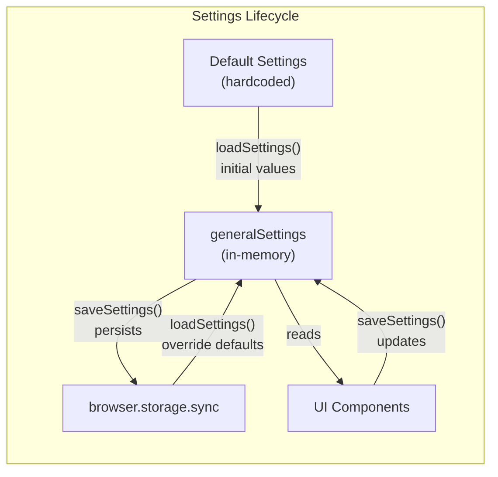

# Storage System

<details>
<summary>Relevant source files</summary>

The following files were used as context for generating this wiki page:

- [src/managers/general-settings.ts](src/managers/general-settings.ts)
- [src/managers/inspect-variables.ts](src/managers/inspect-variables.ts)
- [src/styles/inspect-variables.scss](src/styles/inspect-variables.scss)
- [src/utils/clipboard-utils.ts](src/utils/clipboard-utils.ts)
- [src/utils/debug.ts](src/utils/debug.ts)
- [src/utils/obsidian-note-creator.ts](src/utils/obsidian-note-creator.ts)
- [src/utils/storage-utils.ts](src/utils/storage-utils.ts)
- [tsconfig.json](tsconfig.json)

</details>


The Storage System manages all persistent data in the Obsidian Web Clipper, including user settings, templates, history, and highlights. It implements a dual-tier storage architecture using the browser's sync and local storage APIs, with support for cross-device synchronization, compression, caching, and schema migration.

For template-specific import/export functionality, see [Import and Export](#8.2). For template storage and management, see [Template System](#5.1).

## Architecture Overview

The storage system is built around a single source of truth (`generalSettings`) defined in [src/utils/storage-utils.ts:8-51](). This object synchronizes with browser storage, separating settings that should sync across devices from device-specific data.

**Storage Architecture**

```mermaid
graph TB
    subgraph "In-Memory State"
        generalSettings["generalSettings<br/>(Settings object)"]
        templates["templates array<br/>(Template[])"]
    end
    
    subgraph "browser.storage.sync"
        vaults["vaults: string[]"]
        general["general_settings"]
        highlighter["highlighter_settings"]
        interpreter["interpreter_settings"]
        properties["property_types"]
        reader["reader_settings"]
        stats["stats"]
        templateList["template_list"]
        templateChunks["template_{id}<br/>(LZ-compressed)"]
    end
    
    subgraph "browser.storage.local"
        history["history<br/>(HistoryEntry[])"]
        ratings["ratings<br/>(Rating[])"]
        highlightsURL["highlights"]
        debugMode["debugMode"]
    end
    
    subgraph "Core Functions"
        loadSettings["loadSettings()"]
        saveSettings["saveSettings()"]
        setLocalStorage["setLocalStorage()"]
        getLocalStorage["getLocalStorage()"]
        incrementStat["incrementStat()"]
        addHistoryEntry["addHistoryEntry()"]
    end
    
    loadSettings -->|reads| general
    loadSettings -->|reads| vaults
    loadSettings -->|reads| highlighter
    loadSettings -->|reads| interpreter
    loadSettings -->|reads| properties
    loadSettings -->|reads| reader
    loadSettings -->|reads| stats
    loadSettings -->|populates| generalSettings
    
    saveSettings -->|writes| general
    saveSettings -->|writes| vaults
    saveSettings -->|writes| highlighter
    saveSettings -->|writes| interpreter
    saveSettings -->|writes| properties
    saveSettings -->|writes| reader
    saveSettings -->|writes| stats
    generalSettings -->|source| saveSettings
    
    setLocalStorage -->|writes| history
    setLocalStorage -->|writes| ratings
    getLocalStorage -->|reads| history
    getLocalStorage -->|reads| ratings
    
    incrementStat -->|updates| stats
    incrementStat -->|calls| addHistoryEntry
    addHistoryEntry -->|writes| history
```

Sources: [src/utils/storage-utils.ts:8-303](), [src/utils/debug.ts:8-15]()

## Storage Tiers

### Sync Storage (Cross-Device)

Sync storage contains settings and configuration that should be synchronized across all devices where the user is logged in. Storage is managed through `browser.storage.sync`.

| Storage Key | Type | Purpose | File Reference |
|------------|------|---------|----------------|
| `vaults` | `string[]` | List of Obsidian vault names | [src/utils/storage-utils.ts:70]() |
| `general_settings` | Object | Core extension settings (e.g., `legacyMode`, `silentOpen`) | [src/utils/storage-utils.ts:62-69]() |
| `highlighter_settings` | Object | Highlighter configuration | [src/utils/storage-utils.ts:71-75]() |
| `interpreter_settings` | Object | AI provider and model configs | [src/utils/storage-utils.ts:93-100]() |
| `property_types` | `PropertyType[]` | Custom property definitions | [src/utils/storage-utils.ts:101]() |
| `reader_settings` | Object | Reader mode preferences | [src/utils/storage-utils.ts:76-92]() |
| `stats` | Object | Usage statistics counters | [src/utils/storage-utils.ts:102-107]() |
| `migrationVersion` | number | Schema version tracker | [src/utils/storage-utils.ts:110]() |

The `general_settings` object contains core behavior flags like `legacyMode` (using URI instead of clipboard) and `silentOpen` (suppressing Obsidian focus) which are utilized in the note creation process [src/utils/obsidian-note-creator.ts:81-85]().

Sources: [src/utils/storage-utils.ts:51-111](), [src/utils/obsidian-note-creator.ts:79-88]()

### Local Storage (Device-Specific)

Local storage contains data that should remain on the current device, accessed through `browser.storage.local`.

| Storage Key | Type | Purpose | Max Entries |
|------------|------|---------|-------------|
| `history` | `HistoryEntry[]` | Clip history records | 1000 |
| `ratings` | `Rating[]` | User feedback ratings | - |
| `debugMode` | boolean | Toggle for developer logging | - |

The `history` array stores clip events with a specific structure defined in the `HistoryEntry` type. History is automatically trimmed to the last 1000 entries when new clips are added via `addHistoryEntry` [src/utils/storage-utils.ts:249-277]().

Sources: [src/utils/storage-utils.ts:108-109](), [src/utils/storage-utils.ts:249-277](), [src/utils/debug.ts:8-15]()

## Settings Management

### The Settings Object

The `generalSettings` object serves as the single source of truth for all extension configuration. It is initialized with defaults [src/utils/storage-utils.ts:8-51]() and updated from storage on load.

**Settings Flow**

Sources: [src/utils/storage-utils.ts:8-41](), [src/utils/storage-utils.ts:115-210]()

### Loading and Sanitization

The `loadSettings()` function retrieves data from `browser.storage.sync.get(null)` and performs strict sanitization to prevent corruption from malformed data [src/utils/storage-utils.ts:115-178]():

```typescript
// Example sanitization for vaults and models in src/utils/storage-utils.ts
const sanitizedVaults = Array.isArray(data.vaults) ? data.vaults.filter(v => typeof v === 'string') : [];
const sanitizedModels = Array.isArray(data.interpreter_settings?.models) 
    ? data.interpreter_settings.models.filter(m => m && typeof m === 'object' && typeof m.id === 'string') 
    : [];
```
Sources: [src/utils/storage-utils.ts:171-177]()

## History and Statistics

### Statistics Tracking

The `stats` object tracks usage metrics for different clip actions (e.g., `addToObsidian`, `saveFile`). The `incrementStat()` function atomically updates counters and triggers history recording if a URL is provided [src/utils/storage-utils.ts:232-247]().

```typescript
export async function incrementStat(
	action: keyof Settings['stats'],
	vault?: string,
	path?: string,
	url?: string,
	title?: string
): Promise<void>
```
Sources: [src/utils/storage-utils.ts:232-247]()

### History Management

History entries are stored in `browser.storage.local` and retrieved via `getClipHistory()` for usage charts and rating logic [src/utils/storage-utils.ts:279-282](). In the settings UI, history length is checked to determine if a rating request should be displayed to the user [src/managers/general-settings.ts:179-183]().

Sources: [src/utils/storage-utils.ts:249-282](), [src/managers/general-settings.ts:178-183]()

## Migration System

The storage system includes a migration version tracker (`CURRENT_MIGRATION_VERSION = 1`) to handle schema evolution. During `loadSettings()`, the function checks the stored `migrationVersion`. If it is missing or outdated, it updates the version to ensure the data structure remains consistent with the current codebase [src/utils/storage-utils.ts:165-168]().

Sources: [src/utils/storage-utils.ts:113](), [src/utils/storage-utils.ts:165-168]()

## Integration with Other Systems

### Obsidian Note Creator
The note creator relies on `generalSettings` to determine:
- **Communication Method**: Whether to use the legacy URI method or the clipboard-based method [src/utils/obsidian-note-creator.ts:85-93]().
- **Silent Mode**: Whether to add the `&silent=true` parameter to the Obsidian URI [src/utils/obsidian-note-creator.ts:81-83]().
- **Property Types**: Mapping types for frontmatter generation by looking up the `propertyTypes` array [src/utils/obsidian-note-creator.ts:11-13]().

### Vault Management
Vaults are managed via `addVault` and `removeVault` functions in `src/managers/general-settings.ts`, which update the `generalSettings.vaults` array and call `saveSettings()` to persist changes to sync storage [src/managers/general-settings.ts:70-80]().

Sources: [src/utils/obsidian-note-creator.ts:11-13](), [src/utils/obsidian-note-creator.ts:81-93](), [src/managers/general-settings.ts:70-80]()
