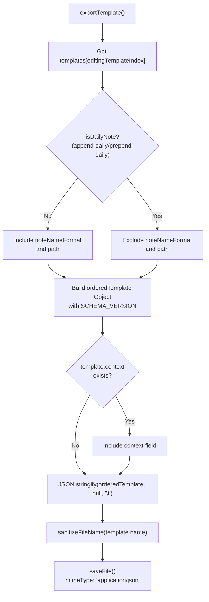
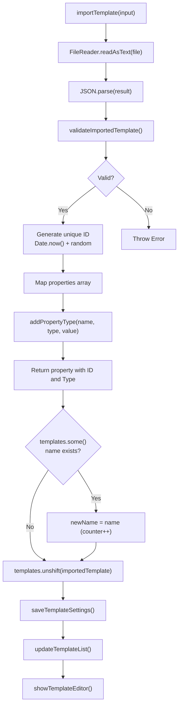
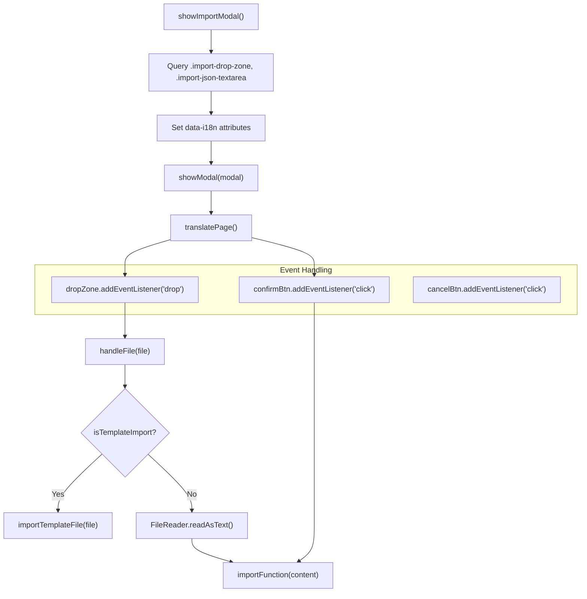

# Import and Export

Relevant source files

The following files were used as context for generating this wiki page:

- [src/managers/property-types-manager.ts](src/managers/property-types-manager.ts)
- [src/managers/template-ui.ts](src/managers/template-ui.ts)
- [src/utils/import-export.ts](src/utils/import-export.ts)
- [src/utils/import-modal.ts](src/utils/import-modal.ts)

## Purpose and Scope

This document describes the import and export functionality in the Obsidian Web Clipper, which enables users to share, backup, and restore configuration data. The system supports exporting and importing individual templates, full settings backups, property type definitions, and highlight collections.

For information about template structure and management, see [Template System](#5.1). For details about storage mechanisms, see [Storage System](#8.1).

## Overview

The Web Clipper provides four distinct import/export capabilities:

| Feature | Scope | File Format | Compression |
|---------|-------|-------------|-------------|
| Template Export/Import | Single template | JSON | No |
| Full Settings Export/Import | All extension data | JSON | During storage only |
| Property Types Export/Import | Property type definitions | JSON (types.json) | No |
| Highlights Export | All page highlights | JSON | No |

Sources: [src/utils/import-export.ts:15-15](), [src/utils/import-export.ts:18-21]()

## Template Import and Export

### Export Flow

Templates can be exported individually to JSON files for sharing or backup. The export process sanitizes the template name for use as a filename and includes only relevant fields based on the template's behavior.

**Diagram: Template Export Process**

The `exportTemplate()` function constructs an ordered template object that includes a `schemaVersion` (currently `0.1.0`) for compatibility checking [src/utils/import-export.ts:15-15](). It maps properties and ensures their types are correctly identified from `generalSettings.propertyTypes` [src/utils/import-export.ts:40-44]().

Sources: [src/utils/import-export.ts:23-67](), [src/utils/import-export.ts:15-15]()

### Import Flow

Templates can be imported from JSON files or pasted JSON text. The import process validates the template structure, handles property type registration, and ensures unique template names.

**Diagram: Template Import Process**

Sources: [src/utils/import-export.ts:69-148](), [src/utils/import-export.ts:191-238]()

### Validation

The `validateImportedTemplate()` function ensures imported templates meet required structural constraints:

- **Required fields**: `name`, `behavior`, `properties`, `noteContentFormat` [src/utils/import-export.ts:151-151]().
- **Conditional fields**: `noteNameFormat` and `path` are required unless behavior is a daily note type (`append-daily` or `prepend-daily`) [src/utils/import-export.ts:154-154](), [src/utils/import-export.ts:165-165]().
- **Property validation**: Each property must have `name` and `value`; `type` must be one of: `text`, `multitext`, `number`, `checkbox`, `date`, `datetime` [src/utils/import-export.ts:152-162]().
- **Optional fields**: `context` is validated as a string if present [src/utils/import-export.ts:168-168]().

Sources: [src/utils/import-export.ts:150-171]()

## Full Settings Import and Export

### Export All Settings

The `exportAllSettings()` function creates a complete backup of all extension data stored in `browser.storage.sync`. This includes templates, settings, providers, models, and property types.

Before export, the system decompresses all template data to create human-readable JSON. Templates are stored compressed in sync storage to work within browser limits, but exported files contain uncompressed data for portability.

Sources: [src/utils/import-export.ts:328-372](), [src/managers/template-manager.ts:34-35]()

### Import All Settings

The `importAllSettingsFromJson()` function restores a complete settings backup. It reverses the export process by compressing templates before storage.

The import process handles both compressed and uncompressed template data. If templates in the import file are already compressed (detected as an array of strings), they are used as-is. Otherwise, templates are compressed into chunks (using `compressToUTF16`) before storage via `browser.storage.sync.set()` [src/utils/import-export.ts:374-433]().

Sources: [src/utils/import-export.ts:374-433](), [src/managers/template-manager.ts:13-14]()

## Property Types Import and Export

Property types can be independently imported and exported using a specialized `types.json` format. This is managed by the `property-types-manager.ts`.

### Export Format

The `exportTypesJson()` function creates a JSON object where the key is the property name and the value is the property type [src/managers/property-types-manager.ts:272-287]().

### Import and Merging

The `importTypesFromJson()` function parses the `types.json` format and merges new types with existing ones using `mergePropertyTypes()` [src/managers/property-types-manager.ts:205-226](). The manager ensures the `tags` property is always present as a `multitext` type [src/managers/property-types-manager.ts:20-27]().

Sources: [src/managers/property-types-manager.ts:20-27](), [src/managers/property-types-manager.ts:205-259](), [src/managers/property-types-manager.ts:272-287]()

## Import Modal System

The `showImportModal()` function in `src/utils/import-modal.ts` provides a reusable modal interface for all import operations, supporting both drag-and-drop and manual JSON pasting.

**Diagram: Import Modal Flow**

Sources: [src/utils/import-modal.ts:5-168]()

## Highlights Export

The highlights export system creates a JSON export of all saved highlights across all URLs from `browser.storage.local`. The export uses `dayjs` for timestamp formatting and supports the native `navigator.share` API on Safari/Mobile Safari.

Sources: [src/managers/highlights-manager.ts:7-57]()

## File Utilities

All export operations use the shared `saveFile()` utility function, which handles creating Blobs and triggering downloads [src/utils/file-utils.ts:1-10](). The `sanitizeFileName()` function in `src/utils/string-utils.ts` ensures exported filenames are safe for all operating systems [src/utils/import-export.ts:4-4](), [src/utils/import-export.ts:30-31]().

Sources: [src/utils/import-export.ts:4-4](), [src/utils/import-export.ts:30-31](), [src/utils/file-utils.ts:1-10]()
