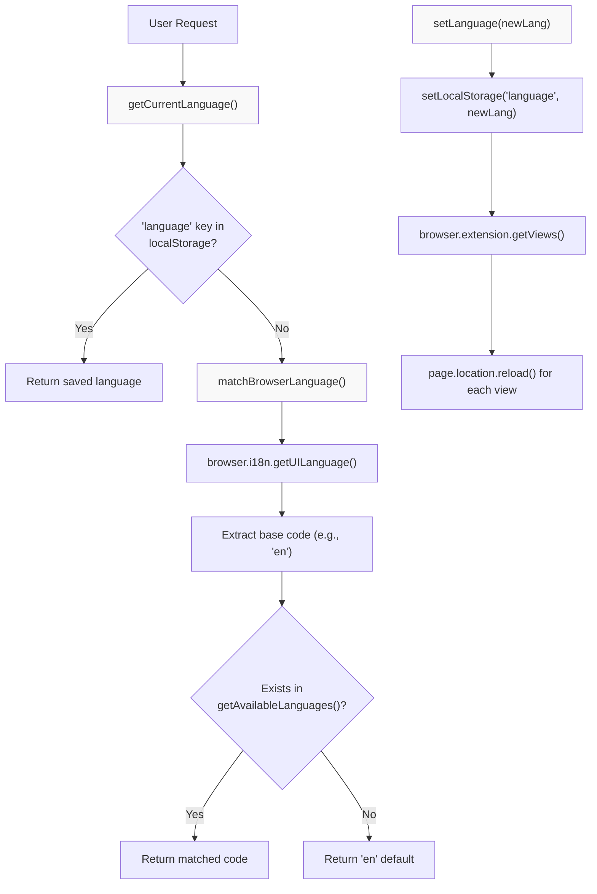
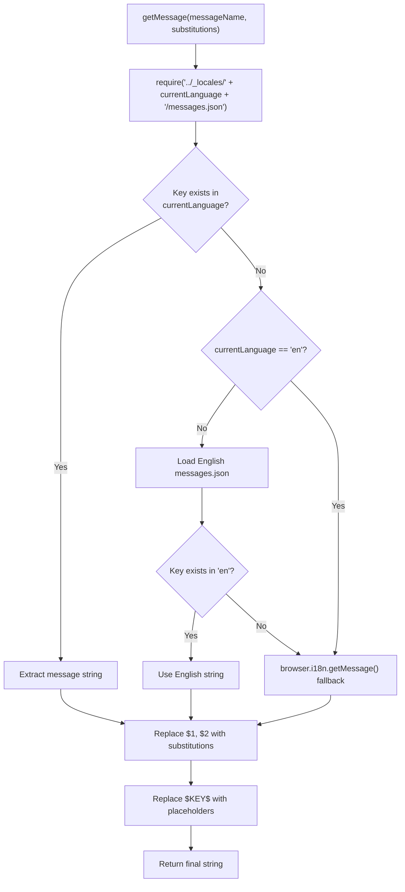
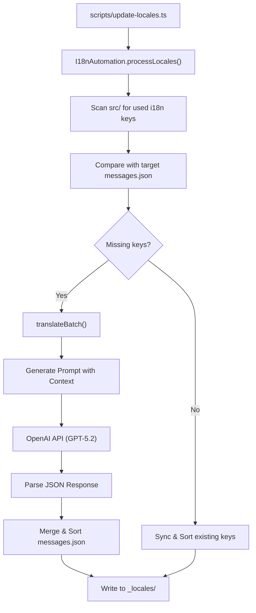

# Internationalization

Relevant source files

The following files were used as context for generating this wiki page:

- [scripts/add-locale.ts](scripts/add-locale.ts)
- [scripts/tsconfig.json](scripts/tsconfig.json)
- [scripts/update-locales.ts](scripts/update-locales.ts)
- [src/_locales/en/messages.json](src/_locales/en/messages.json)
- [src/_locales/es/messages.json](src/_locales/es/messages.json)
- [src/_locales/fa/messages.json](src/_locales/fa/messages.json)
- [src/_locales/fi/messages.json](src/_locales/fi/messages.json)
- [src/_locales/hu/messages.json](src/_locales/hu/messages.json)
- [src/_locales/km/messages.json](src/_locales/km/messages.json)
- [src/_locales/pt/messages.json](src/_locales/pt/messages.json)
- [src/_locales/sk/messages.json](src/_locales/sk/messages.json)
- [src/styles/rtl.scss](src/styles/rtl.scss)
- [src/utils/active-tab-manager.test.ts](src/utils/active-tab-manager.test.ts)
- [src/utils/active-tab-manager.ts](src/utils/active-tab-manager.ts)
- [src/utils/i18n-automation.ts](src/utils/i18n-automation.ts)
- [src/utils/i18n.ts](src/utils/i18n.ts)

The Obsidian Web Clipper's internationalization (i18n) system provides comprehensive multi-language support across 35+ languages, including right-to-left (RTL) script support, automated translation workflows, and dynamic locale switching.

This document covers the language detection, message translation hierarchy, RTL support, and development automation systems.

## Language Management System

The core language management is handled through the `getAvailableLanguages`, `getCurrentLanguage`, and `setLanguage` functions in [src/utils/i18n.ts:69-126](). The system supports 35+ languages with automatic browser language detection and persistent user preferences.

### Language Detection and Selection

The system determines which language to display based on a hierarchy: user preference (stored in local storage), browser UI language, and finally a fallback to English.

**Language Selection and Update Flow**

Sources: [src/utils/i18n.ts:111-142](), [src/utils/i18n.ts:119-126]()

The system maintains a static list of supported languages through `getAvailableLanguages()`, which returns language objects with ISO codes and native names [src/utils/i18n.ts:69-109](). Language persistence is handled via `setLocalStorage`, with a full reload of all extension views (popup, settings, etc.) to ensure the new locale is applied immediately [src/utils/i18n.ts:119-126]().

### Supported Languages

The extension supports a wide array of languages, including specialized regional variants and RTL scripts:

| Category | Languages |
|--------|-----------|
| **European** | German, French, Italian, Spanish, Portuguese (PT/BR), Dutch, Swedish, Norwegian (nb), Danish, Finnish, Polish, Czech, Romanian, Hungarian, Slovak, Greek, Catalan |
| **Asian** | Chinese (Simplified/Traditional), Japanese, Korean, Hindi, Thai, Vietnamese, Indonesian, Tagalog (tl-ph), Khmer, Bengali |
| **Middle Eastern (RTL)** | Arabic, Persian, Hebrew |
| **Others** | Russian, Ukrainian, Turkish |

Sources: [src/utils/i18n.ts:69-108](), [src/utils/i18n.ts:40-54]()

## Translation System

### Message Loading and Fallback

The `getMessage` function serves as the primary interface for retrieving localized strings. It implements a hierarchy that prefers the user's selected language but falls back to English if a specific key is missing in the target locale.

**Message Lookup Logic**

Sources: [src/utils/i18n.ts:150-207]()

Messages are stored in standard Web Extension format within `src/_locales/`. The `getMessage` implementation manually handles variable substitution for `$1`, `$2`, etc., and named placeholders defined in the `placeholders` object of a message entry [src/utils/i18n.ts:186-202]().

### Page Translation

The `translatePage` function scans the DOM for elements requiring localization. It uses `data-i18n` attributes to identify keys and `DOMPurify` to ensure safe insertion of translated content.

**DOM Localization Process**
| Attribute | Target | Implementation |
|-----------|--------|----------------|
| `data-i18n` | Text/HTML Content | `element.innerHTML = DOMPurify.sanitize(translation)` [src/utils/i18n.ts:221]() |
| `data-i18n` | Input Placeholders | `element.placeholder = translation` (for Input/TextArea) [src/utils/i18n.ts:218]() |
| `data-i18n-title` | Tooltips | `element.setAttribute('title', translation)` [src/utils/i18n.ts:230]() |

Sources: [src/utils/i18n.ts:209-233]()

## RTL Language Support

The system provides comprehensive right-to-left (RTL) support for languages like Arabic (`ar`), Hebrew (`he`), and Persian (`fa`).

### Direction Detection and Styling

The `setupLanguageAndDirection` function determines if the current locale is RTL and updates the document root accordingly.

1.  **Detection**: Checks if the language code is in the `RTL_LANGUAGES` array [src/utils/i18n.ts:235-237]().
2.  **Attributes**: Sets `dir="rtl"` and `lang="{code}"` on `document.documentElement` [src/utils/i18n.ts:278-282]().
3.  **CSS Class**: Adds the `.mod-rtl` class to the document root [src/utils/i18n.ts:277]().

### RTL Stylesheets
The `.mod-rtl` class triggers specific layout overrides in `src/styles/rtl.scss`:
*   **Icon Mirroring**: SVGs (except specific icons like checkmarks) are flipped using `transform: scale(-1, 1)` [src/styles/rtl.scss:5-11]().
*   **Input Alignment**: Textareas and inputs use `unicode-bidi: plaintext` to handle mixed-direction content [src/styles/rtl.scss:22-25]().
*   **UI Positioning**: Absolute positions for menus and search icons are swapped (e.g., `left: 0; right: auto;`) [src/styles/rtl.scss:13-21]().

Sources: [src/utils/i18n.ts:265-283](), [src/styles/rtl.scss:1-26]()

## Translation Automation System

To maintain dozens of languages, the project uses an AI-powered automation system built around the `I18nAutomation` class, which integrates with OpenAI APIs.

### Automated Workflow

The automation system uses GPT models to generate translations while preserving technical syntax and placeholders.

**AI Translation Pipeline**

Sources: [src/utils/i18n-automation.ts:125-186](), [scripts/update-locales.ts:11-25]()

### Contextual Translation
The system improves AI accuracy by providing context based on the key name via `getMessageContext` [src/utils/i18n-automation.ts:188-196](). For example, keys containing "button" are flagged as "button label" to ensure the AI uses concise, actionable language [src/utils/i18n-automation.ts:190]().

### Development Scripts
*   **`npm run add-locale {code}`**: Executes `scripts/add-locale.ts`. It updates the `i18n.ts` language array, creates the directory structure, and triggers the AI translation for the new language [scripts/add-locale.ts:76-157]().
*   **`npm run update-locales`**: Executes `scripts/update-locales.ts`. It synchronizes all existing `messages.json` files with the primary English source, translating any newly added keys [scripts/update-locales.ts:11-25]().

Sources: [scripts/add-locale.ts:1-168](), [scripts/update-locales.ts:1-27](), [src/utils/i18n-automation.ts:17-30]()
