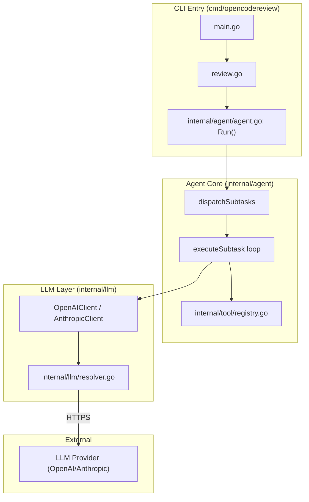
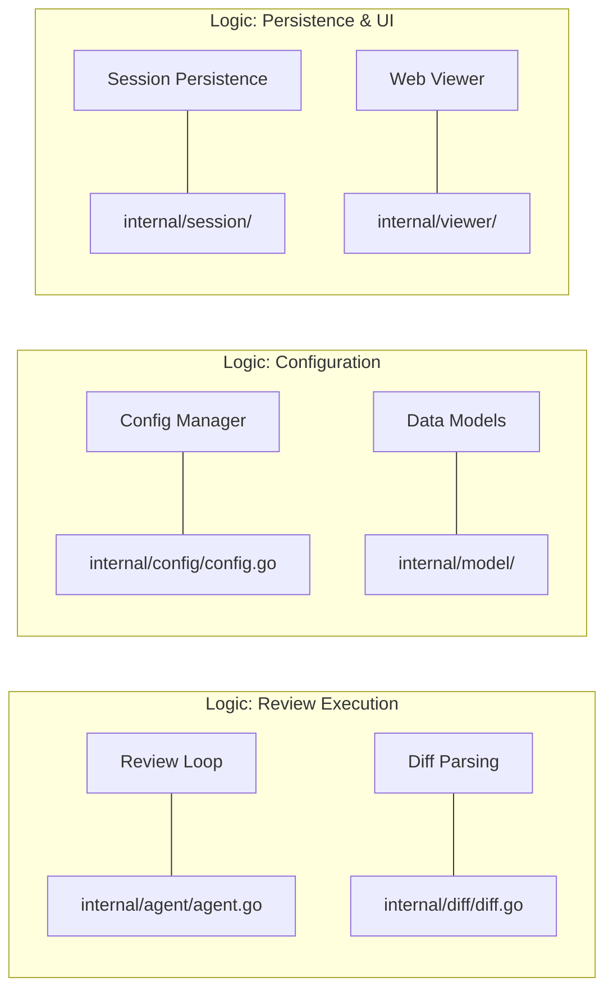

# OpenCodeReview Overview

Relevant source files

The following files were used as context for generating this wiki page:

- [CONTRIBUTING.md](CONTRIBUTING.md)
- [CONTRIBUTING.zh-CN.md](CONTRIBUTING.zh-CN.md)
- [README.md](README.md)
- [README.zh-CN.md](README.zh-CN.md)
- [package.json](package.json)

OpenCodeReview (OCR) is an AI-powered code review CLI designed to provide deep, context-aware analysis of Git diffs. Originally developed as an internal tool at Alibaba Group, it has been refined to handle large-scale codebases by combining deterministic engineering with a tool-augmented agent [README.md:18-24]().

## What is OpenCodeReview?

OCR bridges the gap between raw Git diffs and meaningful architectural feedback. It functions as a virtual senior developer that:
*   **Reads beyond the diff**: Uses tools to fetch full file contents and search the codebase for cross-references [README.md:22-23]().
*   **Operates Autonomously**: Executes a multi-phase review pipeline using a Large Language Model (LLM) as the reasoning engine [README.md:40-42]().
*   **Deterministic Engineering**: Uses hard constraints for file selection, bundling, and rule matching to ensure stability and coverage [README.md:42-50]().

For installation and initial setup instructions, see **[Getting Started](#1.1)**.

## High-Level Architecture

The system is built around a concurrent Agent model. When a review is triggered via `ocr review`, the system identifies changed files and dispatches them to a worker pool.

### The Review Pipeline
The agent follows a structured workflow:
1.  **Plan Phase**: For significant changes, the agent performs an initial risk analysis to identify architectural concerns [README.md:49-50]().
2.  **Main Task Loop**: The agent iterates through changed files, utilizing tools like `file_read` or `code_search` to gather context. It submits feedback via the `code_comment` tool [README.md:56-57]().
3.  **Memory Compression**: To handle large contexts, the agent manages its conversation history using a three-zone partitioning strategy (Frozen, Compress, and Active zones).

### Code Entity Relationship Diagram
This diagram illustrates how the CLI commands trigger the core agent logic and interact with the LLM providers.

**Sources:** [README.md:111-127](), [CONTRIBUTING.md:111-126]().

## Key Concepts

### Tool-Use Agent
The LLM is not just a text generator; it is an agent equipped with a purpose-built toolset distilled from large-scale production data [README.md:56-57]().

| Tool | Purpose |
| :--- | :--- |
| `code_search` | Executes regex or text searches across the repository. |
| `file_read` | Reads specific line ranges of any file in the repo. |
| `file_read_diff` | Inspects the diffs of other files involved in the current change. |
| `code_comment` | Submits a structured review comment with line-level precision [README.md:22-23](). |

### System Review Rules
OCR uses a rule engine that matches files to specific review checklists based on characteristics. This keeps the model's attention focused and eliminates information noise [README.md:48-49]().

### Code-to-Logic Mapping
The following diagram maps internal system names to their corresponding code entities to help navigate the repository.

**Sources:** [CONTRIBUTING.md:111-126](), [README.md:40-57]().

## Major Subsections

Detailed documentation is split into the following child pages:

*   **[Getting Started](#1.1)**: Covers installation via NPM, GitHub Release, or source [README.md:62-107](), and the essential LLM connectivity configuration using `ocr config` [README.md:111-132]().
*   **[CLI Command Reference](#1.2)**: A complete guide to all `ocr` sub-commands, including `review`, `config`, `llm`, `rules`, and the `viewer` [README.md:222-231]().

For developers looking to contribute, please refer to the [CONTRIBUTING.md:1-219]() guide.
