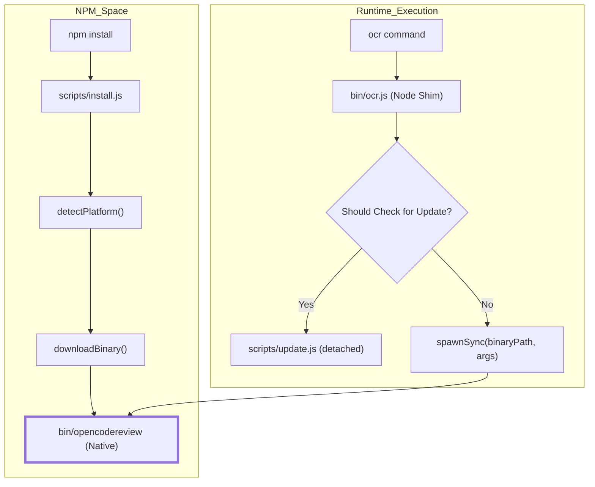
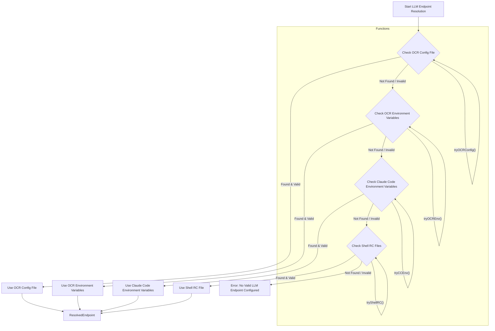

# Getting Started

<details>
<summary>Relevant source files</summary>

The following files were used as context for generating this wiki page:

- [.github/workflows/release.yml](.github/workflows/release.yml)
- [CONTRIBUTING.md](CONTRIBUTING.md)
- [CONTRIBUTING.zh-CN.md](CONTRIBUTING.zh-CN.md)
- [bin/ocr.js](bin/ocr.js)
- [cmd/opencodereview/config_cmd.go](cmd/opencodereview/config_cmd.go)
- [cmd/opencodereview/llm_cmd.go](cmd/opencodereview/llm_cmd.go)
- [internal/llm/resolver.go](internal/llm/resolver.go)
- [internal/llm/resolver_test.go](internal/llm/resolver_test.go)
- [internal/telemetry/config.go](internal/telemetry/config.go)
- [package.json](package.json)
- [scripts/install.js](scripts/install.js)
- [scripts/update.js](scripts/update.js)

</details>


This page provides technical details on installing OpenCodeReview (OCR), configuring the Large Language Model (LLM) backend, and executing your first automated code review.

## Installation Overview

OpenCodeReview is distributed primarily as an npm package that wraps a high-performance Go binary. The installation process involves a Node.js shim that detects the host platform and downloads the appropriate compiled executable.

### npm Installation
When running `npm install -g @alibaba/open-code-review`, the following sequence occurs:
1. **Post-install Script**: The `package.json` defines a `postinstall` hook that executes `scripts/install.js` [package.json:9-9]().
2. **Platform Detection**: The script identifies the operating system (Linux or Darwin) and architecture (amd64 or arm64) [scripts/install.js:27-51]().
3. **Binary Retrieval**: It constructs a download URL using the `ocrConfig.urlPattern` from `package.json` [package.json:18-19](), downloads the binary, and saves it to the `bin/` directory as `opencodereview` [scripts/install.js:186-186]().
4. **Checksum Verification**: If a `checksumPattern` is provided, it downloads the `sha256sum.txt` file and validates the local binary against the expected hash [scripts/install.js:191-218]().
5. **Permissions**: The script applies executable permissions (`0o755`) to both the JS shim and the downloaded binary [scripts/install.js:168-174](), [scripts/install.js:187-189]().

### The Bin Shim (ocr.js)
The command `ocr` is mapped to `bin/ocr.js` [package.json:5-7](). This file acts as a lightweight wrapper that first checks for updates [bin/ocr.js:12-32]() and then uses `child_process.spawnSync` to execute the native `opencodereview` binary, passing through all CLI arguments (`process.argv`), environment variables, and standard I/O streams [bin/ocr.js:35-38]().

**Data Flow: Installation to Execution**

Title: OCR Binary Installation and Execution Flow

Sources: [package.json:1-29](), [scripts/install.js:1-254](), [bin/ocr.js:1-41](), [scripts/update.js:1-227]()

---

## Initial LLM Configuration

OCR requires an LLM provider (Anthropic or OpenAI-compatible) to function. Configuration is managed via the `ocr config` command and stored in a JSON file.

### Configuration Storage
The default configuration file is located at `~/.opencodereview/config.json` [cmd/opencodereview/config_cmd.go:12-18](). This file persists settings for the LLM endpoint, authentication, and preferred language.

### Key Configuration Fields
The `Config` struct defines the schema for this file:
| Field | Type | Description |
| :--- | :--- | :--- |
| `llm.url` | string | The API base URL for the LLM provider [cmd/opencodereview/config_cmd.go:80-80](). |
| `llm.auth_token` | string | API Key / Bearer token [cmd/opencodereview/config_cmd.go:81-81](). |
| `llm.model` | string | The specific model identifier (e.g., `claude-3-5-sonnet`) [cmd/opencodereview/config_cmd.go:82-82](). |
| `llm.use_anthropic`| `*bool` | If `true` (default), uses Anthropic protocol. If `false`, uses OpenAI protocol [cmd/opencodereview/config_cmd.go:83-83](). |
| `llm.extra_body` | `map[string]any` | Vendor-specific request body fields [cmd/opencodereview/config_cmd.go:84-84](). |
| `language` | string | The output language for review comments (defaults to Chinese when empty) [cmd/opencodereview/config_cmd.go:76-76](). |
| `telemetry.enabled` | bool | Master switch for telemetry [cmd/opencodereview/config_cmd.go:90-90](). |
| `telemetry.exporter` | string | Telemetry exporter type: "console" or "otlp" [cmd/opencodereview/config_cmd.go:91-91](). |
| `telemetry.otlp_endpoint` | string | OTLP collector address [cmd/opencodereview/config_cmd.go:92-92](). |
| `telemetry.content_logging` | bool | Include prompt/response content in telemetry [cmd/opencodereview/config_cmd.go:93-93](). |

### Setting Values via CLI
The `runConfigSet` function handles updates to the configuration file. It loads the existing config, updates the specified key using `setConfigValue`, and writes the indented JSON back to disk [cmd/opencodereview/config_cmd.go:39-67]().

Example:
```bash
ocr config set llm.model claude-3-5-sonnet-20241022
ocr config set llm.auth_token your-api-key
ocr config set telemetry.enabled true
```

Sources: [cmd/opencodereview/config_cmd.go:11-179]()

### LLM Endpoint Resolution Strategy
The `llm.ResolveEndpoint` function [internal/llm/resolver.go:40-64]() determines the LLM configuration by checking multiple sources in a defined priority order:

1.  **OCR config file**: `~/.opencodereview/config.json` [internal/llm/resolver.go:45-45](), specifically the `llm` section [internal/llm/resolver.go:90-96](). This is handled by `tryOCRConfig` [internal/llm/resolver.go:103-132]().
2.  **OCR environment variables**: `OCR_LLM_URL`, `OCR_LLM_TOKEN`, `OCR_LLM_MODEL`, `OCR_USE_ANTHROPIC` [internal/llm/resolver.go:23-28](). This is handled by `tryOCREnv` [internal/llm/resolver.go:67-87]().
3.  **Claude Code environment variables**: `ANTHROPIC_BASE_URL`, `ANTHROPIC_AUTH_TOKEN`, `ANTHROPIC_MODEL` [internal/llm/resolver.go:31-34](). This is handled by `tryCCEnv` [internal/llm/resolver.go:134-146]().
4.  **Shell RC files**: Parses `export` statements in `~/.zshrc`, `~/.bashrc`, etc., for `ANTHROPIC_*` variables [internal/llm/resolver.go:148-157](). This is handled by `tryShellRC` [internal/llm/resolver.go:148-157]() and `parseShellRC` [internal/llm/resolver.go:188-228]().

For a configuration to be considered valid, all three fields (`URL`, `Token`, `Model`) must be non-empty [internal/llm/resolver.go:56-56](). The `Model` field is also stripped of any `[<number>m]` suffix (e.g., `claude-opus-4-7[1m]` becomes `claude-opus-4-7`) [internal/llm/resolver.go:184-186](), [internal/llm/resolver_test.go:10-30]().

Title: LLM Endpoint Resolution Flow

Sources: [internal/llm/resolver.go:40-64](), [internal/llm/resolver.go:67-87](), [internal/llm/resolver.go:103-132](), [internal/llm/resolver.go:134-146](), [internal/llm/resolver.go:148-157](), [internal/llm/resolver.go:188-228]()

---

## Running the First Review

Once configured, the `ocr review` command initiates the review agent.

### Execution Steps
1.  **Connectivity Check**: The agent attempts to contact the configured `llm.url`.
2.  **Context Gathering**: OCR automatically detects the git repository and gathers diff information.
3.  **Agent Loop**: The system enters the `Plan` phase, followed by the `Main Task Loop` where it uses tools to explore the codebase and generate comments.

### Verifying LLM Connectivity
To verify the LLM configuration and connectivity without running a full review, use the `ocr llm test` command [cmd/opencodereview/llm_cmd.go:21-21](). This command performs the following:
1.  Loads the application configuration from `~/.opencodereview/config.json` [cmd/opencodereview/llm_cmd.go:33-36]().
2.  Resolves the LLM endpoint using the priority strategy described above [cmd/opencodereview/llm_cmd.go:38-41]().
3.  Loads a default test conversation template [cmd/opencodereview/llm_cmd.go:43-46]().
4.  Initializes an LLM client with the resolved endpoint [cmd/opencodereview/llm_cmd.go:61-61]().
5.  Sends a test chat completion request to the LLM [cmd/opencodereview/llm_cmd.go:68-75]().
6.  Prints the source of the configuration, the URL, the model used, and the LLM's response [cmd/opencodereview/llm_cmd.go:85-88]().

Example:
```bash
ocr llm test
```
This command will output details about the resolved LLM endpoint and a sample response from the LLM, confirming that the connection is working.

### Verifying Binary Installation
To verify the installation and that the `ocr` binary is reachable, use:
```bash
ocr version
```
This confirms the binary is reachable and returns the version string injected during the build process [scripts/install.js:231-231]().

**Entity Mapping: Configuration to Code**

Title: Configuration System Entity Mapping
```mermaid
graph LR
    subgraph "Natural Language Space"
        "User Config File"
        "LLM Settings"
        "Telemetry Settings"
    end

    subgraph "Code Entity Space"
        "User Config File" --- PATH["defaultConfigPath()"]
        "LLM Settings" --- STRUCT_LLM["LlmConfig struct"]
        "Telemetry Settings" --- STRUCT_TEL["TelemetryConfig struct"]
        
        SET_CMD["runConfigSet()"] --> LOAD["loadOrCreateConfig()"]
        LOAD --> UNMARSHAL["json.Unmarshal()"]
        SET_CMD --> SAVE["os.WriteFile()"]
    end
```
Sources: [cmd/opencodereview/config_cmd.go:12-18](), [cmd/opencodereview/config_cmd.go:39-67](), [cmd/opencodereview/config_cmd.go:70-89]()

## Summary of Files
-   `bin/ocr.js`: Entry point for the npm package; spawns the native binary and handles update checks [bin/ocr.js:1-41]().
-   `scripts/install.js`: Handles platform-specific binary downloads and checksum verification [scripts/install.js:1-254]().
-   `scripts/update.js`: Manages automatic updates of the `opencodereview` binary [scripts/update.js:1-227]().
-   `cmd/opencodereview/config_cmd.go`: Implements the configuration logic and defines the `Config` schema [cmd/opencodereview/config_cmd.go:1-179]().
-   `cmd/opencodereview/llm_cmd.go`: Contains the `runLLMTest` function for verifying LLM connectivity [cmd/opencodereview/llm_cmd.go:28-89]().
-   `internal/llm/resolver.go`: Implements the multi-source LLM endpoint resolution strategy [internal/llm/resolver.go:1-239]().
-   `package.json`: Contains metadata and triggers the installation lifecycle [package.json:1-29]().
