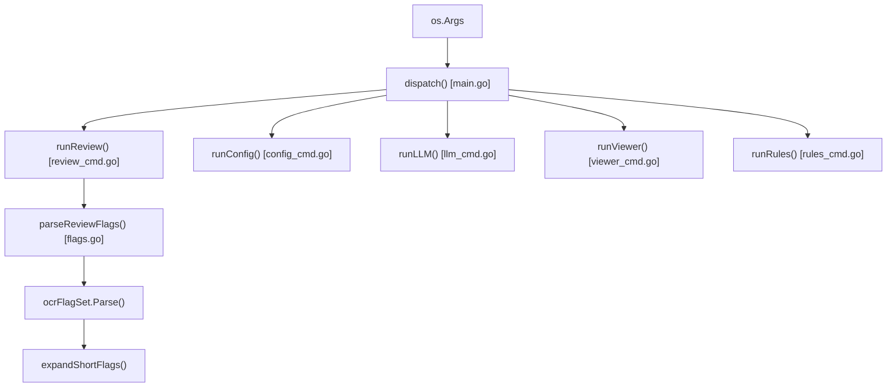
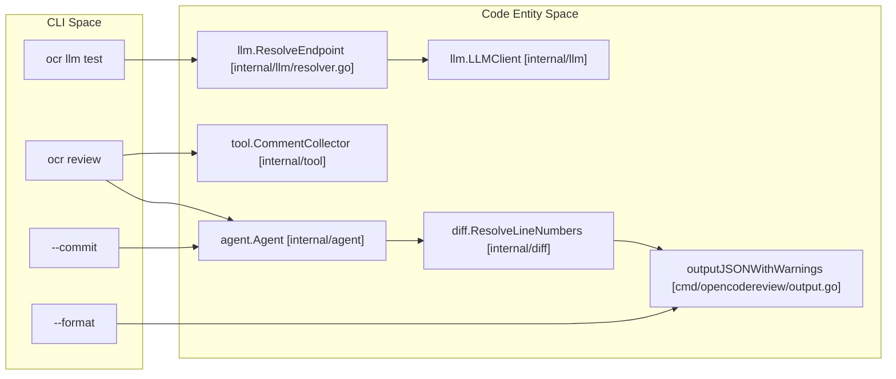
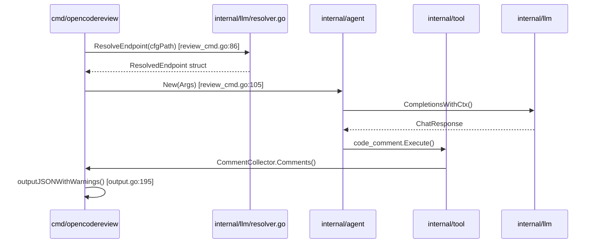

# CLI Command Reference

Relevant source files

The following files were used as context for generating this wiki page:

- [cmd/opencodereview/config_cmd.go](cmd/opencodereview/config_cmd.go)
- [cmd/opencodereview/flags.go](cmd/opencodereview/flags.go)
- [cmd/opencodereview/git.go](cmd/opencodereview/git.go)
- [cmd/opencodereview/llm_cmd.go](cmd/opencodereview/llm_cmd.go)
- [cmd/opencodereview/main.go](cmd/opencodereview/main.go)
- [cmd/opencodereview/output.go](cmd/opencodereview/output.go)
- [cmd/opencodereview/review_cmd.go](cmd/opencodereview/review_cmd.go)
- [cmd/opencodereview/rules_cmd.go](cmd/opencodereview/rules_cmd.go)
- [cmd/opencodereview/version.go](cmd/opencodereview/version.go)
- [cmd/opencodereview/viewer_cmd.go](cmd/opencodereview/viewer_cmd.go)
- [internal/llm/resolver.go](internal/llm/resolver.go)
- [internal/llm/resolver_test.go](internal/llm/resolver_test.go)
- [internal/telemetry/config.go](internal/telemetry/config.go)

This page provides a detailed technical reference for the OpenCodeReview (OCR) Command Line Interface. It covers sub-command routing, flag parsing logic, and the internal data flow between the CLI layer and the core agent.

## Command Dispatching

The entry point of the application is `main.go`, which initializes global state like telemetry and the embedded asset loader before handing control to the `dispatch()` function [cmd/opencodereview/main.go:15-28](). The `dispatch` function routes arguments to specific sub-command handlers [cmd/opencodereview/main.go:31-60]().

### Sub-command Architecture
OCR uses a custom flag set implementation, `ocrFlagSet`, which wraps the standard library `flag` package to support shorthand flags (e.g., `-c` for `--commit`) and automatic help message generation [cmd/opencodereview/flags.go:11-22]().

**Command Routing Map:**
| Command | Alias | Handler Function | Purpose |
| :--- | :--- | :--- | :--- |
| `review` | `r` | `runReview` | Primary AI review pipeline |
| `rules` | - | `runRules` | Inspect and debug review rules |
| `config` | - | `runConfig` | Manage local configuration keys |
| `llm` | - | `runLLM` | Connectivity and model testing |
| `viewer` | - | `runViewer` | Launch WebUI session browser |
| `version` | - | `printVersion` | Display build metadata |

**CLI Routing Data Flow:**

**Sources:** [cmd/opencodereview/main.go:31-60](), [cmd/opencodereview/flags.go:9-22](), [cmd/opencodereview/flags.go:79-92](), [cmd/opencodereview/rules_cmd.go:10-24]()

---

## `ocr review`

The `review` command is the primary interface for triggering the AI agent. It supports three distinct git modes: **Workspace** (default), **Ref Range**, and **Single Commit**.

### Flags and Options
The `reviewOptions` struct defines the configuration for a review session [cmd/opencodereview/flags.go:96-111]().

| Flag | Shorthand | Default | Description |
| :--- | :--- | :--- | :--- |
| `--repo` | - | `.` | Root directory of the git repository [cmd/opencodereview/flags.go:120](). |
| `--from` | - | - | Source ref (requires `--to`) [cmd/opencodereview/flags.go:121](). |
| `--to` | - | - | Target ref for diff [cmd/opencodereview/flags.go:122](). |
| `--commit` | `-c` | - | Review a specific commit vs its parent [cmd/opencodereview/flags.go:123](). |
| `--format` | `-f` | `text` | Output format: `text` or `json` [cmd/opencodereview/flags.go:124](). |
| `--audience`| - | `human`| `human` (progress bars) or `agent` (summary only) [cmd/opencodereview/flags.go:127](). |
| `--concurrency`| - | `8` | Max concurrent file reviews [cmd/opencodereview/flags.go:125](). |
| `--timeout` | - | `10` | Timeout in minutes per concurrent task [cmd/opencodereview/flags.go:126](). |
| `--background`| `-b` | - | Business/requirement context for the LLM [cmd/opencodereview/flags.go:128](). |
| `--rule` | - | - | Path to custom system review rules JSON [cmd/opencodereview/flags.go:119](). |
| `--preview` | `-p` | `false` | Preview which files will be reviewed [cmd/opencodereview/flags.go:130](). |

### Implementation Detail: Review Initialization
When `runReview` is called, it performs the following sequence:
1. **Git Validation**: Ensures the target directory is a valid git repository using `requireGitRepo` [cmd/opencodereview/review_cmd.go:31-33]().
2. **Config Loading**: Loads default templates and system rules [cmd/opencodereview/review_cmd.go:35-60]().
3. **Registry Setup**: Constructs a `tool.Registry` containing `FileRead`, `CodeSearch`, and `CodeComment` tools [cmd/opencodereview/review_cmd.go:94-103]().
4. **Agent Execution**: Initializes `agent.New` and calls `ag.Run(ctx)` [cmd/opencodereview/review_cmd.go:105-141]().
5. **Post-Processing**: Resolves LLM-suggested code snippets back to line numbers using `diff.ResolveLineNumbers` [cmd/opencodereview/review_cmd.go:148]().

**Sources:** [cmd/opencodereview/review_cmd.go:21-182](), [cmd/opencodereview/flags.go:113-167]()

---

## `ocr rules`

The `rules` command allows developers to inspect how review rules are applied to specific files based on glob patterns.

### Sub-commands
*   **`check <file-path>`**: Shows which review rule applies to the given file, including its source layer (System, Global, Project, or Custom) and the specific pattern matched [cmd/opencodereview/rules_cmd.go:26-79]().

**Sources:** [cmd/opencodereview/rules_cmd.go:1-105]()

---

## `ocr llm`

The `llm` command provides utilities for debugging the connection between the CLI and the configured LLM provider.

### Sub-commands
*   **`test`**: Executes a minimal conversation using the configured model to verify API keys, endpoints, and protocol compatibility [cmd/opencodereview/llm_cmd.go:27-90]().

### Implementation: Connection Testing
The `runLLMTest` function:
1. Resolves the endpoint via `llm.ResolveEndpoint`, which checks environment variables and local config files [cmd/opencodereview/llm_cmd.go:38-41]().
2. Loads the `testconnection` task configuration and applies language settings [cmd/opencodereview/llm_cmd.go:43-49]().
3. Instantiates an `llm.LLMClient` and sends a `CompletionsWithCtx` request [cmd/opencodereview/llm_cmd.go:61-76]().

**Sources:** [cmd/opencodereview/llm_cmd.go:13-90](), [internal/llm/resolver.go:40-64]()

---

## `ocr config`

Manages persistent configuration stored in `~/.opencodereview/config.json`.

### Implementation: Configuration Keys
The `setConfigValue` function supports updating the following keys [cmd/opencodereview/config_cmd.go:126-172]():

| Key | Type | Description |
| :--- | :--- | :--- |
| `llm.url` | String | LLM API Endpoint URL |
| `llm.auth_token`| String | API Authentication Token |
| `llm.model` | String | Model identifier (e.g., `gpt-4o`) |
| `llm.use_anthropic`| Bool | Protocol toggle (True=Anthropic, False=OpenAI) |
| `language` | String | Output language for AI comments |
| `telemetry.enabled`| Bool | Master switch for OpenTelemetry |
| `telemetry.exporter`| String | `console` or `otlp` |

**Sources:** [cmd/opencodereview/config_cmd.go:72-179]()

---

## Output Formats

OCR supports two primary output formats: **Text** (standard out) and **JSON**.

### Text Output
Renders comments with ANSI color codes and word-wrapped content [cmd/opencodereview/output.go:34-51]().
*   **Diff Rendering**: If a comment includes `ExistingCode` and `SuggestionCode`, OCR computes a line-level diff using `suggestdiff.ComputeLineDiff` [cmd/opencodereview/output.go:156-163]().

### JSON Output
Produces a structured `jsonOutput` object containing comments, warnings, and summary metrics [cmd/opencodereview/output.go:174-180]().

**JSON Schema (`jsonSummary`):**
| Field | Type | Description |
| :--- | :--- | :--- |
| `files_reviewed`| Int64 | Number of files processed [cmd/opencodereview/output.go:166](). |
| `comments` | Int64 | Total comments generated [cmd/opencodereview/output.go:167](). |
| `total_tokens` | Int64 | Total token consumption [cmd/opencodereview/output.go:168](). |
| `elapsed` | String| Wall-clock execution time [cmd/opencodereview/output.go:171](). |

**Sources:** [cmd/opencodereview/output.go:1-238]()

---

## Technical Mapping: CLI to Code Entities

The following diagrams bridge the gap between user commands and internal code implementation.

**CLI to Internal Entity Mapping:**

**Implementation Data Flow:**

**Sources:** [cmd/opencodereview/review_cmd.go:86-124](), [cmd/opencodereview/output.go:195-227](), [internal/llm/resolver.go:40-64]()
