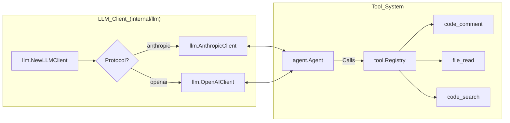

# Glossary

<details>
<summary>Relevant source files</summary>

The following files were used as context for generating this wiki page:

- [README.md](README.md)
- [internal/agent/agent.go](internal/agent/agent.go)
- [internal/agent/preview.go](internal/agent/preview.go)
- [internal/agent/preview_test.go](internal/agent/preview_test.go)
- [internal/agent/template_test.go](internal/agent/template_test.go)
- [internal/config/rules/system_rules.go](internal/config/rules/system_rules.go)
- [internal/config/rules/system_rules_test.go](internal/config/rules/system_rules_test.go)
- [internal/diff/resolver.go](internal/diff/resolver.go)
- [internal/diff/resolver_test.go](internal/diff/resolver_test.go)
- [internal/llm/client.go](internal/llm/client.go)
- [internal/llm/client_test.go](internal/llm/client_test.go)
- [internal/session/history.go](internal/session/history.go)
- [internal/session/persist.go](internal/session/persist.go)
- [internal/session/persist_test.go](internal/session/persist_test.go)
- [internal/tool/code_search.go](internal/tool/code_search.go)
- [internal/viewer/store.go](internal/viewer/store.go)

</details>


This page provides definitions for codebase-specific terminology, domain concepts, and architectural components within the OpenCodeReview (OCR) system. It serves as a technical reference for onboarding engineers to understand the mapping between high-level concepts and their implementation in the Go codebase.

## Core Pipeline Concepts

### Review Agent
The central orchestrator that manages the lifecycle of a code review. It coordinates git diff parsing, LLM communication, and tool execution.
*   **Implementation**: Defined by the `Agent` struct in [internal/agent/agent.go:159-174]().
*   **Data Flow**: Initialized via `Args` which holds dependencies like `LLMClient`, `Registry`, and `SystemRule` [internal/agent/agent.go:48-122]().

### Plan Phase
A preliminary risk analysis stage triggered for large changes. If a diff exceeds a specific line threshold, the agent first analyzes the overall impact before performing detailed line-level reviews.
*   **Implementation**: Controlled by the `PlanToolDefs` field in `Args` [internal/agent/agent.go:79-81]().
*   **Logic**: The agent uses `planBlockPattern` to identify and manage plan guidance within prompt templates [internal/agent/agent.go:33-34]().

### Main Task Loop
The primary execution phase where the LLM reviews a specific file. This is a multi-turn conversation loop where the LLM can call tools to gather context and eventually submits comments.
*   **Concurrency**: Managed via `MaxConcurrency` and `ConcurrentTaskTimeout` [internal/agent/agent.go:97-101]().
*   **Subtask Execution**: Each file is treated as a subtask; failures are tracked via `subtaskFailed` atomic counters [internal/agent/agent.go:169]().

### Memory Compression
A context management strategy used to handle long conversations. When the token count hits thresholds, the agent summarizes older parts of the conversation to free up the context window.
*   **Thresholds**: `tokenSoftThreshold` (0.60 for async background compression) and `tokenWarningThreshold` (0.80 for immediate sync compression) [internal/agent/agent.go:132-135]().
*   **Strategy**: Uses `partitionResult` to determine `frozenEnd` and `compressEnd` markers for message history [internal/agent/agent.go:145-150]().

### Pipeline Execution Flow
The following diagram illustrates the transition from a CLI command to the internal agent phases and the data structures involved.

**Review Pipeline Data Flow**
```mermaid
graph TD
    subgraph "CLI_Space"
        ["ocr_review"] --> ARGS["agent.Args"]
    end

    subgraph "Agent_Logic_(internal/agent/agent.go)"
        ARGS --> AGENT["Agent_struct"]
        AGENT --> DIFFS["agent.loadDiffs()"]
        DIFFS --> PLAN{"Plan_Required?"}
        PLAN -- "Yes" --> PHASE1["PlanTask"]
        PLAN -- "No" --> PHASE2["MainTask"]
        PHASE1 --> PHASE2
        
        subgraph "Per_File_Loop"
            PHASE2 --> LLM["llm.LLMClient"]
            LLM --> TOOL["agent.executeToolCall"]
            TOOL --> MEM{"Token_Limit?"}
            MEM -- "Threshold_Reached" --> COMP["MemoryCompressionTask"]
            COMP --> LLM
            TOOL -- "code_comment" --> COMM["CommentWorkerPool"]
        end
    end

    subgraph "Output_Space"
        COMM --> COLL["tool.CommentCollector"]
        COLL --> PERSIST["session.jsonlWriter"]
    end
```
Sources: [internal/agent/agent.go:48-122](), [internal/agent/agent.go:132-150](), [internal/agent/agent.go:159-182](), [internal/session/history.go:15-23]()

---

## LLM & Tooling Terms

### Tool Registry
A mapping system that allows the LLM to invoke Go functions.
*   **Registry**: `Registry` is defined in the `tool` package and used by the agent to dispatch subtasks [internal/agent/agent.go:77]().
*   **Execution**: Tool calls are recorded as `ToolResultRecord` in the session history [internal/session/history.go:88-92]().

### LLM Client Interface
A unified interface supporting multiple protocols (Anthropic and OpenAI).
*   **Interface**: `LLMClient` provides methods for completions and streaming [internal/llm/client.go:36-40]().
*   **Normalization**: Both `OpenAIClient` and `AnthropicClient` perform URL normalization to ensure consistent endpoint paths [internal/llm/client_test.go:7-91]().

### Comment Worker Pool
A background execution pool that processes review comments (line-range tracking, reflection, validation) off the critical path of the LLM conversation to reduce latency.
*   **Implementation**: `CommentWorkerPool` manages a fixed-size pool of workers [internal/agent/agent.go:176-182]().

**LLM and Tooling Interaction**

Sources: [internal/llm/client.go:198-211](), [internal/agent/agent.go:74-85](), [internal/agent/agent.go:176-182]()

---

## Configuration & Domain Terms

### System Rules
Path-based review checklists defined in JSON. They allow different review priorities for different file types (e.g., Java vs. SQL).
*   **Resolution**: `SystemRule.Resolve(path)` matches file paths against glob patterns [internal/config/rules/system_rules.go:127-137]().
*   **Brace Expansion**: Supports patterns like `*.{go,py}` which expand into multiple match targets [internal/config/rules/system_rules.go:154-175]().

### Hunk
A specific block of changes within a unified git diff, used for line number resolution.
*   **Structure**: `Hunk` contains start lines and line content [internal/diff/resolver.go:117-118]().
*   **Resolution**: `ResolveLineNumbers` matches LLM-suggested code against diff hunks to find absolute file positions [internal/diff/resolver.go:9-15]().

### JSONL Session
A persistence format where every interaction (request, response, tool call) is streamed to a `.jsonl` file.
*   **Persistence**: Handled by `jsonlWriter` [internal/session/persist.go:19-32]().
*   **Path Encoding**: Repository paths are encoded to create safe directory names on disk (e.g., replacing `/` with `-`) [internal/session/persist.go:65-90]().
*   **Viewer**: The `viewer` package reads these files back to build a `ViewSession` for the WebUI [internal/viewer/store.go:197-201]().

---

## Abbreviations Table

| Abbreviation | Full Term | Context | Code Pointer |
| :--- | :--- | :--- | :--- |
| **OCR** | OpenCodeReview | The project name and CLI command. | [README.md:18-20]() |
| **JSONL** | JSON Lines | The streaming persistence format for sessions. | [internal/session/persist.go:16-19]() |
| **CWD** | Current Working Directory | Used to identify the repository root in sessions. | [internal/session/persist.go:133]() |
| **LLM** | Large Language Model | The backend intelligence (Claude, GPT, etc.). | [internal/llm/client.go:1-3]() |
| **UUID** | Universally Unique ID | Used to chain session records via `parentUuid`. | [internal/session/persist.go:52-63]() |

Sources: [README.md:18-24](), [internal/session/persist.go:16-90](), [internal/llm/client.go:1-16](), [internal/agent/agent.go:159-174]()
