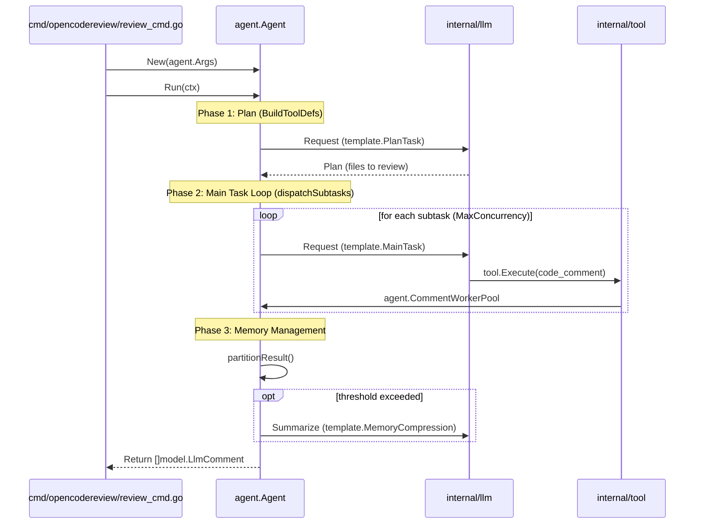

# Core Architecture

<details>
<summary>Relevant source files</summary>

The following files were used as context for generating this wiki page:

- [cmd/opencodereview/flags.go](cmd/opencodereview/flags.go)
- [cmd/opencodereview/git.go](cmd/opencodereview/git.go)
- [cmd/opencodereview/output.go](cmd/opencodereview/output.go)
- [cmd/opencodereview/review_cmd.go](cmd/opencodereview/review_cmd.go)
- [internal/agent/agent.go](internal/agent/agent.go)
- [internal/agent/preview.go](internal/agent/preview.go)
- [internal/agent/preview_test.go](internal/agent/preview_test.go)
- [internal/agent/template_test.go](internal/agent/template_test.go)
- [internal/model/diff.go](internal/model/diff.go)
- [internal/model/review.go](internal/model/review.go)
- [internal/tool/code_search.go](internal/tool/code_search.go)

</details>


The OpenCodeReview (OCR) system is built around a structured, multi-phase review pipeline managed by a central `Agent`. The architecture is designed to handle large-scale code changes by breaking them into manageable subtasks, executing them concurrently, and using an intelligent memory management strategy to stay within Large Language Model (LLM) context limits.

## Review Pipeline Overview

The review process follows a three-phase execution model orchestrated in `internal/agent/agent.go`. This pipeline ensures that the LLM first understands the global context of the changes before diving into specific file-level reviews.

1.  **Plan Phase**: The `Agent` invokes the LLM to analyze the entire diff and generate a high-level review plan. This phase identifies which files are critical, which can be skipped, and how to group related changes.
2.  **Main Task Loop**: Based on the plan, the `Agent` dispatches subtasks (often per-file or per-module). These subtasks run concurrently using a worker pool model to maximize throughput.
3.  **Memory Compression**: As the conversation grows, the `Agent` monitors token usage. If thresholds are met, it triggers a summarization task to compress older parts of the conversation into a "memory" block, freeing up context for active tasks.

For details on the execution flow and concurrency, see [Review Agent](#2.1).

## System Components and Data Flow

The following diagram illustrates how the core packages interact to move from a raw Git repository to a set of resolved review comments.

### Architecture Entity Map
This diagram bridges the **Natural Language Space** (concepts like "Tasks" and "Rules") with the **Code Entity Space** (structs and functions).

```mermaid
graph TD
    subgraph "Input Layer"
        [GitRepo] -->|"-C repoDir"| Git["git cli"]
        Rules["rules.Resolver"]
        Tpl["template.Template"]
    end

    subgraph "Core Orchestration (internal/agent)"
        Ag["agent.Agent"]
        WP["agent.CommentWorkerPool"]
        Mem["agent.compressionJob"]
    end

    subgraph "Execution Space (internal/tool)"
        Reg["tool.Registry"]
        FR["tool.FileReader"]
        Coll["tool.CommentCollector"]
    end

    subgraph "Output Layer"
        Diff["diff.ResolveLineNumbers"]
        Hist["session.SessionHistory"]
    end

    Git -->|parsed into| Ag
    Rules -->|guides| Ag
    Tpl -->|configures| Ag
    
    Ag -->|dispatches| WP
    Ag -->|queries| Reg
    Reg -->|reads| FR
    Reg -->|writes| Coll
    Ag -.->|manages| Mem
    
    Coll -->|model.LlmComment| Diff
    Ag -->|logs events| Hist
    Diff -->|final comments| User["stdout.outputText"]
```
**Sources:** [internal/agent/agent.go:159-174](), [cmd/opencodereview/review_cmd.go:105-124](), [cmd/opencodereview/review_cmd.go:148-155](), [internal/agent/agent.go:176-181]()

## Concurrent Execution Model

OCR utilizes two distinct concurrency mechanisms to optimize performance:
*   **Subtask Concurrency**: The `agent.Run` method uses the `MaxConcurrency` setting (defaulting to CPU count) to limit simultaneous LLM requests for file reviews [internal/agent/agent.go:97-98]().
*   **Comment Worker Pool**: A dedicated `agent.CommentWorkerPool` processes `CODE_COMMENT` tool outputs off the critical path. This allows the LLM to continue generating new thoughts while the system performs line-range tracking, reflection, and suggestion validation in the background [internal/agent/agent.go:86-95](), [internal/agent/agent.go:176-181]().

## Context Management (The Three-Zone Strategy)

To maintain long-running review sessions without hitting LLM context windows, OCR implements a "Three-Zone" memory strategy:
1.  **Frozen Zone**: System prompts and essential rules that are never compressed.
2.  **Compress Zone**: Historical conversation rounds that are summarized by the LLM into a concise "memory" block.
3.  **Active Zone**: The most recent tool calls and responses kept in full detail for immediate context.

The system triggers compression based on `tokenSoftThreshold` (60%) for asynchronous background tasks and `tokenWarningThreshold` (80%) for immediate synchronous cleanup [internal/agent/agent.go:131-135]().

For details, see [Memory Compression and Context Management](#2.2).

## Git and Diff Processing

The Agent begins by loading the diff range (workspace, range, or commit) and parsing it into `model.Diff` objects [internal/agent/agent.go:52-61](), [internal/agent/preview.go:74-77](). These objects are used by tools to provide context to the LLM and are later used by `diff.ResolveLineNumbers` to map LLM-suggested code snippets back to exact file line numbers [cmd/opencodereview/review_cmd.go:148-149]().

For details, see [Git Diff Processing](#2.3).

### Code-to-Logic Mapping
This diagram shows how internal function calls map to the three-phase pipeline.


**Sources:** [internal/agent/agent.go:158-174](), [cmd/opencodereview/review_cmd.go:141-145](), [internal/agent/agent.go:131-156](), [cmd/opencodereview/review_cmd.go:70-71]()

---
**Sources:**
- `cmd/opencodereview/review_cmd.go` [lines 21-182]()
- `internal/agent/agent.go` [lines 47-181]()
- `internal/agent/preview.go` [lines 74-112]()
- `internal/model/review.go` [lines 3-12]()
