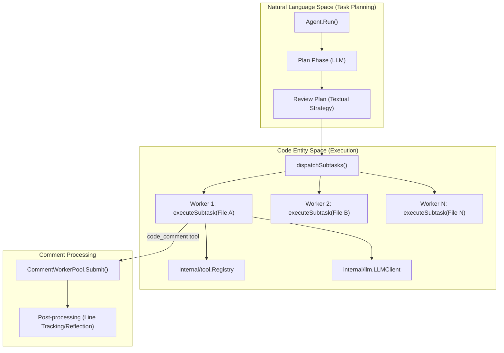
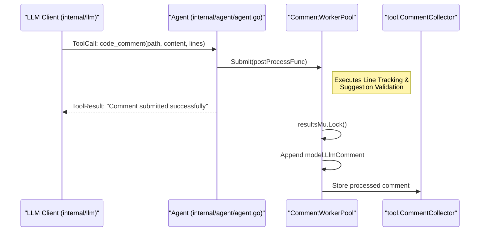

# Review Agent

Relevant source files

The following files were used as context for generating this wiki page:

- [internal/agent/agent.go](internal/agent/agent.go)
- [internal/agent/preview.go](internal/agent/preview.go)
- [internal/agent/preview_test.go](internal/agent/preview_test.go)
- [internal/agent/template_test.go](internal/agent/template_test.go)
- [internal/stdout/stdout.go](internal/stdout/stdout.go)
- [internal/tool/code_search.go](internal/tool/code_search.go)

The `Agent` is the central orchestrator of the OpenCodeReview system. It manages the lifecycle of a review session, including git diff analysis, multi-phase LLM interactions (Planning and Execution), concurrent task dispatching, and asynchronous comment processing.

## The Agent Struct

The `Agent` struct maintains the state of a review session, including parsed diffs, token usage metrics, and session history. It acts as the bridge between the high-level review logic and the underlying LLM/Git subsystems.

| Field | Type | Description |
| :--- | :--- | :--- |
| `args` | `Args` | Dependencies: LLM clients, tool registries, and concurrency settings [internal/agent/agent.go:48-122](). |
| `diffs` | `[]model.Diff` | Parsed git diffs representing file changes [internal/agent/agent.go:161](). |
| `session` | `*session.SessionHistory` | Persistence layer for recording LLM conversations [internal/agent/agent.go:165](). |
| `totalTokensUsed` | `int64` (Atomic) | Cumulative token count across all phases [internal/agent/agent.go:166](). |
| `CommentWorkerPool` | `*CommentWorkerPool` | Pool for offloading non-critical comment post-processing [internal/agent/agent.go:176-184](). |

**Sources:**
- `Agent` definition: [internal/agent/agent.go:159-174]()
- `Args` definition: [internal/agent/agent.go:48-122]()

---

## Review Pipeline Flow

The review process follows a structured pipeline designed to maximize context awareness while staying within LLM token limits.

### 1. Initialization and Diff Loading
The agent identifies changed files using git commands and populates the `diffs` slice. This provides the context for both the LLM and the tools. The `Preview()` method can be used to see which files will be reviewed or excluded based on `FileFilter` rules [internal/agent/preview.go:74-112]().

### 2. Plan Phase
If `plan_task` is enabled, the agent initiates the **Plan Phase**.
- **Purpose**: To provide the LLM with a global view of the changes so it can develop a strategy before diving into specific files.
- **Tooling**: Uses `PlanToolDefs` [internal/agent/agent.go:81]().
- **Output**: A textual plan injected into the `Main Task Loop` via the `{{plan_guidance}}` placeholder [internal/agent/agent.go:26-34]().

### 3. Main Task Loop
The agent transitions to the **Main Task Loop**, where it dispatches subtasks.
- **dispatchSubtasks**: Manages the concurrency model, grouping files and dispatching them to `executeSubtask`.
- **Concurrency**: Controlled by `MaxConcurrency` (defaults to CPU count) [internal/agent/agent.go:97-98]().

### 4. Memory Management
During the loop, the agent monitors token usage against `MaxTokens`:
- **Soft Threshold (60%)**: Triggers asynchronous background compression [internal/agent/agent.go:133]().
- **Warning Threshold (80%)**: Triggers immediate synchronous compression to prevent context overflow [internal/agent/agent.go:134]().

**Sources:**
- `Agent.Run` entry point: [internal/agent/agent.go:345]()
- Token thresholds: [internal/agent/agent.go:132-135]()
- Plan block handling: [internal/agent/agent.go:33-45]()

---

## Concurrency and Subtask Execution

The agent uses a "Fan-out" model to process multiple files or code modules simultaneously.

### Subtask Dispatch Diagram
This diagram shows how the `Agent` bridges the high-level "Review Task" into "Code Entities" (Files/Diffs) using concurrent workers.

**Sources:**
- `dispatchSubtasks` logic: [internal/agent/agent.go:616-728]()
- `executeSubtask`: [internal/agent/agent.go:731-860]()

---

## executeSubtask and Tool-Use Loop

Inside `executeSubtask`, the agent runs a loop where the LLM can call various tools (e.g., `file_read`, `code_search`, `code_comment`).

1. **LLM Request**: The agent sends the current message history and `MainToolDefs` to the LLM [internal/agent/agent.go:83-84]().
2. **Tool Execution**: Tool calls are handled by `executeToolCall`.
3. **Special Handling (code_comment)**: If the tool is `code_comment`, the agent offloads the task to the `CommentWorkerPool` (if configured) so the LLM can continue issuing requests while the comment is being validated or tracked in the background [internal/agent/agent.go:86-95]().

**Sources:**
- `executeToolCall`: [internal/agent/agent.go:941-1033]()
- `code_comment` tool logic: [internal/tool/code_comment.go:1-100]()

---

## CommentWorkerPool

The `CommentWorkerPool` is a specialized concurrency primitive used to unblock the LLM during the review process.

### Data Flow: Comment Post-Processing
This diagram illustrates the association between the `model.LlmComment` entity and the asynchronous processing pipeline.

### Implementation Details
- **Semaphore**: Uses a buffered channel `semaphore chan struct{}` to limit active goroutines [internal/agent/agent.go:185]().
- **Wait Group**: Uses `sync.WaitGroup` to ensure all background tasks finish before the session ends [internal/agent/agent.go:186]().
- **Results Aggregation**: Collects `model.LlmComment` objects into a slice protected by `resultsMu` [internal/agent/agent.go:188]().

**Sources:**
- `CommentWorkerPool` struct: [internal/agent/agent.go:176-191]()
- `Submit` method: [internal/agent/agent.go:207-224]()
- `Await` method: [internal/agent/agent.go:227-230]()

---

## Summary of Key Methods

| Method | File:Line | Purpose |
| :--- | :--- | :--- |
| `New(args Args)` | [internal/agent/agent.go:312-343]() | Initializes the agent, collector, and default tools. |
| `Run(ctx context.Context)` | [internal/agent/agent.go:345-448]() | Entry point for the review process. |
| `Preview()` | [internal/agent/preview.go:74-112]() | Loads diffs and applies filters to show what will be reviewed. |
| `Submit(f func())` | [internal/agent/agent.go:207]() | Offloads a comment task to the worker pool. |
| `Await()` | [internal/agent/agent.go:227]() | Blocks until all background comments are processed. |

**Sources:**
- Method definitions: [internal/agent/agent.go:207-448]()
- Preview logic: [internal/agent/preview.go:74-112]()
