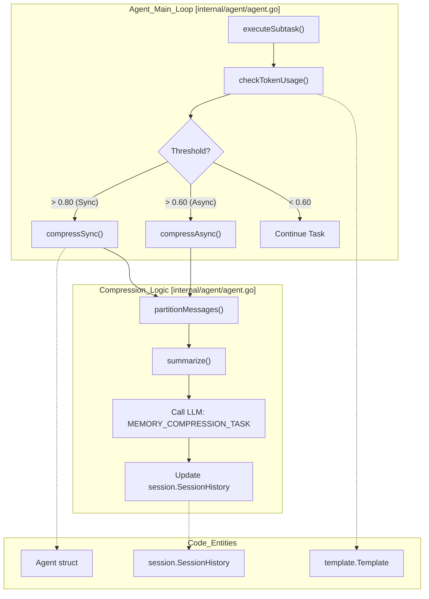
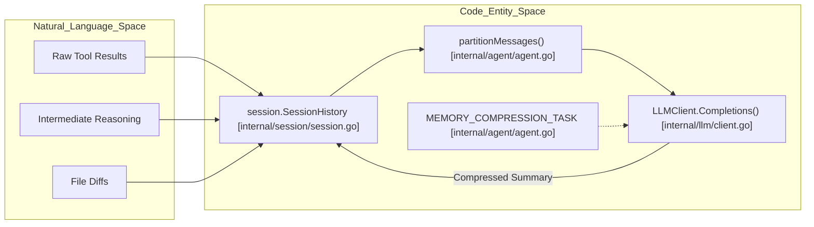

# Memory Compression and Context Management

Relevant source files

The following files were used as context for generating this wiki page:

- [internal/agent/agent.go](internal/agent/agent.go)
- [internal/agent/preview.go](internal/agent/preview.go)
- [internal/agent/preview_test.go](internal/agent/preview_test.go)
- [internal/agent/template_test.go](internal/agent/template_test.go)
- [internal/llm/client.go](internal/llm/client.go)
- [internal/llm/client_test.go](internal/llm/client_test.go)
- [internal/tool/code_search.go](internal/tool/code_search.go)

The `Agent` maintains a conversation history with the LLM during the review process. As the number of tool calls and file reads increases, the context window can become saturated. OpenCodeReview implements a three-zone memory partitioning strategy and an automated compression mechanism to ensure the agent retains critical information while staying within model token limits.

## Context Partitioning Strategy

The conversation history is managed through a partitioning strategy that divides messages into three distinct zones: **Frozen**, **Compress**, and **Active**. This logic is primarily implemented in `internal/agent/agent.go`.

### The Three Zones

| Zone | Description |
| :--- | :--- |
| **Frozen** | The initial system prompts and the first user task description. These are never compressed to ensure the agent never loses its core instructions or the primary review objective. |
| **Compress** | A sliding window of intermediate conversation history, including tool calls and tool results. When thresholds are met, these messages are sent to the LLM to be summarized into a single XML-formatted block. |
| **Active** | The most recent "rounds" of conversation. These are kept in their raw form to provide the LLM with immediate context for the current line of reasoning. |

### Partitioning Logic
The `partitionMessages` function determines the boundaries of these zones. It identifies `round` structs, where a round consists of one `assistant` message index followed by zero or more `tool` result message indices [internal/agent/agent.go:139-142]().

1.  **Frozen Boundary**: Fixed at the first two messages (System + Initial User Task) [internal/agent/agent.go:275-276]().
2.  **Active Boundary**: The last 3 rounds are preserved as "Active" to maintain immediate context [internal/agent/agent.go:282-284]().
3.  **Compressible Range**: Everything between the Frozen boundary and the Active boundary is eligible for summarization [internal/agent/agent.go:304-306]().

**Sources:** [internal/agent/agent.go:139-150](), [internal/agent/agent.go:263-315]()

## Compression Thresholds and Execution

Compression is triggered based on the `MaxTokens` value defined in the `Template` [internal/config/template/template.go:16-16](). The agent uses two specific thresholds defined as constants in the `agent` package [internal/agent/agent.go:132-135]():

*   **tokenSoftThreshold (0.60)**: Triggers **Asynchronous** background compression. A `compressionJob` is started to summarize history while the main review loop continues [internal/agent/agent.go:133-133]().
*   **tokenWarningThreshold (0.80)**: Triggers **Synchronous** compression. The main loop blocks until compression is complete to prevent context overflow [internal/agent/agent.go:134-134]().

### Workflow: Async vs Sync Compression

The `compressIfNecessary` function checks current token usage against these thresholds. If an asynchronous `pendingJob` is already running, the agent will wait for it to finish if the warning threshold is hit [internal/agent/agent.go:343-349]().

#### Context Management Flow
The following diagram illustrates how the `Agent` manages the transition from raw messages to compressed state.

Title: Context Management and Compression Flow

**Sources:** [internal/agent/agent.go:132-135](), [internal/agent/agent.go:317-366](), [internal/config/template/template.go:12-21]()

## Summarization Prompt and XML Structure

When compression is triggered, the agent invokes the `summarize` function [internal/agent/agent.go:387-387](). This function uses the `MEMORY_COMPRESSION_TASK` template to guide the LLM in condensing the conversation history.

### Structured Summary Format
The LLM is instructed to act as a professional code review assistant and provide a summary organized into structured dimensions:

1.  **Identified Code Issues**: A severity-sorted list (HIGH/MEDIUM/LOW) of confirmed problems.
2.  **Tool Call Conclusions**: Key findings from tools like `file_read` or `code_search`.
3.  **Completed Tasks**: Items requiring no further follow-up.
4.  **Pending Tasks**: Started but incomplete investigations.
5.  **Current Focus**: A single sentence describing the immediate goal.

### Implementation of Summarization
The `summarize` function takes the identified `compress` range of messages and wraps them in a `<context>` XML tag before sending them to the LLM [internal/agent/agent.go:404-413](). The result is a single `Message` with the `assistant` role containing the summarized XML block, which replaces the raw intermediate history in the session.

**Sources:** [internal/agent/agent.go:387-422](), [internal/llm/client.go:48-53]()

## Data Flow: From History to Compressed State

The `Agent` interacts with `SessionHistory` to manage the lifecycle of conversation records.

Title: Memory Compression Data Transformation

### Key Functions and Classes

| Entity | Location | Role |
| :--- | :--- | :--- |
| `Agent` | `internal/agent/agent.go` | Orchestrates the compression lifecycle and monitors `totalTokensUsed` atomically [internal/agent/agent.go:159-174](). |
| `partitionMessages` | `internal/agent/agent.go` | Logic for dividing history into Frozen, Compress, and Active zones based on message roles [internal/agent/agent.go:263-315](). |
| `summarize` | `internal/agent/agent.go` | Prepares the prompt for the compression task and invokes the `LLMClient` [internal/agent/agent.go:387-422](). |
| `Template` | `internal/config/template/template.go` | Defines the `MaxTokens` limit used to calculate compression thresholds [internal/config/template/template.go:12-21](). |
| `SessionHistory` | `internal/session/session.go` | The underlying storage for all `llm.Message` instances in the current review session [internal/agent/agent.go:121-121](). |
| `compressionJob` | `internal/agent/agent.go` | Tracks an in-flight background compression operation with a `done` channel [internal/agent/agent.go:153-156](). |

**Sources:** [internal/agent/agent.go:132-174](), [internal/agent/agent.go:263-315](), [internal/agent/agent.go:387-422](), [internal/config/template/template.go:12-21]()
