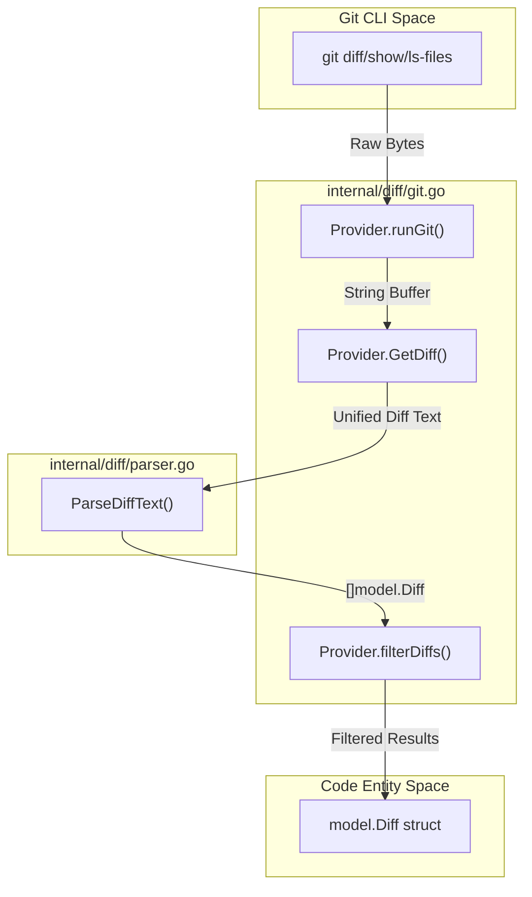
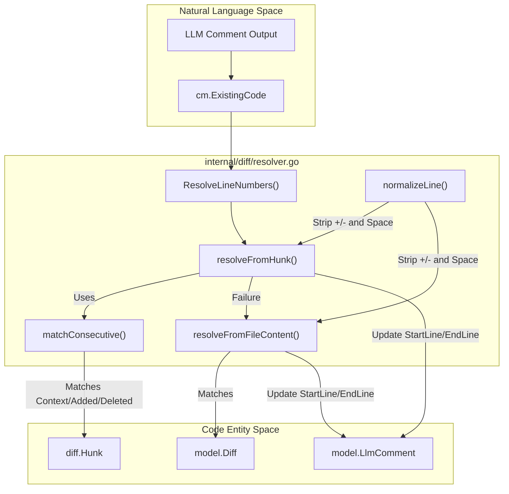

# Git Diff Processing

Relevant source files

The following files were used as context for generating this wiki page:

- [cmd/testdiff/main.go](cmd/testdiff/main.go)
- [internal/diff/git.go](internal/diff/git.go)
- [internal/diff/hunk.go](internal/diff/hunk.go)
- [internal/diff/hunk_test.go](internal/diff/hunk_test.go)
- [internal/diff/parser.go](internal/diff/parser.go)
- [internal/diff/relocation.go](internal/diff/relocation.go)
- [internal/diff/relocation_test.go](internal/diff/relocation_test.go)
- [internal/diff/resolver.go](internal/diff/resolver.go)
- [internal/diff/resolver_test.go](internal/diff/resolver_test.go)
- [internal/model/diff.go](internal/model/diff.go)
- [internal/tool/code_comment.go](internal/tool/code_comment.go)
- [internal/tool/file_find.go](internal/tool/file_find.go)
- [internal/viewer/static/style.css](internal/viewer/static/style.css)

The Git Diff Processing system is responsible for retrieving raw changes from a repository, parsing them into structured objects, and mapping LLM-generated feedback back to specific source code line numbers. This subsystem bridges the gap between the external Git CLI and the internal `model.Diff` and `model.LlmComment` entities.

## 1. Diff Retrieval and Provider Modes

The `Provider` struct in `internal/diff/git.go` handles interaction with the Git binary. It supports three distinct modes of operation to determine which changes are subject to review.

| Mode | Description | Implementation |
| :--- | :--- | :--- |
| **Workspace** | Current uncommitted changes (staged, unstaged, and untracked). | `ModeWorkspace` [internal/diff/git.go:37-37]() |
| **Commit** | Changes introduced by a specific commit compared to its parent. | `ModeCommit` [internal/diff/git.go:38-38]() |
| **Range** | Changes between two refs, calculated via their common ancestor (`merge-base`). | `ModeRange` [internal/diff/git.go:39-39]() |

### Data Flow: Raw Git to model.Diff
The `GetDiff()` function orchestrates the command execution and subsequent parsing.

Title: Git Diff Retrieval Flow

**Sources:** [internal/diff/git.go:103-155](), [internal/diff/parser.go:27-82]()

## 2. Unified Diff Parsing

The parser converts unified diff text into `model.Diff` objects. It tracks file metadata (paths, binary status, new/deleted status) and calculates insertion/deletion counts by inspecting line prefixes.

### File-Level Parsing
`ParseDiffText` uses several regular expressions to identify file boundaries and properties:
* `diffHeaderRe`: `^diff --git a/(.+?) b/(.+)$` [internal/diff/parser.go:18-18]()
* `oldFileRe`: `^--- a/(.+)$` [internal/diff/parser.go:19-19]()
* `newFileRe`: `^\+\+\+ b/(.+)$` [internal/diff/parser.go:20-20]()

### Hunk-Level Parsing
Inside each file diff, the system parses "hunks" (blocks starting with `@@`). The `ParseHunks` function in `internal/diff/hunk.go` extracts the coordinate system of the change.

| Field | Meaning |
| :--- | :--- |
| `OldStart` | Starting line number in the source file (1-indexed). [internal/diff/hunk.go:26-26]() |
| `NewStart` | Starting line number in the target file (1-indexed). [internal/diff/hunk.go:28-28]() |
| `Lines` | Slice of `HunkLine` containing `HunkContext`, `HunkAdded`, or `HunkDeleted`. [internal/diff/hunk.go:30-30]() |

**Sources:** [internal/diff/parser.go:17-82](), [internal/diff/hunk.go:9-31]()

## 3. Path Exclusion and Filtering

Before diffs are passed to the agent, they are filtered against hardcoded directory ignores and the repository's `.gitignore` file.

* **Hardcoded Ignores:** Common directories like `node_modules/`, `vendor/`, and `.git/` are always excluded via `providerDirIgnoreDirs`. [internal/diff/git.go:18-31]()
* **Gitignore Matching:** The `matchGitignorePattern` function implements standard glob matching for both directory-only and file patterns. [internal/diff/git.go:195-233]()

**Sources:** [internal/diff/git.go:176-249]()

## 4. Line Number Resolution

LLMs often provide review comments by quoting "Existing Code" rather than providing exact line numbers. The `ResolveLineNumbers` function in `internal/diff/resolver.go` implements a two-stage strategy to map these comments back to the file.

### Stage 1: Hunk-Based Resolution (`resolveFromHunk`)
This is the primary method. It attempts to find the `ExistingCode` within the `HunkContext`, `HunkAdded`, and `HunkDeleted` lines of the diff.
1. It splits the LLM's `ExistingCode` into normalized lines using `splitAndNormalize`. [internal/diff/resolver.go:88-88]()
2. It extracts side-specific lines (new-side first, then old-side) using `extractSideLines`. [internal/diff/resolver.go:94-103]()
3. It uses `matchConsecutive` to scan for the target lines, returning the 1-indexed file line numbers. [internal/diff/resolver.go:148-165]()

### Stage 2: Full Content Fallback (`resolveFromFileContent`)
If the hunk-based search fails (e.g., the LLM comments on code that was not part of the diff but was provided in context), the system scans the entire `NewFileContent` line-by-line. [internal/diff/resolver.go:169-196]()

### LLM-Assisted Relocation
If text-based matching fails, the system can use `ReLocateComment` in `internal/diff/relocation.go`. This calls the LLM to regenerate a more precise `existing_code` snippet based on the diff context before retrying the resolution logic. [internal/diff/relocation.go:19-69]()

Title: Line Number Resolution Logic

**Sources:** [internal/diff/resolver.go:12-55](), [internal/diff/resolver.go:82-112](), [internal/diff/resolver.go:117-145](), [internal/diff/resolver.go:169-196](), [internal/diff/relocation.go:19-69]()
