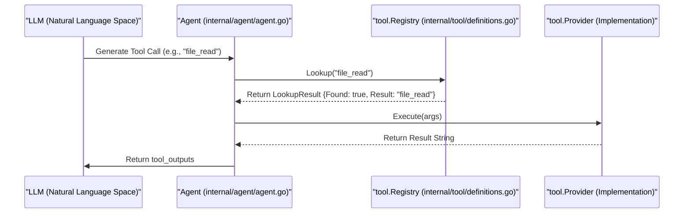

# Agent Tool System

<details>
<summary>Relevant source files</summary>

The following files were used as context for generating this wiki page:

- [internal/tool/definitions.go](internal/tool/definitions.go)
- [internal/tool/response_message.go](internal/tool/response_message.go)
- [internal/tool/stub.go](internal/tool/stub.go)

</details>


The Agent Tool System provides the interface through which the LLM interacts with the local codebase and submits review findings. It is built on a decoupled architecture using a **Registry** pattern, allowing the agent to invoke specific capabilities like file reading, code searching, or commenting without being coupled to the underlying implementations.

## Tool Architecture

The system revolves around the `Provider` interface, which defines how a tool is identified and executed. Each tool is a discrete unit of functionality that accepts a map of arguments and returns a string result to be fed back into the LLM's context.

### Registry Pattern
The `Registry` acts as a central dispatcher. During the initialization of the `Agent`, various tool providers are registered. When the LLM generates a tool call, the `Agent` looks up the corresponding `Provider` in the `Registry` and calls its `Execute` method.

### Core Components
| Component | Responsibility | Location |
| :--- | :--- | :--- |
| `Tool` | A value object representing a unique tool identifier (e.g., `file_read`). | [internal/tool/definitions.go:6-8]() |
| `Provider` | Interface requiring `Tool()` and `Execute(map[string]any)` methods. | [internal/tool/definitions.go:49-54]() |
| `Registry` | A map-based store for resolving tool names to `Provider` instances. | [internal/tool/definitions.go:57-67]() |
| `ToolCallResult` | Container for the output of a tool execution, including OpenAI-compatible IDs. | [internal/tool/response_message.go:4-8]() |
| `BuiltinToolProvider` | A wrapper for tools implemented via simple functions. | [internal/tool/stub.go:18-21]() |
| `StubProvider` | A fallback provider used when a tool is not available. | [internal/tool/stub.go:5-7]() |

### Tool Execution Flow

This diagram illustrates how a tool request moves from the LLM through the `Registry` to a concrete `Provider`.

**Tool Resolution and Execution**

Sources: [internal/tool/definitions.go:49-76](), [internal/tool/response_message.go:4-8]()

## Available Tools

The system defines a standard set of tools that the LLM uses to navigate the codebase and perform reviews. These are categorized into file operations, search capabilities, and feedback mechanisms.

| Tool Name | Purpose | Implementation Category |
| :--- | :--- | :--- |
| `file_read` | Reads the full content of a specific file. | File and Code Tools |
| `file_find` | Lists files in a directory or searches by name pattern. | File and Code Tools |
| `file_read_diff` | Reads the specific git diff hunks for a file. | File and Code Tools |
| `code_search` | Performs a keyword search across the repository. | File and Code Tools |
| `code_comment` | Submits a review comment on a specific line/file. | Comment Collection |
| `task_done` | Signals that the current subtask is finished. | Built-in |

### Code Entity Mapping

The following diagram bridges the LLM's tool calls to the internal Go structures that handle them.

**Tool Entity Mapping**
```mermaid
classDiagram
    class "ToolDefinitions" {
        <<Variable>>
        +FileRead: Tool
        +FileFind: Tool
        +CodeSearch: Tool
        +CodeComment: Tool
        +TaskDone: Tool
    }
    class "Registry" {
        +Register(Provider)
        +Lookup(string) LookupResult
    }
    class "BuiltinToolProvider" {
        +Execute(map[string]any)
    }
    class "StubProvider" {
        +Execute(map[string]any)
    }
    class "TaskCheckpoint" {
        +Data: string
        +Completed: bool
    }

    "ToolDefinitions" --> "Registry" : "Populates"
    "Registry" --> "BuiltinToolProvider" : "Dispatches to"
    "Registry" --> "StubProvider" : "Fallback for missing tools"
    "TaskDone" ..> "TaskCheckpoint" : "Signals Completion"
```
Sources: [internal/tool/definitions.go:10-18](), [internal/tool/definitions.go:57-76](), [internal/tool/stub.go:5-28](), [internal/tool/response_message.go:10-20]()

## Subsystems

The tool system is divided into two primary functional areas:

### File and Code Tools
These tools provide the "eyes" of the agent. They use a shared `FileReader` abstraction to access the local filesystem and git state. They are designed to handle large files by providing structured views (like diffs) to save LLM context tokens.
*   **Key Tools:** `file_read`, `file_find`, `file_read_diff`, `code_search`.
*   **For details, see [File and Code Tools](#3.1).**

### Comment Collection and code_comment Tool
The `code_comment` tool is the primary "output" of the review process. Unlike other tools that return data to the LLM, this tool sends data to a thread-safe `CommentCollector`. This allows the agent to work on multiple subtasks concurrently while aggregating all review findings into a single final report.
*   **Key Tool:** `code_comment`.
*   **For details, see [Comment Collection and code_comment Tool](#3.2).**

## Error Handling
If the LLM attempts to call a tool that is not registered in the `Registry`, the system returns a standard `NotAvailableMsg`. This informs the LLM that the tool is unavailable and prompts it to try a valid alternative, preventing the agent from getting stuck in a loop of invalid tool calls.
*   **Source:** [internal/tool/definitions.go:82-83](), [internal/tool/stub.go:13-15](), [internal/tool/response_message.go:23-24]()
