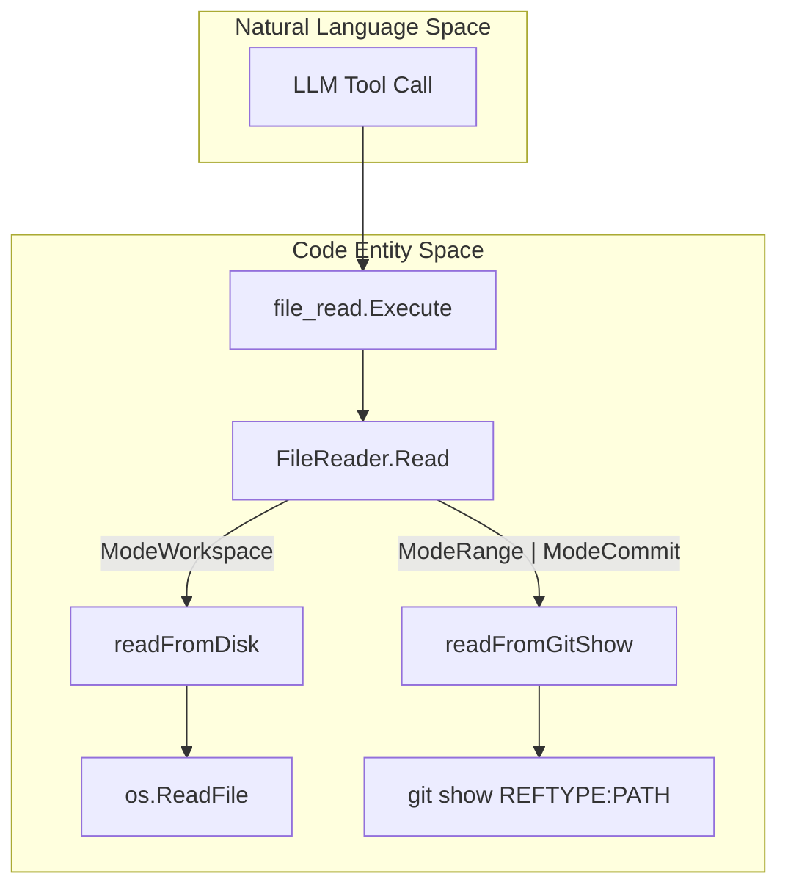
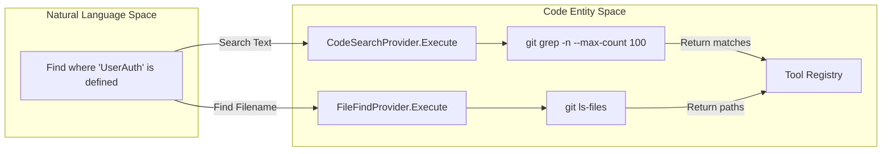

# File and Code Tools

Relevant source files

The following files were used as context for generating this wiki page:

- [internal/agent/agent.go](internal/agent/agent.go)
- [internal/agent/preview.go](internal/agent/preview.go)
- [internal/agent/preview_test.go](internal/agent/preview_test.go)
- [internal/agent/template_test.go](internal/agent/template_test.go)
- [internal/diff/git.go](internal/diff/git.go)
- [internal/diff/parser.go](internal/diff/parser.go)
- [internal/tool/code_search.go](internal/tool/code_search.go)
- [internal/tool/file_find.go](internal/tool/file_find.go)
- [internal/tool/file_read.go](internal/tool/file_read.go)
- [internal/tool/file_read_diff.go](internal/tool/file_read_diff.go)
- [internal/tool/filereader.go](internal/tool/filereader.go)

The File and Code tools provide the LLM Agent with the ability to explore the repository, locate specific symbols, and read file contents. These tools are built upon a unified abstraction layer that ensures consistency across different review modes (Workspace, Range, and Commit).

## FileReader Abstraction

The `FileReader` struct is the foundational component used by most code-related tools. It abstracts the complexity of retrieving file contents depending on the user's review context [internal/tool/filereader.go:49-56]().

### Review Modes
The system supports three distinct modes of operation [internal/tool/filereader.go:15-22]():
*   **ModeWorkspace**: Reads files directly from the local filesystem working tree [internal/tool/filereader.go:72-79]().
*   **ModeRange**: Reads files as they exist at a specific git reference (typically the `--to` branch) using `git show` [internal/tool/filereader.go:81-92]().
*   **ModeCommit**: Reads files as they exist at a specific commit hash [internal/tool/filereader.go:81-92]().

**FileReader Data Flow**
"FileReader" translates high-level read requests into either OS-level file reads or Git commands.

Sources: [internal/tool/filereader.go:61-70](), [internal/tool/file_read.go:34-37]()

## File and Code Toolset

### 1. file_read
The `FileReadProvider` allows the agent to read specific lines from a file. To prevent context window exhaustion, it enforces a hard limit of 500 lines per call [internal/tool/file_read.go:8-13]().

*   **Arguments**: `file_path` (string), `start_line` (int), `end_line` (int) [internal/tool/file_read.go:20-32]().
*   **Behavior**:
    *   If `start_line` is omitted, it defaults to 1 [internal/tool/file_read.go:27-29]().
    *   If `end_line` is omitted, it reads to the end of the file (subject to the 500-line cap) [internal/tool/file_read.go:30-32]().
    *   The output includes metadata: `IS_TRUNCATED` and `LINE_RANGE` [internal/tool/file_read.go:62-64]().
    *   Lines are returned in the format `lineNumber|content` [internal/tool/file_read.go:66-68]().

Sources: [internal/tool/file_read.go:19-73]()

### 2. file_find
The `FileFindProvider` locates files by name or pattern using `git ls-files`. This is often the first tool an agent uses to navigate an unfamiliar codebase [internal/tool/file_find.go:11-14]().

*   **Implementation**: It executes `git ls-files --cached --others --exclude-standard` to include both tracked and untracked files while respecting `.gitignore` [internal/tool/file_find.go:60-63](). In Range or Commit modes, it uses `git ls-tree -r --name-only` [internal/tool/file_find.go:63-65]().
*   **Filtering**: It automatically filters out binary files and common generated artifacts to reduce noise. It explicitly preserves well-known extensionless files like `Makefile` and `Dockerfile` [internal/tool/file_find.go:92-108]().
*   **Constraints**: Results are limited to the first 100 matches [internal/tool/file_find.go:9-9]().

Sources: [internal/tool/file_find.go:20-57](), [internal/tool/file_find.go:60-82]()

### 3. code_search
The `CodeSearchProvider` performs a text-based search across the repository using `git grep` [internal/tool/code_search.go:12-15]().

*   **Implementation**: It wraps `git grep` with flags for line numbers (`-n`) and extended/perl regex support [internal/tool/code_search.go:46-58]().
*   **Ref Awareness**: If the `FileReader` is in Range or Commit mode, `code_search` automatically targets the specific git ref instead of the working tree [internal/tool/code_search.go:61-63]().
*   **Output**: Matches are grouped by file path, showing the line number and the matching line content [internal/tool/code_search.go:125-132]().

Sources: [internal/tool/code_search.go:45-71](), [internal/tool/code_search.go:97-134]()

### 4. file_read_diff
The `FileReadDiffProvider` provides access to the specific changes (diffs) being reviewed [internal/tool/file_read_diff.go:8-10]().

*   **Implementation**: Unlike other tools, it does not call Git directly. It reads from an internal `DiffMap` (populated during the agent's initialization phase) which maps file paths to their raw diff text [internal/tool/file_read_diff.go:9-12]().
*   **Use Case**: Used by the agent to understand the exact modifications in the current PR or commit range [internal/tool/file_read_diff.go:23-35]().

Sources: [internal/tool/file_read_diff.go:16-42]()

## Tool Execution Architecture

All file tools follow a provider pattern. The `Agent` dispatches tool calls to these providers based on the `Tool` type.

**Search and Retrieval Flow**
This diagram bridges the "Natural Language" intent of searching for code to the "Code Entity" execution of Git commands.

Sources: [internal/tool/code_search.go:21-43](), [internal/tool/file_find.go:20-57]()

### Summary of Constraints and Limits

| Tool | Limit | Implementation Detail |
| :--- | :--- | :--- |
| `file_read` | 500 Lines | `fileReadMaxLines` constant [internal/tool/file_read.go:8]() |
| `file_find` | 100 Files | `fileFindMaxCount` constant [internal/tool/file_find.go:9]() |
| `code_search` | 100 Matches | `gitGrepMaxCount` constant [internal/tool/code_search.go:10]() |
| `file_read_diff` | None | Limited by the scope of the git diff provided at startup |

Sources: [internal/tool/file_read.go:8-13](), [internal/tool/file_find.go:9-14](), [internal/tool/code_search.go:10-15]()
