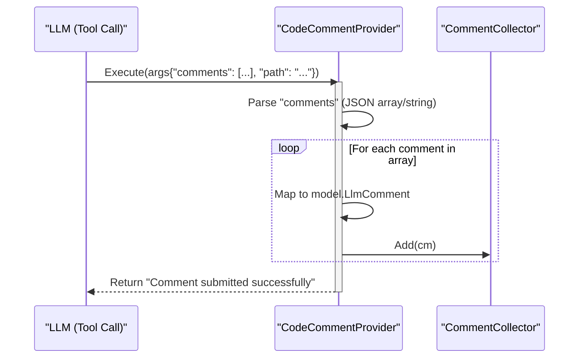
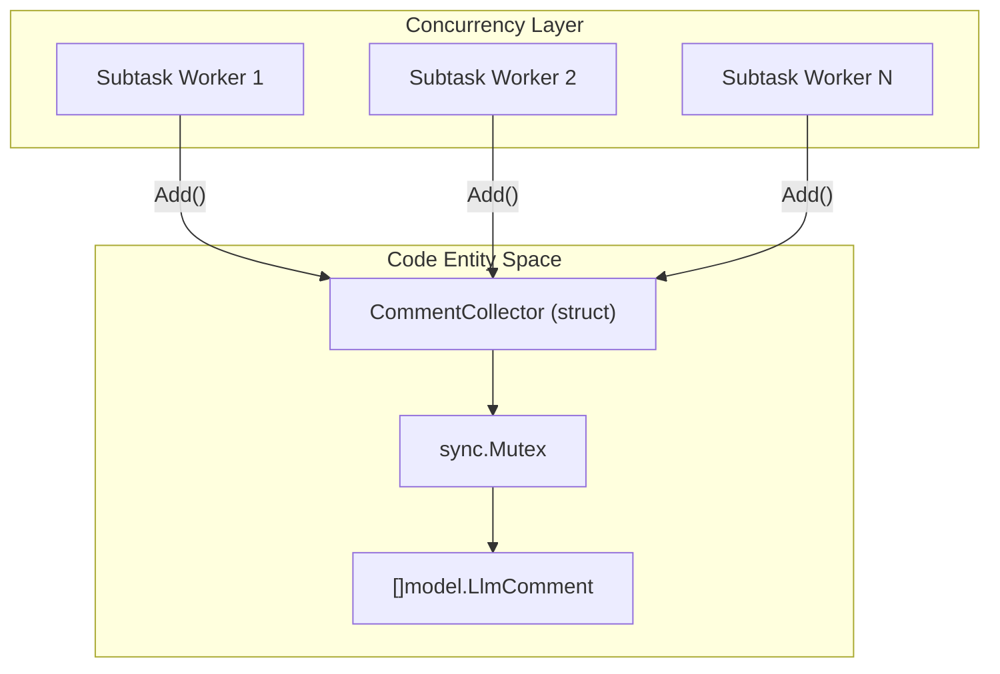

# Comment Collection and code_comment Tool

Relevant source files

The following files were used as context for generating this wiki page:

- [internal/diff/relocation.go](internal/diff/relocation.go)
- [internal/diff/relocation_test.go](internal/diff/relocation_test.go)
- [internal/model/review.go](internal/model/review.go)
- [internal/suggestdiff/diff.go](internal/suggestdiff/diff.go)
- [internal/tool/code_comment.go](internal/tool/code_comment.go)
- [internal/tool/comment_collector.go](internal/tool/comment_collector.go)
- [internal/viewer/static/style.css](internal/viewer/static/style.css)

This page describes the mechanism by which the Large Language Model (LLM) submits review findings back to the OpenCodeReview (OCR) system. It covers the `code_comment` tool, the thread-safe aggregation of these comments, and the internal data structures used to manage suggestions and line-number resolution.

## Overview

During the review process, the LLM identifies issues or improvements in the code. To report these, it invokes the `code_comment` tool. This tool acts as the bridge between the LLM's natural language reasoning and the structured data required by the OCR output layer. Comments are collected asynchronously across multiple subtasks and stored in a central, thread-safe repository before being rendered to the user.

## The code_comment Tool

The `CodeCommentProvider` is the implementation of the `code_comment` tool [internal/tool/code_comment.go:11-13](). It is responsible for parsing the LLM's tool arguments and transforming them into internal `model.LlmComment` objects.

### Implementation Details
The tool expects a `comments` array containing one or more comment objects. It handles cases where the LLM might double-encode the JSON array as a string [internal/tool/code_comment.go:35-45]().

Key fields extracted from the LLM tool call include:
*   **`path`**: The file path being reviewed [internal/tool/code_comment.go:68-70]().
*   **`content`**: The actual review message or critique [internal/tool/code_comment.go:56-58]().
*   **`suggestion_code`**: Optional code snippet provided by the LLM to replace existing code [internal/tool/code_comment.go:59-61]().
*   **`existing_code`**: The original code snippet that the suggestion targets [internal/tool/code_comment.go:62-64]().
*   **`thinking`**: Internal reasoning from the LLM regarding this specific comment [internal/tool/code_comment.go:65-67]().

### Data Flow: Tool to Collector
The following diagram illustrates how the `CodeCommentProvider` processes a tool call and interacts with the `CommentCollector`.

**LLM Tool Execution Flow**

Sources: [internal/tool/code_comment.go:11-79]()

## CommentCollector

The `CommentCollector` is a thread-safe aggregator owned by an Agent instance [internal/tool/comment_collector.go:9-14](). Because the OCR Agent executes subtasks concurrently, multiple goroutines may attempt to submit comments simultaneously.

### Key Functions
*   **`Add(cm model.LlmComment)`**: Uses a `sync.Mutex` to safely append a new comment to the internal slice [internal/tool/comment_collector.go:22-26]().
*   **`Comments()`**: Returns a deep copy of all collected comments to prevent race conditions during the final rendering phase [internal/tool/comment_collector.go:29-35]().

### Structure and Concurrency
The collector ensures that reviews across different repositories or concurrent subtasks do not interfere with each other by maintaining isolation at the Agent level.

**Comment Aggregation Architecture**

Sources: [internal/tool/comment_collector.go:11-14](), [internal/tool/comment_collector.go:22-26]()

## Comment Relocation and Line Resolution

A critical challenge in automated code review is mapping the LLM's `existing_code` snippet back to specific line numbers in the file. OCR provides a robust mechanism for this via the `diff` package.

### Text-Based Matching
The system first attempts to find the `existing_code` block within the `model.Diff` context to resolve `StartLine` and `EndLine` [internal/diff/relocation_test.go:65-80]().

### LLM-Assisted Relocation
If text-based matching fails (e.g., due to the LLM providing slightly inaccurate snippets), the `ReLocateComment` function is invoked [internal/diff/relocation.go:19-27]().
1.  **Context Construction**: A new prompt is built containing the file diff and the problematic `existing_code` [internal/diff/relocation.go:38-45]().
2.  **LLM Call**: The LLM is asked to provide a precise, verbatim snippet from the actual diff that matches the intent of the comment [internal/diff/relocation.go:47-51]().
3.  **Extraction**: The system extracts the code from the LLM's markdown response using `extractCodeBlock` [internal/diff/relocation.go:73-91]().
4.  **Retry**: The system retries the line resolution with the newly obtained snippet [internal/diff/relocation.go:64-66]().

Sources: [internal/diff/relocation.go:19-91](), [internal/model/review.go:4-12]()

## Suggestion Diff Computation

When an LLM provides a `suggestion_code` and `existing_code`, OCR uses the `suggestdiff` package to compute a line-level diff for visual representation.

### Myers-style LCS
The `ComputeLineDiff` function implements a Myers-style Longest Common Subsequence (LCS) algorithm to find differences between the old and new code snippets [internal/suggestdiff/diff.go:24-43]().

1.  **Normalization**: Lines are compared using `strings.EqualFold` and `strings.TrimSpace` to ignore trivial whitespace or casing differences [internal/suggestdiff/diff.go:37-38]().
2.  **Backtracking**: The algorithm backtracks through the DP table to produce a sequence of `DiffLine` objects [internal/suggestdiff/diff.go:49-61]().
3.  **Line Types**: Each result line is categorized as `DiffContext`, `DiffAdded`, or `DiffDeleted` [internal/suggestdiff/diff.go:10-14]().

| Line Type | Description |
| :--- | :--- |
| `DiffContext` | Unchanged code used for context. |
| `DiffAdded` | New code suggested by the LLM. |
| `DiffDeleted` | Original code to be removed. |

Sources: [internal/suggestdiff/diff.go:7-20](), [internal/suggestdiff/diff.go:24-68]()

## Output Layer Integration

Once the review tasks are complete, the collected comments are retrieved from the `CommentCollector`.

1.  **Retrieval**: The Agent calls `collector.Comments()` to gather all results [internal/tool/comment_collector.go:29]().
2.  **Rendering**: The comments are passed to the session persistence layer and rendered via the WebUI or CLI. The WebUI uses specific CSS classes like `.file-accordion` and `.task-main` to group these comments by file and task type [internal/viewer/static/style.css:134-141](), [internal/viewer/static/style.css:228-232]().

Sources: [internal/tool/comment_collector.go:29-35](), [internal/viewer/static/style.css:134-249]()
